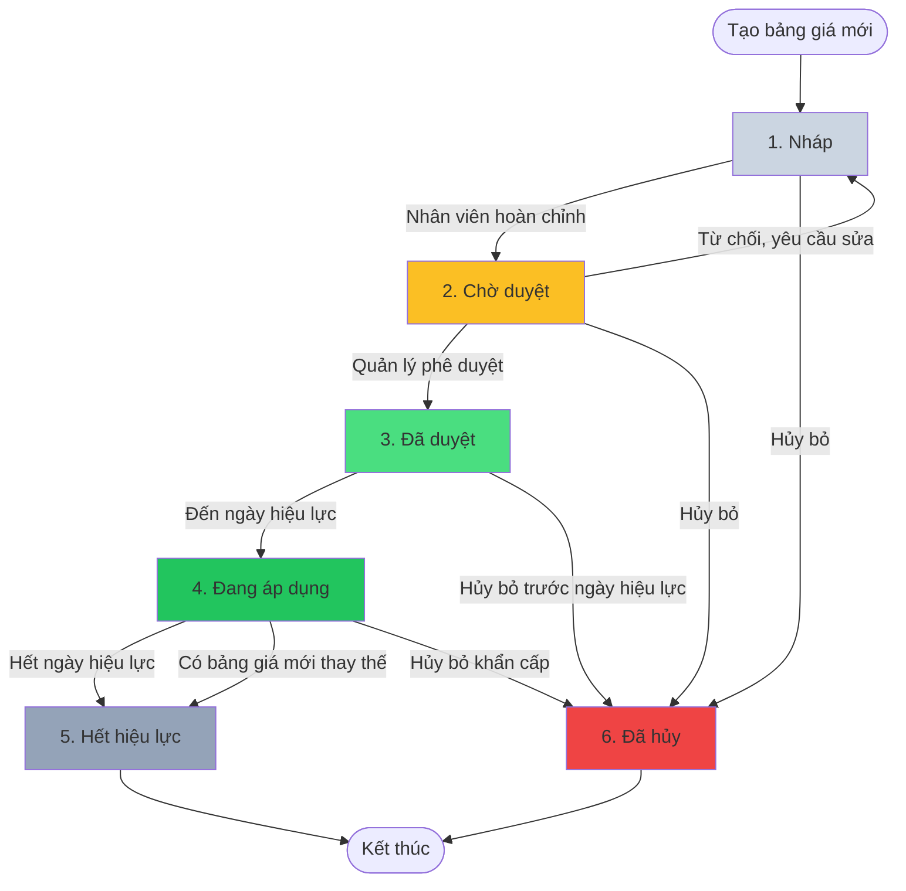
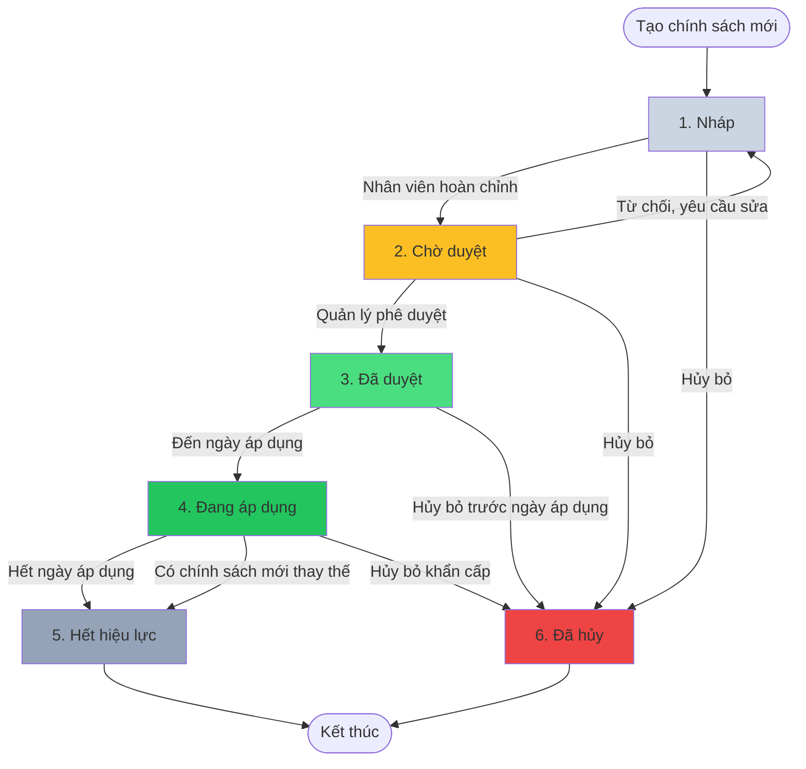
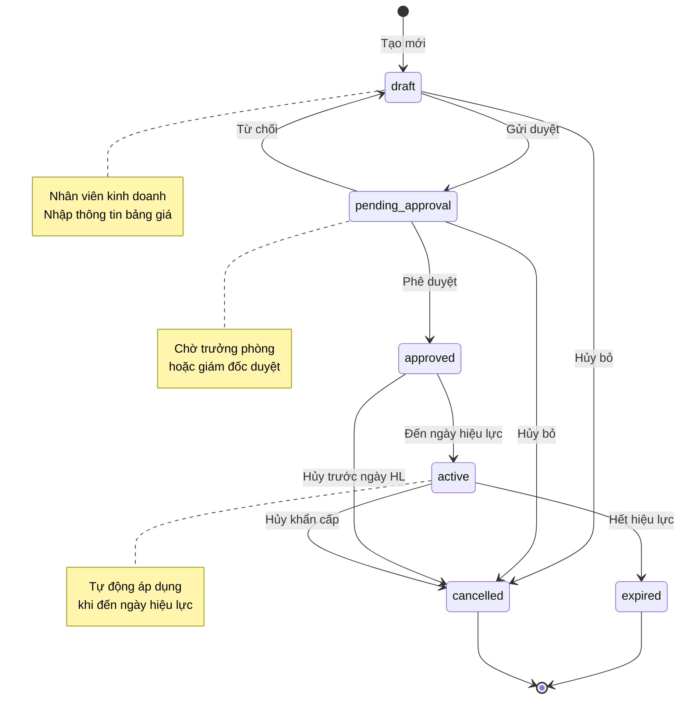
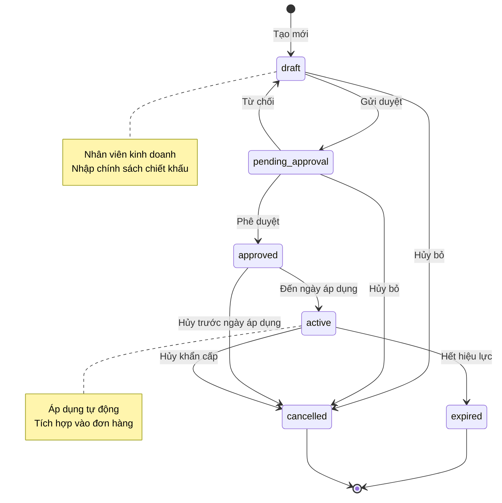

# Module Pricing - Trạng thái (Status)

> **Phiên bản**: v1.0 - Cơ bản (4 trạng thái)
> **Ngày cập nhật**: 2026-01-14
> **Trạng thái**: Đề xuất - Chờ khách hàng Nhật Minh phê duyệt
> **Lưu ý**: Module Pricing quản lý master data (Bảng giá & Chính sách chiết khấu), không phải transactional data nên workflow khác với Lead

---

## 📋 Danh sách trạng thái

### 1. Trạng thái Bảng giá (Price List)

| # | Trạng thái | Code | Màu | Mô tả | Loại |
| --- | --- | --- | --- | --- | --- |
| 1 | **Nháp** | `draft` | #cbd5e1 | Bảng giá đang soạn thảo, chưa hoàn chỉnh | Active |
| 2 | **Chờ duyệt** | `pending_approval` | #fbbf24 | Bảng giá đã hoàn chỉnh, chờ phê duyệt | Active |
| 3 | **Đã duyệt** | `approved` | #4ade80 | Bảng giá đã được phê duyệt, sẵn sàng áp dụng | Active |
| 4 | **Đang áp dụng** | `active` | #22c55e | Bảng giá đang được sử dụng (ngày hiệu lực đã đến) | Active |
| 5 | **Hết hiệu lực** | `expired` | #94a3b8 | Bảng giá đã hết hiệu lực, không còn sử dụng | Terminal |
| 6 | **Đã hủy** | `cancelled` | #ef4444 | Bảng giá bị hủy bỏ (do lỗi hoặc thay đổi quy định) | Terminal |

### 2. Trạng thái Chính sách chiết khấu (Discount Policy)

| # | Trạng thái | Code | Màu | Mô tả | Loại |
| --- | --- | --- | --- | --- | --- |
| 1 | **Nháp** | `draft` | #cbd5e1 | Chính sách đang soạn thảo | Active |
| 2 | **Chờ duyệt** | `pending_approval` | #fbbf24 | Chính sách chờ phê duyệt | Active |
| 3 | **Đã duyệt** | `approved` | #4ade80 | Chính sách đã được phê duyệt | Active |
| 4 | **Đang áp dụng** | `active` | #22c55e | Chính sách đang được sử dụng | Active |
| 5 | **Hết hiệu lực** | `expired` | #94a3b8 | Chính sách đã hết hiệu lực | Terminal |
| 6 | **Đã hủy** | `cancelled` | #ef4444 | Chính sách bị hủy bỏ | Terminal |

### Phân loại

- **Active**: Trạng thái đang hoạt động, có thể chuyển sang trạng thái khác
- **Terminal**: Trạng thái kết thúc, không thể chuyển sang trạng thái khác

---

## 🔄 Workflow - Luồng chuyển đổi

### 1. Workflow Bảng giá (Price List)

### 2. Workflow Chính sách chiết khấu (Discount Policy)

### State Machine Diagram - Bảng giá

### State Machine Diagram - Chính sách chiết khấu

---

## 🗃️ Database Schema

### Bảng: `tabPrice List` (Bảng giá)

| Field | Type | Mô tả | Required | Default |
|-------|------|-------|----------|---------|
| `name` | VARCHAR(140) | ID bảng giá (số bảng giá) | ✅ | AUTO |
| `price_list_name` | VARCHAR(200) | Tên bảng giá | ✅ | - |
| `status` | VARCHAR(20) | Trạng thái | ✅ | `draft` |
| `effective_date` | DATE | Ngày hiệu lực | ✅ | - |
| `expiry_date` | DATE | Ngày hết hiệu lực | ❌ | NULL |
| `price_list_type` | VARCHAR(20) | Loại (Buôn/Lẻ) | ✅ | `Wholesale` |
| `currency` | VARCHAR(3) | Tiền tệ | ✅ | `VND` |
| `buying` | INT(1) | Bảng giá mua | ❌ | 0 |
| `selling` | INT(1) | Bảng giá bán | ✅ | 1 |
| `enabled` | INT(1) | Kích hoạt | ✅ | 1 |
| `created_by` | VARCHAR(140) | Người lập | ✅ | - |
| `approved_by` | VARCHAR(140) | Người duyệt | ❌ | NULL |
| `approved_date` | DATETIME | Ngày duyệt | ❌ | NULL |
| `description` | TEXT | Nội dung | ❌ | NULL |
| `attachment` | TEXT | File đính kèm | ❌ | NULL |

### Bảng: `tabItem Price` (Chi tiết bảng giá)

| Field | Type | Mô tả | Required |
|-------|------|-------|----------|
| `name` | VARCHAR(140) | ID | ✅ |
| `parent` | VARCHAR(140) | FK → Price List | ✅ |
| `item_code` | VARCHAR(140) | Mã hàng hóa | ✅ |
| `item_name` | VARCHAR(200) | Tên hàng hóa | ✅ |
| `price_list_rate` | DECIMAL(18,2) | Giá bán | ✅ |
| `uom` | VARCHAR(50) | Đơn vị tính | ❌ |
| `note` | TEXT | Ghi chú | ❌ |

### Bảng: `tabDiscount Policy` (Chính sách chiết khấu)

| Field | Type | Mô tả | Required | Default |
|-------|------|-------|----------|---------|
| `name` | VARCHAR(140) | ID (số chính sách) | ✅ | AUTO |
| `policy_name` | VARCHAR(200) | Tên chính sách | ✅ | - |
| `status` | VARCHAR(20) | Trạng thái | ✅ | `draft` |
| `apply_date` | DATE | Ngày áp dụng | ✅ | - |
| `expiry_date` | DATE | Ngày hết hạn | ❌ | NULL |
| `policy_type` | VARCHAR(20) | Loại (Buôn/Lẻ) | ✅ | `Wholesale` |
| `customer` | VARCHAR(140) | Khách hàng (nếu Buôn) | ❌ | NULL |
| `customer_group` | VARCHAR(140) | Nhóm khách hàng | ❌ | NULL |
| `created_by` | VARCHAR(140) | Người lập | ✅ | - |
| `approved_by` | VARCHAR(140) | Người duyệt | ❌ | NULL |
| `approved_date` | DATETIME | Ngày duyệt | ❌ | NULL |
| `description` | TEXT | Nội dung | ❌ | NULL |
| `attachment` | TEXT | File đính kèm | ❌ | NULL |

### Bảng: `tabDiscount Policy Item` (Chi tiết chính sách)

| Field | Type | Mô tả | Required |
|-------|------|-------|----------|
| `name` | VARCHAR(140) | ID | ✅ |
| `parent` | VARCHAR(140) | FK → Discount Policy | ✅ |
| `item_code` | VARCHAR(140) | Mã hàng hóa | ✅ |
| `item_name` | VARCHAR(200) | Tên hàng hóa | ✅ |
| `discount_percentage` | DECIMAL(5,2) | Tỷ lệ chiết khấu (%) | ✅ |
| `min_qty` | DECIMAL(18,2) | Số lượng tối thiểu | ❌ |
| `max_qty` | DECIMAL(18,2) | Số lượng tối đa | ❌ |

---

## ⚙️ Quy tắc chuyển trạng thái (Transition Rules)

### Ma trận chuyển trạng thái - Bảng giá

| Từ \ Đến | Draft | Pending Approval | Approved | Active | Expired | Cancelled |
|----------|-------|------------------|----------|--------|---------|-----------|
| **Draft** | ✅ | ✅ | ❌ | ❌ | ❌ | ✅ |
| **Pending Approval** | ✅ | ✅ | ✅ | ❌ | ❌ | ✅ |
| **Approved** | ❌ | ❌ | ✅ | ✅ | ❌ | ✅ |
| **Active** | ❌ | ❌ | ❌ | ✅ | ✅ | ✅ |
| **Expired** | ❌ | ❌ | ❌ | ❌ | ✅ | ❌ |
| **Cancelled** | ❌ | ❌ | ❌ | ❌ | ❌ | ✅ |

### Điều kiện chuyển trạng thái

#### 1. Draft → Pending Approval
**Điều kiện:**
- Bảng giá có ít nhất 1 sản phẩm
- Ngày hiệu lực phải >= ngày hiện tại
- Tất cả giá bán > 0
- Đã đính kèm file quyết định giá (nếu bắt buộc)

**Hành động:**
- Ghi nhận thời gian gửi duyệt
- Gửi thông báo đến người phê duyệt

#### 2. Pending Approval → Approved
**Điều kiện:**
- Người duyệt có quyền phê duyệt
- Bảng giá chưa hết hạn

**Hành động:**
- Ghi nhận người duyệt, thời gian duyệt
- Gửi thông báo đến người tạo
- Lên lịch tự động chuyển sang Active khi đến ngày hiệu lực

#### 3. Approved → Active
**Điều kiện:**
- Ngày hiện tại >= Ngày hiệu lực

**Hành động:**
- Tự động chuyển trạng thái (scheduled job)
- Đánh dấu bảng giá khả dụng để tích hợp vào đơn hàng/hóa đơn

#### 4. Active → Expired
**Điều kiện:**
- Ngày hiện tại > Ngày hết hiệu lực (nếu có)
- HOẶC: Có bảng giá mới thay thế

**Hành động:**
- Tự động chuyển trạng thái (scheduled job)
- Không thể chọn bảng giá này trong đơn hàng/hóa đơn mới

#### 5. Any → Cancelled
**Điều kiện:**
- Người hủy có quyền cao (Admin, Giám đốc)
- Nhập lý do hủy

**Hành động:**
- Ghi nhận người hủy, thời gian hủy, lý do
- Không thể chọn bảng giá này trong đơn hàng/hóa đơn mới

---

## 👤 Phân quyền theo trạng thái

### Quyền trên Bảng giá

| Vai trò | Draft | Pending | Approved | Active | Expired | Cancelled |
|---------|-------|---------|----------|--------|---------|-----------|
| **Nhân viên KD** | Create, Edit, Delete | View | View | View | View | View |
| **Trưởng phòng KD** | Create, Edit, Delete | Approve, Reject | View | View | View | Cancel |
| **Giám đốc** | All | All | All | All | View | Cancel |
| **Kế toán** | View | View | View | View | View | View |

### Quyền trên Chính sách chiết khấu

| Vai trò | Draft | Pending | Approved | Active | Expired | Cancelled |
|---------|-------|---------|----------|--------|---------|-----------|
| **Nhân viên KD** | Create, Edit, Delete | View | View | View | View | View |
| **Trưởng phòng KD** | Create, Edit, Delete | Approve, Reject | View | View | View | Cancel |
| **Giám đốc** | All | All | All | All | View | Cancel |
| **Kế toán** | View | View | View | View | View | View |

---

## 🔔 Tích hợp và Thông báo

### Tích hợp với các module

#### 1. Sales Order (Đơn đặt hàng bán)
- **Khi tạo đơn hàng:**
  - Chỉ hiển thị bảng giá có trạng thái `Active`
  - Tự động áp dụng bảng giá theo ngày đơn hàng và loại khách (Buôn/Lẻ)
  - Tự động áp dụng chính sách chiết khấu theo khách hàng/sản phẩm

#### 2. Delivery Order (Lệnh xuất hàng)
- Kế thừa thông tin giá và chiết khấu từ đơn hàng
- Kiểm tra xem bảng giá/chính sách vẫn còn Active không

#### 3. Sales Invoice (Hóa đơn bán hàng)
- Tự động lấy bảng giá/chiết khấu Active theo ngày hóa đơn
- Cảnh báo nếu giá khác với lệnh xuất

#### 4. POS Invoice (Hóa đơn bán lẻ)
- Tự động áp dụng bảng giá lẻ Active
- Tự động áp dụng chiết khấu lẻ
- Cho phép chiết khấu đặc biệt do nhân viên cấp (theo quyền hạn)

### Thông báo tự động

| Sự kiện | Người nhận | Nội dung |
|---------|-----------|----------|
| Gửi duyệt bảng giá | Người phê duyệt | "Bảng giá {name} chờ phê duyệt" |
| Phê duyệt thành công | Người tạo | "Bảng giá {name} đã được phê duyệt" |
| Từ chối phê duyệt | Người tạo | "Bảng giá {name} bị từ chối: {lý do}" |
| Bảng giá sắp hiệu lực | Nhân viên KD, Kế toán | "Bảng giá {name} sẽ có hiệu lực từ {date}" |
| Bảng giá đã Active | Nhân viên KD, Kế toán | "Bảng giá {name} đã được áp dụng" |
| Bảng giá sắp hết hạn | Nhân viên KD, Trưởng phòng | "Bảng giá {name} sẽ hết hạn sau 7 ngày" |
| Bảng giá đã hết hạn | Nhân viên KD, Trưởng phòng | "Bảng giá {name} đã hết hiệu lực" |
| Bảng giá bị hủy | Người tạo, NV KD | "Bảng giá {name} đã bị hủy: {lý do}" |

---

## 📊 Báo cáo và Phân tích

### Báo cáo cần có

1. **Lịch sử thay đổi bảng giá**
   - Theo sản phẩm: Xem giá thay đổi qua các thời kỳ
   - Theo bảng giá: Xem các sản phẩm và giá

2. **Hiệu quả chính sách chiết khấu**
   - Tổng doanh số theo chính sách chiết khấu
   - Tỷ lệ đơn hàng sử dụng chiết khấu
   - Top khách hàng được hưởng chiết khấu cao nhất

3. **Dashboard trạng thái**
   - Số lượng bảng giá theo trạng thái
   - Số lượng chính sách chiết khấu theo trạng thái
   - Bảng giá/chính sách sắp hết hạn

---

## ❓ Câu hỏi cần làm rõ

### 1. Workflow phê duyệt
❓ **Hỏi:** Bảng giá có cần phê duyệt không? Nếu có, ai là người phê duyệt?
- Trưởng phòng Kinh doanh
- Giám đốc
- Cả hai (tuần tự)

❓ **Hỏi:** Chính sách chiết khấu có cần phê duyệt không?

### 2. Tự động hóa
❓ **Hỏi:** Có cho phép hệ thống tự động chuyển trạng thái Active khi đến ngày hiệu lực không?
❓ **Hỏi:** Có tự động gửi thông báo khi bảng giá sắp hết hạn không? (Trước bao nhiêu ngày?)

### 3. Đa phiên bản
❓ **Hỏi:** Có cho phép nhiều bảng giá Active cùng lúc không?
- Nếu có: Ưu tiên theo thứ tự nào? (Ngày hiệu lực, loại khách hàng...)
- Nếu không: Có tự động Expire bảng giá cũ khi Active bảng giá mới không?

### 4. Xử lý đơn hàng đã tạo
❓ **Hỏi:** Khi bảng giá/chiết khấu bị Cancelled hoặc Expired:
- Các đơn hàng đã tạo có bị ảnh hưởng không?
- Có cần cảnh báo khi tạo hóa đơn từ đơn hàng cũ không?

### 5. Lịch sử và Audit
❓ **Hỏi:** Có cần lưu lịch sử chuyển trạng thái không? (Ai chuyển, khi nào, lý do)
❓ **Hỏi:** Có cần báo cáo phân tích thay đổi giá không?

---

**Tổng kết:**
- **6 trạng thái** cho cả Bảng giá và Chính sách chiết khấu
- **Workflow:** Draft → Pending Approval → Approved → Active → Expired/Cancelled
- **Tự động hóa:** Chuyển trạng thái Active/Expired theo ngày hiệu lực
- **Tích hợp:** Sales Order, Delivery Order, Sales Invoice, POS Invoice
- **5 nhóm câu hỏi** cần làm rõ với khách hàng
