# Module Pricing - Đặc tả Workflow & ERD

> **Nguồn:** `/docs/feature/ERP_SPECIFICATION.md` Section 2, Bước 2-3 (Quản lý Bán hàng - Bảng giá & Chiết khấu)
> **Lưu ý:** Đây là đặc tả YÊU CẦU, code phải làm theo đặc tả này

---

## 1. Định nghĩa

> Module **Pricing** quản lý bảng giá niêm yết và chính sách chiết khấu cho kênh bán buôn (B2B) và bán lẻ (B2C).

**Phạm vi:**
- Bảng giá bán niêm yết (Wholesale & Retail)
- Chính sách chiết khấu bán buôn
- Chính sách chiết khấu bán lẻ (bao gồm chiết khấu đặc biệt)

---

## 2. ERD - Entity Relationship Diagram

### 2.1. ERD Overview

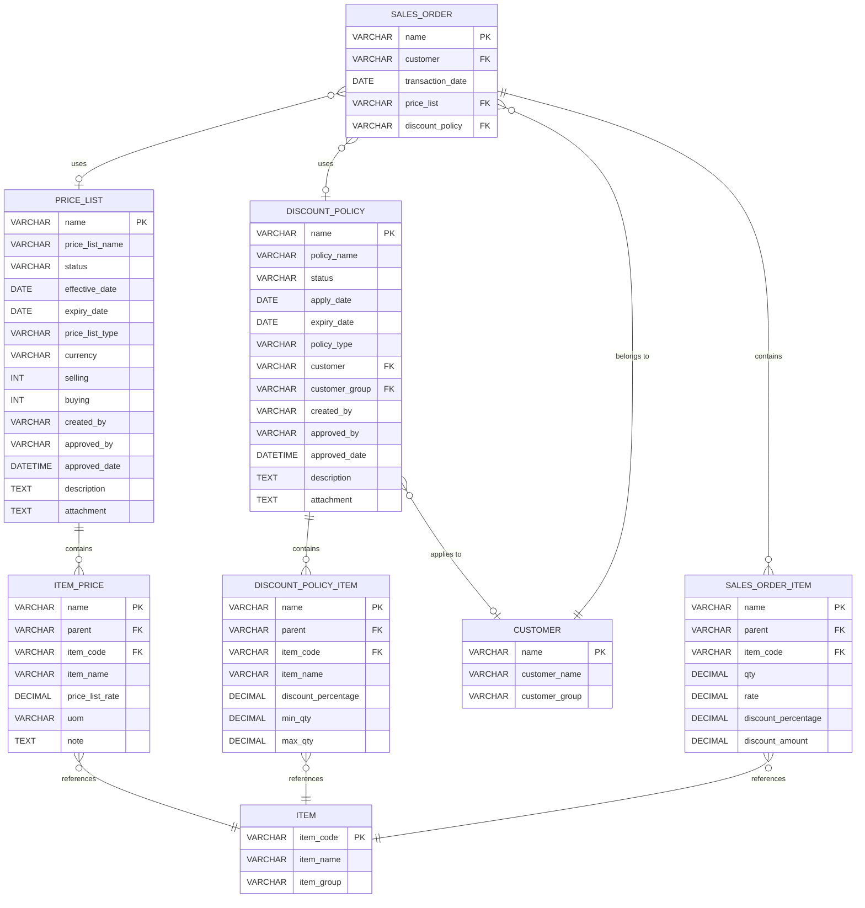

### 2.2. Mô tả các bảng chính

#### Bảng: `tabPrice List` (Bảng giá)

**Quan hệ:**
- 1 Price List → N Item Price (1-N)
- 1 Item → N Item Price (1-N, qua nhiều bảng giá)
- 1 Price List → N Sales Order (1-N, reference)

**Trường quan trọng:**
- `status`: Draft | Pending Approval | Approved | Active | Expired | Cancelled
- `price_list_type`: Wholesale | Retail
- `effective_date`, `expiry_date`: Xác định khoảng thời gian hiệu lực

#### Bảng: `tabDiscount Policy` (Chính sách chiết khấu)

**Quan hệ:**
- 1 Discount Policy → N Discount Policy Item (1-N)
- 1 Customer → N Discount Policy (1-N, áp dụng nhiều chính sách)
- 1 Discount Policy → N Sales Order (1-N, reference)

**Trường quan trọng:**
- `status`: Draft | Pending Approval | Approved | Active | Expired | Cancelled
- `policy_type`: Wholesale | Retail
- `customer`, `customer_group`: Đối tượng áp dụng (Buôn), NULL nếu Lẻ

---

## 3. Workflow - Bảng giá (Price List)

### 3.1. State Diagram - Bảng giá

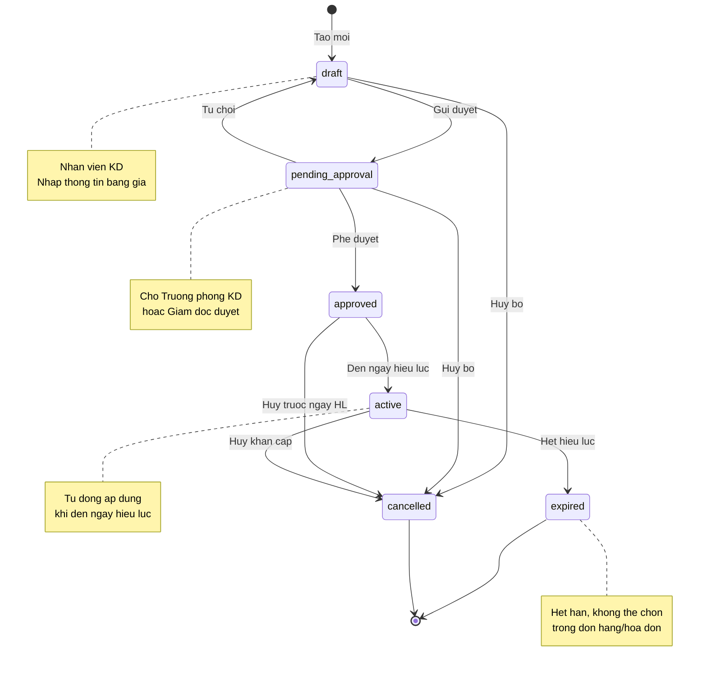

### 3.2. Flowchart - Quy trình phê duyệt bảng giá

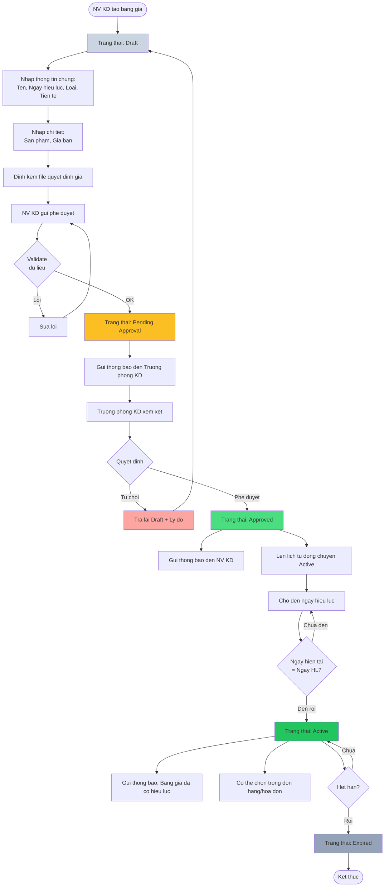

### 3.3. Sequence Diagram - Tạo và phê duyệt bảng giá

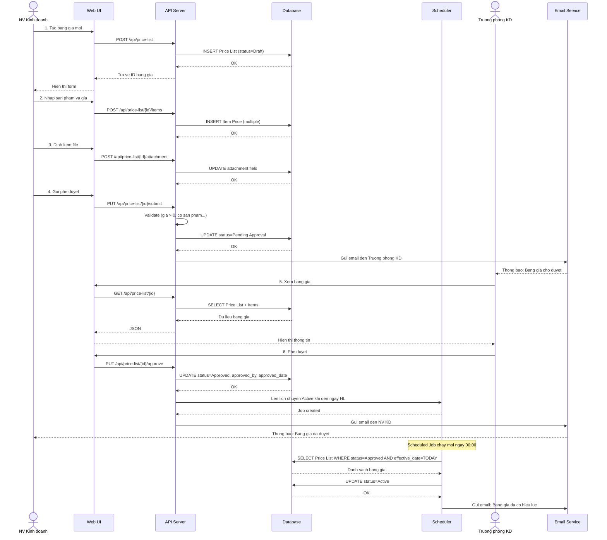

---

## 4. Workflow - Chính sách chiết khấu (Discount Policy)

### 4.1. State Diagram - Chính sách chiết khấu

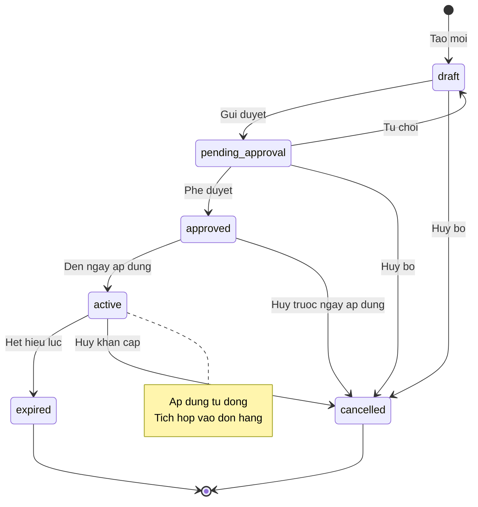

### 4.2. Flowchart - Áp dụng chiết khấu vào đơn hàng

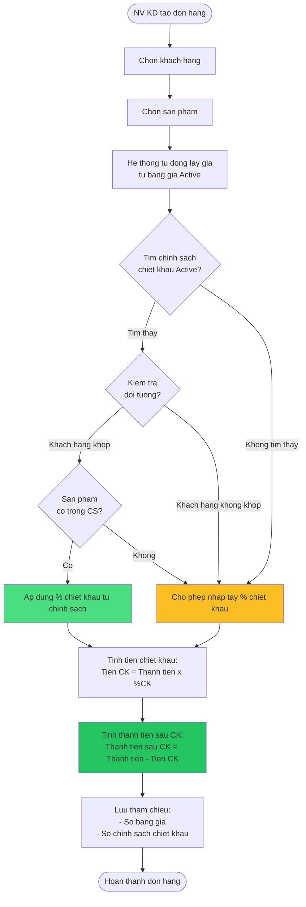

---

## 5. Data Flow - Tích hợp với các module khác

### 5.1. Tích hợp với Sales Order (Đơn đặt hàng bán)

**Nguồn:** ERP_SPECIFICATION.md Section 2, Bước 4 (Lines 86-100)

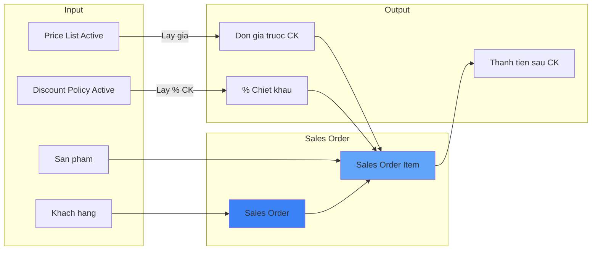

**Quy tắc:**
1. Hệ thống tự động tìm bảng giá Active theo loại khách hàng (Buôn/Lẻ)
2. Hệ thống tự động tìm chính sách chiết khấu Active theo khách hàng và sản phẩm
3. Nếu không tìm thấy chính sách, cho phép nhập tay % chiết khấu
4. Thông tin đơn hàng bao gồm:
   - Số bảng giá
   - Số chính sách chiết khấu
   - % chiết khấu
   - Tiền chiết khấu
   - Đơn giá trước/sau chiết khấu
   - Thành tiền trước/sau chiết khấu

### 5.2. Tích hợp với Delivery Order (Lệnh xuất hàng)

**Nguồn:** ERP_SPECIFICATION.md Section 2, Bước 6 (Lines 110-135)

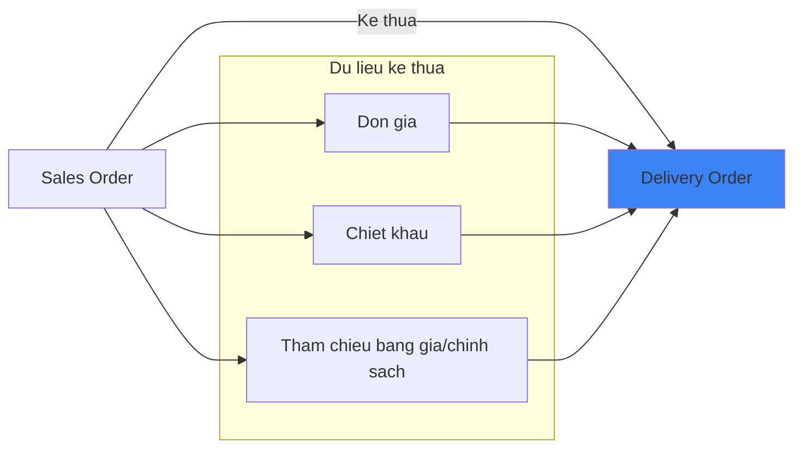

**Quy tắc:**
- Lệnh xuất kế thừa 100% thông tin giá và chiết khấu từ đơn hàng
- Không cho phép sửa giá trên lệnh xuất (phân quyền)

### 5.3. Tích hợp với Sales Invoice (Hóa đơn bán buôn)

**Nguồn:** ERP_SPECIFICATION.md Section 2, Bước 9 (Lines 164-182)

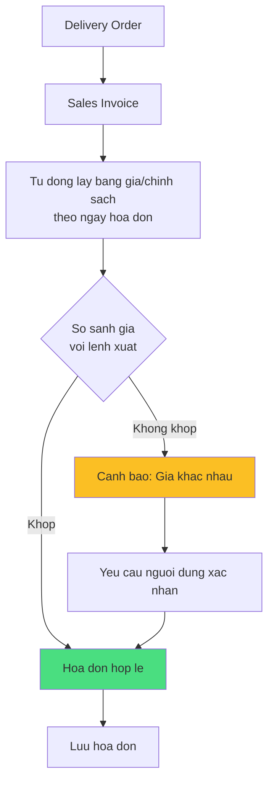

**Quy tắc:**
1. Tự động lấy số bảng giá, số chính sách chiết khấu theo ngày hóa đơn
2. **Cảnh báo** nếu giá bán trên lệnh xuất khác với giá bán trên hóa đơn
3. Yêu cầu xác nhận nếu có sự khác biệt

### 5.4. Tích hợp với POS Invoice (Hóa đơn bán lẻ)

**Nguồn:** ERP_SPECIFICATION.md Section 2, Bước 3 (Quy trình Bán lẻ) (Lines 254-265)

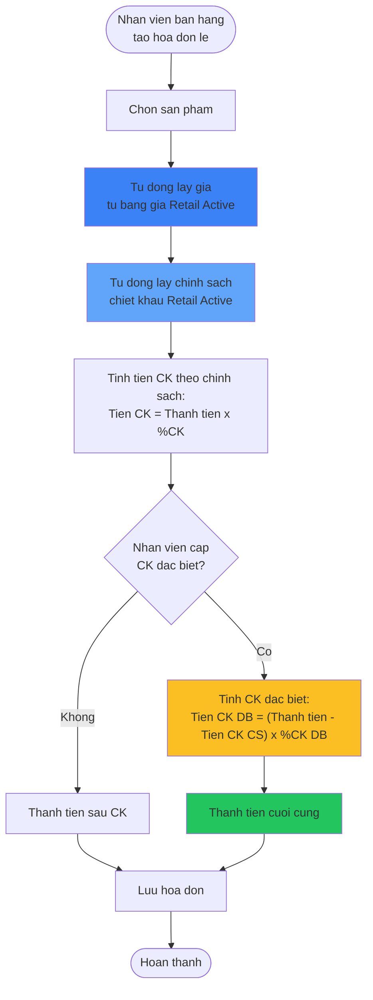

**Công thức chiết khấu đặc biệt:**
```
Tiền chiết khấu đặc biệt = (Tiền hàng trước CK - Tiền CK theo chính sách) × Tỷ lệ CK đặc biệt
```

**Ví dụ:**
- Giá niêm yết: 10,000,000 VND
- CK theo chính sách (10%): 1,000,000 VND
- Giá sau CK CS: 9,000,000 VND
- CK đặc biệt (5%): 9,000,000 × 5% = 450,000 VND
- **Giá cuối cùng: 8,550,000 VND**

---

## 6. Ma trận chuyển trạng thái

### 6.1. Ma trận chuyển trạng thái - Bảng giá

| Từ \ Đến | Draft | Pending Approval | Approved | Active | Expired | Cancelled |
|----------|-------|------------------|----------|--------|---------|-----------|
| **Draft** | ✅ | ✅ | ❌ | ❌ | ❌ | ✅ |
| **Pending Approval** | ✅ | ✅ | ✅ | ❌ | ❌ | ✅ |
| **Approved** | ❌ | ❌ | ✅ | ✅ | ❌ | ✅ |
| **Active** | ❌ | ❌ | ❌ | ✅ | ✅ | ✅ |
| **Expired** | ❌ | ❌ | ❌ | ❌ | ✅ | ❌ |
| **Cancelled** | ❌ | ❌ | ❌ | ❌ | ❌ | ✅ |

**Giải thích:**
- ✅ = Cho phép chuyển
- ❌ = Không cho phép chuyển

### 6.2. Điều kiện chuyển trạng thái

| Chuyển trạng thái | Điều kiện | Người thực hiện | Hành động sau chuyển |
|-------------------|-----------|-----------------|----------------------|
| **Draft → Pending Approval** | - Có ít nhất 1 sản phẩm<br/>- Giá > 0<br/>- Ngày hiệu lực >= Ngày hiện tại | NV KD, TP KD, GD | Gửi thông báo đến người phê duyệt |
| **Pending Approval → Approved** | - Người duyệt có quyền | TP KD, GD | Lên lịch tự động Active |
| **Pending Approval → Draft** | - Người duyệt từ chối<br/>- Nhập lý do | TP KD, GD | Gửi thông báo lý do từ chối |
| **Approved → Active** | - Ngày hiện tại = Ngày hiệu lực | System (Auto) | Gửi thông báo: Bảng giá đã Active |
| **Active → Expired** | - Ngày hiện tại > Ngày hết hiệu lực<br/>- HOẶC: Có bảng giá mới thay thế | System (Auto) | Gửi thông báo: Bảng giá đã hết hạn |
| **Any → Cancelled** | - Người hủy có quyền cao<br/>- Nhập lý do hủy | TP KD, GD | Gửi thông báo lý do hủy |

---

## 7. Dashboard và Báo cáo

### 7.1. Dashboard Trạng thái

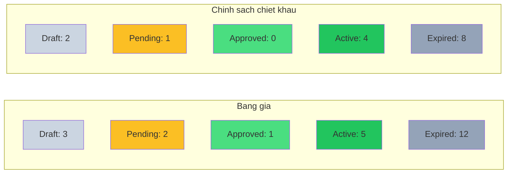

### 7.2. Báo cáo lịch sử giá theo sản phẩm

**Mục đích:** Xem giá của 1 sản phẩm thay đổi như thế nào qua thời gian

**Dữ liệu:**
- Sản phẩm: "TaylorMade Stealth 2 Driver"
- Thời gian: Q1/2024 → Q4/2025

| Ngày hiệu lực | Số bảng giá | Giá bán (VND) | Thay đổi (%) | Người lập |
|---------------|-------------|---------------|--------------|-----------|
| 01/01/2024 | PL-2024-001 | 15,000,000 | - | Nguyễn Văn A |
| 01/04/2024 | PL-2024-002 | 14,500,000 | -3.3% | Nguyễn Văn A |
| 01/07/2024 | PL-2024-003 | 14,000,000 | -3.4% | Trần Thị B |
| 01/10/2024 | PL-2024-004 | 13,500,000 | -3.6% | Trần Thị B |
| 01/01/2025 | PL-2025-001 | 13,000,000 | -3.7% | Lê Văn C |

**Biểu đồ:** Line chart thể hiện xu hướng giảm giá

### 7.3. Báo cáo hiệu quả chiết khấu

**Mục đích:** Đánh giá hiệu quả của các chính sách chiết khấu

**Dữ liệu:**

| Chính sách | Khách hàng | Doanh số (VND) | Tiền CK (VND) | % CK | Số đơn hàng |
|-----------|------------|----------------|---------------|------|-------------|
| DP-2025-001 | Đại lý A | 500,000,000 | 50,000,000 | 10% | 25 |
| DP-2025-002 | Đại lý B | 300,000,000 | 45,000,000 | 15% | 18 |
| DP-2025-003 | Nhóm VIP | 800,000,000 | 80,000,000 | 10% | 42 |

**Phân tích:**
- Top 3 khách hàng được hưởng chiết khấu cao nhất
- Tỷ lệ đơn hàng có áp dụng chiết khấu: 87%
- Tổng tiền chiết khấu trong tháng: 175,000,000 VND

---

## 8. Quy tắc nghiệp vụ (Business Rules)

### 8.1. Bảng giá

1. **Hiệu lực:**
   - Ngày hiệu lực phải >= Ngày hiện tại (khi tạo mới)
   - Ngày hết hiệu lực phải > Ngày hiệu lực (nếu có)

2. **Duy nhất:**
   - Có thể có nhiều bảng giá Active cùng lúc (phân biệt theo loại: Buôn/Lẻ)
   - Hệ thống ưu tiên bảng giá có Ngày hiệu lực gần nhất

3. **Sản phẩm:**
   - Mỗi sản phẩm chỉ xuất hiện 1 lần trong 1 bảng giá
   - Giá bán phải > 0

4. **Phê duyệt:**
   - Bảng giá Draft không thể sử dụng trong đơn hàng/hóa đơn
   - Chỉ bảng giá Active mới có thể chọn

5. **Hủy bỏ:**
   - Nếu bảng giá đang được sử dụng trong đơn hàng/hóa đơn chưa hoàn thành → Cần quyền Giám đốc để hủy

### 8.2. Chính sách chiết khấu

1. **Đối tượng:**
   - Chiết khấu Buôn: Phải chỉ định Khách hàng hoặc Nhóm khách hàng
   - Chiết khấu Lẻ: Áp dụng cho tất cả khách lẻ

2. **Tỷ lệ:**
   - Tỷ lệ chiết khấu: 0% ≤ % ≤ 100%
   - Tỷ lệ chiết khấu đặc biệt (Bán lẻ): Theo quyền hạn nhân viên

3. **Áp dụng:**
   - Nếu 1 khách hàng có nhiều chính sách Active → Ưu tiên chính sách có % chiết khấu cao nhất
   - Nếu không chọn chính sách → Cho phép nhập tay % chiết khấu

4. **Tích hợp:**
   - Chiết khấu áp dụng trên giá từ bảng giá (không phải giá nhập tay)
   - Công thức: `Thành tiền sau CK = Thành tiền trước CK - (Thành tiền trước CK × % CK)`

---

## 9. Câu hỏi cần làm rõ

### 9.1. Hiệu lực bảng giá

❓ **Hỏi:** Có cho phép nhiều bảng giá Active cùng lúc không?
- Nếu có: Ưu tiên theo thứ tự nào?
- Nếu không: Có tự động Expire bảng giá cũ không?

### 9.2. Chiết khấu theo số lượng

❓ **Hỏi:** Có chiết khấu theo số lượng mua không? (VD: Mua >= 100 sp giảm 10%)

### 9.3. Chiết khấu kết hợp

❓ **Hỏi:** Có cho phép áp dụng nhiều chính sách chiết khấu cùng lúc không?
❓ **Hỏi:** Thứ tự áp dụng chiết khấu như thế nào? (Nối tiếp hay song song)

### 9.4. Giá theo kho

❓ **Hỏi:** Giá có khác nhau theo kho không? (VD: Kho trung tâm vs Chi nhánh)

### 9.5. Giá theo tiền tệ

❓ **Hỏi:** Có nhiều bảng giá theo tiền tệ không? (VND, USD...)
❓ **Hỏi:** Tỷ giá quy đổi lấy từ đâu?

---

**Tổng kết:**
- **2 entity chính:** Price List, Discount Policy
- **Workflow:** Draft → Pending Approval → Approved → Active → Expired
- **Tích hợp:** Sales Order, Delivery Order, Sales Invoice, POS Invoice
- **Business Rules:** Đảm bảo tính nhất quán giữa các chứng từ
- **5 nhóm câu hỏi** cần làm rõ với khách hàng
