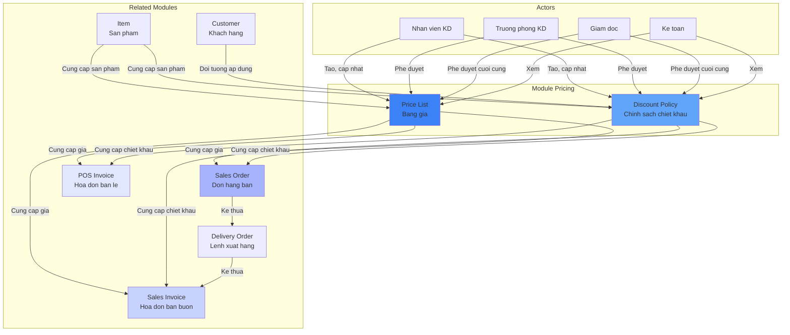
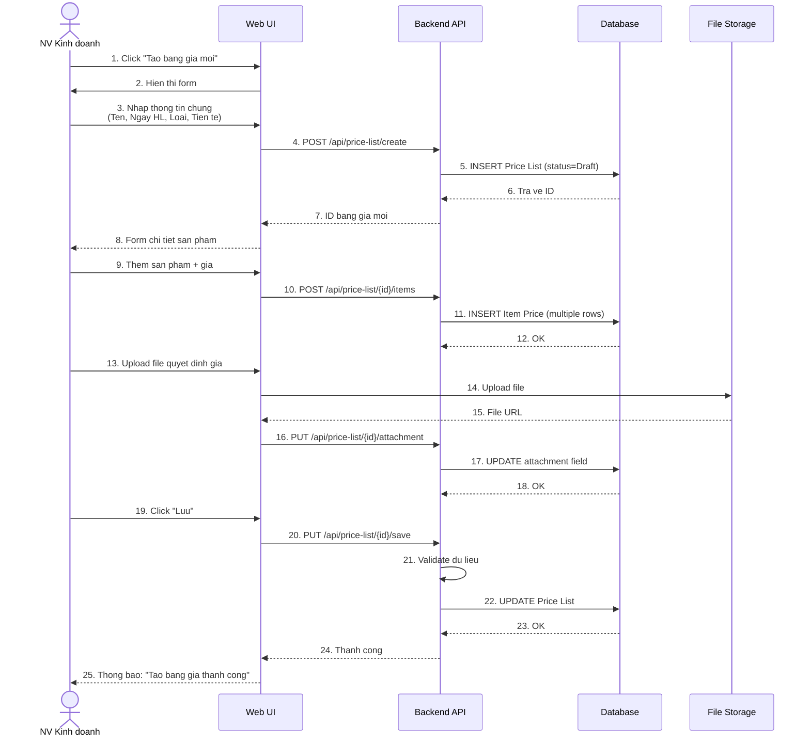
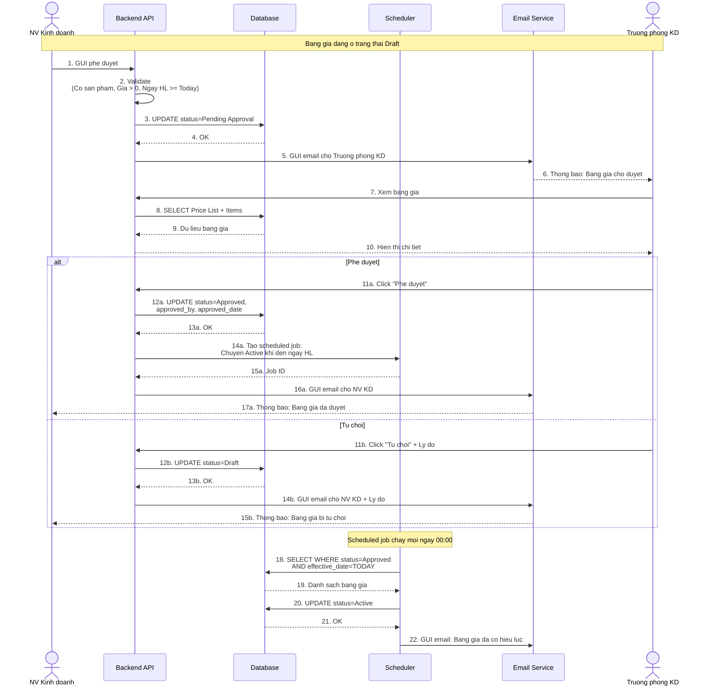
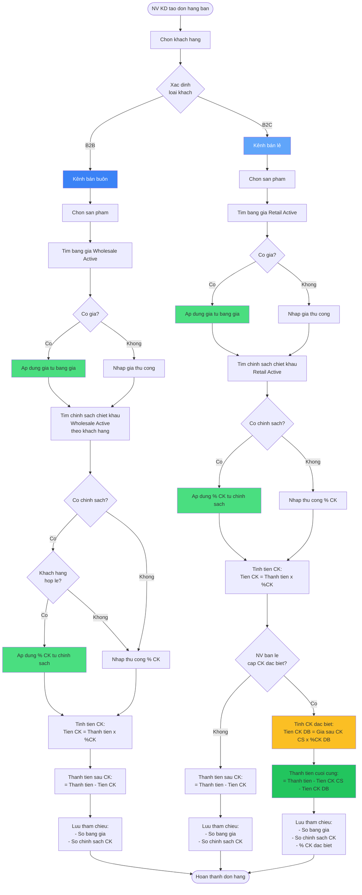
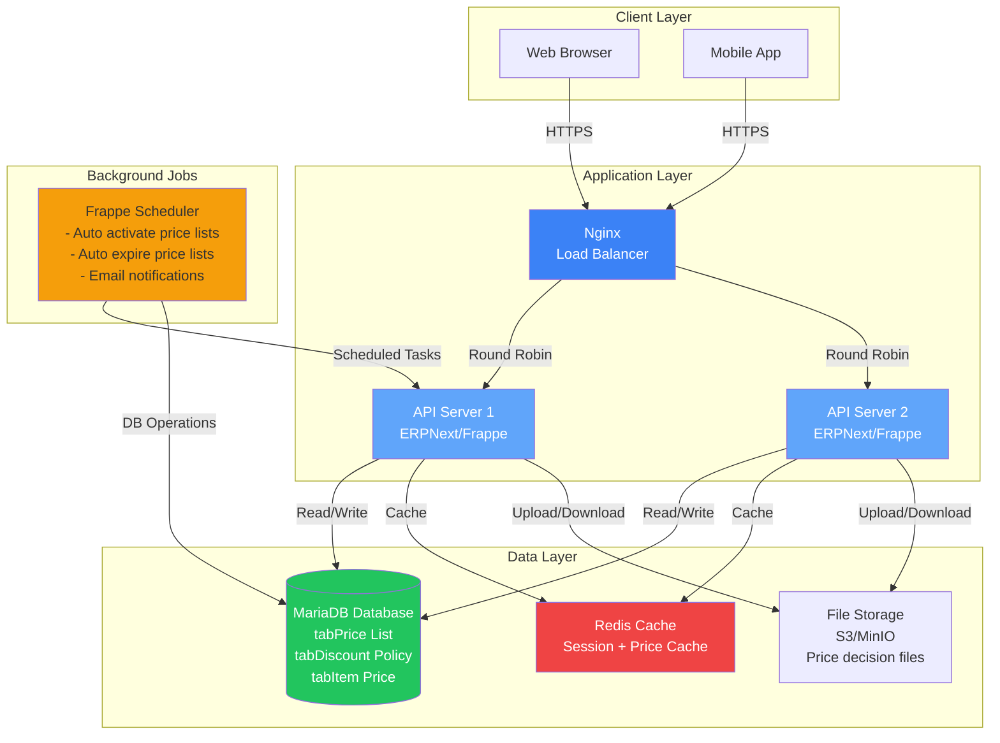
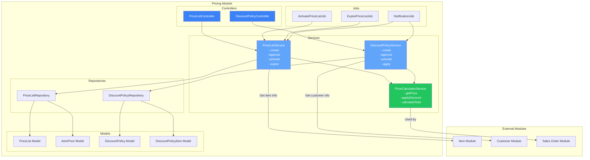
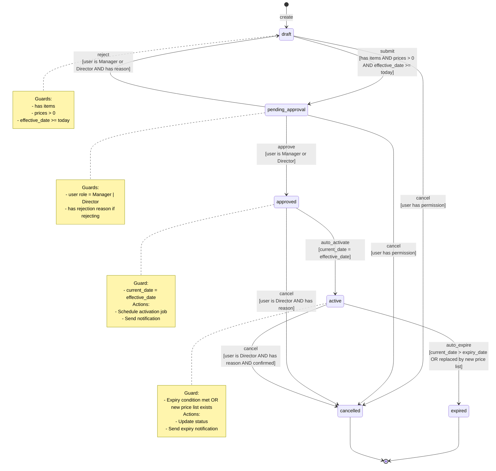
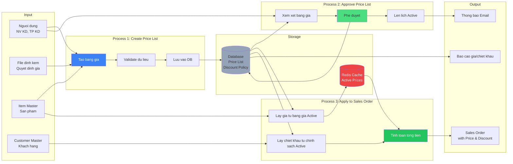
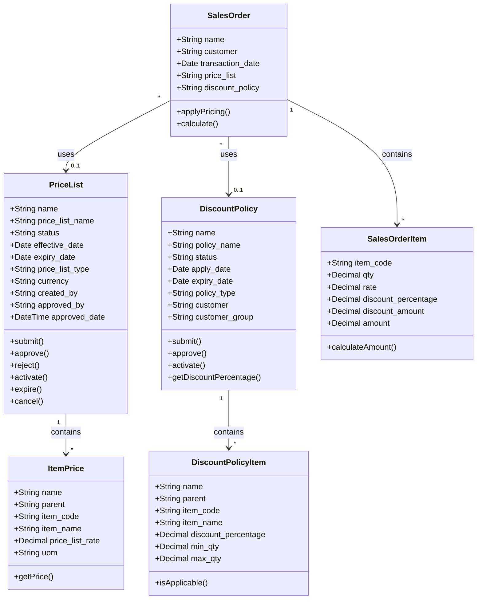
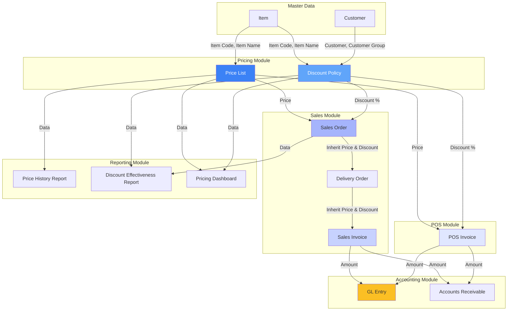

# Module Pricing - Diagrams

> **Nguồn:** `/docs/feature/ERP_SPECIFICATION.md` Section 2, Bước 2-3 (Quản lý Bán hàng)
> **Lưu ý:** Diagrams dựa trên đặc tả YÊU CẦU, không dựa trên code hiện tại

---

## 1. Context Diagram - Module Pricing trong hệ thống ERP

---

## 2. Sequence Diagram - Tạo bảng giá mới

---

## 3. Sequence Diagram - Workflow phê duyệt bảng giá

---

## 4. Activity Diagram - Áp dụng giá và chiết khấu vào đơn hàng

---

## 5. Deployment Diagram - Kiến trúc hệ thống

---

## 6. Component Diagram - Cấu trúc module Pricing

---

## 7. State Machine Diagram - Trạng thái bảng giá (với Guards)

---

## 8. Data Flow Diagram - Luồng dữ liệu giá và chiết khấu

---

## 9. Class Diagram - Cấu trúc dữ liệu (Simplified)

---

## 10. Integration Diagram - Tích hợp với các module khác

---

**Tổng kết:**
- **10 loại diagrams** mô tả toàn diện module Pricing
- **Context, Sequence, Activity, Deployment, Component, State Machine, Data Flow, Class, Integration**
- **Mermaid syntax** tuân thủ quy tắc: ASCII IDs, quoted labels, Unix line endings
- **Ready for validation** với `/mermaid-doctor`
