# Đặc tả Use Cases - Module Pricing

**Dự án:** DCNET Flow - Nhật Minh Sports
**Module:** Pricing Management (Quản lý Giá và Chiết khấu)
**Phiên bản:** 1.0
**Nguồn:** ERP_SPECIFICATION.md (Section 2, Bước 2-3)
**Ngày:** 14/01/2026

---

## 📋 Mục lục

1. [Định nghĩa Module Pricing](#1-định-nghĩa-module-pricing)
2. [Danh sách Actors và Vai trò](#2-danh-sách-actors-và-vai-trò)
3. [Ma trận Phân quyền](#3-ma-trận-phân-quyền)
4. [Chi tiết Use Cases](#4-chi-tiết-use-cases)
5. [Use Case Diagram](#5-use-case-diagram)

---

## 1. Định nghĩa Module Pricing

> **Định nghĩa:**
>
> Module Pricing quản lý **Bảng giá niêm yết** và **Chính sách chiết khấu** cho cả kênh bán buôn (B2B) và bán lẻ (B2C). Module này là master data cung cấp thông tin giá và chiết khấu cho các chứng từ bán hàng (Đơn hàng, Lệnh xuất, Hóa đơn).

**Đặc điểm:**
- Master data (không phải transactional data)
- Có workflow phê duyệt (Draft → Pending → Approved → Active → Expired)
- Tích hợp với Sales Order, Delivery Order, Sales Invoice, POS Invoice
- Hỗ trợ cả bán buôn và bán lẻ

---

## 2. Danh sách Actors và Vai trò

### 2.1. Nhân viên Kinh doanh

**Mô tả:** Nhân viên bộ phận kinh doanh

**Quyền hạn:**
- Tạo bảng giá mới (Draft)
- Tạo chính sách chiết khấu mới (Draft)
- Cập nhật bảng giá/chính sách ở trạng thái Draft
- Gửi phê duyệt
- Xem bảng giá/chính sách đã phê duyệt

**Giới hạn:**
- Không thể phê duyệt
- Không thể hủy bỏ bảng giá/chính sách đã Active

---

### 2.2. Trưởng phòng Kinh doanh

**Mô tả:** Quản lý bộ phận kinh doanh

**Quyền hạn:**
- Tất cả quyền của Nhân viên Kinh doanh
- **Phê duyệt hoặc Từ chối** bảng giá/chính sách
- Hủy bỏ bảng giá/chính sách (với lý do)
- Xem báo cáo hiệu quả giá/chiết khấu

**Giới hạn:**
- Không thể hủy bảng giá đang Active nếu đang được sử dụng trong đơn hàng (cần Giám đốc phê duyệt)

---

### 2.3. Giám đốc

**Mô tả:** Giám đốc công ty

**Quyền hạn:**
- **Tất cả quyền hạn** (Full access)
- Hủy bỏ khẩn cấp bảng giá/chính sách đang Active
- Phê duyệt các quyết định giá đặc biệt

---

### 2.4. Kế toán

**Mô tả:** Nhân viên bộ phận kế toán

**Quyền hạn:**
- **Xem** bảng giá/chính sách (Read-only)
- Áp dụng bảng giá vào hóa đơn bán hàng
- Xem báo cáo lịch sử giá

**Giới hạn:**
- Không thể tạo, sửa, xóa bảng giá/chính sách
- Không thể phê duyệt

---

### 2.5. System (Tự động)

**Mô tả:** Hệ thống tự động thực hiện các tác vụ

**Chức năng:**
- **Tự động chuyển trạng thái:** Approved → Active khi đến ngày hiệu lực
- **Tự động chuyển trạng thái:** Active → Expired khi hết hạn
- **Tự động áp dụng giá:** Lấy bảng giá/chiết khấu Active khi tạo đơn hàng/hóa đơn
- **Cảnh báo:** Giá không khớp giữa đơn hàng/lệnh xuất/hóa đơn
- **Thông báo:** Gửi email khi bảng giá sắp hết hạn

---

## 3. Ma trận Phân quyền

### 3.1. Phân quyền - Bảng giá (Price List)

| Use Case | NV KD | TP KD | Giám đốc | Kế toán | System |
| --- | --- | --- | --- | --- | --- |
| **UC-01: Tạo bảng giá mới** | ✓ | ✓ | ✓ | - | - |
| **UC-02: Cập nhật bảng giá (Draft)** | ✓ | ✓ | ✓ | - | - |
| **UC-03: Gửi phê duyệt bảng giá** | ✓ | ✓ | ✓ | - | - |
| **UC-04: Phê duyệt bảng giá** | - | ✓ | ✓ | - | - |
| **UC-05: Từ chối bảng giá** | - | ✓ | ✓ | - | - |
| **UC-06: Hủy bỏ bảng giá** | - | ✓ | ✓ | - | - |
| **UC-07: Xem danh sách bảng giá** | ✓ | ✓ | ✓ | ✓ | - |
| **UC-08: Xem lịch sử thay đổi giá** | ✓ | ✓ | ✓ | ✓ | - |
| **UC-09: Copy bảng giá từ bảng cũ** | ✓ | ✓ | ✓ | - | - |
| **UC-10: Import bảng giá từ Excel** | ✓ | ✓ | ✓ | - | - |
| **UC-11: Tự động chuyển trạng thái** | - | - | - | - | ✓ |
| **UC-12: Tự động áp dụng giá vào đơn hàng** | - | - | - | - | ✓ |

### 3.2. Phân quyền - Chính sách chiết khấu (Discount Policy)

| Use Case | NV KD | TP KD | Giám đốc | Kế toán | System |
| --- | --- | --- | --- | --- | --- |
| **UC-13: Tạo chính sách chiết khấu mới** | ✓ | ✓ | ✓ | - | - |
| **UC-14: Cập nhật chính sách (Draft)** | ✓ | ✓ | ✓ | - | - |
| **UC-15: Gửi phê duyệt chính sách** | ✓ | ✓ | ✓ | - | - |
| **UC-16: Phê duyệt chính sách** | - | ✓ | ✓ | - | - |
| **UC-17: Từ chối chính sách** | - | ✓ | ✓ | - | - |
| **UC-18: Hủy bỏ chính sách** | - | ✓ | ✓ | - | - |
| **UC-19: Xem danh sách chính sách** | ✓ | ✓ | ✓ | ✓ | - |
| **UC-20: Xem báo cáo hiệu quả chiết khấu** | ✓ | ✓ | ✓ | ✓ | - |
| **UC-21: Tự động áp dụng chiết khấu** | - | - | - | - | ✓ |

**Chú thích:**
- ✓ = Có quyền thực hiện
- \- = Không có quyền
- NV KD = Nhân viên Kinh doanh
- TP KD = Trưởng phòng Kinh doanh

---

## 4. Chi tiết Use Cases

### UC-01: Tạo bảng giá mới

**ID:** UC-01
**Tên:** Tạo bảng giá mới
**Actors:** Nhân viên KD, Trưởng phòng KD, Giám đốc

**Nguồn:** ERP_SPECIFICATION.md Section 2, Bước 2 (Lines 57-70)

**Mô tả:**
Tạo bảng giá niêm yết mới cho bán buôn hoặc bán lẻ.

**Precondition:**
- User đã đăng nhập vào hệ thống
- User có quyền tạo bảng giá

**Main Flow:**
1. User chọn "Tạo bảng giá mới"
2. Hệ thống hiển thị form nhập thông tin
3. User nhập **Thông tin chung:**
   - Số bảng giá (auto hoặc nhập tay)
   - Tên bảng giá (bắt buộc)
   - Ngày hiệu lực (bắt buộc, >= ngày hiện tại)
   - Ngày hết hiệu lực (tùy chọn)
   - Loại bảng giá: Wholesale (Buôn) / Retail (Lẻ)
   - Tiền tệ: VND (mặc định)
   - Nội dung: Mô tả bảng giá
   - File đính kèm: Quyết định giá (PDF/DOC)
4. User nhập **Thông tin chi tiết** (Line Items):
   - Chọn mã hàng hóa (từ Item master)
   - Nhập giá bán (bắt buộc, > 0)
   - Chọn đơn vị tính (tùy chọn)
   - Nhập ghi chú (tùy chọn)
5. User có thể thêm nhiều sản phẩm
6. User click "Lưu"
7. Hệ thống validate:
   - Ngày hiệu lực >= ngày hiện tại
   - Ít nhất 1 sản phẩm
   - Tất cả giá bán > 0
8. Hệ thống tạo bảng giá mới với trạng thái **Draft**
9. Hệ thống hiển thị thông báo "Tạo bảng giá thành công"

**Alternative Flow:**
- **A1: Ngày hiệu lực < ngày hiện tại**
  - Hệ thống hiển thị lỗi: "Ngày hiệu lực phải >= ngày hiện tại"
  - Quay lại bước 3
- **A2: Không có sản phẩm nào**
  - Hệ thống hiển thị lỗi: "Phải có ít nhất 1 sản phẩm"
  - Quay lại bước 4
- **A3: Giá bán <= 0**
  - Hệ thống hiển thị lỗi: "Giá bán phải > 0"
  - Quay lại bước 4

**Postcondition:**
- Bảng giá mới được tạo với trạng thái Draft
- Người tạo được ghi nhận

**Business Rules:**
- Ngày hiệu lực phải >= ngày hiện tại
- Bảng giá phải có ít nhất 1 sản phẩm
- Giá bán phải > 0

---

### UC-02: Cập nhật bảng giá (Draft)

**ID:** UC-02
**Tên:** Cập nhật bảng giá ở trạng thái Draft
**Actors:** Nhân viên KD, Trưởng phòng KD, Giám đốc

**Mô tả:**
Sửa đổi thông tin bảng giá đang ở trạng thái Draft.

**Precondition:**
- Bảng giá tồn tại và có trạng thái Draft
- User có quyền cập nhật

**Main Flow:**
1. User mở bảng giá Draft
2. User sửa đổi thông tin
3. User click "Lưu"
4. Hệ thống validate dữ liệu
5. Hệ thống lưu thay đổi
6. Hệ thống ghi log thay đổi (ai, khi nào, sửa gì)

**Alternative Flow:**
- **A1: Bảng giá không ở trạng thái Draft**
  - Hệ thống hiển thị lỗi: "Chỉ có thể sửa bảng giá ở trạng thái Draft"
  - Kết thúc use case

**Postcondition:**
- Bảng giá được cập nhật
- Lịch sử thay đổi được ghi nhận

---

### UC-03: Gửi phê duyệt bảng giá

**ID:** UC-03
**Tên:** Gửi phê duyệt bảng giá
**Actors:** Nhân viên KD, Trưởng phòng KD, Giám đốc

**Mô tả:**
Gửi bảng giá Draft để Trưởng phòng KD hoặc Giám đốc phê duyệt.

**Precondition:**
- Bảng giá có trạng thái Draft
- Bảng giá đã hoàn chỉnh (có sản phẩm, giá > 0)

**Main Flow:**
1. User mở bảng giá Draft
2. User click "Gửi phê duyệt"
3. Hệ thống validate:
   - Ngày hiệu lực >= ngày hiện tại
   - Ít nhất 1 sản phẩm
   - Tất cả giá > 0
   - File quyết định giá đã đính kèm (nếu bắt buộc)
4. Hệ thống chuyển trạng thái: Draft → **Pending Approval**
5. Hệ thống gửi thông báo đến Trưởng phòng KD
6. Hệ thống hiển thị: "Đã gửi phê duyệt thành công"

**Alternative Flow:**
- **A1: Validation thất bại**
  - Hệ thống hiển thị lỗi cụ thể
  - User sửa lỗi và thử lại

**Postcondition:**
- Bảng giá chuyển sang trạng thái Pending Approval
- Thông báo được gửi đến người phê duyệt

---

### UC-04: Phê duyệt bảng giá

**ID:** UC-04
**Tên:** Phê duyệt bảng giá
**Actors:** Trưởng phòng KD, Giám đốc

**Mô tả:**
Phê duyệt bảng giá đang chờ duyệt.

**Precondition:**
- Bảng giá có trạng thái Pending Approval
- User có quyền phê duyệt

**Main Flow:**
1. User mở bảng giá Pending Approval
2. User kiểm tra thông tin bảng giá
3. User click "Phê duyệt"
4. Hệ thống chuyển trạng thái: Pending Approval → **Approved**
5. Hệ thống ghi nhận:
   - Người phê duyệt
   - Thời gian phê duyệt
6. Hệ thống lên lịch tự động chuyển sang Active khi đến ngày hiệu lực
7. Hệ thống gửi thông báo đến người tạo: "Bảng giá đã được phê duyệt"

**Postcondition:**
- Bảng giá chuyển sang trạng thái Approved
- Scheduled job được tạo để tự động Active

---

### UC-05: Từ chối bảng giá

**ID:** UC-05
**Tên:** Từ chối bảng giá
**Actors:** Trưởng phòng KD, Giám đốc

**Mô tả:**
Từ chối bảng giá và yêu cầu sửa đổi.

**Precondition:**
- Bảng giá có trạng thái Pending Approval
- User có quyền phê duyệt

**Main Flow:**
1. User mở bảng giá Pending Approval
2. User click "Từ chối"
3. Hệ thống hiển thị popup nhập lý do từ chối (bắt buộc)
4. User nhập lý do
5. User click "Xác nhận"
6. Hệ thống chuyển trạng thái: Pending Approval → **Draft**
7. Hệ thống gửi thông báo đến người tạo với lý do từ chối

**Postcondition:**
- Bảng giá quay về trạng thái Draft
- Người tạo nhận được thông báo với lý do từ chối

---

### UC-06: Hủy bỏ bảng giá

**ID:** UC-06
**Tên:** Hủy bỏ bảng giá
**Actors:** Trưởng phòng KD, Giám đốc

**Mô tả:**
Hủy bỏ bảng giá (từ bất kỳ trạng thái nào).

**Precondition:**
- Bảng giá tồn tại
- User có quyền hủy bỏ
- Nếu bảng giá đang Active và đang được sử dụng → Chỉ Giám đốc mới có quyền

**Main Flow:**
1. User mở bảng giá
2. User click "Hủy bỏ"
3. Hệ thống kiểm tra:
   - Nếu bảng giá Active và đang được sử dụng trong đơn hàng/hóa đơn → Yêu cầu quyền Giám đốc
4. Hệ thống hiển thị popup nhập lý do hủy (bắt buộc)
5. User nhập lý do
6. User click "Xác nhận"
7. Hệ thống chuyển trạng thái → **Cancelled**
8. Hệ thống ghi nhận:
   - Người hủy
   - Thời gian hủy
   - Lý do hủy
9. Hệ thống gửi thông báo đến các bộ phận liên quan

**Postcondition:**
- Bảng giá chuyển sang trạng thái Cancelled
- Không thể chọn bảng giá này trong đơn hàng/hóa đơn mới

---

### UC-07: Xem danh sách bảng giá

**ID:** UC-07
**Tên:** Xem danh sách bảng giá
**Actors:** Tất cả (NV KD, TP KD, Giám đốc, Kế toán)

**Mô tả:**
Xem danh sách tất cả bảng giá với bộ lọc và tìm kiếm.

**Main Flow:**
1. User chọn "Danh sách bảng giá"
2. Hệ thống hiển thị danh sách bảng giá với các cột:
   - Số bảng giá
   - Tên bảng giá
   - Loại (Buôn/Lẻ)
   - Ngày hiệu lực
   - Ngày hết hiệu lực
   - Trạng thái
   - Người tạo
3. User có thể:
   - **Tìm kiếm** theo: Số bảng giá, Tên bảng giá
   - **Lọc** theo: Trạng thái, Loại bảng giá, Ngày hiệu lực
   - **Sắp xếp** theo: Ngày tạo, Ngày hiệu lực

**Postcondition:**
- Danh sách bảng giá được hiển thị

---

### UC-08: Xem lịch sử thay đổi giá

**ID:** UC-08
**Tên:** Xem lịch sử thay đổi giá theo sản phẩm
**Actors:** Tất cả

**Mô tả:**
Xem lịch sử thay đổi giá của một sản phẩm qua các bảng giá.

**Main Flow:**
1. User chọn "Lịch sử giá"
2. User chọn sản phẩm
3. Hệ thống hiển thị bảng lịch sử giá:
   - Ngày hiệu lực
   - Số bảng giá
   - Giá bán
   - % thay đổi so với bảng giá trước
   - Người lập bảng giá
4. Hệ thống vẽ biểu đồ đường (Line chart) thể hiện xu hướng giá

**Postcondition:**
- Lịch sử giá được hiển thị dạng bảng và biểu đồ

---

### UC-09: Copy bảng giá từ bảng cũ

**ID:** UC-09
**Tên:** Copy bảng giá từ bảng giá đã có
**Actors:** NV KD, TP KD, Giám đốc

**Mô tả:**
Tạo bảng giá mới bằng cách copy từ bảng giá cũ.

**Main Flow:**
1. User mở bảng giá muốn copy
2. User click "Copy"
3. Hệ thống tạo bảng giá mới với:
   - Thông tin chung: Copy từ bảng cũ (trừ số bảng giá, ngày hiệu lực)
   - Thông tin chi tiết: Copy tất cả sản phẩm và giá
   - Trạng thái: Draft
4. User cập nhật:
   - Số bảng giá mới
   - Ngày hiệu lực mới
   - Điều chỉnh giá (nếu cần)
5. User click "Lưu"

**Postcondition:**
- Bảng giá mới được tạo (Draft)
- Thông tin được kế thừa từ bảng giá cũ

---

### UC-10: Import bảng giá từ Excel

**ID:** UC-10
**Tên:** Import bảng giá từ file Excel
**Actors:** NV KD, TP KD, Giám đốc

**Mô tả:**
Nhập hàng loạt sản phẩm và giá từ file Excel.

**Main Flow:**
1. User tạo bảng giá mới (hoặc mở bảng giá Draft)
2. User click "Import từ Excel"
3. Hệ thống hiển thị template Excel mẫu
4. User tải template, điền dữ liệu (Mã hàng, Giá bán, Ghi chú)
5. User upload file Excel
6. Hệ thống validate:
   - Mã hàng tồn tại trong Item master
   - Giá bán > 0
   - Định dạng file đúng
7. Hệ thống hiển thị preview dữ liệu
8. User xác nhận import
9. Hệ thống import dữ liệu vào bảng giá

**Alternative Flow:**
- **A1: File sai định dạng**
  - Hệ thống hiển thị lỗi: "File không đúng định dạng"
- **A2: Mã hàng không tồn tại**
  - Hệ thống hiển thị lỗi: "Mã hàng {code} không tồn tại" và bỏ qua dòng đó

**Postcondition:**
- Dữ liệu được import vào bảng giá

---

### UC-11: Tự động chuyển trạng thái

**ID:** UC-11
**Tên:** Tự động chuyển trạng thái bảng giá
**Actors:** System

**Mô tả:**
Hệ thống tự động chuyển trạng thái bảng giá theo ngày hiệu lực/hết hạn.

**Main Flow:**
1. **Scheduled job chạy mỗi ngày 00:00**
2. Hệ thống tìm tất cả bảng giá có:
   - Trạng thái Approved và Ngày hiệu lực = Ngày hiện tại
3. Hệ thống chuyển trạng thái: Approved → **Active**
4. Hệ thống gửi thông báo: "Bảng giá {name} đã có hiệu lực"
5. Hệ thống tìm tất cả bảng giá có:
   - Trạng thái Active và Ngày hết hiệu lực = Ngày hiện tại
6. Hệ thống chuyển trạng thái: Active → **Expired**
7. Hệ thống gửi thông báo: "Bảng giá {name} đã hết hiệu lực"

**Postcondition:**
- Bảng giá được chuyển trạng thái tự động
- Thông báo được gửi đến các bộ phận liên quan

---

### UC-12: Tự động áp dụng giá vào đơn hàng

**ID:** UC-12
**Tên:** Tự động áp dụng bảng giá vào đơn hàng
**Actors:** System

**Nguồn:** ERP_SPECIFICATION.md Section 2, Bước 4 (Lines 86-100)

**Mô tả:**
Khi tạo đơn hàng bán, hệ thống tự động lấy giá từ bảng giá Active.

**Precondition:**
- Có bảng giá Active phù hợp (theo loại: Buôn/Lẻ)

**Main Flow:**
1. User tạo đơn hàng bán (Sales Order)
2. User chọn khách hàng
3. User chọn sản phẩm
4. Hệ thống tự động:
   - Xác định loại bảng giá (Buôn/Lẻ) dựa trên khách hàng
   - Tìm bảng giá Active theo:
     - Loại bảng giá
     - Ngày đơn hàng nằm trong khoảng (Ngày hiệu lực → Ngày hết hiệu lực)
   - Lấy giá bán của sản phẩm từ bảng giá
5. Hệ thống điền giá vào đơn hàng
6. Hệ thống ghi nhận số bảng giá đã sử dụng

**Alternative Flow:**
- **A1: Không tìm thấy bảng giá Active**
  - Hệ thống hiển thị cảnh báo: "Không tìm thấy bảng giá Active"
  - Cho phép nhập giá thủ công
- **A2: Sản phẩm không có trong bảng giá**
  - Hệ thống hiển thị cảnh báo: "Sản phẩm {name} không có trong bảng giá"
  - Cho phép nhập giá thủ công

**Postcondition:**
- Giá được điền tự động vào đơn hàng
- Số bảng giá được ghi nhận

---

### UC-13: Tạo chính sách chiết khấu mới

**ID:** UC-13
**Tên:** Tạo chính sách chiết khấu mới
**Actors:** NV KD, TP KD, Giám đốc

**Nguồn:** ERP_SPECIFICATION.md Section 2, Bước 3 (Lines 71-83)

**Mô tả:**
Tạo chính sách chiết khấu cho bán buôn hoặc bán lẻ.

**Main Flow:**
1. User chọn "Tạo chính sách chiết khấu"
2. Hệ thống hiển thị form
3. User nhập **Thông tin chung:**
   - Số chính sách (auto)
   - Tên chính sách (bắt buộc)
   - Ngày áp dụng (bắt buộc, >= ngày hiện tại)
   - Ngày hết hạn (tùy chọn)
   - Loại: Wholesale (Buôn) / Retail (Lẻ)
   - Đối tượng: Khách hàng cụ thể / Nhóm khách hàng (nếu Buôn)
   - Nội dung: Mô tả chính sách
   - File đính kèm
4. User nhập **Thông tin chi tiết:**
   - Chọn mã hàng hóa
   - Nhập tỷ lệ chiết khấu (%) (0-100)
   - Nhập số lượng tối thiểu (tùy chọn)
   - Nhập ghi chú
5. User click "Lưu"
6. Hệ thống validate và tạo chính sách (Draft)

**Postcondition:**
- Chính sách chiết khấu mới được tạo (Draft)

---

### UC-14 đến UC-21: Tương tự như UC-01 đến UC-12

*(Các use case cho Chính sách chiết khấu tương tự như Bảng giá, chỉ khác về đối tượng)*

---

## 5. Use Case Diagram

```mermaid
graph TB
    subgraph "Actors"
        NVKD[Nhân viên KD]
        TPKD[Trưởng phòng KD]
        GD[Giám đốc]
        KT[Kế toán]
        SYS[System]
    end

    subgraph "Price List Management"
        UC01[UC-01: Tạo bảng giá mới]
        UC02[UC-02: Cập nhật bảng giá]
        UC03[UC-03: Gửi phê duyệt]
        UC04[UC-04: Phê duyệt bảng giá]
        UC05[UC-05: Từ chối bảng giá]
        UC06[UC-06: Hủy bỏ bảng giá]
        UC07[UC-07: Xem danh sách]
        UC08[UC-08: Xem lịch sử giá]
        UC09[UC-09: Copy bảng giá]
        UC10[UC-10: Import từ Excel]
        UC11[UC-11: Tự động chuyển trạng thái]
        UC12[UC-12: Tự động áp dụng giá]
    end

    subgraph "Discount Policy Management"
        UC13[UC-13: Tạo chính sách chiết khấu]
        UC14[UC-14: Cập nhật chính sách]
        UC15[UC-15: Gửi phê duyệt]
        UC16[UC-16: Phê duyệt chính sách]
        UC17[UC-17: Từ chối chính sách]
        UC18[UC-18: Hủy bỏ chính sách]
        UC19[UC-19: Xem danh sách chính sách]
        UC20[UC-20: Báo cáo hiệu quả]
        UC21[UC-21: Tự động áp dụng chiết khấu]
    end

    %% Connections - Price List
    NVKD --> UC01
    NVKD --> UC02
    NVKD --> UC03
    NVKD --> UC07
    NVKD --> UC08
    NVKD --> UC09
    NVKD --> UC10

    TPKD --> UC01
    TPKD --> UC02
    TPKD --> UC03
    TPKD --> UC04
    TPKD --> UC05
    TPKD --> UC06
    TPKD --> UC07
    TPKD --> UC08
    TPKD --> UC09
    TPKD --> UC10

    GD --> UC01
    GD --> UC02
    GD --> UC03
    GD --> UC04
    GD --> UC05
    GD --> UC06
    GD --> UC07
    GD --> UC08
    GD --> UC09
    GD --> UC10

    KT --> UC07
    KT --> UC08

    SYS --> UC11
    SYS --> UC12

    %% Connections - Discount Policy
    NVKD --> UC13
    NVKD --> UC14
    NVKD --> UC15
    NVKD --> UC19
    NVKD --> UC20

    TPKD --> UC13
    TPKD --> UC14
    TPKD --> UC15
    TPKD --> UC16
    TPKD --> UC17
    TPKD --> UC18
    TPKD --> UC19
    TPKD --> UC20

    GD --> UC13
    GD --> UC14
    GD --> UC15
    GD --> UC16
    GD --> UC17
    GD --> UC18
    GD --> UC19
    GD --> UC20

    KT --> UC19
    KT --> UC20

    SYS --> UC21
```

---

**Tổng kết:**
- **21 Use Cases** cho module Pricing
- **5 Actors:** Nhân viên KD, Trưởng phòng KD, Giám đốc, Kế toán, System
- **Workflow:** Draft → Pending Approval → Approved → Active → Expired
- **Tích hợp:** Sales Order, Delivery Order, Sales Invoice, POS Invoice
