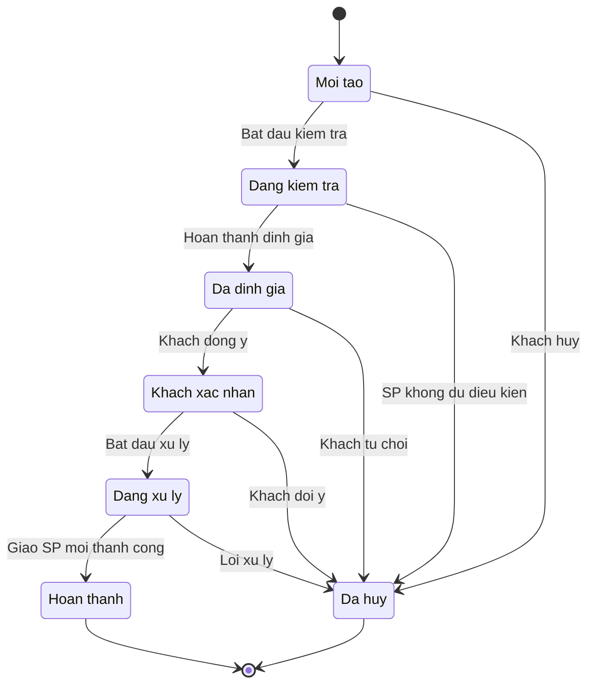
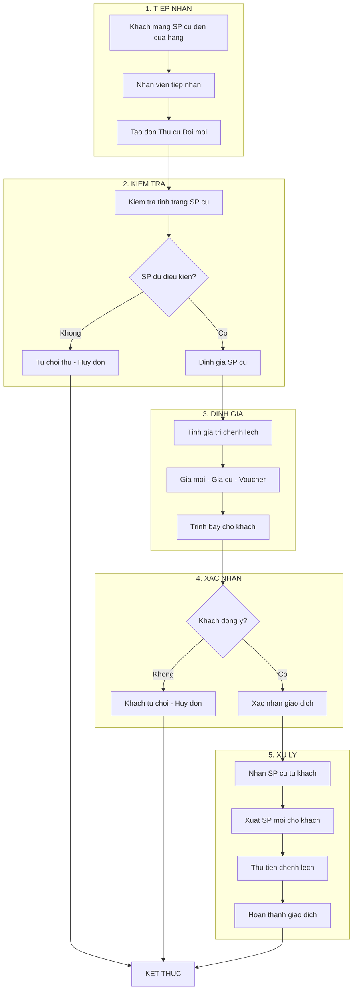

# Module Thu cũ Đổi mới (Trade-in) - Trạng thái & Workflow

> **Nguồn:** `/docs/feature/FEATURE_SPECIFICATION.md` Section 5.2.4, 5.4, 5.5
> **Phiên bản:** 1.0.0 | **Cập nhật:** 13/01/2026

---

## 1. Tổng quan Status

### 1.1. Lưu ý quan trọng

> ⚠️ **SPEC GỐC KHÔNG ĐỊNH NGHĨA TRẠNG THÁI CHO ĐƠN THU CŨ ĐỔI MỚI**
>
> Các trạng thái dưới đây được **đề xuất dựa trên quy trình nghiệp vụ** và workflow đơn hàng chung.
> **Cần xác nhận với khách hàng trước khi triển khai.**

**Nguồn:** FEATURE_SPECIFICATION.md Section 5.2.4 (Line 489-500) - Không có định nghĩa trạng thái

### 1.2. Trạng thái đề xuất

| Mã | Tên trạng thái | Mô tả | Màu đề xuất |
|----|----------------|-------|-------------|
| `NEW` | Mới tạo | Đơn vừa được tạo, chờ kiểm tra SP cũ | Xanh dương |
| `INSPECTION` | Đang kiểm tra | Nhân viên đang kiểm tra/định giá SP cũ | Vàng |
| `PRICED` | Đã định giá | SP cũ đã được định giá, chờ khách xác nhận | Cam |
| `CONFIRMED` | Khách xác nhận | Khách đồng ý với giá thu và giá trị chênh lệch | Xanh lá |
| `PROCESSING` | Đang xử lý | Đang chuẩn bị SP mới cho khách | Tím |
| `COMPLETED` | Hoàn thành | Giao dịch hoàn tất, đã giao SP mới | Xanh lá đậm |
| `CANCELLED` | Đã hủy | Đơn bị hủy (KH từ chối hoặc lý do khác) | Đỏ |

---

## 2. State Machine Diagram

### 2.1. Sơ đồ trạng thái



### 2.2. Transition Matrix

| Từ trạng thái | Đến trạng thái | Điều kiện | Actor |
|---------------|----------------|-----------|-------|
| `NEW` | `INSPECTION` | Bắt đầu kiểm tra SP cũ | Staff |
| `NEW` | `CANCELLED` | Khách hủy đơn | Staff/Customer |
| `INSPECTION` | `PRICED` | Hoàn thành định giá SP cũ | Staff |
| `INSPECTION` | `CANCELLED` | SP không đủ điều kiện thu | Staff |
| `PRICED` | `CONFIRMED` | Khách đồng ý giá | Staff |
| `PRICED` | `CANCELLED` | Khách từ chối giá | Staff/Customer |
| `CONFIRMED` | `PROCESSING` | Bắt đầu chuẩn bị SP mới | Staff |
| `CONFIRMED` | `CANCELLED` | Khách đổi ý | Staff/Customer |
| `PROCESSING` | `COMPLETED` | Giao SP mới thành công | Staff |
| `PROCESSING` | `CANCELLED` | Lỗi xử lý (hết hàng...) | Staff |

---

## 3. Workflow Chi tiết

### 3.1. Quy trình tạo đơn Thu cũ Đổi mới



### 3.2. Công thức tính giá trị chênh lệch

**Nguồn:** FEATURE_SPECIFICATION.md Section 5.2.4 (Line 498-499)

```
Số tiền khách thanh toán = Giá gậy mới - Giá thu gậy cũ - Voucher (nếu có)
```

| Thành phần | Mô tả | Ví dụ |
|------------|-------|-------|
| Giá gậy mới | Giá bán của sản phẩm mới | 15,000,000 VNĐ |
| Giá thu gậy cũ | Giá định giá sản phẩm cũ | 5,000,000 VNĐ |
| Voucher | Giảm giá (nếu có) | 500,000 VNĐ |
| **Số tiền thanh toán** | **Khách trả thêm** | **9,500,000 VNĐ** |

> ⚠️ **Cần clarify:** Trường hợp Giá thu gậy cũ > Giá gậy mới, khách có được nhận tiền chênh lệch không?

---

## 4. Database Schema (Đề xuất)

### 4.1. Trade-in Order (tradein_order)

| Field | Type | Required | Description |
|-------|------|----------|-------------|
| `id` | INT | PK | ID đơn |
| `order_code` | VARCHAR(50) | Yes | Mã đơn (auto) |
| `customer_id` | INT | FK | Khách hàng |
| `status` | ENUM | Yes | Trạng thái |
| `old_product_id` | INT | FK | SP cũ (từ Product) |
| `old_product_condition` | TEXT | No | Tình trạng SP cũ |
| `old_product_price` | DECIMAL | Yes | Giá thu SP cũ |
| `new_product_id` | INT | FK | SP mới (từ Product) |
| `new_product_price` | DECIMAL | Yes | Giá SP mới |
| `voucher_id` | INT | FK | Voucher áp dụng |
| `voucher_amount` | DECIMAL | No | Số tiền voucher |
| `payment_amount` | DECIMAL | Yes | Số tiền KH thanh toán |
| `payment_method` | ENUM | No | Phương thức TT |
| `staff_id` | INT | FK | NV xử lý |
| `branch_id` | INT | FK | Chi nhánh |
| `notes` | TEXT | No | Ghi chú |
| `created_at` | DATETIME | Yes | Ngày tạo |
| `updated_at` | DATETIME | Yes | Ngày cập nhật |

### 4.2. Trade-in Product Condition (tradein_condition)

> ⚠️ **Đề xuất bổ sung** - Cần confirm với khách hàng

| Field | Type | Required | Description |
|-------|------|----------|-------------|
| `id` | INT | PK | ID |
| `tradein_order_id` | INT | FK | Đơn trade-in |
| `condition_type` | ENUM | Yes | Loại kiểm tra |
| `condition_value` | VARCHAR | Yes | Kết quả |
| `photo_url` | VARCHAR | No | Ảnh minh chứng |
| `inspector_id` | INT | FK | NV kiểm tra |
| `inspected_at` | DATETIME | Yes | Thời gian KT |

---

## 5. Business Rules (Đề xuất)

### 5.1. Rules từ Spec

| # | Rule | Nguồn |
|---|------|-------|
| BR-01 | Gắn 2 dòng sản phẩm (cũ + mới) trong cùng một giao dịch | Section 5.2.4, Line 497 |
| BR-02 | Tính giá trị chênh lệch theo công thức | Section 5.2.4, Line 498-499 |

### 5.2. Rules đề xuất (Cần confirm)

| # | Rule | Lý do |
|---|------|-------|
| BR-03 | Chỉ thu SP cũ đã mua tại Nhật Minh Sports | Đảm bảo nguồn gốc |
| BR-04 | SP cũ phải còn sử dụng được | Đảm bảo chất lượng |
| BR-05 | Giá thu SP cũ do Manager duyệt | Kiểm soát chi phí |
| BR-06 | SP cũ sau khi thu nhập kho "Hàng thu cũ" | Quản lý tồn kho |

---

## 6. Integration Points

### 6.1. Liên kết với các module khác

| Module | Mối quan hệ | Mô tả |
|--------|-------------|-------|
| **Khách hàng** | Customer | Khách hàng thực hiện trade-in |
| **Sản phẩm** | Product | SP cũ và SP mới trong giao dịch |
| **Kho** | Inventory | Nhập SP cũ, xuất SP mới |
| **Voucher** | Promotion | Áp dụng voucher giảm giá |
| **Đơn hàng** | Order | Trade-in là một loại đơn hàng |
| **Resell** | Resell | SP cũ có thể bán lại (Section 5.9) |

### 6.2. Tích hợp với Resell (Section 5.9)

**Nguồn:** FEATURE_SPECIFICATION.md Section 5.9 (Line 580-586)

> ⚠️ **Cần clarify:** Sau khi thu SP cũ, quy trình bán lại (Resell) như thế nào?

---

## 7. Permission Matrix (Đề xuất)

| Chức năng | Admin | Manager | Sales Staff | Cashier |
|-----------|-------|---------|-------------|---------|
| Xem danh sách đơn trade-in | ✅ | ✅ | ✅ (Chi nhánh) | ✅ (Chi nhánh) |
| Tạo đơn trade-in | ✅ | ✅ | ✅ | ❌ |
| Kiểm tra/Định giá SP cũ | ✅ | ✅ | ✅ | ❌ |
| Duyệt giá thu SP cũ | ✅ | ✅ | ❌ | ❌ |
| Cập nhật đơn | ✅ | ✅ | ✅ (Sở hữu) | ❌ |
| Hủy đơn | ✅ | ✅ | ❌ | ❌ |
| Hoàn thành giao dịch | ✅ | ✅ | ✅ | ✅ |
| Export báo cáo | ✅ | ✅ | ❌ | ❌ |

---

## 8. Các điểm cần Clarify

| # | Câu hỏi | Phạm vi |
|---|---------|---------|
| 1 | Danh sách trạng thái chính thức của đơn trade-in? | Status |
| 2 | Tiêu chí kiểm tra SP cũ (checklist)? | Workflow |
| 3 | Quy tắc định giá SP cũ? | Business Rule |
| 4 | Ai có quyền duyệt giá thu? | Permission |
| 5 | SP cũ sau khi thu nhập vào kho nào? | Integration |
| 6 | Trường hợp giá cũ > giá mới xử lý thế nào? | Business Rule |
| 7 | Có giới hạn thời gian SP cũ (VD: mua trong 2 năm)? | Business Rule |
| 8 | Có yêu cầu hóa đơn mua SP cũ không? | Validation |

---

**Nguồn:** `/docs/feature/FEATURE_SPECIFICATION.md` Section 5.2.4, 5.4, 5.5
**Lưu ý:** Các trạng thái và workflow được **ĐỀ XUẤT** dựa trên quy trình nghiệp vụ. Cần xác nhận với khách hàng.
