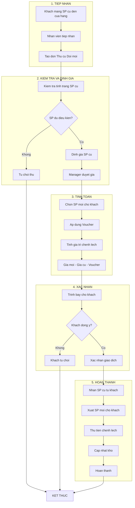
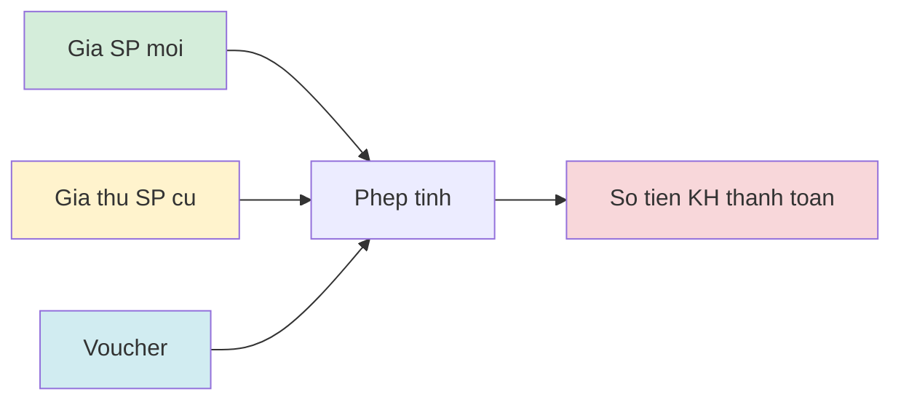
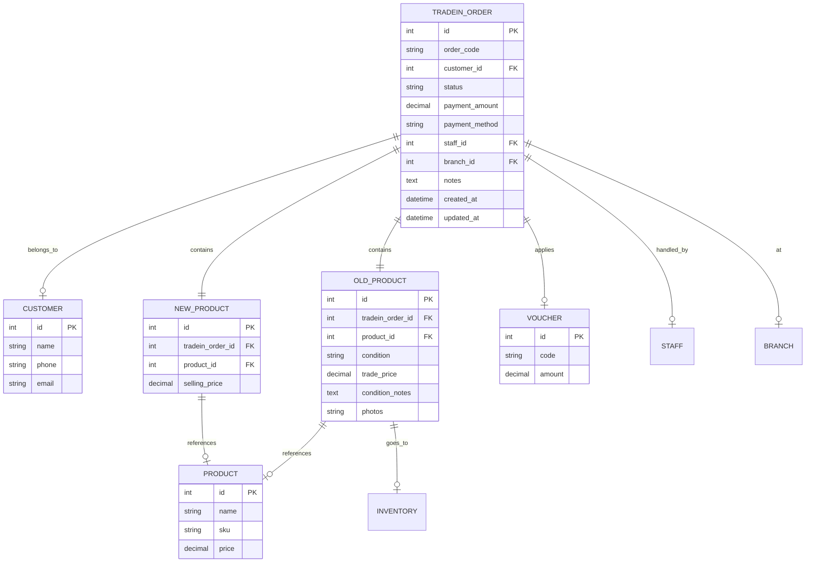
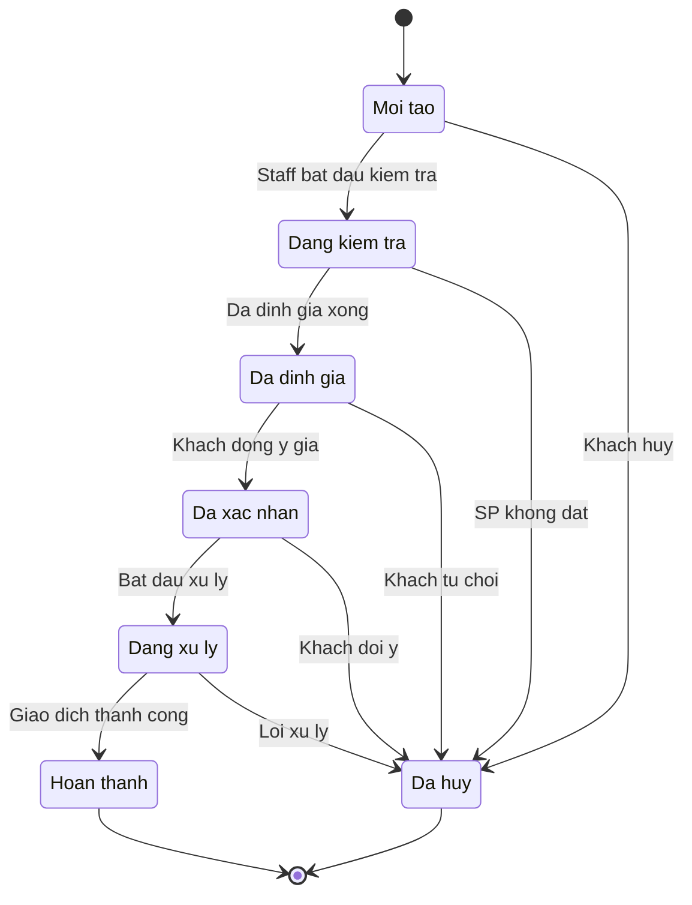
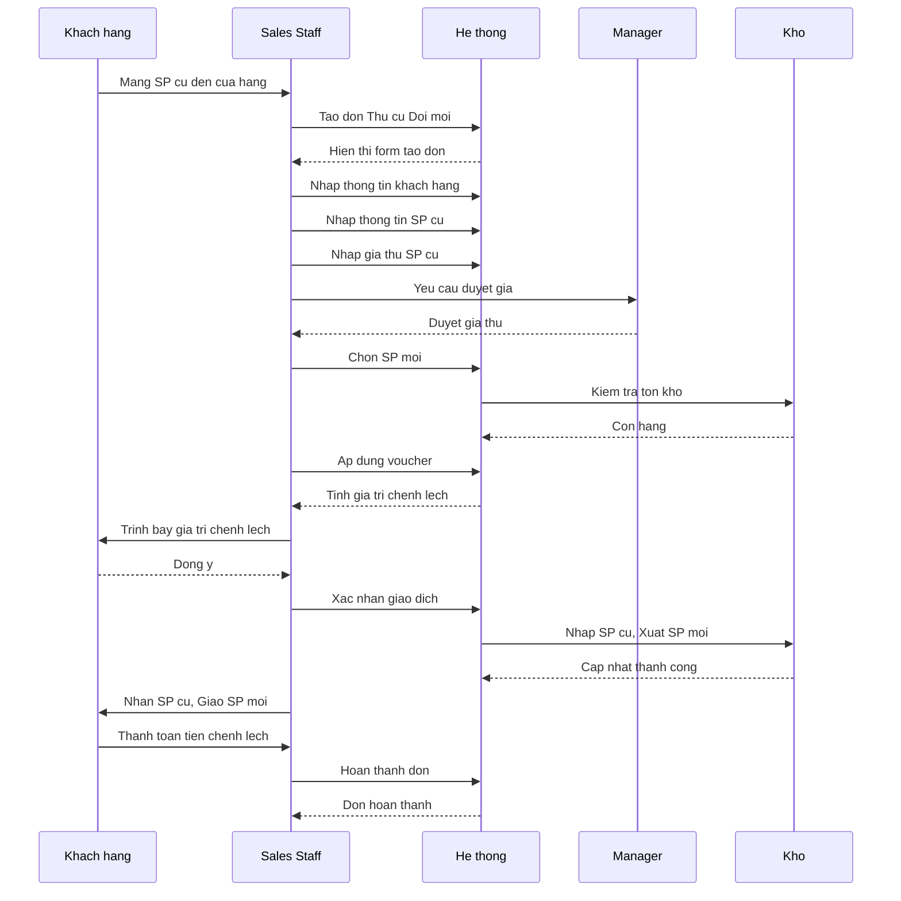
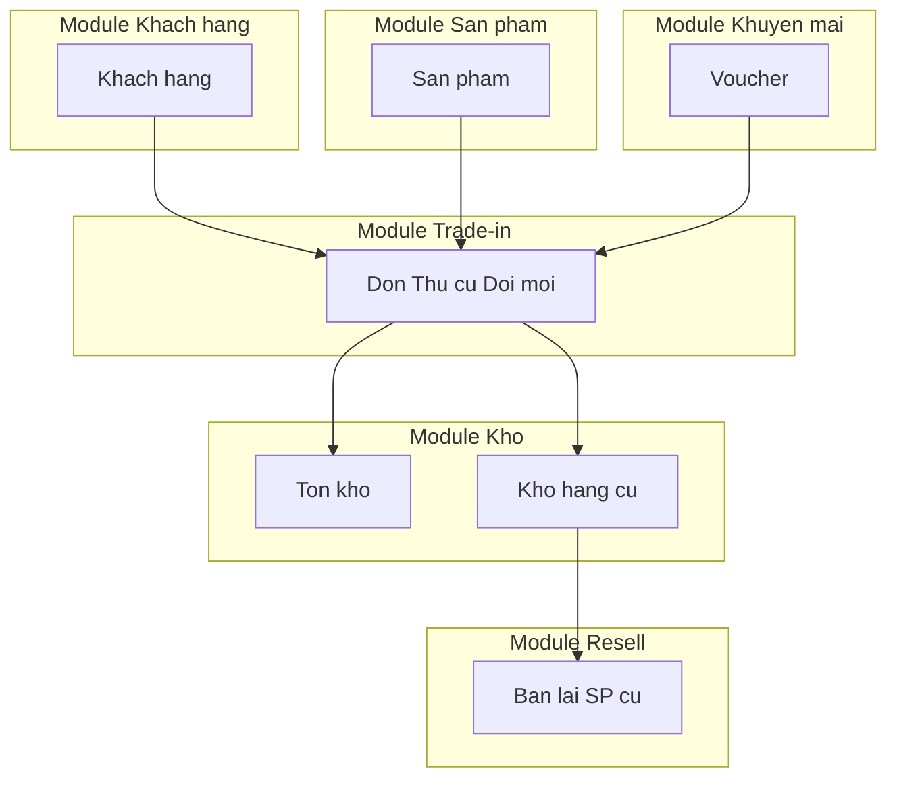

# Module Thu cũ Đổi mới (Trade-in) - Workflow, ERD & UI

> **Nguồn:** `/docs/feature/FEATURE_SPECIFICATION.md` Section 5.2.4, 5.4, 5.5
> **Phiên bản:** 1.0.0 | **Cập nhật:** 13/01/2026

---

## 1. Workflow Diagram

### 1.1. Quy trình tổng quan



### 1.2. Quy trình tính giá trị chênh lệch

**Nguồn:** FEATURE_SPECIFICATION.md Section 5.2.4 (Line 498-499)



**Công thức:**
```
Số tiền khách thanh toán = Giá SP mới - Giá thu SP cũ - Voucher (nếu có)
```

---

## 2. Entity Relationship Diagram (ERD)

### 2.1. ERD Tổng quan



### 2.2. Mô tả các Entity

| Entity | Mô tả | Nguồn |
|--------|-------|-------|
| **TRADEIN_ORDER** | Đơn thu cũ đổi mới | Section 5.2.4 |
| **OLD_PRODUCT** | Thông tin SP cũ khách trả | Section 5.2.4, Line 492 |
| **NEW_PRODUCT** | Thông tin SP mới khách nhận | Section 5.2.4, Line 493 |
| **CUSTOMER** | Khách hàng | Section 4 |
| **PRODUCT** | Danh mục sản phẩm | Section 6 |
| **VOUCHER** | Mã giảm giá | Section 5.2.4, Line 499 |

---

## 3. State Diagram

### 3.1. Trạng thái đơn Trade-in (Đề xuất)



### 3.2. Ma trận chuyển trạng thái

| Từ | Đến | Điều kiện | Actor |
|----|-----|-----------|-------|
| NEW | INSPECTION | Bắt đầu kiểm tra SP cũ | Staff |
| NEW | CANCELLED | Khách hủy yêu cầu | Staff |
| INSPECTION | PRICED | Hoàn thành định giá | Staff/Manager |
| INSPECTION | CANCELLED | SP không đủ điều kiện | Staff |
| PRICED | CONFIRMED | Khách đồng ý giá | Staff |
| PRICED | CANCELLED | Khách từ chối giá | Staff |
| CONFIRMED | PROCESSING | Bắt đầu giao dịch | Staff |
| CONFIRMED | CANCELLED | Khách đổi ý | Staff/Manager |
| PROCESSING | COMPLETED | Giao dịch thành công | Staff |
| PROCESSING | CANCELLED | Lỗi xử lý | Manager |

---

## 4. UI Mockups

### 4.1. Danh sách đơn Trade-in

```
┌─────────────────────────────────────────────────────────────────────────┐
│ DANH SÁCH ĐƠN THU CŨ ĐỔI MỚI                         [+ Tạo đơn mới]   │
├─────────────────────────────────────────────────────────────────────────┤
│ 🔍 Tìm kiếm: [________________]  📅 Từ: [__/__/____] Đến: [__/__/____] │
│ Trạng thái: [Tất cả ▼]  Chi nhánh: [Tất cả ▼]                          │
├─────────────────────────────────────────────────────────────────────────┤
│ Mã đơn    │ Khách hàng   │ SP Cũ      │ SP Mới     │ Chênh lệch │ TT   │
├───────────┼──────────────┼────────────┼────────────┼────────────┼──────┤
│ TI-001    │ Nguyễn Văn A │ Driver     │ Driver     │ 9,500,000  │ ✅   │
│           │ 0901234567   │ Callaway   │ TaylorMade │            │      │
├───────────┼──────────────┼────────────┼────────────┼────────────┼──────┤
│ TI-002    │ Trần Thị B   │ Iron Set   │ Iron Set   │ 12,000,000 │ 🟡   │
│           │ 0912345678   │ Titleist   │ Mizuno     │            │      │
├───────────┼──────────────┼────────────┼────────────┼────────────┼──────┤
│ TI-003    │ Lê Văn C     │ Putter     │ Putter     │ 3,500,000  │ ⏳   │
│           │ 0923456789   │ Odyssey    │ Scotty     │            │      │
└─────────────────────────────────────────────────────────────────────────┘
│                              [1] [2] [3] ... [10]                       │
└─────────────────────────────────────────────────────────────────────────┘

Trạng thái: ✅ Hoàn thành  🟡 Đang xử lý  ⏳ Chờ xác nhận  ❌ Đã hủy
```

### 4.2. Form tạo đơn Trade-in

```
┌─────────────────────────────────────────────────────────────────────────┐
│ TẠO ĐƠN THU CŨ ĐỔI MỚI                                                 │
├─────────────────────────────────────────────────────────────────────────┤
│                                                                         │
│ THÔNG TIN KHÁCH HÀNG                                                   │
│ ┌─────────────────────────────────────────────────────────────────┐    │
│ │ Khách hàng: [Tìm kiếm khách hàng...          ▼] [+ Tạo mới]    │    │
│ │ SĐT: 0901234567          Email: customer@email.com              │    │
│ └─────────────────────────────────────────────────────────────────┘    │
│                                                                         │
│ THÔNG TIN SẢN PHẨM CŨ (KHÁCH TRẢ)                                      │
│ ┌─────────────────────────────────────────────────────────────────┐    │
│ │ Tên SP:     [Driver Callaway Big Bertha                    ]    │    │
│ │ Thương hiệu: [Callaway          ▼]                              │    │
│ │ Tình trạng: [Tốt ▼]    ○ Mới  ● Tốt  ○ Trung bình  ○ Kém       │    │
│ │ Giá thu:    [5,000,000         ] VNĐ                            │    │
│ │ Ghi chú:    [Đầu gậy còn tốt, grip cần thay              ]     │    │
│ │ Hình ảnh:   [📷 Thêm ảnh]                                       │    │
│ └─────────────────────────────────────────────────────────────────┘    │
│                                                                         │
│ THÔNG TIN SẢN PHẨM MỚI (KHÁCH NHẬN)                                    │
│ ┌─────────────────────────────────────────────────────────────────┐    │
│ │ Sản phẩm:   [Tìm kiếm sản phẩm...            ▼]                │    │
│ │ Tên:        Driver TaylorMade Stealth 2                         │    │
│ │ Giá bán:    15,000,000 VNĐ                                      │    │
│ │ Tồn kho:    5 (Chi nhánh HCM)                                   │    │
│ └─────────────────────────────────────────────────────────────────┘    │
│                                                                         │
│ TÍNH TOÁN                                                              │
│ ┌─────────────────────────────────────────────────────────────────┐    │
│ │ Giá SP mới:         15,000,000 VNĐ                              │    │
│ │ Giá thu SP cũ:     - 5,000,000 VNĐ                              │    │
│ │ Voucher:           [SUMMER2026  ] -500,000 VNĐ [Áp dụng]        │    │
│ │ ─────────────────────────────────                               │    │
│ │ KHÁCH THANH TOÁN:   9,500,000 VNĐ                               │    │
│ └─────────────────────────────────────────────────────────────────┘    │
│                                                                         │
│ Ghi chú đơn hàng:                                                      │
│ ┌─────────────────────────────────────────────────────────────────┐    │
│ │ [                                                            ]  │    │
│ └─────────────────────────────────────────────────────────────────┘    │
│                                                                         │
│                              [Hủy]  [Lưu nháp]  [Tạo đơn]              │
└─────────────────────────────────────────────────────────────────────────┘
```

### 4.3. Chi tiết đơn Trade-in

```
┌─────────────────────────────────────────────────────────────────────────┐
│ CHI TIẾT ĐƠN THU CŨ ĐỔI MỚI #TI-001                                    │
│ Trạng thái: [✅ Hoàn thành]                    [Cập nhật] [In] [Hủy]   │
├─────────────────────────────────────────────────────────────────────────┤
│                                                                         │
│ ┌── KHÁCH HÀNG ─────────────┐  ┌── THÔNG TIN ĐƠN ──────────────────┐  │
│ │ Tên: Nguyễn Văn A         │  │ Mã đơn: TI-001                    │  │
│ │ SĐT: 0901234567           │  │ Ngày tạo: 13/01/2026 10:30        │  │
│ │ Email: nva@email.com      │  │ NV xử lý: Trần Thị Sale           │  │
│ └───────────────────────────┘  │ Chi nhánh: HCM - Quận 1           │  │
│                                └────────────────────────────────────┘  │
│                                                                         │
│ ┌── SẢN PHẨM CŨ ────────────────────────────────────────────────────┐ │
│ │ Tên: Driver Callaway Big Bertha                                    │ │
│ │ Thương hiệu: Callaway                                              │ │
│ │ Tình trạng: Tốt                                                    │ │
│ │ Giá thu: 5,000,000 VNĐ                                             │ │
│ │ Ghi chú: Đầu gậy còn tốt, grip cần thay                           │ │
│ │ [📷 Xem ảnh]                                                       │ │
│ └────────────────────────────────────────────────────────────────────┘ │
│                                                                         │
│ ┌── SẢN PHẨM MỚI ───────────────────────────────────────────────────┐ │
│ │ Tên: Driver TaylorMade Stealth 2                                   │ │
│ │ SKU: TM-STL2-001                                                   │ │
│ │ Giá bán: 15,000,000 VNĐ                                            │ │
│ └────────────────────────────────────────────────────────────────────┘ │
│                                                                         │
│ ┌── THANH TOÁN ─────────────────────────────────────────────────────┐ │
│ │ Giá SP mới:         15,000,000 VNĐ                                 │ │
│ │ Giá thu SP cũ:     - 5,000,000 VNĐ                                 │ │
│ │ Voucher (SUMMER2026): -500,000 VNĐ                                 │ │
│ │ ───────────────────────────────────                                │ │
│ │ TỔNG THANH TOÁN:     9,500,000 VNĐ                                 │ │
│ │ Phương thức: Chuyển khoản                                          │ │
│ └────────────────────────────────────────────────────────────────────┘ │
│                                                                         │
│ ┌── LỊCH SỬ ────────────────────────────────────────────────────────┐ │
│ │ 13/01/2026 10:30 - Tạo đơn (Trần Thị Sale)                        │ │
│ │ 13/01/2026 10:35 - Kiểm tra SP cũ (Trần Thị Sale)                 │ │
│ │ 13/01/2026 10:45 - Định giá: 5,000,000 VNĐ (Nguyễn Văn Manager)   │ │
│ │ 13/01/2026 11:00 - Khách xác nhận đồng ý                          │ │
│ │ 13/01/2026 11:15 - Hoàn thành giao dịch (Trần Thị Sale)           │ │
│ └────────────────────────────────────────────────────────────────────┘ │
└─────────────────────────────────────────────────────────────────────────┘
```

---

## 5. Sequence Diagram - Tạo đơn Trade-in



---

## 6. Integration Points

### 6.1. Tích hợp với các module



### 6.2. Data Flow

| Từ Module | Đến Module | Dữ liệu | Hành động |
|-----------|------------|---------|-----------|
| Khách hàng | Trade-in | Customer info | Lookup |
| Sản phẩm | Trade-in | Product info | Lookup |
| Trade-in | Kho | SP cũ | Nhập kho |
| Trade-in | Kho | SP mới | Xuất kho |
| Voucher | Trade-in | Discount | Áp dụng |
| Trade-in | Resell | SP cũ | Bán lại |

---

**Nguồn:** `/docs/feature/FEATURE_SPECIFICATION.md` Section 5.2.4, 5.4, 5.5
**Lưu ý:** Workflow và trạng thái được **đề xuất** dựa trên quy trình nghiệp vụ. UI mockups là bản phác thảo, cần xác nhận với khách hàng.
