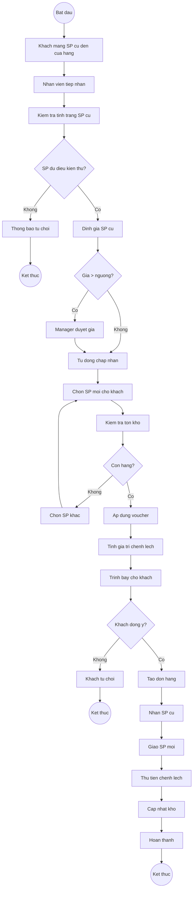
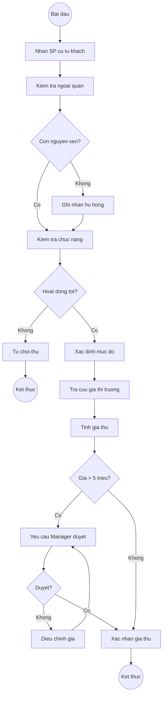
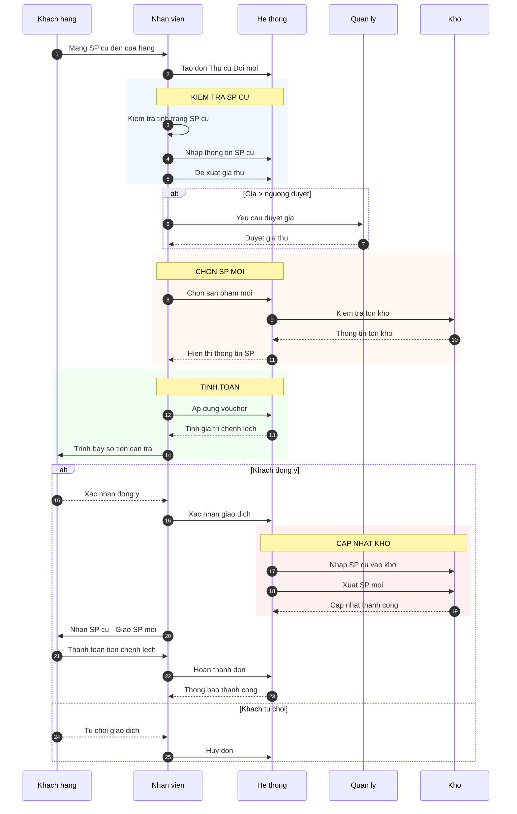
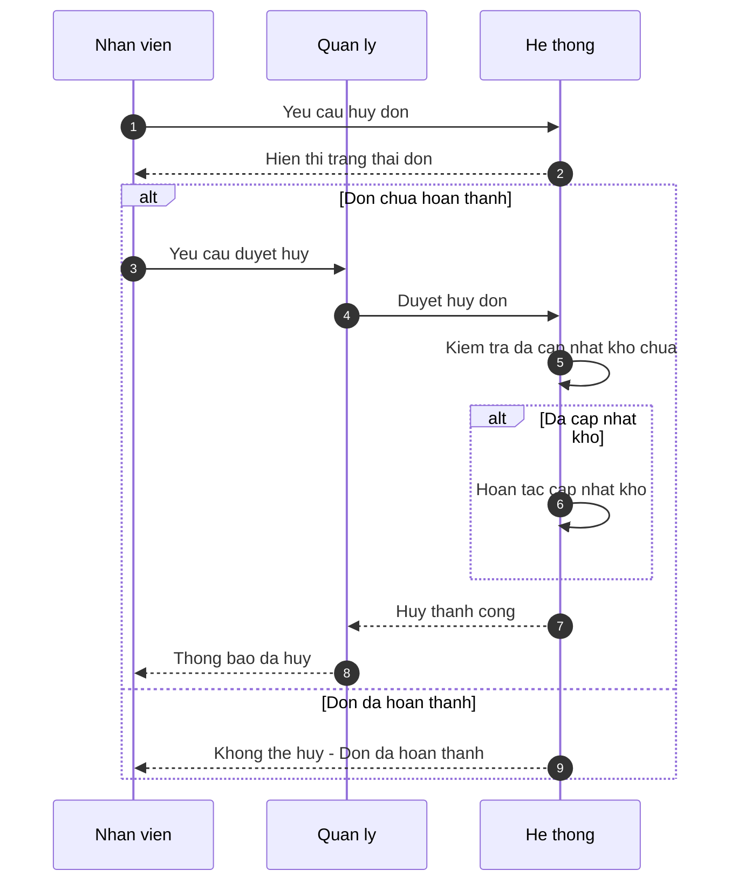
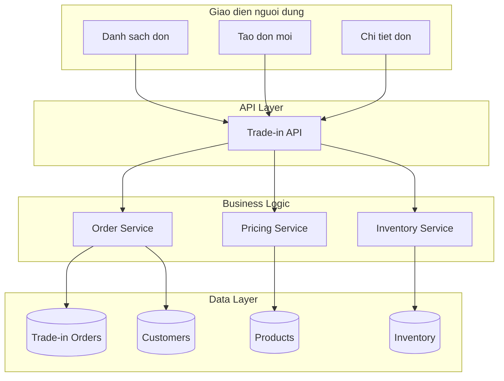
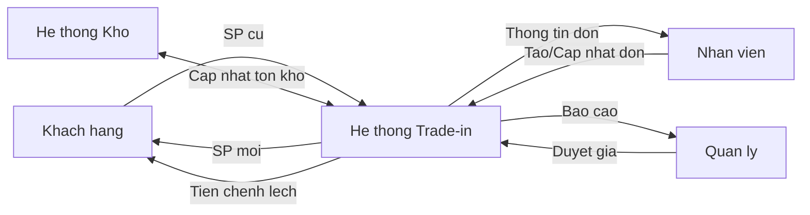
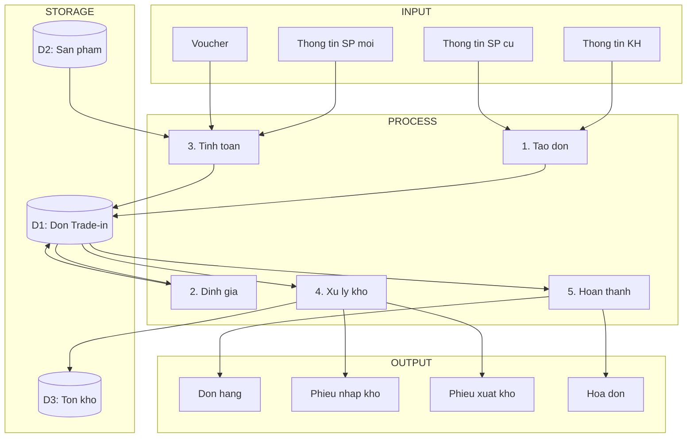
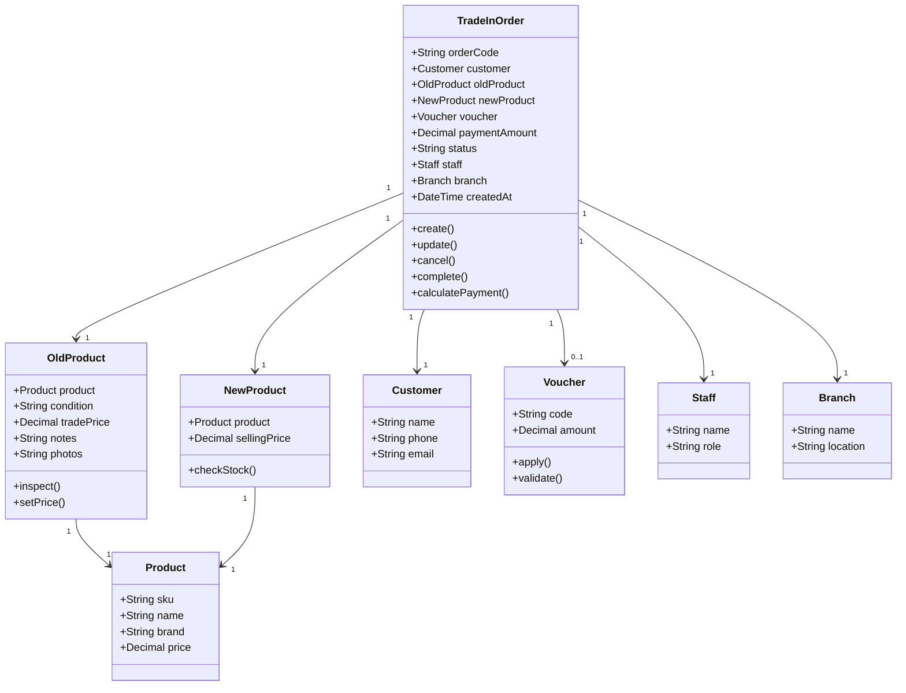
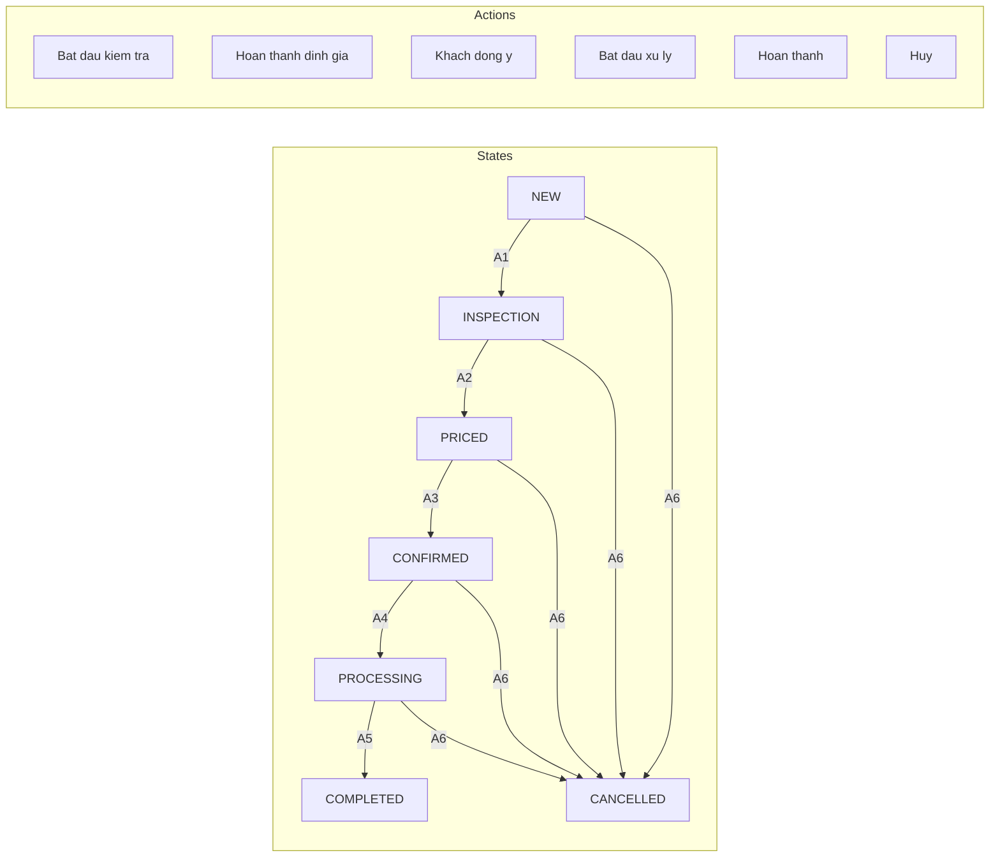

# Module Thu cũ Đổi mới (Trade-in) - Diagrams

> **Nguồn:** `/docs/feature/FEATURE_SPECIFICATION.md` Section 5.2.4, 5.4, 5.5
> **Phiên bản:** 1.0.0 | **Cập nhật:** 13/01/2026

---

## 1. Activity Diagrams

### 1.1. Quy trình tạo đơn Trade-in



### 1.2. Quy trình định giá SP cũ



---

## 2. Sequence Diagrams

### 2.1. Luồng tạo đơn Trade-in đầy đủ



### 2.2. Luồng hủy đơn Trade-in



---

## 3. Component Diagram

### 3.1. Kiến trúc Module Trade-in



---

## 4. Data Flow Diagram

### 4.1. DFD Level 0 - Context



### 4.2. DFD Level 1 - Chi tiết



---

## 5. Class Diagram (Đề xuất)



---

## 6. Timeline - Một giao dịch Trade-in

```mermaid
gantt
    title Timeline giao dich Trade-in
    dateFormat HH:mm
    axisFormat %H:%M

    section Tiep nhan
    Khach den cua hang           :a1, 10:00, 5m
    Tiep nhan yeu cau           :a2, after a1, 5m

    section Kiem tra
    Kiem tra SP cu              :b1, after a2, 10m
    Dinh gia SP cu              :b2, after b1, 5m
    Duyet gia                   :b3, after b2, 5m

    section Giao dich
    Chon SP moi                 :c1, after b3, 5m
    Tinh toan chenh lech        :c2, after c1, 2m
    Khach xac nhan              :c3, after c2, 5m

    section Hoan thanh
    Nhan SP cu - Giao SP moi    :d1, after c3, 5m
    Thanh toan                  :d2, after d1, 5m
    Cap nhat he thong           :d3, after d2, 3m
```



---

## 7. Trạng thái và Hành động

### 7.1. State-Action Matrix



---

## 8. Công thức tính toán

### 8.1. Visual công thức

**Nguồn:** FEATURE_SPECIFICATION.md Section 5.2.4 (Line 498-499)

```
┌─────────────────────────────────────────────────────────────────┐
│                                                                 │
│   ┌─────────────┐   ┌─────────────┐   ┌─────────────┐          │
│   │  Giá SP     │   │  Giá thu    │   │   Voucher   │          │
│   │    mới      │ - │   SP cũ     │ - │   (nếu có)  │          │
│   │ 15,000,000  │   │  5,000,000  │   │   500,000   │          │
│   └─────────────┘   └─────────────┘   └─────────────┘          │
│          │                 │                 │                  │
│          └────────────────┬┴─────────────────┘                  │
│                           ▼                                     │
│                  ┌─────────────────┐                           │
│                  │   Số tiền KH    │                           │
│                  │   thanh toán    │                           │
│                  │   9,500,000     │                           │
│                  └─────────────────┘                           │
│                                                                 │
└─────────────────────────────────────────────────────────────────┘
```

---

## 9. Danh sách Diagrams

| # | Diagram | Loại | Mô tả |
|---|---------|------|-------|
| 1.1 | Quy trình tạo đơn | Activity | Flow tạo đơn trade-in đầy đủ |
| 1.2 | Quy trình định giá | Activity | Flow định giá SP cũ |
| 2.1 | Tạo đơn đầy đủ | Sequence | Luồng tạo đơn với các actors |
| 2.2 | Hủy đơn | Sequence | Luồng hủy đơn trade-in |
| 3.1 | Kiến trúc module | Component | Cấu trúc kỹ thuật module |
| 4.1 | DFD Level 0 | Data Flow | Context diagram |
| 4.2 | DFD Level 1 | Data Flow | Chi tiết data flow |
| 5 | Class Diagram | Class | Cấu trúc đối tượng |
| 6 | Timeline | Gantt | Timeline 1 giao dịch |
| 7.1 | State-Action | Flowchart | Trạng thái và hành động |

---

**Nguồn:** `/docs/feature/FEATURE_SPECIFICATION.md` Section 5.2.4, 5.4, 5.5
**Lưu ý:** Các diagrams được **thiết kế** dựa trên quy trình nghiệp vụ. Cần review và xác nhận với khách hàng.
