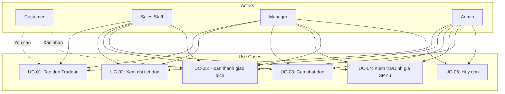

# Module Thu cũ Đổi mới (Trade-in) - Use Cases & Phân quyền

> **Nguồn:** `/docs/feature/FEATURE_SPECIFICATION.md` Section 5.2.4, 5.4, 5.5
> **Phiên bản:** 1.0.0 | **Cập nhật:** 13/01/2026

---

## 1. Actors (Vai trò)

| Actor | Mô tả | Quyền hạn |
|-------|-------|-----------|
| **Customer** | Khách hàng muốn đổi sản phẩm cũ | Yêu cầu trade-in, xác nhận giao dịch |
| **Sales Staff** | Nhân viên bán hàng | Tạo, xem, cập nhật đơn trade-in |
| **Manager** | Quản lý cửa hàng/chi nhánh | Duyệt giá thu, hủy đơn, xem báo cáo |
| **Admin** | Quản trị hệ thống | Toàn quyền |

---

## 2. Use Cases

### 2.1. UC-01: Tạo đơn Thu cũ Đổi mới

**Nguồn:** FEATURE_SPECIFICATION.md Section 5.2.4 (Line 489-500)

| Thuộc tính | Mô tả |
|------------|-------|
| **Actor** | Sales Staff |
| **Mô tả** | Tạo đơn trade-in khi khách muốn đổi sản phẩm cũ lấy mới |
| **Precondition** | - Khách hàng đã có trong hệ thống (hoặc tạo mới) - SP cũ đã được kiểm tra - SP mới còn tồn kho |
| **Postcondition** | - Đơn trade-in được tạo với trạng thái "Mới" - Gắn 2 dòng sản phẩm (cũ + mới) |

**Main Flow:**

| Bước | Actor | Hành động |
|------|-------|-----------|
| 1 | Sales Staff | Chọn "Tạo đơn Thu cũ Đổi mới" |
| 2 | System | Hiển thị form tạo đơn |
| 3 | Sales Staff | Chọn/Tạo khách hàng |
| 4 | Sales Staff | Nhập thông tin SP cũ khách trả |
| 5 | Sales Staff | Nhập giá thu SP cũ |
| 6 | Sales Staff | Chọn SP mới khách nhận |
| 7 | Sales Staff | Áp dụng voucher (nếu có) |
| 8 | System | Tính tự động: Giá mới - Giá cũ - Voucher = Số tiền thanh toán |
| 9 | Sales Staff | Xác nhận tạo đơn |
| 10 | System | Lưu đơn, hiển thị thông báo thành công |

**Alternative Flow:**

| Bước | Điều kiện | Hành động |
|------|-----------|-----------|
| 3a | KH chưa có | Mở popup tạo KH mới, quay lại bước 4 |
| 6a | SP hết hàng | Hiển thị thông báo, chọn SP khác |
| 9a | Thiếu thông tin | Hiển thị lỗi validation |

**Business Rules:**
- BR-01: Gắn 2 dòng sản phẩm trong cùng một giao dịch (Line 497)
- BR-02: Công thức: Giá mới - Giá cũ - Voucher = Số tiền KH thanh toán (Line 498-499)

---

### 2.2. UC-02: Xem chi tiết đơn Thu cũ Đổi mới

**Nguồn:** FEATURE_SPECIFICATION.md Section 5.4 (Line 540)

| Thuộc tính | Mô tả |
|------------|-------|
| **Actor** | Sales Staff, Manager, Admin |
| **Mô tả** | Xem chi tiết thông tin đơn trade-in |
| **Precondition** | Đơn trade-in đã tồn tại |
| **Postcondition** | Hiển thị đầy đủ thông tin đơn |

**Main Flow:**

| Bước | Actor | Hành động |
|------|-------|-----------|
| 1 | Actor | Chọn đơn từ danh sách |
| 2 | System | Hiển thị chi tiết đơn trade-in |
| 3 | Actor | Xem thông tin SP cũ, SP mới, giá trị chênh lệch |

**Thông tin hiển thị (đề xuất):**
- Mã đơn, ngày tạo, trạng thái
- Thông tin khách hàng
- Thông tin SP cũ (tên, tình trạng, giá thu)
- Thông tin SP mới (tên, giá bán)
- Voucher áp dụng (nếu có)
- Số tiền khách thanh toán
- Nhân viên xử lý
- Ghi chú

> ⚠️ **Cần clarify:** Chi tiết hiển thị những thông tin gì? Có hiển thị lịch sử thay đổi trạng thái không?

---

### 2.3. UC-03: Cập nhật đơn Thu cũ Đổi mới

**Nguồn:** FEATURE_SPECIFICATION.md Section 5.5 (Line 553)

| Thuộc tính | Mô tả |
|------------|-------|
| **Actor** | Sales Staff (sở hữu), Manager, Admin |
| **Mô tả** | Cập nhật thông tin đơn trade-in |
| **Precondition** | - Đơn chưa hoàn thành - Actor có quyền cập nhật |
| **Postcondition** | Thông tin đơn được cập nhật |

**Main Flow:**

| Bước | Actor | Hành động |
|------|-------|-----------|
| 1 | Actor | Mở chi tiết đơn, chọn "Cập nhật" |
| 2 | System | Hiển thị form chỉnh sửa |
| 3 | Actor | Thay đổi thông tin cần cập nhật |
| 4 | System | Tính lại giá trị chênh lệch (nếu có thay đổi) |
| 5 | Actor | Xác nhận cập nhật |
| 6 | System | Lưu thay đổi, ghi log |

**Alternative Flow:**

| Bước | Điều kiện | Hành động |
|------|-----------|-----------|
| 1a | Đơn đã hoàn thành | Không cho phép cập nhật |
| 3a | Thay đổi giá thu | Yêu cầu Manager duyệt (đề xuất) |

> ⚠️ **Cần clarify:** Những trường nào được phép cập nhật? Quy trình duyệt như thế nào?

---

### 2.4. UC-04: Kiểm tra/Định giá SP cũ (Đề xuất)

> ⚠️ **LƯU Ý:** Use case này được **đề xuất** dựa trên quy trình nghiệp vụ, không có trong spec gốc

| Thuộc tính | Mô tả |
|------------|-------|
| **Actor** | Sales Staff, Manager |
| **Mô tả** | Kiểm tra tình trạng và định giá SP cũ khách mang đến |
| **Precondition** | Khách mang SP cũ đến cửa hàng |
| **Postcondition** | SP cũ được đánh giá và có giá thu |

**Main Flow:**

| Bước | Actor | Hành động |
|------|-------|-----------|
| 1 | Sales Staff | Nhận SP cũ từ khách |
| 2 | Sales Staff | Kiểm tra tình trạng bên ngoài |
| 3 | Sales Staff | Đánh giá mức độ: Mới/Tốt/Trung bình/Kém |
| 4 | Sales Staff | Chụp ảnh minh chứng (nếu cần) |
| 5 | Sales Staff | Đề xuất giá thu |
| 6 | Manager | Duyệt giá thu (nếu cần) |
| 7 | System | Lưu thông tin định giá |

---

### 2.5. UC-05: Hoàn thành giao dịch Trade-in (Đề xuất)

> ⚠️ **LƯU Ý:** Use case này được **đề xuất** dựa trên quy trình nghiệp vụ

| Thuộc tính | Mô tả |
|------------|-------|
| **Actor** | Sales Staff |
| **Mô tả** | Hoàn thành giao dịch trade-in |
| **Precondition** | - Đơn đã được khách xác nhận - SP mới còn tồn kho |
| **Postcondition** | - Giao dịch hoàn tất - Tồn kho được cập nhật |

**Main Flow:**

| Bước | Actor | Hành động |
|------|-------|-----------|
| 1 | Sales Staff | Xác nhận khách đồng ý với giá |
| 2 | Sales Staff | Nhận SP cũ từ khách |
| 3 | System | Nhập SP cũ vào kho "Hàng thu cũ" |
| 4 | Sales Staff | Xuất SP mới cho khách |
| 5 | System | Giảm tồn kho SP mới |
| 6 | Sales Staff | Thu tiền chênh lệch từ khách |
| 7 | System | Cập nhật trạng thái "Hoàn thành" |

---

### 2.6. UC-06: Hủy đơn Trade-in (Đề xuất)

> ⚠️ **LƯU Ý:** Use case này được **đề xuất** dựa trên quy trình nghiệp vụ

| Thuộc tính | Mô tả |
|------------|-------|
| **Actor** | Manager, Admin |
| **Mô tả** | Hủy đơn trade-in khi khách từ chối hoặc có lý do khác |
| **Precondition** | Đơn chưa hoàn thành |
| **Postcondition** | Đơn chuyển sang trạng thái "Đã hủy" |

**Main Flow:**

| Bước | Actor | Hành động |
|------|-------|-----------|
| 1 | Actor | Mở chi tiết đơn, chọn "Hủy đơn" |
| 2 | System | Hiển thị dialog xác nhận |
| 3 | Actor | Nhập lý do hủy |
| 4 | Actor | Xác nhận hủy |
| 5 | System | Cập nhật trạng thái "Đã hủy", ghi log |

---

## 3. Permission Matrix

### 3.1. Ma trận phân quyền theo Use Case

| Use Case | Customer | Sales Staff | Manager | Admin |
|----------|----------|-------------|---------|-------|
| UC-01: Tạo đơn trade-in | ❌ | ✅ | ✅ | ✅ |
| UC-02: Xem chi tiết | ❌ | ✅ (Chi nhánh) | ✅ (Chi nhánh) | ✅ |
| UC-03: Cập nhật đơn | ❌ | ✅ (Sở hữu) | ✅ | ✅ |
| UC-04: Định giá SP cũ | ❌ | ✅ | ✅ | ✅ |
| UC-05: Hoàn thành GD | ❌ | ✅ | ✅ | ✅ |
| UC-06: Hủy đơn | ❌ | ❌ | ✅ | ✅ |

### 3.2. Ma trận phân quyền chi tiết

| Chức năng | Admin | Manager | Sales Staff | Ghi chú |
|-----------|-------|---------|-------------|---------|
| **Danh sách đơn** |
| Xem tất cả chi nhánh | ✅ | ❌ | ❌ | |
| Xem chi nhánh mình | ✅ | ✅ | ✅ | |
| Filter/Search | ✅ | ✅ | ✅ | |
| Export danh sách | ✅ | ✅ | ❌ | |
| **Tạo đơn** |
| Tạo đơn mới | ✅ | ✅ | ✅ | |
| Nhập giá thu SP cũ | ✅ | ✅ | ✅ | |
| **Duyệt giá** |
| Duyệt giá thu | ✅ | ✅ | ❌ | Đề xuất |
| **Cập nhật đơn** |
| Cập nhật đơn bất kỳ | ✅ | ✅ | ❌ | |
| Cập nhật đơn sở hữu | ✅ | ✅ | ✅ | |
| **Trạng thái** |
| Chuyển trạng thái | ✅ | ✅ | ✅ | Theo flow |
| Hủy đơn | ✅ | ✅ | ❌ | |
| **Báo cáo** |
| Xem báo cáo | ✅ | ✅ | ❌ | |
| Export báo cáo | ✅ | ✅ | ❌ | |

---

## 4. Use Case Diagram

---

## 5. Tổng hợp Use Cases

| ID | Use Case | Nguồn | Actors | Ưu tiên |
|----|----------|-------|--------|---------|
| UC-01 | Tạo đơn Thu cũ Đổi mới | Section 5.2.4, Line 489 | Staff, Manager, Admin | Cao |
| UC-02 | Xem chi tiết đơn | Section 5.4, Line 540 | Staff, Manager, Admin | Cao |
| UC-03 | Cập nhật đơn | Section 5.5, Line 553 | Staff, Manager, Admin | Cao |
| UC-04 | Kiểm tra/Định giá SP cũ | Đề xuất | Staff, Manager | Trung bình |
| UC-05 | Hoàn thành giao dịch | Đề xuất | Staff, Manager, Admin | Cao |
| UC-06 | Hủy đơn | Đề xuất | Manager, Admin | Trung bình |

---

## 6. Các điểm cần Clarify

| # | Câu hỏi | Liên quan UC |
|---|---------|--------------|
| 1 | Khách hàng có cần tài khoản để thực hiện trade-in không? | UC-01 |
| 2 | Chi tiết xem đơn trade-in gồm những thông tin gì? | UC-02 |
| 3 | Những trường nào được phép cập nhật? | UC-03 |
| 4 | Có cần quy trình duyệt giá thu không? | UC-04 |
| 5 | SP cũ sau khi thu về xử lý như thế nào? | UC-05 |
| 6 | Ai có quyền hủy đơn? Điều kiện hủy? | UC-06 |

---

**Nguồn:** `/docs/feature/FEATURE_SPECIFICATION.md` Section 5.2.4, 5.4, 5.5
**Lưu ý:** UC-04, UC-05, UC-06 được **đề xuất** dựa trên quy trình nghiệp vụ. Cần xác nhận với khách hàng.
