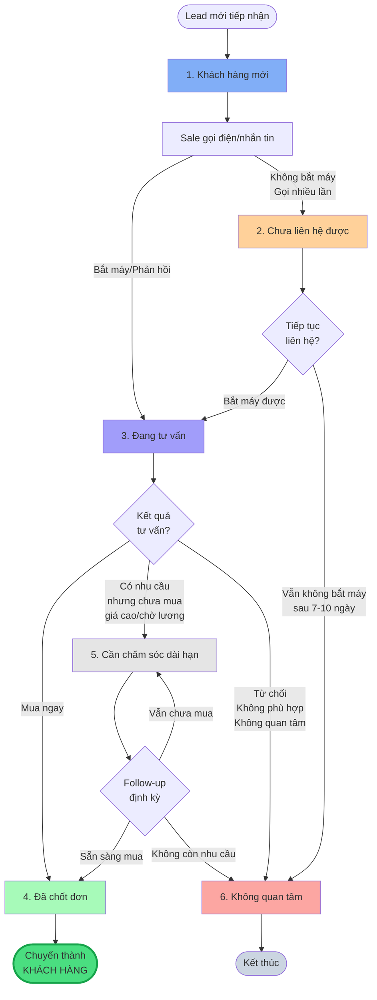
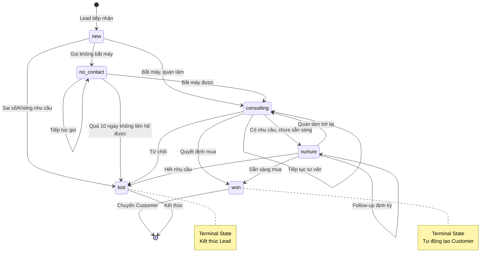
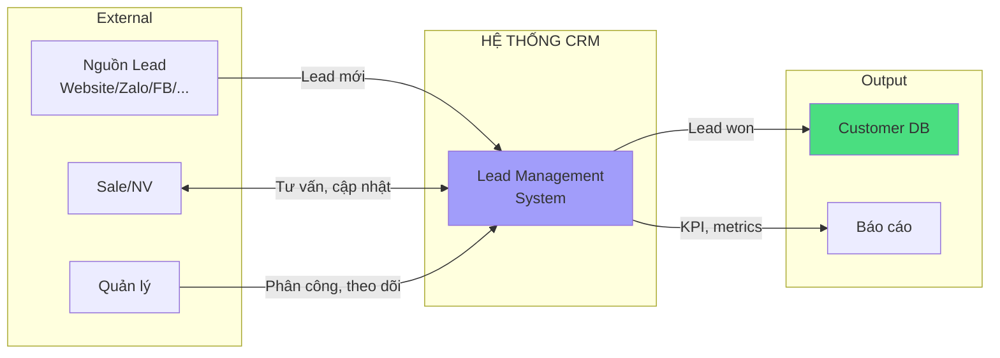
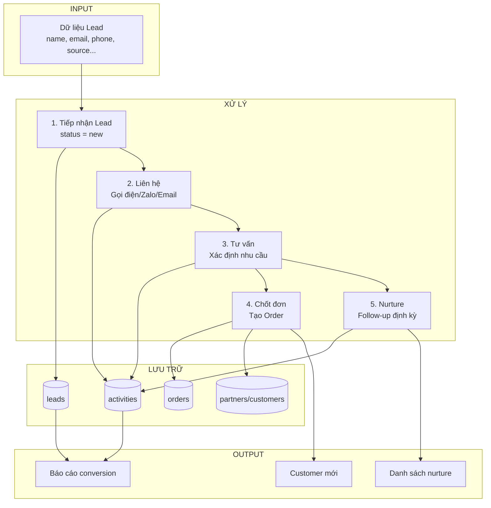
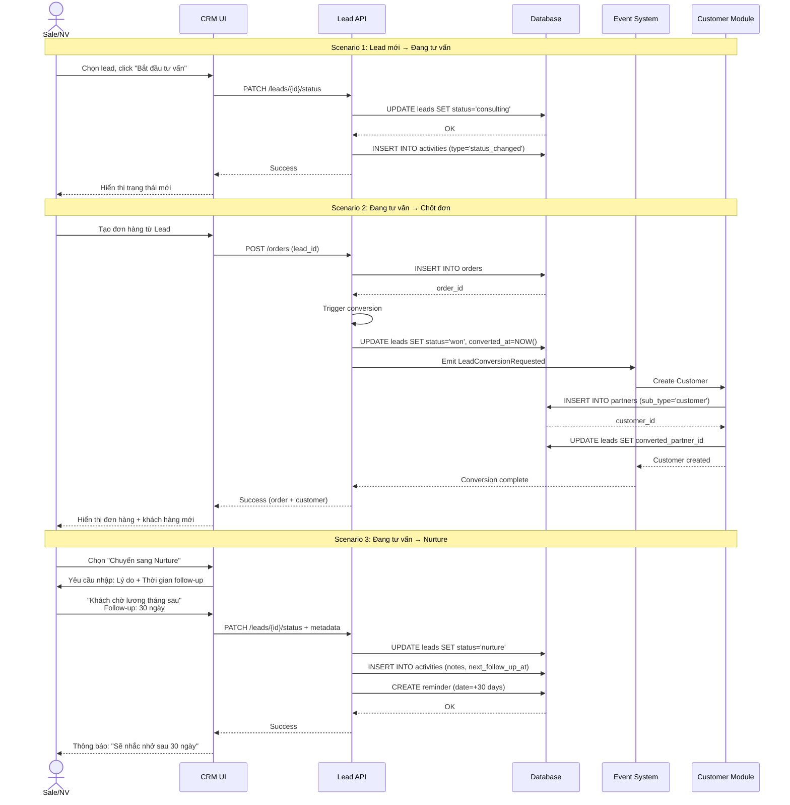
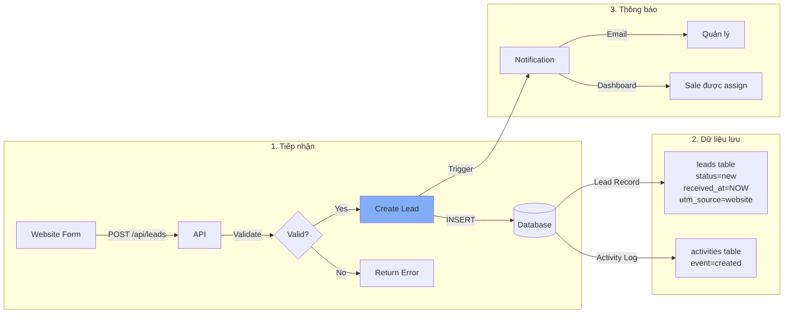
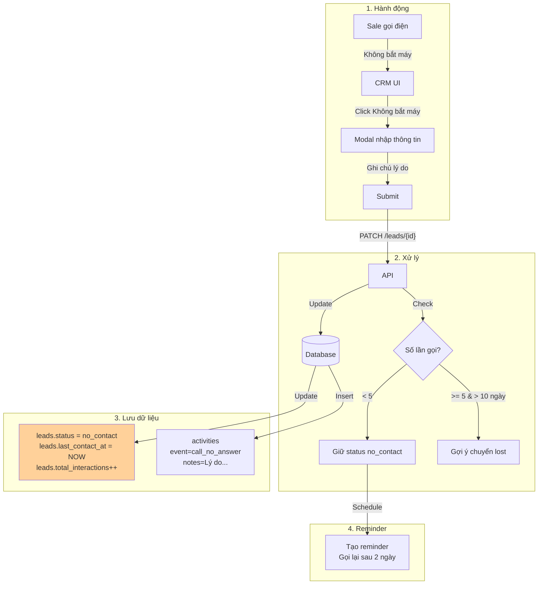
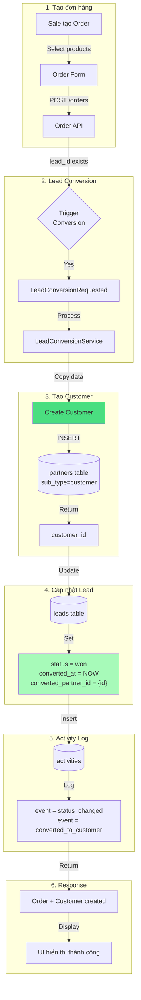
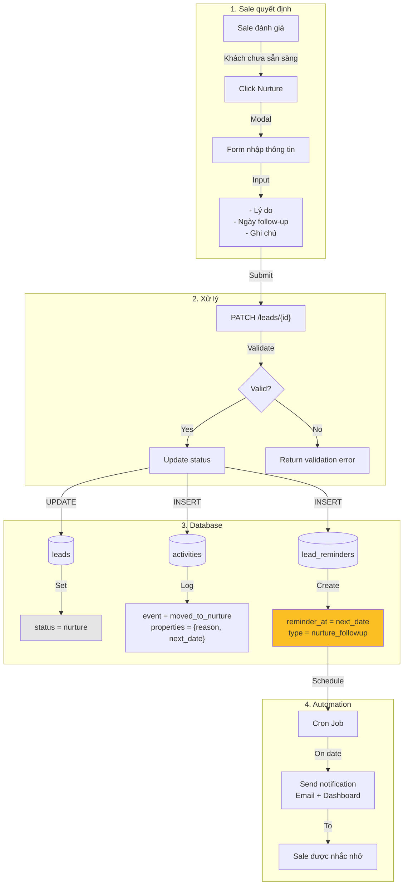

# Module Lead - Trạng thái (Status)

> **Phiên bản**: v1.0 - Cơ bản (6 trạng thái)
> **Ngày cập nhật**: 2026-01-05
> **Trạng thái**: Đề xuất - Chờ khách hàng Nhật Minh phê duyệt

---

## 📋 Danh sách trạng thái

| # | Trạng thái | Code | Màu | Mô tả | Loại |
| --- | --- | --- | --- | --- | --- |
| 1 | **Khách hàng mới** | `new` | #81aef7 | Lead mới tiếp nhận | Active |
| 2 | **Chưa liên hệ được** | `no_contact` | #ffd19a | Gọi nhưng chưa bắt máy | Active |
| 3 | **Đang tư vấn** | `consulting` | #a19dfa | Đang trong quá trình tư vấn, cần theo dõi | Active |
| 4 | **Đã chốt đơn** | `won` | #a7fab9 | Đã có đơn hàng → Chuyển thành Khách hàng | Terminal |
| 5 | **Cần chăm sóc dài hạn** | `nurture` | #e5e5e5 | Khách có nhu cầu, cần theo dõi định kỳ | Active |
| 6 | **Không quan tâm** | `lost` | #fca6a2 | Không có nhu cầu/từ chối/không phản hồi | Terminal |

### Phân loại

- **Active**: Trạng thái đang hoạt động, có thể chuyển sang trạng thái khác
- **Terminal**: Trạng thái kết thúc, không thể chuyển sang trạng thái khác

---

## 🔄 Workflow - Luồng chuyển đổi

### Sơ đồ tổng quan



### State Machine Diagram



---

## 📊 Sơ đồ luồng dữ liệu (Data Flow Diagram)

### Level 0: Context Diagram



### Level 1: Quy trình xử lý Lead



### Level 2: Chi tiết quy trình chuyển đổi trạng thái



---

## 🗄️ Database Schema - Status Related

### Bảng `leads` - Các trường liên quan status

```sql
CREATE TABLE leads (
    id BIGINT PRIMARY KEY,

    -- Status fields
    status ENUM('new', 'no_contact', 'consulting', 'won', 'nurture', 'lost')
        DEFAULT 'new' NOT NULL,

    -- Timestamps
    created_at TIMESTAMP DEFAULT CURRENT_TIMESTAMP,
    received_at TIMESTAMP NULL COMMENT 'Ngày nhận lead',
    last_contact_at TIMESTAMP NULL COMMENT 'Liên hệ lần cuối',
    converted_at TIMESTAMP NULL COMMENT 'Ngày chuyển thành Customer',

    -- Conversion tracking
    converted_partner_id BIGINT NULL COMMENT 'ID Customer sau khi convert',

    -- Metrics
    total_interactions INT DEFAULT 0 COMMENT 'Tổng số tương tác',

    -- Assignment
    employee_id BIGINT NULL COMMENT 'Sale phụ trách',
    created_by BIGINT NULL COMMENT 'Người tạo',

    -- Indexes
    INDEX idx_status (status),
    INDEX idx_employee_status (employee_id, status),
    INDEX idx_converted_at (converted_at),

    FOREIGN KEY (converted_partner_id) REFERENCES partners(id),
    FOREIGN KEY (employee_id) REFERENCES employees(id)
);
```

### Bảng `activities` - Lưu lịch sử thay đổi status

```sql
CREATE TABLE activities (
    id BIGINT PRIMARY KEY,
    subject_type VARCHAR(255) COMMENT 'Lead, Order, Customer...',
    subject_id BIGINT COMMENT 'ID của lead',

    event VARCHAR(255) COMMENT 'status_changed, created, updated...',

    -- Changes tracking
    properties JSON COMMENT '{
        "old": {"status": "consulting"},
        "new": {"status": "won"},
        "reason": "Khách quyết định mua bộ gậy Titleist"
    }',

    causer_type VARCHAR(255) COMMENT 'User',
    causer_id BIGINT COMMENT 'User ID',

    created_at TIMESTAMP DEFAULT CURRENT_TIMESTAMP,

    INDEX idx_subject (subject_type, subject_id),
    INDEX idx_event (event),
    INDEX idx_created_at (created_at)
);
```

### Bảng `lead_reminders` - Nhắc nhở follow-up

```sql
CREATE TABLE lead_reminders (
    id BIGINT PRIMARY KEY,
    lead_id BIGINT NOT NULL,
    employee_id BIGINT NOT NULL,

    reminder_type ENUM('nurture_followup', 'no_contact_retry', 'callback') DEFAULT 'nurture_followup',
    reminder_at DATETIME NOT NULL COMMENT 'Thời gian nhắc nhở',
    notes TEXT NULL,

    is_completed BOOLEAN DEFAULT FALSE,
    completed_at TIMESTAMP NULL,

    created_at TIMESTAMP DEFAULT CURRENT_TIMESTAMP,

    INDEX idx_reminder (employee_id, reminder_at, is_completed),
    FOREIGN KEY (lead_id) REFERENCES leads(id) ON DELETE CASCADE
);
```

---

## 📊 Ma trận chuyển đổi trạng thái

| Từ ↓ / Sang → | Khách hàng mới | Chưa liên hệ | Đang tư vấn | Đã chốt đơn | Nurture | Không quan tâm |
| --- | --- | --- | --- | --- | --- | --- |
| **1. Khách hàng mới** | - | ✅ | ✅ | ❌ | ❌ | ✅ |
| **2. Chưa liên hệ được** | ❌ | - | ✅ | ❌ | ❌ | ✅ |
| **3. Đang tư vấn** | ❌ | ❌ | - | ✅ | ✅ | ✅ |
| **4. Đã chốt đơn** | ❌ | ❌ | ❌ | - | ❌ | ❌ |
| **5. Nurture** | ❌ | ❌ | ✅ | ✅ | - | ✅ |
| **6. Không quan tâm** | ❌ | ❌ | ❌ | ❌ | ❌ | - |

**Ghi chú:**
- ✅ = Được phép chuyển
- ❌ = Không được phép chuyển
- Trạng thái "Đã chốt đơn" và "Không quan tâm" là **Terminal State** - không thể chuyển sang trạng thái khác

---

## 📈 Luồng dữ liệu theo Use Case

### Use Case 1: Lead mới từ Website



### Use Case 2: Sale gọi điện không bắt máy



### Use Case 3: Tư vấn thành công → Chốt đơn



### Use Case 4: Chuyển sang Nurture



---

## 📝 Mô tả chi tiết từng trạng thái

### 1. Khách hàng mới (`new`)

**Định nghĩa:**
- Lead mới tiếp nhận từ bất kỳ nguồn nào
- Chưa có bất kỳ tương tác nào

**Nguồn lead:**
- Website/Landing page
- Facebook/Instagram/TikTok
- Zalo OA
- Giới thiệu từ khách hàng cũ
- Sự kiện/Triển lãm
- Walk-in (khách vào cửa hàng)

**Hành động cần làm:**
- Gọi điện/nhắn tin trong vòng 24h
- Xác định nhu cầu sơ bộ
- Phân công sale phụ trách

**Thời gian lưu:**
- Tối đa 1-2 ngày
- Nếu quá 2 ngày không xử lý → Cảnh báo quản lý

**Chuyển sang:**
- `Chưa liên hệ được`: Gọi điện nhưng không bắt máy
- `Đang tư vấn`: Liên hệ được, khách quan tâm
- `Không quan tâm`: Sai số, không có nhu cầu ngay từ đầu

---

### 2. Chưa liên hệ được (`no_contact`)

**Định nghĩa:**
- Đã gọi điện/nhắn tin nhiều lần nhưng không kết nối được
- Không bắt máy, không phản hồi tin nhắn

**Nguyên nhân phổ biến:**
- Khách bận, không nghe máy
- Số điện thoại sai/không hoạt động
- Đã không còn quan tâm

**Hành động cần làm:**
- Thử liên hệ qua nhiều kênh: Phone, Zalo, SMS, Email
- Thay đổi thời gian gọi (sáng/trưa/chiều/tối)
- Gọi ít nhất 3-5 lần trong 7-10 ngày

**Thời gian lưu:**
- 7-10 ngày
- Nếu quá 10 ngày vẫn không liên hệ được → Chuyển `Không quan tâm`

**Chuyển sang:**
- `Đang tư vấn`: Cuối cùng bắt máy được
- `Không quan tâm`: Quá 10 ngày không liên hệ được

**Ghi chú:**
- Ghi rõ số lần gọi, thời gian gọi vào Activity Log
- Một số trường hợp có thể giữ lại nếu khách nhắn "Bận, gọi lại sau"

---

### 3. Đang tư vấn (`consulting`)

**Định nghĩa:**
- Đã liên hệ được với khách hàng
- Đang trong quá trình tư vấn, xác định nhu cầu
- Khách hàng thể hiện sự quan tâm

**Hoạt động tư vấn:**
- Tư vấn sản phẩm (gậy, phụ kiện, quần áo)
- Giới thiệu dịch vụ Fitting
- Giới thiệu khóa học Coaching
- Tư vấn Trade-in (thu cũ đổi mới)
- Hỗ trợ tìm hiểu thông tin, so sánh sản phẩm

**Hành động cần làm:**
- Follow-up thường xuyên (2-3 ngày/lần)
- Gửi catalog, video demo, thông tin sản phẩm
- Hẹn khách đến showroom/Fitting
- Ghi chú đầy đủ nhu cầu, sở thích khách hàng

**Thời gian lưu:**
- Không giới hạn (tùy cycle bán hàng)
- Gợi ý: 14-30 ngày
- Nếu quá 30 ngày không có tiến triển → Cân nhắc chuyển `Nurture`

**Chuyển sang:**
- `Đã chốt đơn`: Khách quyết định mua
- `Nurture`: Khách có nhu cầu nhưng chưa sẵn sàng mua (giá cao, chờ lương...)
- `Không quan tâm`: Khách từ chối, không phù hợp

**KPI quan trọng:**
- Thời gian trung bình từ "Đang tư vấn" → "Đã chốt đơn"
- Tỷ lệ chuyển đổi từ "Đang tư vấn" → "Đã chốt đơn"

---

### 4. Đã chốt đơn (`won`)

**Định nghĩa:**
- Lead đã quyết định mua hàng
- Đã tạo đơn hàng trong hệ thống

**Hành động tự động:**
- ✅ **Chuyển Lead → Customer** (Tự động)
- ✅ Cập nhật `converted_at` = ngày chuyển đổi
- ✅ Cập nhật `converted_partner_id` = ID khách hàng mới tạo
- ✅ Cập nhật `status` = `won`

**Hành động thủ công:**
- Tạo đơn hàng (Order) trong module Sales
- Ghi nhận sản phẩm đã mua
- Xử lý thanh toán, giao hàng

**Đặc điểm:**
- **Terminal State**: KHÔNG THỂ chuyển sang trạng thái khác
- Nếu cần theo dõi tiếp → Làm việc trên module **Customer** (không phải Lead)

**Lưu ý:**
- Nếu khách hủy đơn sau khi chốt → Xử lý trên module Order, KHÔNG chuyển ngược lại Lead
- Nếu khách mua lại lần 2 → Đây là Customer returning, không phải Lead mới

---

### 5. Cần chăm sóc dài hạn (`nurture`)

**Định nghĩa:**
- Khách hàng có nhu cầu THẬT (đã xem hàng, hỏi giá, quan tâm...)
- Nhưng CHƯA SẴN SÀNG mua ngay

**Lý do phổ biến:**
- Giá cao, cần tích lũy thêm
- Chờ lương/thưởng cuối năm
- Đang cân nhắc, so sánh với đối thủ
- Chờ mùa giải (mua gậy mới đầu mùa)
- Cần xin ý kiến gia đình/bạn bè

**Hành động cần làm:**
- Follow-up định kỳ: 2-4 tuần/lần (hoặc 2-3 tháng tùy case)
- Gửi thông tin sản phẩm mới, khuyến mãi
- Nhắc nhở khi có event, sale off
- Chúc mừng sinh nhật, lễ tết
- Mời tham gia sự kiện (demo sản phẩm mới, giải golf...)

**Thời gian lưu:**
- 3-6 tháng (hoặc lâu hơn)
- Review định kỳ xem có cần tiếp tục nurture không

**Chuyển sang:**
- `Đang tư vấn`: Khách chủ động liên hệ lại, quan tâm
- `Đã chốt đơn`: Khách sẵn sàng mua
- `Không quan tâm`: Không còn nhu cầu, ngừng phản hồi

**Ví dụ thực tế:**
- Khách hỏi bộ gậy Titleist TSR4 (90 triệu) nhưng chưa đủ tiền
- Khách muốn Fitting nhưng đang ở nước ngoài, về VN sau 3 tháng
- Khách đang học golf, chưa cần gậy mới, hỏi để tham khảo

---

### 6. Không quan tâm (`lost`)

**Định nghĩa:**
- Lead không có nhu cầu
- Từ chối mua hàng
- Không phản hồi sau nhiều lần liên hệ

**Nguyên nhân phổ biến:**
- Không có nhu cầu thật (tò mò, hỏi thăm)
- Giá không phù hợp (quá cao so với ngân sách)
- Đã mua ở đối thủ
- Thông tin sai (sai số điện thoại, thuê bao, spam)
- Không phản hồi sau nhiều lần liên hệ
- Sản phẩm không phù hợp (ví dụ: tìm gậy cũ nhưng shop chỉ bán mới)

**Hành động trước khi chuyển:**
- Xác nhận lý do (gọi điện hỏi lại 1 lần cuối)
- Ghi rõ lý do vào Notes/Activity Log

**Đặc điểm:**
- **Terminal State**: KHÔNG THỂ chuyển sang trạng thái khác
- Nếu khách liên hệ lại sau này → Tạo Lead MỚI (không restore lead cũ)

**Phân loại lý do (để báo cáo):**
- `no_need`: Không có nhu cầu
- `price_too_high`: Giá quá cao
- `bought_elsewhere`: Đã mua ở chỗ khác
- `no_response`: Không phản hồi
- `invalid_contact`: Sai thông tin liên hệ
- `not_fit`: Sản phẩm không phù hợp

**Lưu ý:**
- Có thể export danh sách để chạy Remarketing sau này (nếu có consent)

---

## ⏱️ Thời gian lưu trạng thái (SLA)

| Trạng thái | Thời gian khuyến nghị | Hành động khi quá hạn |
| --- | --- | --- |
| Khách hàng mới | 24h - 2 ngày | Cảnh báo quản lý |
| Chưa liên hệ được | 7-10 ngày | Chuyển "Không quan tâm" |
| Đang tư vấn | 14-30 ngày | Hỏi Sale: Chuyển "Nurture"? |
| Nurture | 3-6 tháng | Review: Tiếp tục nurture hoặc chuyển "Không quan tâm" |
| Đã chốt đơn | - | Chuyển Customer ngay lập tức |
| Không quan tâm | - | Lưu trữ |

---

## 📊 KPI & Metrics

### 1. Conversion Rate (Tỷ lệ chuyển đổi)

```
Conversion Rate = (Số lead "Đã chốt đơn") / (Tổng lead - "Không quan tâm")

Ví dụ:
- Tổng lead: 100
- Đã chốt đơn: 15
- Không quan tâm: 40
→ Conversion Rate = 15 / (100 - 40) = 25%
```

### 2. Response Rate (Tỷ lệ phản hồi)

```
Response Rate = (Số lead "Đang tư vấn" + "Nurture") / (Tổng lead tiếp nhận)

Ví dụ:
- Tổng lead: 100
- Đang tư vấn: 30
- Nurture: 15
→ Response Rate = (30 + 15) / 100 = 45%
```

### 3. Average Time to Convert (Thời gian chuyển đổi trung bình)

```
Time to Convert = Trung bình (created_at → converted_at)

Ví dụ:
- Lead A: 5 ngày
- Lead B: 10 ngày
- Lead C: 3 ngày
→ Average = (5 + 10 + 3) / 3 = 6 ngày
```

### 4. No Contact Rate (Tỷ lệ không liên hệ được)

```
No Contact Rate = (Số lead "Chưa liên hệ được" → "Không quan tâm") / (Tổng lead)

Mục tiêu: < 20%
```

### 5. Nurture Conversion Rate

```
Nurture Conversion = (Số lead "Nurture" → "Đã chốt đơn") / (Tổng lead "Nurture")

Ví dụ:
- Tổng lead Nurture: 20
- Chốt đơn từ Nurture: 5
→ Nurture Conversion = 5 / 20 = 25%
```

---

## 🎯 Business Rules

### Rule 1: Tự động chuyển Lead → Customer

**Điều kiện:**
- Khi Lead chuyển sang trạng thái `won` (Đã chốt đơn)
- Hoặc khi tạo đơn hàng (Order) từ Lead

**Hành động:**
```
1. Tạo record mới trong bảng `partners` (sub_type = 'customer')
2. Copy toàn bộ thông tin từ Lead:
   - name, email, phone, address, tags...
3. Cập nhật Lead:
   - status = 'won'
   - converted_at = NOW()
   - converted_partner_id = {customer_id}
4. KHÔNG xóa Lead (giữ lại để tracking)
```

### Rule 2: Không liên hệ được → Không quan tâm

**Điều kiện:**
- Trạng thái `no_contact` quá 10 ngày
- Đã gọi ít nhất 5 lần

**Hành động:**
- Tự động đề xuất chuyển sang `lost`
- Yêu cầu Sale xác nhận trước khi chuyển

### Rule 3: Đang tư vấn → Nurture

**Điều kiện:**
- Trạng thái `consulting` quá 30 ngày
- Không có Order/Activity mới trong 14 ngày

**Hành động:**
- Gửi notification cho Sale
- Gợi ý chuyển sang `nurture` để follow-up dài hạn

### Rule 4: Terminal States không thể chuyển

**Điều kiện:**
- Lead ở trạng thái `won` hoặc `lost`

**Hành động:**
- UI không hiển thị button "Đổi trạng thái"
- API reject nếu cố gắng update status
- Nếu cần sửa → Yêu cầu quyền Admin

---

## 🔮 Kế hoạch mở rộng (Future)

### Phase 2: Thêm trạng thái chi tiết

Nếu Nhật Minh cần tracking chi tiết hơn, có thể thêm:

| Trạng thái mới | Code | Khi nào dùng |
| --- | --- | --- |
| **Đã đặt lịch Fitting** | `fitting_scheduled` | Hẹn đến Fitting gậy |
| **Đã đặt lịch Coaching** | `coaching_scheduled` | Hẹn học thử/đăng ký khóa |
| **Đã đặt lịch xem hàng** | `visit_scheduled` | Hẹn đến showroom/demo |
| **Đã gửi báo giá** | `quoted` | Gửi báo giá chính thức (đơn lớn) |

**Workflow mở rộng:**
```
Đang tư vấn → Đã đặt lịch (Fitting/Coaching/Xem hàng) → Đã gửi báo giá → Chốt đơn
```

### Phase 3: Sub-status (Trạng thái phụ)

Mỗi trạng thái chính có thể có sub-status:

**Ví dụ: "Đang tư vấn"**
- `consulting_product`: Đang tư vấn sản phẩm
- `consulting_fitting`: Đang tư vấn Fitting
- `consulting_coaching`: Đang tư vấn Coaching
- `consulting_tradein`: Đang tư vấn Trade-in

→ Chờ feedback từ Nhật Minh sau khi dùng thử phiên bản cơ bản

---

## 📖 References

- [LEAD_WORKFLOW.md](./LEAD_WORKFLOW.md) - Workflow tổng thể module Lead
- [LEAD_DIAGRAMS.md](./LEAD_DIAGRAMS.md) - ERD và UI diagrams
- [FEATURE_SPECIFICATION.md](./../../feature/FEATURE_SPECIFICATION.md) - Đặc tả chức năng CRM

---

**Lịch sử thay đổi:**
- 2026-01-05: v1.0 - Tạo file, đề xuất 6 trạng thái cơ bản + sơ đồ luồng dữ liệu
