# Module Lead - Diagrams

> **Nguồn:** `/docs/feature/FEATURE_SPECIFICATION.md` Section 3 - Quản lý Lead
> **Lưu ý:** Diagrams dựa trên đặc tả YÊU CẦU, không dựa trên code hiện tại

---

## 1. ERD - Entity Relationship Diagram

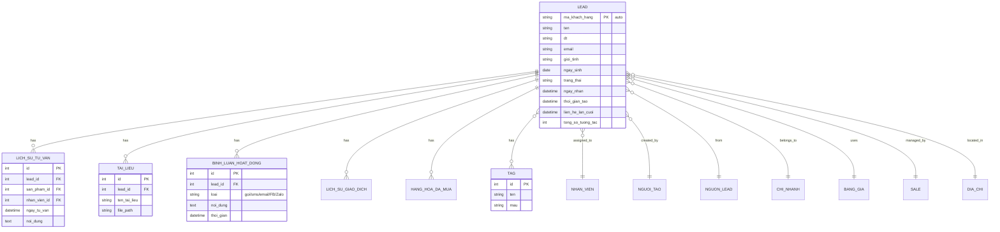

---

## 2. Workflow - Tạo và quản lý Lead

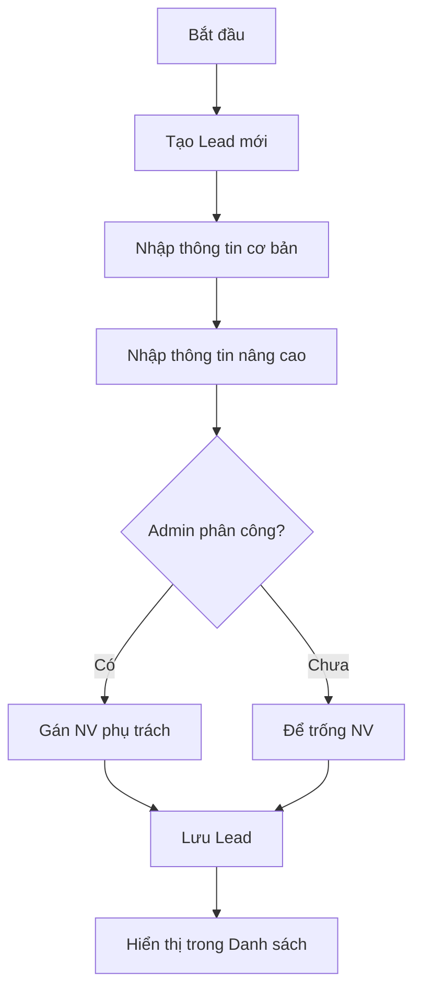

---

## 3. Workflow - Xem và cập nhật Lead

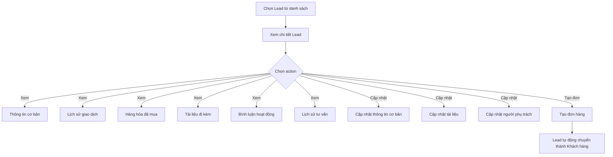

---

## 4. Workflow - Lịch sử tư vấn

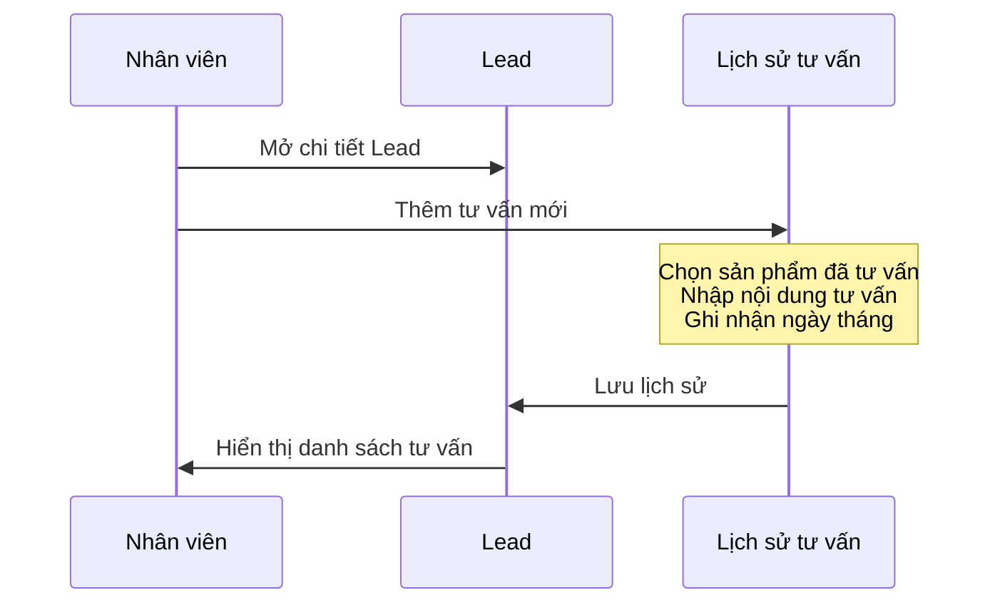

---

## 5. Workflow - Tài liệu đi kèm

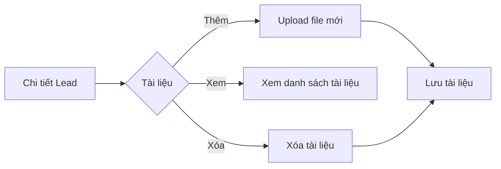

---

## 6. Workflow - Bình luận hoạt động

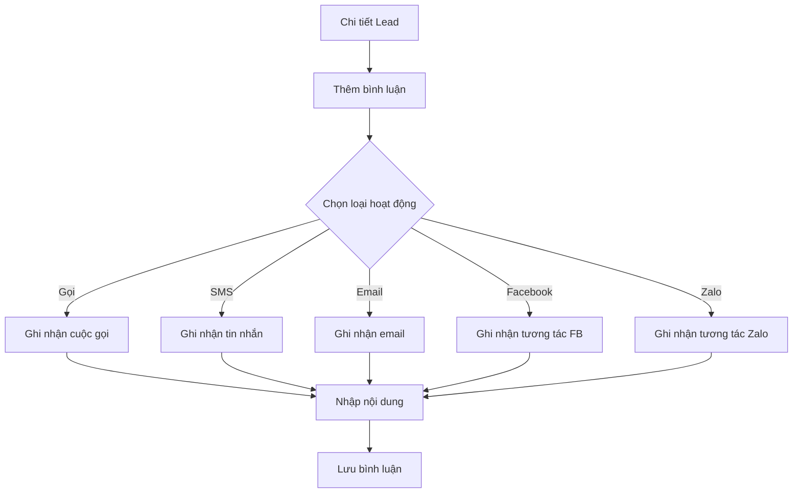

---

## 7. Danh sách Lead - UI Layout

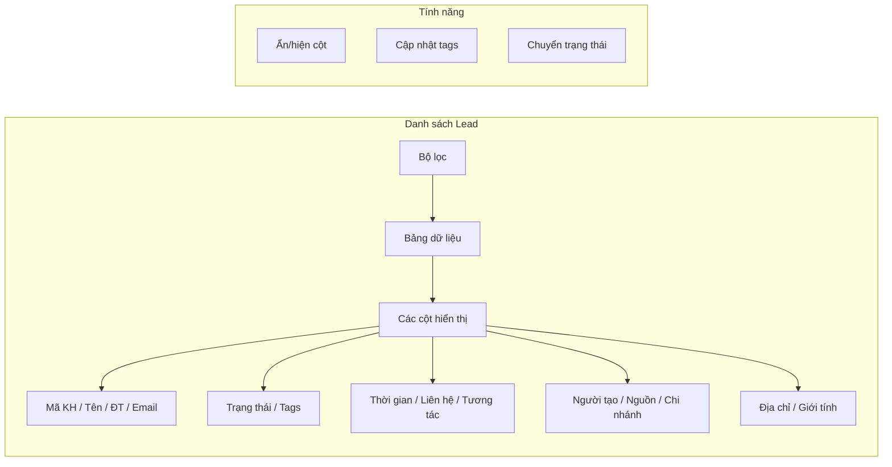

---

## 8. Filter - Bộ lọc

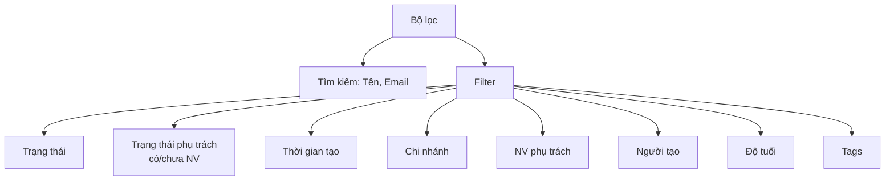

---

## 9. Form tạo Lead - Sections

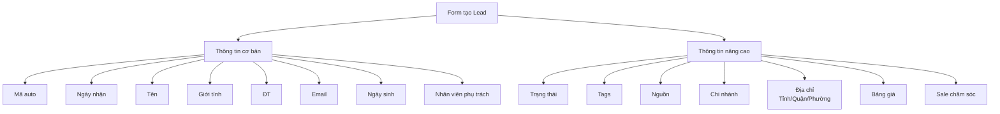

---

## 10. Chi tiết Lead - Tabs

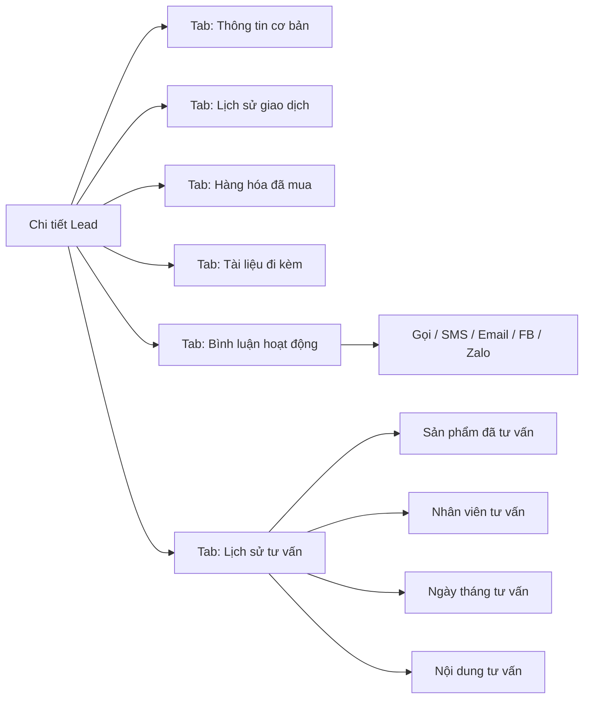

---

## 11. Workflow - Import danh sách Lead

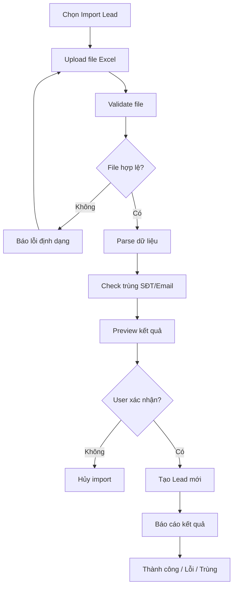

---

## 12. Workflow - Export danh sách Lead

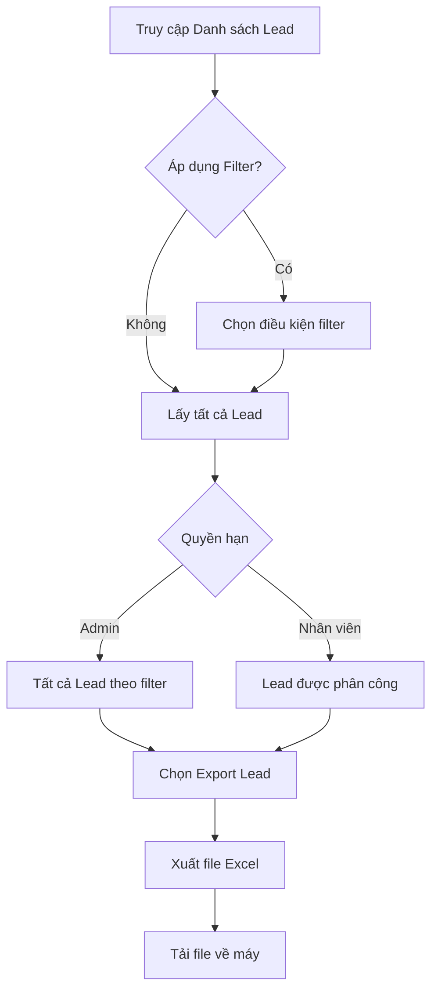

---

## 13. Workflow - Tự động tạo Lead từ nhanh_vn

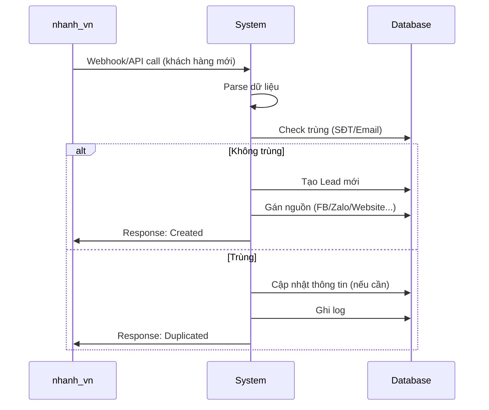

---

## 14. Workflow - Expose API tạo khách hàng

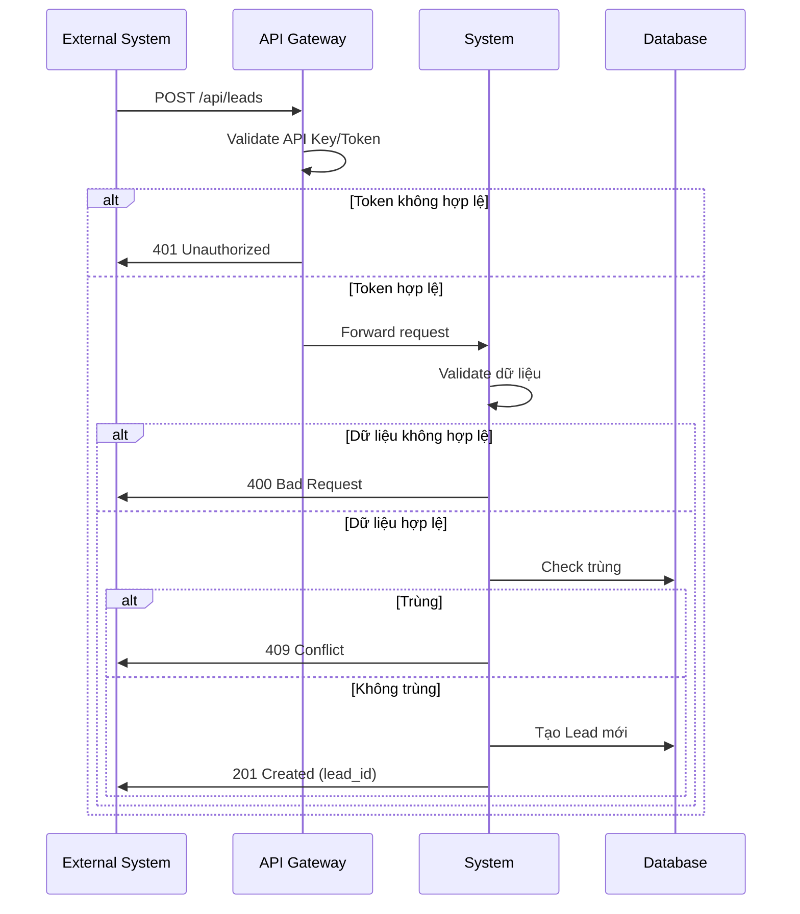

---

## 15. Workflow - Check trùng thông tin

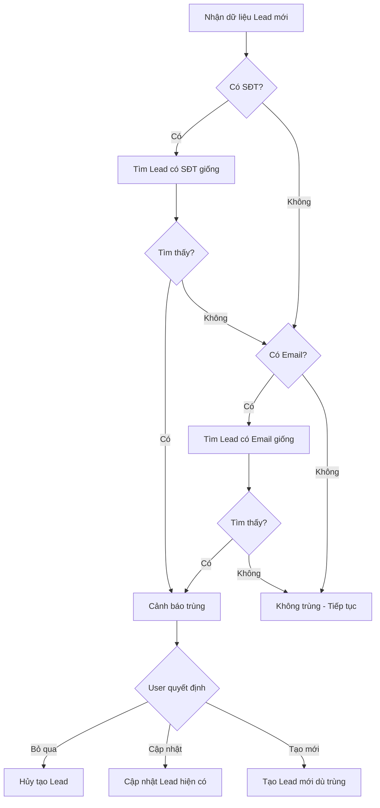

---

## 16. Tổng hợp chức năng Module Lead

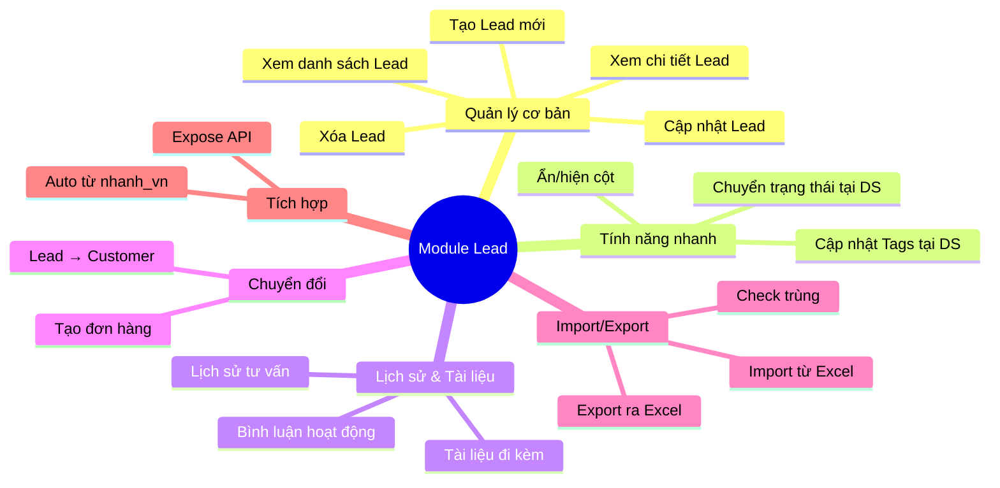

---

**Nguồn:** `/docs/feature/FEATURE_SPECIFICATION.md` Section 3 - Quản lý Lead
**Ngày cập nhật:** 2026-01-06
**Trạng thái:** Đặc tả YÊU CẦU - Code phải implement theo diagrams này
