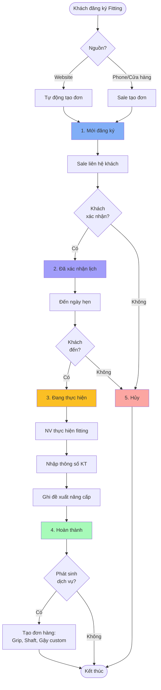
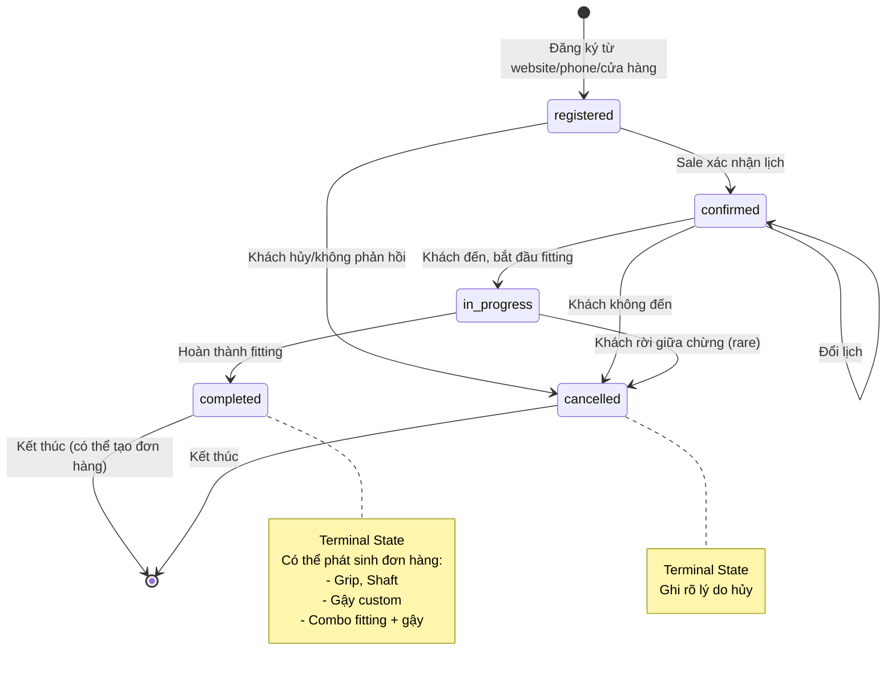
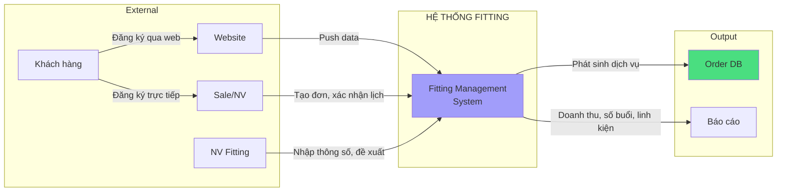
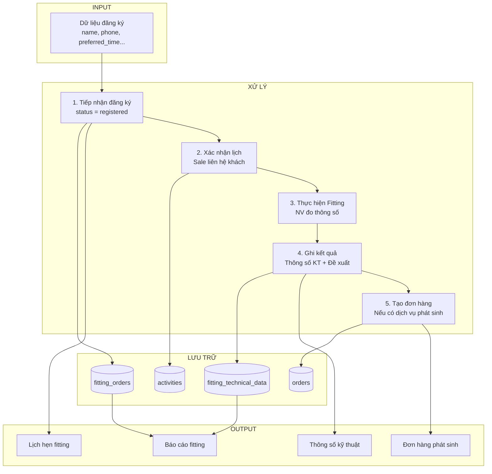
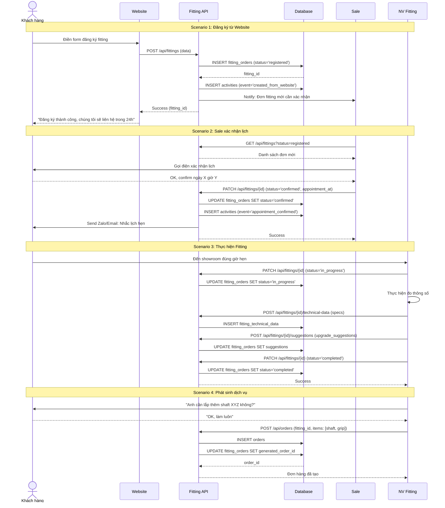

# Module Fitting - Trạng thái (Status)

> **Phiên bản**: v1.0 - Cơ bản (5 trạng thái)
> **Ngày cập nhật**: 2026-01-08
> **Trạng thái**: Đề xuất - Chờ khách hàng Nhật Minh phê duyệt

---

## 📋 Danh sách trạng thái

| # | Trạng thái | Code | Màu | Mô tả | Loại |
|---|------------|------|-----|-------|------|
| 1 | **Mới đăng ký** | `registered` | #81aef7 | Khách đăng ký fitting từ website/phone/cửa hàng | Active |
| 2 | **Đã xác nhận lịch** | `confirmed` | #a19dfa | Sale đã xác nhận lịch hẹn với khách | Active |
| 3 | **Đang thực hiện** | `in_progress` | #fbbf24 | NV Fitting đang thực hiện đo và tư vấn | Active |
| 4 | **Hoàn thành** | `completed` | #a7fab9 | Đã hoàn thành fitting, có thể phát sinh dịch vụ | Terminal |
| 5 | **Hủy** | `cancelled` | #fca6a2 | Khách hủy lịch hoặc không đến | Terminal |

### Phân loại

- **Active**: Trạng thái đang hoạt động, có thể chuyển sang trạng thái khác
- **Terminal**: Trạng thái kết thúc, không thể chuyển sang trạng thái khác

---

## 🔄 Workflow - Luồng chuyển đổi

### Sơ đồ tổng quan



### State Machine Diagram



---

## 📊 Sơ đồ luồng dữ liệu (Data Flow Diagram)

### Level 0: Context Diagram



### Level 1: Quy trình xử lý Fitting



### Level 2: Chi tiết quy trình chuyển đổi trạng thái



---

## 🗄️ Database Schema - Status Related

### Bảng `fitting_orders` - Đơn fitting

```sql
CREATE TABLE fitting_orders (
    id BIGINT PRIMARY KEY,
    code VARCHAR(50) UNIQUE NOT NULL COMMENT 'Mã đơn fitting: FIT-YYYYMMDD-XXXX',

    -- Customer info
    customer_id BIGINT NULL COMMENT 'ID khách hàng (nếu đã có)',
    customer_name VARCHAR(255) NOT NULL,
    customer_phone VARCHAR(20) NOT NULL,
    customer_email VARCHAR(255) NULL,

    -- Appointment
    appointment_at DATETIME NULL COMMENT 'Thời gian hẹn fitting',
    branch_id BIGINT NOT NULL COMMENT 'Chi nhánh thực hiện',

    -- Assignment
    sale_id BIGINT NULL COMMENT 'Sale xác nhận lịch',
    fitter_id BIGINT NULL COMMENT 'NV thực hiện fitting',

    -- Status
    status ENUM('registered', 'confirmed', 'in_progress', 'completed', 'cancelled')
        DEFAULT 'registered' NOT NULL,

    -- Source
    source VARCHAR(50) NULL COMMENT 'website, phone, walk-in',

    -- Notes
    notes TEXT NULL COMMENT 'Ghi chú cho khách',
    internal_notes TEXT NULL COMMENT 'Ghi chú nội bộ',
    cancel_reason TEXT NULL COMMENT 'Lý do hủy (nếu có)',

    -- Timestamps
    created_at TIMESTAMP DEFAULT CURRENT_TIMESTAMP,
    confirmed_at TIMESTAMP NULL COMMENT 'Thời gian xác nhận lịch',
    started_at TIMESTAMP NULL COMMENT 'Thời gian bắt đầu fitting',
    completed_at TIMESTAMP NULL COMMENT 'Thời gian hoàn thành',
    cancelled_at TIMESTAMP NULL COMMENT 'Thời gian hủy',

    -- Linked orders
    generated_order_id BIGINT NULL COMMENT 'Đơn hàng phát sinh (nếu có)',

    -- Indexes
    INDEX idx_status (status),
    INDEX idx_appointment (appointment_at, status),
    INDEX idx_branch_status (branch_id, status),
    INDEX idx_fitter (fitter_id, status),
    INDEX idx_customer (customer_id),
    INDEX idx_created_at (created_at),

    FOREIGN KEY (customer_id) REFERENCES partners(id),
    FOREIGN KEY (branch_id) REFERENCES branches(id),
    FOREIGN KEY (sale_id) REFERENCES employees(id),
    FOREIGN KEY (fitter_id) REFERENCES employees(id),
    FOREIGN KEY (generated_order_id) REFERENCES orders(id)
);
```

### Bảng `fitting_technical_data` - Thông số kỹ thuật

```sql
CREATE TABLE fitting_technical_data (
    id BIGINT PRIMARY KEY,
    fitting_order_id BIGINT NOT NULL,

    -- Thông tin cơ bản
    height INT NULL COMMENT 'Chiều cao (cm)',
    weight DECIMAL(5,2) NULL COMMENT 'Cân nặng (kg)',
    hand_size VARCHAR(20) NULL COMMENT 'Size tay: S, M, L',
    skill_level ENUM('beginner', 'intermediate', 'advanced') NULL COMMENT 'Cấp độ',

    -- Thông số swing
    club_head_speed DECIMAL(5,2) NULL COMMENT 'Tốc độ đầu gậy (mph)',
    ball_speed DECIMAL(5,2) NULL COMMENT 'Tốc độ bóng (mph)',
    swing_shape VARCHAR(50) NULL COMMENT 'Hình swing',
    ball_flight VARCHAR(50) NULL COMMENT 'Đường bóng',
    ball_trajectory VARCHAR(50) NULL COMMENT 'Đường cao bóng',

    -- Khoảng cách
    iron_distance INT NULL COMMENT 'Khoảng cách gậy sắt (yards)',
    driver_distance INT NULL COMMENT 'Khoảng cách driver (yards)',

    -- Tình trạng hiện tại
    current_club_status TEXT NULL COMMENT 'Tình trạng bộ gậy của khách',
    special_requirements TEXT NULL COMMENT 'Nhu cầu riêng của KH',

    -- Đề xuất
    upgrade_suggestions TEXT NULL COMMENT 'Đề xuất nâng cấp',
    accessories_needed TEXT NULL COMMENT 'Phụ kiện cần thiết',

    -- Meta
    created_at TIMESTAMP DEFAULT CURRENT_TIMESTAMP,
    updated_at TIMESTAMP DEFAULT CURRENT_TIMESTAMP ON UPDATE CURRENT_TIMESTAMP,
    created_by BIGINT NULL COMMENT 'NV nhập thông số',

    FOREIGN KEY (fitting_order_id) REFERENCES fitting_orders(id) ON DELETE CASCADE,
    FOREIGN KEY (created_by) REFERENCES employees(id)
);
```

### Bảng `activities` - Lưu lịch sử thay đổi status

```sql
-- Sử dụng bảng activities chung của hệ thống
-- Ví dụ records:

INSERT INTO activities (subject_type, subject_id, event, properties, causer_type, causer_id)
VALUES (
    'FittingOrder',
    123,
    'status_changed',
    '{"old": {"status": "registered"}, "new": {"status": "confirmed"}, "appointment_at": "2026-01-15 14:00:00"}',
    'User',
    456
);
```

---

## 📊 Ma trận chuyển đổi trạng thái

| Từ ↓ / Sang → | Mới đăng ký | Đã xác nhận lịch | Đang thực hiện | Hoàn thành | Hủy |
|---------------|-------------|------------------|----------------|------------|-----|
| **1. Mới đăng ký** | - | ✅ | ❌ | ❌ | ✅ |
| **2. Đã xác nhận lịch** | ❌ | ✅ (đổi lịch) | ✅ | ❌ | ✅ |
| **3. Đang thực hiện** | ❌ | ❌ | - | ✅ | ✅ (rare) |
| **4. Hoàn thành** | ❌ | ❌ | ❌ | - | ❌ |
| **5. Hủy** | ❌ | ❌ | ❌ | ❌ | - |

**Ghi chú:**
- ✅ = Được phép chuyển
- ❌ = Không được phép chuyển
- Trạng thái "Hoàn thành" và "Hủy" là **Terminal State** - không thể chuyển sang trạng thái khác
- "Đã xác nhận lịch" → "Đã xác nhận lịch": Cho phép đổi lịch hẹn

---

## 📝 Mô tả chi tiết từng trạng thái

### 1. Mới đăng ký (`registered`)

**Định nghĩa:**
- Khách hàng vừa đăng ký fitting
- Chưa được xác nhận lịch hẹn

**Nguồn đăng ký:**
- **Website**: Form đăng ký online (tự động tạo đơn)
- **Phone**: Khách gọi điện đặt lịch
- **Walk-in**: Khách vào cửa hàng trực tiếp
- **Facebook/Zalo**: Khách nhắn tin đặt lịch

**Hành động cần làm:**
- Sale liên hệ khách trong vòng 24h
- Xác nhận thời gian phù hợp với cả 2 bên
- Chuyển sang trạng thái "Đã xác nhận lịch"

**Thời gian lưu:**
- Tối đa 1-2 ngày
- Nếu quá 2 ngày không xử lý → Cảnh báo quản lý

**Chuyển sang:**
- `Đã xác nhận lịch`: Sale xác nhận được lịch với khách
- `Hủy`: Khách không phản hồi hoặc không muốn nữa

---

### 2. Đã xác nhận lịch (`confirmed`)

**Định nghĩa:**
- Sale đã liên hệ và xác nhận lịch hẹn với khách
- Đã có thời gian cụ thể (ngày, giờ)
- Đã phân công NV Fitting

**Hành động cần làm:**
- Gửi nhắc nhở cho khách trước 1 ngày (qua Zalo/Email/SMS)
- Chuẩn bị thiết bị fitting
- NV Fitting check lịch của mình

**Cho phép:**
- **Đổi lịch**: Khách có thể đổi lịch hẹn (vẫn giữ status "Đã xác nhận lịch")
- Ghi rõ lịch sử đổi lịch trong Activities

**Chuyển sang:**
- `Đang thực hiện`: Khách đến đúng hẹn, bắt đầu fitting
- `Hủy`: Khách không đến hoặc báo hủy

---

### 3. Đang thực hiện (`in_progress`)

**Định nghĩa:**
- Khách đã đến showroom
- NV Fitting đang thực hiện đo thông số

**Hoạt động fitting:**
- Đo thông số cơ bản: chiều cao, cân nặng, size tay
- Đo thông số swing: tốc độ đầu gậy, tốc độ bóng, hình swing
- Phân tích đường bóng, khoảng cách
- Đánh giá tình trạng gậy hiện tại
- Ghi chú nhu cầu đặc biệt

**Hành động cần làm:**
- Nhập đầy đủ thông số kỹ thuật vào hệ thống
- Tư vấn và đề xuất nâng cấp
- Ghi lại phụ kiện cần thiết (grip, shaft...)

**Thời gian:**
- Trung bình 30-60 phút/buổi

**Chuyển sang:**
- `Hoàn thành`: Đã hoàn thành fitting, nhập xong thông số
- `Hủy`: Khách rời giữa chừng (rare case)

---

### 4. Hoàn thành (`completed`)

**Định nghĩa:**
- Đã hoàn thành buổi fitting
- Đã nhập đầy đủ thông số kỹ thuật
- Đã ghi đề xuất nâng cấp

**Hành động tự động:**
- ✅ Lưu thông số kỹ thuật vào hồ sơ khách hàng
- ✅ Gắn lịch sử fitting vào profile khách
- ✅ Cập nhật `completed_at`

**Dịch vụ phát sinh (thường gặp):**
- **Mua thêm grip**: Thay grip cũ
- **Lắp shaft**: Thay shaft phù hợp hơn
- **Đặt gậy theo thông số đặc biệt**: Custom order
- **Mua combo fitting + gậy**: Mua luôn bộ gậy mới

**Xử lý dịch vụ phát sinh:**
- Sale/NV Fitting tạo đơn hàng mới
- Gắn `generated_order_id` vào fitting order
- Tracking: Khách fitting → Mua gì

**Đặc điểm:**
- **Terminal State**: KHÔNG THỂ chuyển sang trạng thái khác
- Nếu khách muốn fitting lại → Tạo đơn fitting MỚI

---

### 5. Hủy (`cancelled`)

**Định nghĩa:**
- Khách hủy lịch hẹn
- Hoặc khách không đến đúng hẹn

**Nguyên nhân phổ biến:**
- Khách bận đột xuất, không đến được
- Khách không còn nhu cầu
- Khách đã chọn đối thủ
- Không liên hệ được (số sai, không phản hồi)

**Hành động trước khi chuyển:**
- Xác nhận với khách (nếu được)
- Ghi rõ lý do vào `cancel_reason`
- Ghi nhận thời gian hủy `cancelled_at`

**Đặc điểm:**
- **Terminal State**: KHÔNG THỂ chuyển sang trạng thái khác
- Nếu khách liên hệ lại sau này → Tạo đơn fitting MỚI

**Phân loại lý do:**
- `customer_cancel`: Khách chủ động hủy
- `no_show`: Khách không đến
- `no_response`: Không liên hệ được
- `rescheduled`: Đổi lịch thành đơn mới

---

## 🎯 Business Rules

### Rule 1: Tự động tạo đơn từ Website

**Điều kiện:**
- Khách đăng ký qua website form

**Hành động:**
```
1. Tạo record mới trong `fitting_orders`
   - status = 'registered'
   - source = 'website'
   - code = auto-generate (FIT-20260108-0001)
2. Gửi email xác nhận cho khách
3. Notify Sale team: "Đơn fitting mới cần xác nhận"
```

### Rule 2: Nhắc lịch hẹn tự động

**Điều kiện:**
- Trạng thái `confirmed`
- Còn 1 ngày đến lịch hẹn

**Hành động:**
- Gửi Zalo/Email/SMS nhắc khách
- Nội dung: Ngày, giờ, địa chỉ, tên NV Fitting

### Rule 3: Phát sinh dịch vụ

**Điều kiện:**
- Trạng thái `completed`
- NV/Sale tạo đơn hàng từ fitting

**Hành động:**
```
1. Tạo order mới
2. Gắn `fitting_order_id` vào order
3. Update fitting_orders.generated_order_id
4. Track: Khách fitting → Doanh thu phát sinh
```

### Rule 4: Không cho phép đổi trạng thái Terminal

**Điều kiện:**
- Trạng thái hiện tại = `completed` hoặc `cancelled`

**Hành động:**
- UI: Ẩn button "Đổi trạng thái"
- API: Reject request với error "Cannot change terminal status"
- Nếu cần sửa → Yêu cầu quyền Admin

---

## 📖 References

- [FITTING_SPEC.md](./FITTING_SPEC.md) - Spec gốc từ khách hàng
- [FITTING_WORKFLOW.md](./FITTING_WORKFLOW.md) - Workflow tổng thể module Fitting
- [FITTING_DIAGRAMS.md](./FITTING_DIAGRAMS.md) - ERD và UI diagrams
- [FEATURE_SPECIFICATION.md](../../feature/FEATURE_SPECIFICATION.md) - Đặc tả chức năng CRM

---

**Lịch sử thay đổi:**
- 2026-01-08: v1.0 - Tạo file, đề xuất 5 trạng thái cơ bản + workflow appointment-based
