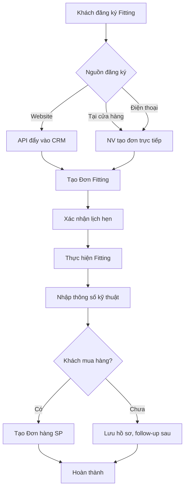
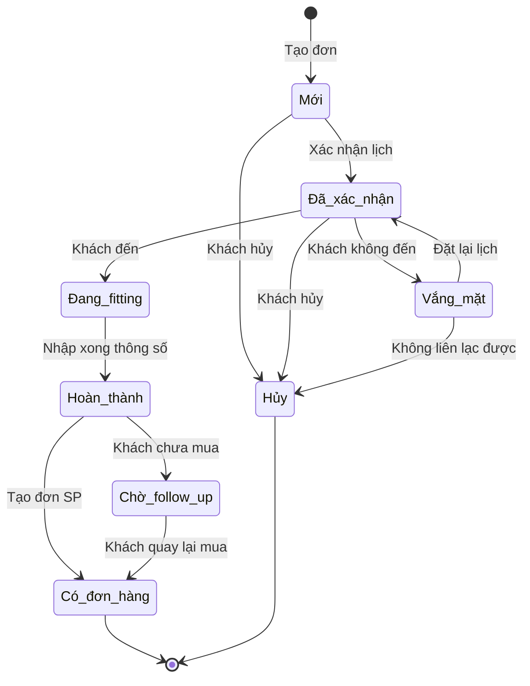
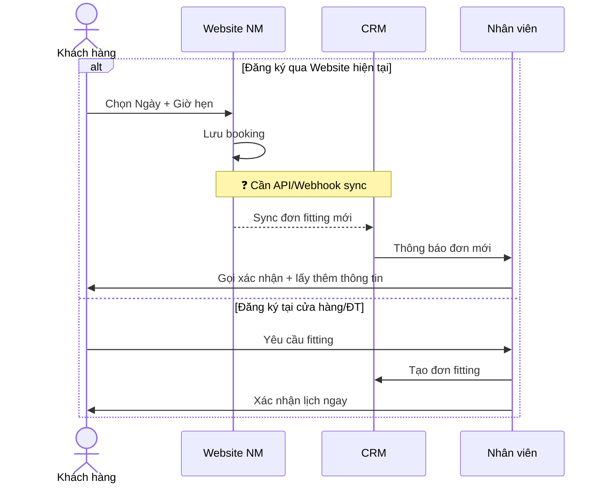
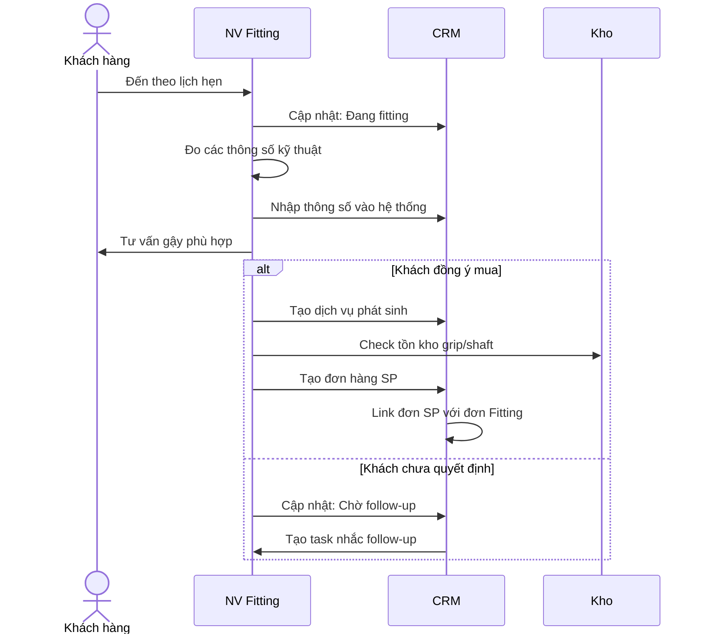
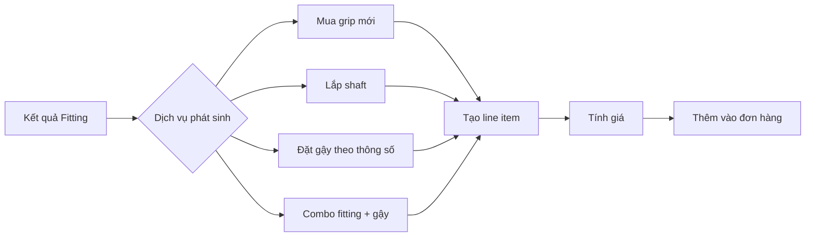
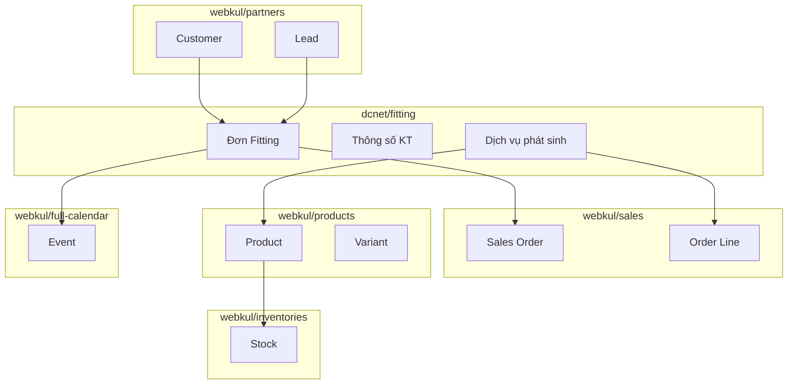

# Module Fitting - Workflow & Phân tích

> **Plugin:** `dcnet/fitting`
> **Ưu tiên:** Cao
> **Phụ thuộc:** `sales`, `partners`, `products`, `inventories`
> **Phiên bản:** 1.0
> **Ngày cập nhật:** 06/01/2026

---

## 📌 Nguồn tài liệu

| Tài liệu | Section | Nội dung |
|----------|---------|----------|
| FEATURE_SPECIFICATION.md | 5.2.2 | Tạo đơn hàng Fitting, Thông tin kỹ thuật |
| FEATURE_SPECIFICATION.md | 5.4 | Xem chi tiết đơn Fitting, Dịch vụ phát sinh |
| FEATURE_SPECIFICATION.md | 14.2 | Báo cáo Fitting |

**Tài liệu liên quan:**
- [FITTING_USE_CASE_SPEC.md](./FITTING_USE_CASE_SPEC.md) - Chi tiết Use Cases
- [FITTING_DIAGRAMS.md](./FITTING_DIAGRAMS.md) - Tổng hợp Diagrams

---

## 1. Tổng quan

### Định nghĩa

**Nguồn:** FEATURE_SPECIFICATION.md Section 5.2.2

Đơn Fitting là dịch vụ đo thông số kỹ thuật để tư vấn và customize gậy golf phù hợp với từng khách hàng.

### Mục tiêu
- Quản lý lịch hẹn fitting
- Lưu trữ thông số kỹ thuật khách hàng
- Tracking dịch vụ phát sinh (grip, shaft, gậy custom)
- Báo cáo doanh thu từ fitting

---

## 2. Workflow chính

### 2.1. Luồng tổng quan



### 2.2. Trạng thái đơn Fitting (State Machine)



#### ❓ CẦN XÁC NHẬN: Trạng thái đơn Fitting

| Trạng thái đề xuất | Mô tả | Xác nhận |
|-------------------|-------|----------|
| Mới | Vừa tạo đơn, chưa xác nhận lịch | ☐ |
| Đã xác nhận | Đã xác nhận lịch hẹn với khách | ☐ |
| Đang fitting | Khách đến, đang thực hiện | ☐ |
| Hoàn thành | Đã nhập xong thông số | ☐ |
| Có đơn hàng | Đã tạo đơn SP từ fitting | ☐ |
| Chờ follow-up | Khách chưa mua, cần theo dõi | ☐ |
| Vắng mặt | Khách không đến theo lịch | ☐ |
| Hủy | Đơn bị hủy | ☐ |

---

## 3. Entity Relationship

### 3.1. ERD

```mermaid
erDiagram
    FITTING_ORDER ||--o{ FITTING_SERVICE : has
    FITTING_ORDER ||--|| CUSTOMER : belongs_to
    FITTING_ORDER ||--o| EMPLOYEE : assigned_to
    FITTING_ORDER ||--o| SALES_ORDER : generates
    FITTING_ORDER ||--|| FITTING_SPECS : has
    FITTING_SERVICE ||--|| PRODUCT : uses

    FITTING_ORDER {
        int id PK
        string code "Auto generate"
        int customer_id FK
        int employee_id FK "Người thực hiện"
        datetime scheduled_at "Lịch hẹn"
        datetime completed_at
        string status
        string source "Website/Cửa hàng/Điện thoại"
        int branch_id FK
        decimal service_fee "Phí fitting"
        text notes
        timestamps
    }

    FITTING_SPECS {
        int id PK
        int fitting_order_id FK
        decimal height_cm
        decimal weight_kg
        string glove_size "❓ Enum hay text"
        string player_level "❓ Enum values"
        decimal club_head_speed "❓ Đơn vị"
        decimal ball_speed "❓ Đơn vị"
        string swing_shape "❓ Text/File/Video"
        string ball_flight "❓ Enum values"
        string ball_height "❓ Enum values"
        decimal iron_distance "Khoảng cách gậy sắt"
        decimal driver_distance "Khoảng cách driver"
        text current_clubs "Tình trạng gậy hiện tại"
        text customer_needs "Nhu cầu riêng"
        text upgrade_recommendations "Đề xuất nâng cấp - YÊU CẦU TỪ PHỤ LỤC"
        timestamps
    }

    FITTING_SERVICE {
        int id PK
        int fitting_order_id FK
        int product_id FK "Grip/Shaft/Gậy"
        string service_type "grip/shaft/custom_club/combo"
        int quantity
        decimal unit_price
        decimal total_price
        text specs_note "Thông số đặc biệt"
        timestamps
    }
```

### 3.2. Chi tiết các Entity

#### FITTING_ORDER (Đơn Fitting)

| Field | Type | Required | Ghi chú |
|-------|------|----------|---------|
| code | string | ✅ | Auto: FIT-YYYYMMDD-XXX |
| customer_id | FK | ✅ | Liên kết Customer/Lead |
| employee_id | FK | ❓ | Ai thực hiện fitting? |
| scheduled_at | datetime | ✅ | Lịch hẹn |
| completed_at | datetime | | Thời gian hoàn thành |
| status | enum | ✅ | Trạng thái |
| source | enum | ✅ | Website/Cửa hàng/Điện thoại |
| branch_id | FK | ✅ | Chi nhánh |
| service_fee | decimal | ❓ | Có thu phí không? |
| notes | text | | Ghi chú |

#### FITTING_SPECS (Thông số kỹ thuật)

| Field | Type | Required | ❓ Cần xác nhận |
|-------|------|----------|----------------|
| height_cm | decimal | ✅ | |
| weight_kg | decimal | ✅ | |
| glove_size | string/enum | ✅ | Có bao nhiêu size? |
| player_level | enum | ✅ | Các level nào? |
| club_head_speed | decimal | | Đơn vị: mph hay km/h? |
| ball_speed | decimal | | Đơn vị? |
| swing_shape | ??? | | Text/Ảnh/Video? |
| ball_flight | enum | | Fade/Draw/Straight/...? |
| ball_height | enum | | Low/Mid/High/...? |
| iron_distance | decimal | | Đơn vị: yard hay mét? |
| driver_distance | decimal | | Đơn vị? |
| current_clubs | text | | Mô tả tự do |
| customer_needs | text | | Mô tả tự do |
| upgrade_recommendations | text | | **Đề xuất nâng cấp** (yêu cầu PHỤ LỤC) |

#### FITTING_SERVICE (Dịch vụ phát sinh)

| Field | Type | Required | Ghi chú |
|-------|------|----------|---------|
| service_type | enum | ✅ | grip/shaft/custom_club/combo |
| product_id | FK | ✅ | Liên kết Product |
| quantity | int | ✅ | |
| unit_price | decimal | ✅ | |
| specs_note | text | | Thông số đặc biệt (nếu custom) |

---

## 4. Quy trình chi tiết

### 4.1. Tạo đơn Fitting

#### Form đặt lịch Website hiện tại

> **URL:** https://nhatminhsports.vn/gioi-thieu/fitting-3d-tech/
>
> Form hiện tại chỉ có 2 field: **Ngày hẹn** + **Giờ hẹn** (08:00 - 18:00)
>
> ❓ **Cần xác nhận:** Xài lại form này hay build mới? Nếu xài lại → cần API sync sang CRM



### 4.2. Thực hiện Fitting



### 4.3. Dịch vụ phát sinh



#### ❓ CẦN XÁC NHẬN: Dịch vụ phát sinh

| Dịch vụ | Có bảng giá? | Tồn kho riêng? | Xác nhận |
|---------|--------------|----------------|----------|
| Mua grip | ❓ | ❓ Chung hay riêng? | ☐ |
| Lắp shaft | ❓ Công lắp? | ❓ | ☐ |
| Đặt gậy theo thông số | ❓ | Đặt hàng nhà SX? | ☐ |
| Combo fitting + gậy | ❓ Có ưu đãi? | | ☐ |

---

## 5. Tích hợp

### 5.1. Với các module khác



### 5.2. Với Bravo ERP

#### ❓ CẦN XÁC NHẬN

| Câu hỏi | Trả lời |
|---------|---------|
| Đơn Fitting có đồng bộ sang Bravo không? | ☐ Có ☐ Không |
| Nếu có, dạng dữ liệu nào? | ☐ Đơn dịch vụ ☐ Khác: ___ |
| Grip/Shaft lấy từ Bravo hay quản lý riêng? | ☐ Từ Bravo ☐ Riêng |

---

## 6. UI/UX đề xuất

### 6.1. Danh sách đơn Fitting

| Cột | Hiển thị | Filter |
|-----|----------|--------|
| Mã đơn | ✅ | Search |
| Khách hàng | ✅ | Search |
| SĐT | ✅ | |
| Lịch hẹn | ✅ | Date range |
| Trạng thái | ✅ | Multi-select |
| NV thực hiện | ✅ | Multi-select |
| Chi nhánh | ✅ | Multi-select |
| Nguồn | ✅ | Multi-select |
| Có đơn SP | ✅ | Yes/No |

### 6.2. Form tạo/sửa đơn Fitting

**Tab 1: Thông tin chung**
- Khách hàng (lookup/create)
- Lịch hẹn (datetime picker + calendar view)
- Chi nhánh
- NV thực hiện
- Nguồn

**Tab 2: Thông số kỹ thuật**
- Các field theo FITTING_SPECS
- Upload ảnh/video swing (nếu có)

**Tab 3: Dịch vụ phát sinh**
- Table thêm/xóa dịch vụ
- Tính tổng tiền

**Tab 4: Lịch sử & Đơn hàng**
- Timeline hoạt động
- Link đến đơn hàng SP (nếu có)

### 6.3. Calendar view

```
┌─────────────────────────────────────────────────────────────┐
│  << Tháng 12/2025 >>                        [Ngày] [Tuần]  │
├─────────────────────────────────────────────────────────────┤
│  T2    │  T3    │  T4    │  T5    │  T6    │  T7    │  CN  │
├────────┼────────┼────────┼────────┼────────┼────────┼──────┤
│        │        │        │        │        │ 09:00  │      │
│        │        │        │        │        │ Nguyễn │      │
│        │        │        │        │        │ Văn A  │      │
│        │        │        │        │        │ [Mới]  │      │
├────────┼────────┼────────┼────────┼────────┼────────┼──────┤
│ 10:00  │        │ 14:00  │        │        │        │      │
│ Trần   │        │ Lê     │        │        │        │      │
│ Văn B  │        │ Thị C  │        │        │        │      │
│ [XN]   │        │ [XN]   │        │        │        │      │
└────────┴────────┴────────┴────────┴────────┴────────┴──────┘
```

---

## 7. Báo cáo

### Yêu cầu từ PHỤ LỤC

| # | Báo cáo | Metrics | Ghi chú |
|---|---------|---------|---------|
| 1 | Doanh thu từ fitting | Tổng doanh thu, theo thời gian | Bao gồm phí fitting + dịch vụ phát sinh |
| 2 | Số buổi fitting/tháng | Count theo thời gian | |
| 3 | Số lượng khách fitting | Unique customers | |
| 4 | Linh kiện sử dụng | Grip, shaft đã dùng | Tracking inventory |
| 5 | NV thực hiện | Doanh thu theo NV, tỉ lệ chuyển đổi | |

### Dashboard Widgets

```
┌──────────────────┬──────────────────┬──────────────────┐
│  Buổi fitting    │  Doanh thu       │  Tỉ lệ chuyển    │
│  tháng này       │  fitting         │  đổi             │
│                  │                  │                  │
│     45           │   125,000,000    │     68%          │
│  ▲ +12%          │   ▲ +8%          │   ▲ +5%          │
└──────────────────┴──────────────────┴──────────────────┘

┌─────────────────────────────────────────────────────────┐
│  Top 5 NV Fitting tháng này                             │
├─────────────────────────────────────────────────────────┤
│  1. Nguyễn Văn A    15 buổi    45,000,000   80% CV     │
│  2. Trần Văn B      12 buổi    38,000,000   75% CV     │
│  3. ...                                                 │
└─────────────────────────────────────────────────────────┘
```

---

## 8. Checklist triển khai

### Phase 1: Core (Tuần 1-2)
- [ ] Migration & Models
- [ ] CRUD Resource (Filament)
- [ ] Calendar integration
- [ ] Trạng thái workflow

### Phase 2: Thông số & Dịch vụ (Tuần 2-3)
- [ ] Form thông số kỹ thuật
- [ ] Dịch vụ phát sinh
- [ ] Tích hợp Products/Inventory
- [ ] Tạo đơn hàng từ Fitting

### Phase 3: Báo cáo (Tuần 3-4)
- [ ] Dashboard widgets
- [ ] Báo cáo chi tiết
- [ ] Export Excel

---

## 9. Câu hỏi chưa giải quyết

> Xem chi tiết: [FITTING_COACHING_QUESTIONS.md](../../kickoff/questions/FITTING_COACHING_QUESTIONS.md#a-module-fitting-đơn-fitting-golf)

| # | Câu hỏi | Ảnh hưởng đến | Trạng thái |
|---|---------|---------------|------------|
| 1 | Size tay có bao nhiêu loại? | FITTING_SPECS.glove_size | ⏳ Chờ |
| 2 | Đường bóng có những giá trị nào? | FITTING_SPECS.ball_flight | ⏳ Chờ |
| 3 | Hình swing lưu dạng gì? | Storage, UI | ⏳ Chờ |
| 4 | Có thu phí fitting không? | FITTING_ORDER.service_fee | ⏳ Chờ |
| 5 | Workflow trạng thái? | State machine | ⏳ Chờ |
| 6 | Đồng bộ Bravo? | Integration | ⏳ Chờ |
| 7 | **Form đặt lịch web hiện tại** - xài lại hay build mới? | Integration, Workflow | ⏳ Chờ |
| 8 | Nếu xài lại → sync bằng API/Webhook? Web build bằng gì? | Integration | ⏳ Chờ |

---

---

## 📚 Tham khảo

- [FEATURE_SPECIFICATION.md](../../feature/FEATURE_SPECIFICATION.md) - Đặc tả chức năng gốc
- [FITTING_USE_CASE_SPEC.md](./FITTING_USE_CASE_SPEC.md) - Use Cases
- [FITTING_DIAGRAMS.md](./FITTING_DIAGRAMS.md) - Tổng hợp Diagrams

---

*Cập nhật: 06/01/2026*
