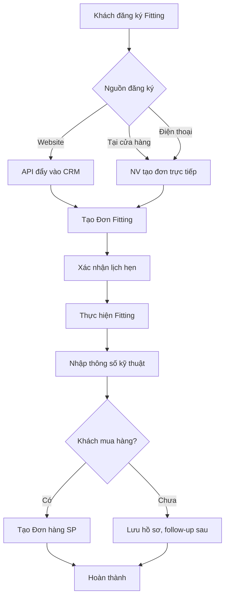
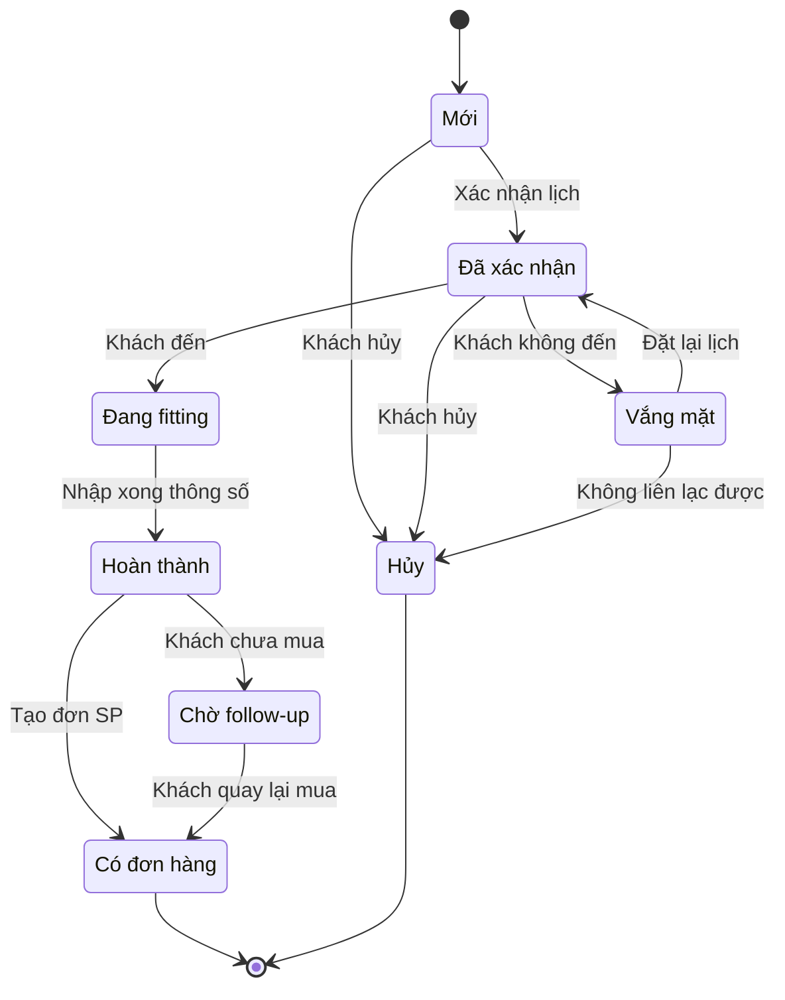
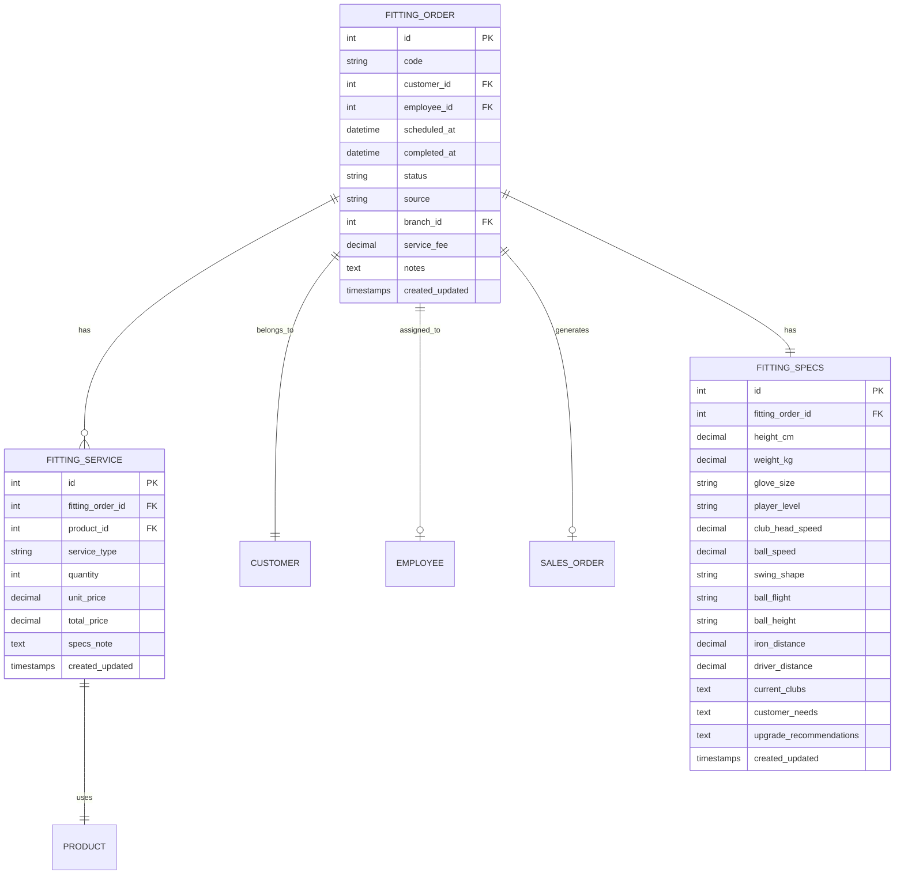
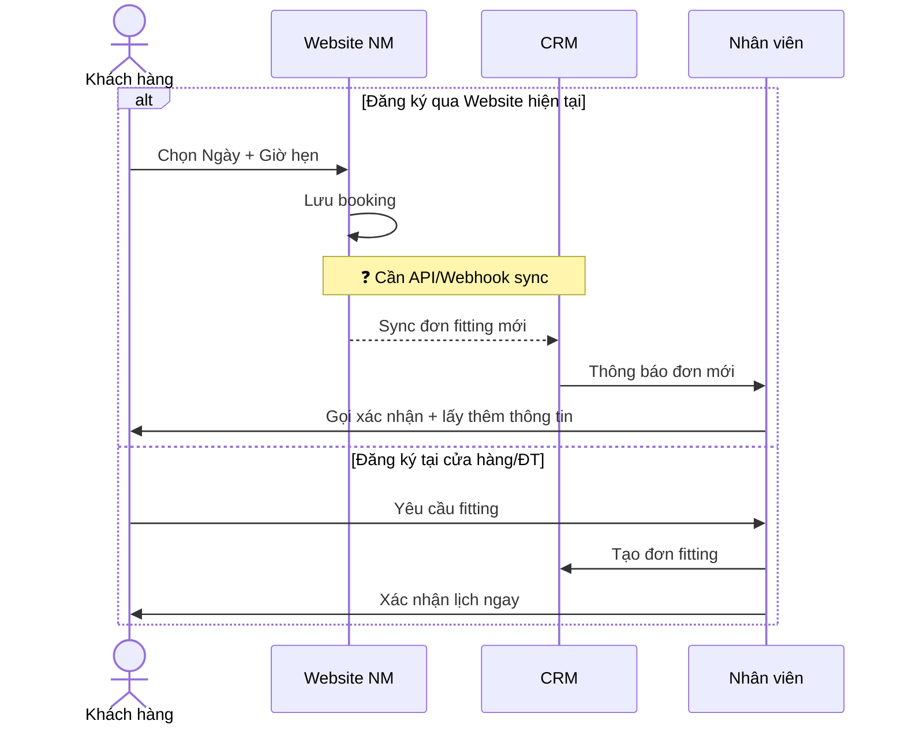
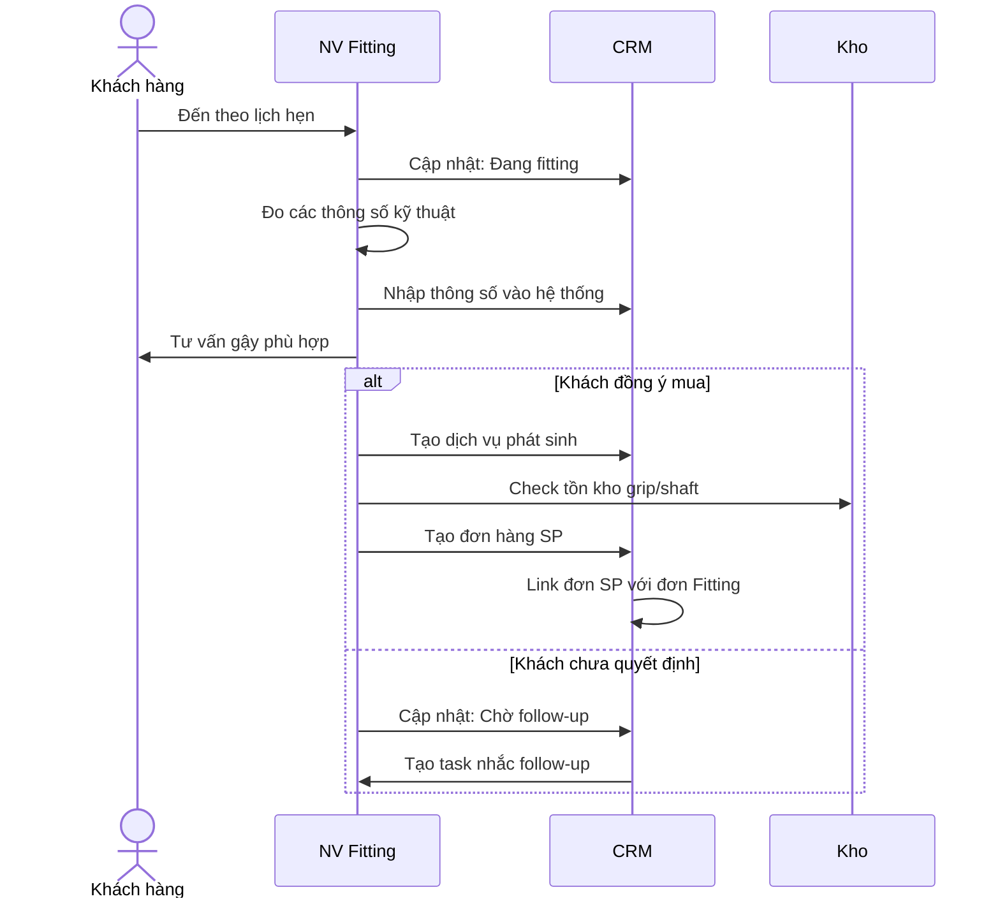
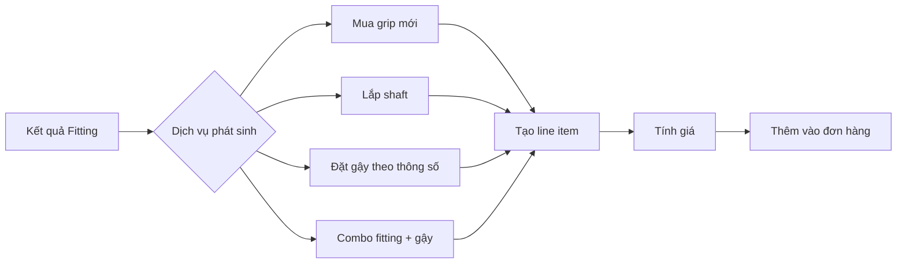

# Fitting Module - Tổng hợp Diagrams

> **Mục đích:** Tổng hợp tất cả Mermaid diagrams để dễ review
> **Phiên bản:** 1.0
> **Ngày cập nhật:** 06/01/2026
> 
> **Preview online:** Paste vào https://mermaid.live hoặc VS Code extension "Mermaid Preview"

---

## 📌 Nguồn tài liệu

| Tài liệu | Section | Nội dung |
| --- | --- | --- |
| FEATURE_SPECIFICATION.md | 5.2.2 | Tạo đơn hàng Fitting, Thông tin kỹ thuật |
| FEATURE_SPECIFICATION.md | 5.4 | Xem chi tiết đơn Fitting, Dịch vụ phát sinh |
| FEATURE_SPECIFICATION.md | 14.2 | Báo cáo Fitting |

**Tài liệu liên quan:**
- [FITTING_USE_CASE_SPEC.md](./FITTING_USE_CASE_SPEC.md) - Chi tiết Use Cases
- [FITTING_WORKFLOW.md](./FITTING_WORKFLOW.md) - Workflow & ERD

---

## 1. Workflow tổng quan



---

## 2. State Machine - Trạng thái đơn Fitting



---

## 3. ERD - Entity Relationship Diagram



---

## 4. Sequence Diagram - Tạo đơn Fitting



---

## 5. Sequence Diagram - Thực hiện Fitting



---

## 6. Flowchart - Dịch vụ phát sinh



## Quick Preview Commands

```bash
# VS Code với extension "Markdown Preview Mermaid Support"
# Hoặc paste từng block vào https://mermaid.live

# Export SVG/PNG từ CLI (cần cài mermaid-cli)
npx @mermaid-js/mermaid-cli mmdc -i FITTING_DIAGRAMS.md -o fitting-diagrams.svg
```

---

---

## 📚 Tham khảo

- [FEATURE_SPECIFICATION.md](./../../feature/FEATURE_SPECIFICATION.md) - Đặc tả chức năng gốc
- [FITTING_USE_CASE_SPEC.md](./FITTING_USE_CASE_SPEC.md) - Use Cases
- [FITTING_WORKFLOW.md](./FITTING_WORKFLOW.md) - Workflow & ERD

---

*Cập nhật: 06/01/2026*
