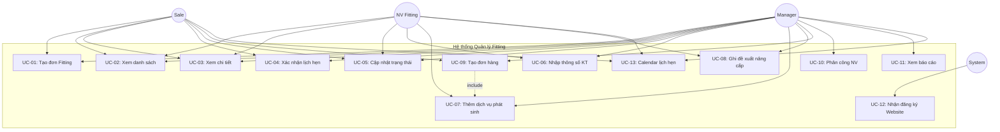

# Đặc tả Use Cases - Module Dịch vụ Fitting Golf

**Dự án:** DCNET Flow - Nhật Minh Sports
**Module:** Fitting Management
**Phiên bản:** 1.0
**Nguồn:** FEATURE_SPECIFICATION.md (Section 5.2.2, 5.4, 14.2)
**Ngày:** 06/01/2026

---

## 📋 Mục lục

1. [Định nghĩa Fitting](#1-định-nghĩa-fitting)
2. [Danh sách Actors và Vai trò](#2-danh-sách-actors-và-vai-trò)
3. [Ma trận Phân quyền](#3-ma-trận-phân-quyền)
4. [Chi tiết Use Cases](#4-chi-tiết-use-cases)
5. [Use Case Diagram](#5-use-case-diagram)

---

## 1. Định nghĩa Fitting

> **Định nghĩa từ khách hàng:**
>
> Dịch vụ đo thông số kỹ thuật cá nhân (chiều cao, cân nặng, tốc độ swing, đường bóng...) để tư vấn và customize gậy golf phù hợp với từng khách hàng.

**Nguồn:** FEATURE_SPECIFICATION.md - Section 5.2.2

**Đặc điểm:**
- Khách đăng ký fitting qua Website, Cửa hàng, hoặc Điện thoại
- NV thực hiện đo thông số kỹ thuật
- Tư vấn và đề xuất nâng cấp gậy/phụ kiện
- Phát sinh dịch vụ: Grip, Shaft, Gậy custom, Combo

---

## 2. Danh sách Actors và Vai trò

### 2.1. NV Fitting (Nhân viên thực hiện Fitting)

**Mô tả:** Nhân viên chuyên môn thực hiện fitting golf

**Quyền hạn:**
- Xem đơn Fitting được phân công
- Cập nhật trạng thái đơn Fitting
- Nhập thông số kỹ thuật
- Thêm dịch vụ phát sinh
- Ghi đề xuất nâng cấp

---

### 2.2. Sale

**Mô tả:** Nhân viên bán hàng

**Quyền hạn:**
- Tạo đơn Fitting mới
- Xem danh sách đơn Fitting
- Xác nhận lịch hẹn với khách
- Tạo đơn hàng SP từ Fitting

---

### 2.3. Manager

**Mô tả:** Quản lý

**Quyền hạn:**
- Tất cả quyền của Sale và NV Fitting
- Xem tất cả đơn Fitting (không chỉ của mình)
- Phân công NV thực hiện Fitting
- Xem báo cáo Fitting

---

### 2.4. System (Tự động)

**Mô tả:** Hệ thống tự động thực hiện các tác vụ

**Chức năng:**
- Tạo mã đơn Fitting tự động
- Nhận đăng ký từ Website
- Ghi log hoạt động

---

## 3. Ma trận Phân quyền

| Use Case | NV Fitting | Sale | Manager | System |
| --- | --- | --- | --- | --- |
| **UC-01: Tạo đơn Fitting mới** | - | ✓ | ✓ | - |
| **UC-02: Xem danh sách đơn Fitting** | ✓ (của mình) | ✓ (của mình) | ✓ (tất cả) | - |
| **UC-03: Xem chi tiết đơn Fitting** | ✓ | ✓ | ✓ | - |
| **UC-04: Xác nhận lịch hẹn** | - | ✓ | ✓ | - |
| **UC-05: Cập nhật trạng thái** | ✓ | ✓ | ✓ | - |
| **UC-06: Nhập thông số kỹ thuật** | ✓ | - | ✓ | - |
| **UC-07: Thêm dịch vụ phát sinh** | ✓ | - | ✓ | - |
| **UC-08: Ghi đề xuất nâng cấp** | ✓ | - | ✓ | - |
| **UC-09: Tạo đơn hàng từ Fitting** | - | ✓ | ✓ | - |
| **UC-10: Phân công NV Fitting** | - | - | ✓ | - |
| **UC-11: Xem báo cáo Fitting** | - | - | ✓ | - |
| **UC-12: Nhận đăng ký từ Website** | - | - | - | ✓ |
| **UC-13: Xem Calendar lịch hẹn** | ✓ | ✓ | ✓ | - |

**Chú thích:**
- ✓ = Có quyền thực hiện
- ✓ (của mình) = Chỉ thực hiện trên đơn được phân công
- ✓ (tất cả) = Thực hiện trên tất cả đơn
- - = Không có quyền

---

## 4. Chi tiết Use Cases

### UC-01: Tạo đơn Fitting mới

**ID:** UC-01
**Tên:** Tạo đơn Fitting mới
**Actors:** Sale, Manager

**Nguồn:** FEATURE_SPECIFICATION.md - Section 5.2.2
> "Đăng ký fitting qua website → đẩy thông tin vào CRM → Tạo lịch fitting"

**Mô tả:**
Tạo đơn fitting mới khi khách hàng đăng ký dịch vụ tại cửa hàng hoặc qua điện thoại.

**Precondition:**
- User đã đăng nhập vào hệ thống

**Main Flow:**
1. User chọn "Tạo đơn Fitting mới"
2. Hệ thống hiển thị form nhập thông tin
3. User nhập thông tin:
  - **Khách hàng:** Chọn từ Customer/Lead hoặc tạo mới
  - **Lịch hẹn:** Ngày + Giờ
  - **Chi nhánh:** Chi nhánh thực hiện
  - **NV phụ trách:** Nhân viên fitting
  - **Nguồn:** Cửa hàng / Điện thoại
  - **Ghi chú:** (tuỳ chọn)
4. User submit form
5. Hệ thống tạo mã đơn tự động: FIT-YYYYMMDD-XXX
6. Hệ thống lưu đơn với trạng thái "Mới"

**Postcondition:**
- Đơn Fitting mới được tạo trong hệ thống
- Trạng thái: Mới
- Mã đơn được sinh tự động

**Business Rules:**
- Mã đơn tự động sinh theo format: FIT-YYYYMMDD-XXX
- Khách hàng và Lịch hẹn là bắt buộc

---

### UC-02: Xem danh sách đơn Fitting

**ID:** UC-02
**Tên:** Xem danh sách đơn Fitting
**Actors:** NV Fitting, Sale, Manager

**Nguồn:** FEATURE_SPECIFICATION.md - Section 5.1
> "Loại danh sách: Đơn fitting"

**Mô tả:**
Hiển thị danh sách đơn Fitting trong hệ thống với khả năng lọc, sắp xếp.

**Precondition:**
- User đã đăng nhập vào hệ thống

**Main Flow:**
1. User truy cập trang "Danh sách đơn Fitting"
2. Hệ thống hiển thị danh sách đơn Fitting:
  - **NV Fitting/Sale:** Thấy đơn được phân công cho mình
  - **Manager:** Thấy tất cả đơn
3. Hệ thống hiển thị các cột:
  - Mã đơn
  - Khách hàng
  - SĐT
  - Lịch hẹn
  - Trạng thái
  - NV thực hiện
  - Chi nhánh
  - Nguồn
  - Có đơn SP (Yes/No)

**Filter:**
- Trạng thái
- Chi nhánh
- NV phụ trách
- Khoảng thời gian
- Có đơn SP (Yes/No)

**Postcondition:**
- Danh sách đơn Fitting được hiển thị theo quyền hạn

---

### UC-03: Xem chi tiết đơn Fitting

**ID:** UC-03
**Tên:** Xem chi tiết đơn Fitting
**Actors:** NV Fitting, Sale, Manager

**Nguồn:** FEATURE_SPECIFICATION.md - Section 5.4
> "Xem chi tiết đơn Fitting: Theo dõi lịch sử fitting khách hàng"

**Mô tả:**
Xem thông tin chi tiết của một đơn Fitting cụ thể.

**Precondition:**
- User đã đăng nhập
- Đơn Fitting tồn tại trong hệ thống
- User có quyền xem đơn này

**Main Flow:**
1. User click vào một đơn Fitting trong danh sách
2. Hệ thống kiểm tra quyền
3. Hệ thống hiển thị chi tiết đơn Fitting:

**Tab 1: Thông tin chung**
- Mã đơn
- Khách hàng (link đến profile)
- Lịch hẹn
- Trạng thái
- Chi nhánh
- NV phụ trách
- Nguồn
- Ghi chú

**Tab 2: Thông số kỹ thuật**
- Tất cả 14+ thông số từ Section 5.2.2
- Đề xuất nâng cấp

**Tab 3: Dịch vụ phát sinh**
- Danh sách dịch vụ (Grip, Shaft, Gậy custom...)
- Tổng tiền
- Link đến đơn hàng SP (nếu có)

**Tab 4: Lịch sử**
- Timeline hoạt động
- Lịch sử thay đổi trạng thái

**Postcondition:**
- Chi tiết đơn Fitting được hiển thị

---

### UC-04: Xác nhận lịch hẹn

**ID:** UC-04
**Tên:** Xác nhận lịch hẹn
**Actors:** Sale, Manager

**Mô tả:**
Liên hệ khách hàng và xác nhận lịch hẹn fitting.

**Precondition:**
- User đã đăng nhập
- Đơn Fitting ở trạng thái "Mới"

**Main Flow:**
1. User mở chi tiết đơn Fitting
2. User click "Xác nhận lịch hẹn"
3. Hệ thống hiển thị form:
  - Xác nhận lịch hẹn (có thể điều chỉnh nếu cần)
  - Ghi chú cuộc gọi
4. User submit
5. Hệ thống chuyển trạng thái: Mới → Đã xác nhận
6. Hệ thống ghi log

**Postcondition:**
- Trạng thái đơn: Đã xác nhận
- Log hoạt động được ghi nhận

---

### UC-05: Cập nhật trạng thái

**ID:** UC-05
**Tên:** Cập nhật trạng thái
**Actors:** NV Fitting, Sale, Manager

**Mô tả:**
Chuyển trạng thái đơn Fitting theo quy trình.

**Precondition:**
- User đã đăng nhập
- Đơn Fitting tồn tại trong hệ thống
- User có quyền cập nhật đơn này

**Main Flow:**
1. User mở chi tiết đơn Fitting
2. User click dropdown "Trạng thái"
3. Hệ thống hiển thị các trạng thái có thể chuyển (theo Ma trận chuyển đổi)
4. User chọn trạng thái mới
5. Hệ thống yêu cầu ghi chú (nếu cần)
6. Hệ thống cập nhật trạng thái
7. Hệ thống ghi log thay đổi

**Danh sách trạng thái:**
1. Mới (new)
2. Đã xác nhận (confirmed)
3. Đang fitting (in_progress)
4. Hoàn thành (completed)
5. Có đơn hàng (has_order)
6. Chờ follow-up (follow_up)
7. Vắng mặt (no_show)
8. Hủy (cancelled)

**Postcondition:**
- Trạng thái đơn Fitting được cập nhật
- Log hoạt động được ghi nhận

**Business Rules:**
- Chỉ cho phép chuyển trạng thái theo Ma trận chuyển đổi (xem FITTING_SPEC.md)

---

### UC-06: Nhập thông số kỹ thuật

**ID:** UC-06
**Tên:** Nhập thông số kỹ thuật
**Actors:** NV Fitting, Manager

**Nguồn:** FEATURE_SPECIFICATION.md - Section 5.2.2 "Thông tin kỹ thuật"

**Mô tả:**
Nhập các thông số kỹ thuật đo được trong buổi fitting.

**Precondition:**
- User đã đăng nhập
- Đơn Fitting ở trạng thái "Đang fitting" hoặc "Hoàn thành"
- User là NV được phân công hoặc Manager

**Main Flow:**
1. User mở chi tiết đơn Fitting
2. User chọn tab "Thông số kỹ thuật"
3. User nhập các thông số:
  - **Thời gian:** Thời gian thực hiện
  - **Chiều cao:** (cm)
  - **Cân nặng:** (kg)
  - **Kích thước size tay**
  - **Cấp độ:** Người mới / Người đã chơi
  - **Tốc độ đầu gậy**
  - **Tốc độ bóng**
  - **Hình swing**
  - **Đường bóng**
  - **Đường cao bóng**
  - **Khoảng cách bóng gậy sắt**
  - **Khoảng cách bóng gậy driver**
  - **Tình trạng bộ gậy của khách**
  - **Nhu cầu riêng của KH (Note)**
4. User lưu thông số
5. Hệ thống lưu dữ liệu

**Postcondition:**
- Thông số kỹ thuật được lưu
- Dữ liệu gắn với đơn Fitting và hồ sơ khách hàng

---

### UC-07: Thêm dịch vụ phát sinh

**ID:** UC-07
**Tên:** Thêm dịch vụ phát sinh
**Actors:** NV Fitting, Manager

**Nguồn:** FEATURE_SPECIFICATION.md - Section 5.4
> "Khách fitting → phát sinh các dịch vụ khác: Mua thêm grip, Lắp shaft, Đặt gậy theo thông số đặc biệt, Mua combo fitting + gậy"

**Mô tả:**
Thêm các dịch vụ/sản phẩm phát sinh từ buổi fitting.

**Precondition:**
- User đã đăng nhập
- Đơn Fitting ở trạng thái "Đang fitting" hoặc "Hoàn thành"

**Main Flow:**
1. User mở chi tiết đơn Fitting
2. User chọn tab "Dịch vụ phát sinh"
3. User click "Thêm dịch vụ"
4. User chọn loại dịch vụ:
  - **Mua thêm grip:** Chọn sản phẩm Grip
  - **Lắp shaft:** Chọn sản phẩm Shaft + Công lắp
  - **Đặt gậy theo thông số:** Nhập specs đặc biệt
  - **Combo fitting + gậy:** Chọn gói combo
5. User nhập số lượng, giá
6. User lưu
7. Hệ thống tính tổng tiền
8. Hệ thống check tồn kho (nếu là sản phẩm)

**Postcondition:**
- Dịch vụ phát sinh được thêm vào đơn Fitting
- Tổng tiền được tính

---

### UC-08: Ghi đề xuất nâng cấp

**ID:** UC-08
**Tên:** Ghi đề xuất nâng cấp
**Actors:** NV Fitting, Manager

**Nguồn:** FEATURE_SPECIFICATION.md - Section 5.2.2
> "Ghi lại thông tin sau khi fitting: Đề xuất nâng cấp"

**Mô tả:**
Ghi lại đề xuất tư vấn nâng cấp gậy/phụ kiện cho khách hàng.

**Precondition:**
- User đã đăng nhập
- Đơn Fitting ở trạng thái "Đang fitting" hoặc "Hoàn thành"

**Main Flow:**
1. User mở chi tiết đơn Fitting
2. User chọn tab "Thông số kỹ thuật"
3. User điền vào field "Đề xuất nâng cấp"
4. User lưu

**Postcondition:**
- Đề xuất nâng cấp được lưu
- Dữ liệu gắn với hồ sơ khách hàng để tracking

---

### UC-09: Tạo đơn hàng từ Fitting

**ID:** UC-09
**Tên:** Tạo đơn hàng từ Fitting
**Actors:** Sale, Manager

**Nguồn:** FEATURE_SPECIFICATION.md - Section 5.4
> "CRM sẽ gắn dịch vụ + sản phẩm đó vào hồ sơ khách hàng để theo dõi toàn diện"

**Mô tả:**
Tạo đơn hàng sản phẩm từ dịch vụ phát sinh của buổi fitting.

**Precondition:**
- User đã đăng nhập
- Đơn Fitting ở trạng thái "Hoàn thành" hoặc "Chờ follow-up"
- Có ít nhất 1 dịch vụ phát sinh

**Main Flow:**
1. User mở chi tiết đơn Fitting
2. User chọn tab "Dịch vụ phát sinh"
3. User click "Tạo đơn hàng"
4. Hệ thống mở form tạo Order:
  - Pre-fill thông tin từ Khách hàng
  - Pre-fill dịch vụ phát sinh từ Fitting
5. User bổ sung thông tin đơn hàng
6. User submit
7. Hệ thống tạo Sales Order
8. Hệ thống chuyển trạng thái Fitting: → Có đơn hàng
9. Hệ thống link đơn SP với đơn Fitting

**Postcondition:**
- Sales Order được tạo thành công
- Đơn Fitting chuyển trạng thái: Có đơn hàng
- Link giữa Fitting Order và Sales Order

---

### UC-10: Phân công NV Fitting

**ID:** UC-10
**Tên:** Phân công NV Fitting
**Actors:** Manager

**Mô tả:**
Phân công hoặc đổi nhân viên thực hiện fitting.

**Precondition:**
- User đã đăng nhập với quyền Manager
- Đơn Fitting tồn tại trong hệ thống

**Main Flow:**
1. Manager mở chi tiết đơn Fitting
2. Manager click "Phân công NV"
3. Hệ thống hiển thị danh sách NV Fitting
4. Manager chọn NV mới
5. Manager submit
6. Hệ thống cập nhật người phụ trách
7. Hệ thống gửi thông báo cho NV mới

**Postcondition:**
- Đơn Fitting được phân công cho NV mới
- NV mới nhận được thông báo

---

### UC-11: Xem báo cáo Fitting

**ID:** UC-11
**Tên:** Xem báo cáo Fitting
**Actors:** Manager

**Nguồn:** FEATURE_SPECIFICATION.md - Section 14.2 "Báo cáo - Fitting"

**Mô tả:**
Xem các báo cáo liên quan đến dịch vụ Fitting.

**Precondition:**
- User đã đăng nhập với quyền Manager

**Main Flow:**
1. Manager truy cập menu "Báo cáo → Fitting"
2. Hệ thống hiển thị các báo cáo:
  - **Doanh thu phát sinh từ fitting:** Tổng doanh thu, theo thời gian
  - **Tổng số buổi fitting trong tháng:** Count theo thời gian
  - **Số lượng khách đến thực hiện fitting:** Unique customers
  - **Báo cáo linh kiện sử dụng trong fitting:** Grip, shaft đã dùng
  - **Báo cáo nhân viên thực hiện:** Doanh thu theo NV, tỉ lệ tư vấn thành công
3. Manager chọn khoảng thời gian, filter
4. Hệ thống hiển thị dữ liệu và biểu đồ

**Postcondition:**
- Báo cáo được hiển thị theo filter

---

### UC-12: Nhận đăng ký từ Website

**ID:** UC-12
**Tên:** Nhận đăng ký từ Website
**Actors:** System

**Nguồn:** FEATURE_SPECIFICATION.md - Section 5.2.2
> "Đăng ký fitting qua website → đẩy thông tin vào CRM"

**Mô tả:**
Hệ thống tự động nhận đăng ký fitting từ website và tạo đơn mới.

**Precondition:**
- API tích hợp với Website đã được cấu hình
- Có đăng ký mới từ Website

**Main Flow:**
1. Khách đăng ký fitting trên Website (Ngày + Giờ)
2. Website gọi API/Webhook đến CRM
3. System nhận và parse dữ liệu
4. System check khách hàng đã tồn tại chưa:
  - Nếu có: Link đến Customer/Lead hiện có
  - Nếu chưa: Tạo Lead mới
5. System tạo đơn Fitting mới:
  - Trạng thái: Mới
  - Nguồn: Website
  - Lịch hẹn từ form đăng ký
6. System gửi thông báo cho Sale để xác nhận lịch

**Postcondition:**
- Đơn Fitting mới được tạo tự động
- Sale nhận được thông báo để follow-up

---

### UC-13: Xem Calendar lịch hẹn

**ID:** UC-13
**Tên:** Xem Calendar lịch hẹn
**Actors:** NV Fitting, Sale, Manager

**Mô tả:**
Xem lịch hẹn fitting trên giao diện Calendar.

**Precondition:**
- User đã đăng nhập

**Main Flow:**
1. User truy cập "Calendar Fitting"
2. Hệ thống hiển thị Calendar view:
  - **View theo ngày/tuần/tháng**
  - Các slot thời gian có đơn Fitting được highlight
  - Màu sắc theo trạng thái
3. User có thể:
  - Click vào slot để xem chi tiết đơn
  - Drag-drop để đổi lịch (nếu có quyền)
  - Filter theo chi nhánh, NV

**Postcondition:**
- Calendar lịch hẹn được hiển thị

---

## 5. Use Case Diagram

### 5.1. Sơ đồ Use Case (Mermaid)

### 5.2. Mối quan hệ Actors và Use Cases

**NV Fitting:**
- UC-02: Xem danh sách đơn Fitting (của mình)
- UC-03: Xem chi tiết đơn Fitting
- UC-05: Cập nhật trạng thái
- UC-06: Nhập thông số kỹ thuật
- UC-07: Thêm dịch vụ phát sinh
- UC-08: Ghi đề xuất nâng cấp
- UC-13: Xem Calendar lịch hẹn

**Sale:**
- UC-01: Tạo đơn Fitting mới
- UC-02: Xem danh sách đơn Fitting (của mình)
- UC-03: Xem chi tiết đơn Fitting
- UC-04: Xác nhận lịch hẹn
- UC-05: Cập nhật trạng thái
- UC-09: Tạo đơn hàng từ Fitting
- UC-13: Xem Calendar lịch hẹn

**Manager:**
- Tất cả Use Cases của NV Fitting và Sale
- UC-10: Phân công NV Fitting
- UC-11: Xem báo cáo Fitting

**System:**
- UC-12: Nhận đăng ký từ Website

### 5.3. Mối quan hệ Include

- **UC-09 «include» UC-07:**
  - Khi tạo đơn hàng từ Fitting (UC-09)
  - Phải có dịch vụ phát sinh (UC-07) trước

---

## 📚 Tham khảo

**Tài liệu liên quan:**
- [FEATURE_SPECIFICATION.md](./../../feature/FEATURE_SPECIFICATION.md) - Đặc tả chức năng gốc (Section 5.2.2, 5.4, 14.2)
- [FITTING_WORKFLOW.md](./FITTING_WORKFLOW.md) - Workflow và ERD
- [FITTING_DIAGRAMS.md](./FITTING_DIAGRAMS.md) - Tổng hợp Diagrams

---

## 📝 Ghi chú quan trọng

1. **Nguồn đăng ký:** Website, Cửa hàng, Điện thoại

2. **Thông số kỹ thuật:** 14+ thông số từ spec, một số cần clarify đơn vị/enum values

3. **Dịch vụ phát sinh:** 4 loại - Grip, Shaft, Gậy custom, Combo

4. **Báo cáo bắt buộc:** 5 báo cáo từ Section 14.2

5. **Tích hợp:**
  - Website: Nhận đăng ký qua API
  - Customer/Lead: Link hồ sơ khách hàng
  - Sales Order: Tạo đơn hàng từ dịch vụ phát sinh
  - Products: Link với sản phẩm Grip/Shaft/Gậy
  - Inventory: Check tồn kho
  - Calendar: Hiển thị lịch hẹn

---

**Ngày cập nhật:** 06/01/2026
**Người soạn:** DCNET Development Team
**Nguồn:** FEATURE_SPECIFICATION.md v1.0 (Section 5.2.2, 5.4, 14.2)
