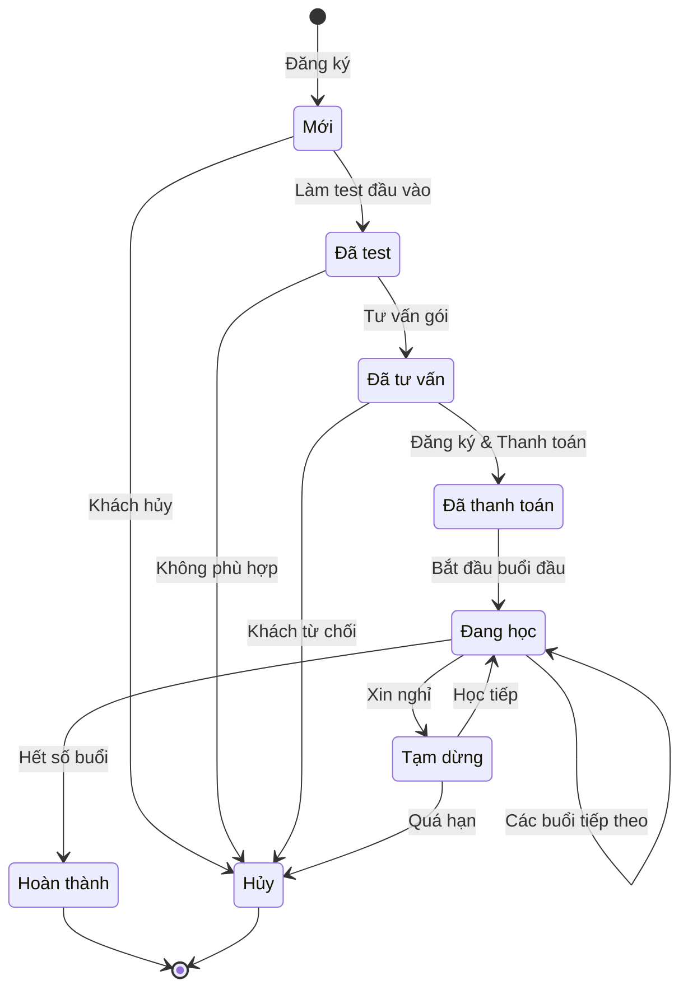
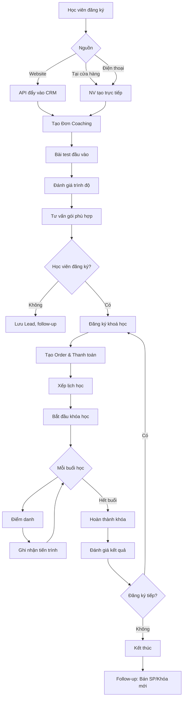
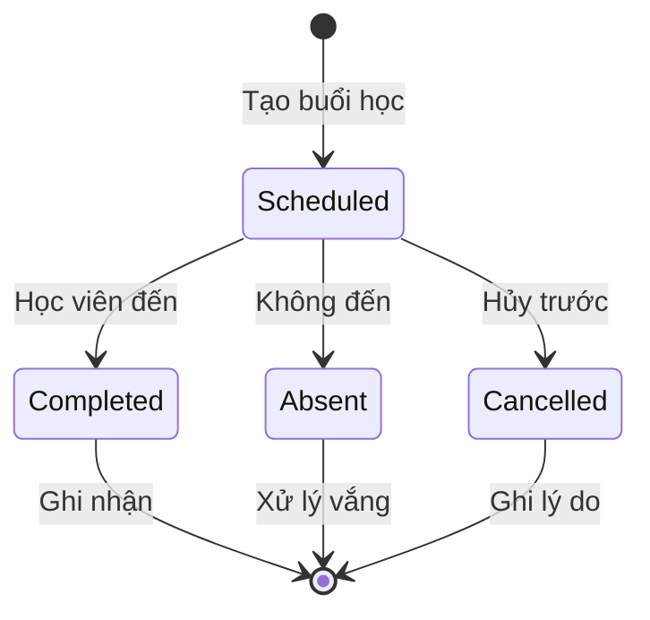
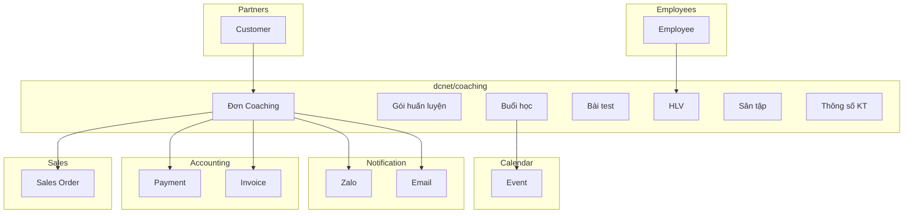

# Coaching Module - Status Workflow & State Machine

> **Module:** Coaching (Huấn luyện Golf)
> **Phiên bản:** 1.0
> **Nguồn:** FEATURE_SPECIFICATION.md Section 5.2.3, 5.4, 14.2
> **Ngày:** 10/01/2026

---

## 1. Tổng quan Status Workflow

### 1.1. Đặc điểm Module Coaching

| Tiêu chí | Giá trị |
|----------|---------|
| **Loại module** | Service-based (dịch vụ nhiều buổi) |
| **Số trạng thái** | 8 trạng thái |
| **Terminal states** | 2 (Hoàn thành, Hủy) |
| **Có SLA** | Không (khác với Lead) |
| **Có KPI** | Có (doanh thu, số học viên) |
| **Tracking** | Theo khóa học + từng buổi |

### 1.2. So sánh với các Module khác

| Module | Loại | Trạng thái | SLA | Tracking |
|--------|------|------------|-----|----------|
| **Lead** | CRM | 6 | ✅ | Conversion |
| **Fitting** | Service (1 buổi) | 8 | ❌ | 1 lần |
| **Coaching** | Service (nhiều buổi) | 8 | ❌ | Khóa học + buổi |

---

## 2. Định nghĩa 8 Trạng thái

### 2.1. Danh sách trạng thái

| # | Trạng thái | Code | Loại | Màu | Mô tả |
|---|------------|------|------|-----|-------|
| 1 | **Mới** | `new` | Active | 🔵 Blue | Đơn coaching mới đăng ký, chưa test đầu vào |
| 2 | **Đã test** | `tested` | Active | 🟣 Purple | Đã làm bài test đánh giá trình độ |
| 3 | **Đã tư vấn** | `consulted` | Active | 🟡 Yellow | Đã tư vấn gói học phù hợp |
| 4 | **Đã thanh toán** | `paid` | Active | 🟢 Green | Đã đăng ký gói và thanh toán |
| 5 | **Đang học** | `in_progress` | Active | 🟠 Orange | Đang trong quá trình học |
| 6 | **Tạm dừng** | `paused` | Active | ⚪ Gray | Học viên xin nghỉ tạm thời |
| 7 | **Hoàn thành** | `completed` | Terminal | ✅ Green | Đã hoàn thành khóa học |
| 8 | **Hủy** | `cancelled` | Terminal | 🔴 Red | Đơn bị hủy |

### 2.2. Chi tiết từng trạng thái

#### 2.2.1. Mới (new)

**Mô tả:** Đơn coaching mới được tạo khi học viên đăng ký

**Trigger vào:**
- Học viên đăng ký qua Website
- NV tạo đơn tại cửa hàng
- NV tạo đơn qua điện thoại

**Actions có thể thực hiện:**
- Liên hệ học viên
- Lên lịch test đầu vào
- Hủy đơn

**Chuyển sang:**
- `tested`: Khi hoàn thành bài test
- `cancelled`: Khi khách hủy

---

#### 2.2.2. Đã test (tested)

**Mô tả:** Học viên đã làm bài test đánh giá trình độ

**Trigger vào:**
- Hoàn thành bài test đầu vào

**Thông tin cần ghi nhận:**
- Kết quả bài test
- Trình độ hiện tại
- Điểm mạnh/yếu
- Đề xuất gói phù hợp

**Actions có thể thực hiện:**
- Tư vấn gói học
- Hủy đơn

**Chuyển sang:**
- `consulted`: Khi đã tư vấn gói
- `cancelled`: Khi không phù hợp

---

#### 2.2.3. Đã tư vấn (consulted)

**Mô tả:** NV đã tư vấn gói học phù hợp cho học viên

**Trigger vào:**
- Hoàn thành tư vấn gói

**Thông tin cần ghi nhận:**
- Gói được đề xuất
- Học phí
- HLV gợi ý
- Lịch học dự kiến

**Actions có thể thực hiện:**
- Đăng ký gói học
- Tạo đơn hàng (Order)
- Hủy đơn

**Chuyển sang:**
- `paid`: Khi học viên đăng ký và thanh toán
- `cancelled`: Khi khách từ chối

---

#### 2.2.4. Đã thanh toán (paid)

**Mô tả:** Học viên đã đăng ký gói và thanh toán (toàn bộ hoặc đặt cọc)

**Trigger vào:**
- Tạo Order thành công
- Ghi nhận thanh toán

**Thông tin cần ghi nhận:**
- Gói huấn luyện đăng ký
- HLV phụ trách
- Tổng học phí
- Số tiền đã thanh toán
- Số buổi học
- Sân tập

**Actions có thể thực hiện:**
- Xếp lịch học
- Tạo các buổi học (Sessions)
- Bắt đầu khóa học

**Chuyển sang:**
- `in_progress`: Khi bắt đầu buổi học đầu tiên

---

#### 2.2.5. Đang học (in_progress)

**Mô tả:** Học viên đang trong quá trình học

**Trigger vào:**
- Bắt đầu buổi học đầu tiên

**Tracking theo buổi:**
- Điểm danh từng buổi
- Nội dung buổi học
- Tiến trình kỹ năng
- Bài tập về nhà

**Actions có thể thực hiện:**
- Điểm danh
- Ghi nhận tiến trình
- Đánh giá định kỳ
- Tạm dừng khóa học

**Chuyển sang:**
- `paused`: Khi học viên xin nghỉ
- `completed`: Khi hoàn thành tất cả buổi học

---

#### 2.2.6. Tạm dừng (paused)

**Mô tả:** Học viên xin nghỉ tạm thời

**Trigger vào:**
- Học viên yêu cầu tạm dừng
- Lý do cá nhân

**Thông tin cần ghi nhận:**
- Lý do tạm dừng
- Số buổi đã học
- Số buổi còn lại
- Ngày dự kiến học lại

**Actions có thể thực hiện:**
- Liên hệ học viên
- Tiếp tục học
- Hủy khóa học

**Chuyển sang:**
- `in_progress`: Khi học viên học tiếp
- `cancelled`: Khi quá hạn không học

---

#### 2.2.7. Hoàn thành (completed)

**Mô tả:** Học viên đã hoàn thành khóa học

**Trigger vào:**
- Hoàn thành tất cả buổi học
- `completed_sessions == total_sessions`

**Thông tin cần ghi nhận:**
- Kết quả đánh giá cuối khóa
- Tiến bộ so với đầu vào
- Đề xuất khóa tiếp theo

**Actions có thể thực hiện:**
- Đánh giá kết quả
- Follow-up bán SP
- Đề xuất khóa mới

**Trạng thái cuối:** Terminal state

---

#### 2.2.8. Hủy (cancelled)

**Mô tả:** Đơn coaching bị hủy

**Trigger vào:**
- Khách hủy đăng ký
- Không phù hợp sau test
- Quá hạn tạm dừng
- Không liên lạc được

**Thông tin cần ghi nhận:**
- Lý do hủy
- Hoàn tiền (nếu có)

**Trạng thái cuối:** Terminal state

---

## 3. State Machine Diagram

### 3.1. Mermaid State Diagram



### 3.2. Workflow Tổng quan



---

## 4. Ma trận chuyển đổi trạng thái

### 4.1. Transition Matrix

| Từ ↓ / Sang → | Mới | Đã test | Đã tư vấn | Đã TT | Đang học | Tạm dừng | Hoàn thành | Hủy |
|---------------|-----|---------|-----------|-------|----------|----------|------------|-----|
| **Mới** | - | ✅ | ❌ | ❌ | ❌ | ❌ | ❌ | ✅ |
| **Đã test** | ❌ | - | ✅ | ❌ | ❌ | ❌ | ❌ | ✅ |
| **Đã tư vấn** | ❌ | ❌ | - | ✅ | ❌ | ❌ | ❌ | ✅ |
| **Đã TT** | ❌ | ❌ | ❌ | - | ✅ | ❌ | ❌ | ❌ |
| **Đang học** | ❌ | ❌ | ❌ | ❌ | ✅ | ✅ | ✅ | ❌ |
| **Tạm dừng** | ❌ | ❌ | ❌ | ❌ | ✅ | - | ❌ | ✅ |
| **Hoàn thành** | ❌ | ❌ | ❌ | ❌ | ❌ | ❌ | - | ❌ |
| **Hủy** | ❌ | ❌ | ❌ | ❌ | ❌ | ❌ | ❌ | - |

### 4.2. Transition Rules

| # | Transition | Trigger | Conditions | Actions |
|---|------------|---------|------------|---------|
| 1 | Mới → Đã test | Hoàn thành test | Test results recorded | Ghi nhận kết quả test |
| 2 | Mới → Hủy | Khách hủy | - | Ghi lý do hủy |
| 3 | Đã test → Đã tư vấn | Hoàn thành tư vấn | Có gói đề xuất | Ghi nhận gói tư vấn |
| 4 | Đã test → Hủy | Không phù hợp | - | Ghi lý do |
| 5 | Đã tư vấn → Đã TT | Thanh toán | Order created | Tạo Order, ghi nhận TT |
| 6 | Đã tư vấn → Hủy | Từ chối | - | Ghi lý do |
| 7 | Đã TT → Đang học | Buổi đầu | Sessions created | Bắt đầu khóa học |
| 8 | Đang học → Đang học | Buổi tiếp | `completed < total` | Cập nhật tiến trình |
| 9 | Đang học → Tạm dừng | Xin nghỉ | - | Ghi lý do, ngày dự kiến |
| 10 | Đang học → Hoàn thành | Hết buổi | `completed == total` | Đánh giá cuối khóa |
| 11 | Tạm dừng → Đang học | Học tiếp | - | Tiếp tục theo lịch |
| 12 | Tạm dừng → Hủy | Quá hạn | Timeout exceeded | Xử lý hoàn tiền |

---

## 5. Database Schema

### 5.1. Entity Relationship

```mermaid
erDiagram
    COACHING_ORDER ||--|| CUSTOMER : belongs_to
    COACHING_ORDER ||--|| COACHING_PACKAGE : uses
    COACHING_ORDER ||--|| COACH : assigned_to
    COACHING_ORDER ||--|| GOLF_COURSE : at
    COACHING_ORDER ||--o| COACHING_TEST : has
    COACHING_ORDER ||--o| COACHING_SPECS : has
    COACHING_ORDER ||--o{ COACHING_SESSION : has
    COACHING_ORDER ||--o{ SALES_ORDER : generates
    COACHING_SESSION ||--o| COACH : taught_by

    COACH ||--|| EMPLOYEE : extends

    COACHING_ORDER {
        int id PK
        string code "Auto: COACH-YYYYMMDD-XXX"
        int customer_id FK
        int package_id FK
        int coach_id FK
        int golf_course_id FK
        string status "8 trạng thái"
        date start_date
        date end_date
        decimal total_fee "Tổng học phí"
        decimal discount "Ưu đãi"
        decimal paid_amount "Đã thanh toán"
        int total_sessions "Tổng số buổi"
        int completed_sessions "Đã học"
        text learning_goals "Mục tiêu học"
        timestamps
    }

    COACHING_PACKAGE {
        int id PK
        string name "VD: 8 buổi cơ bản"
        string type "Cá nhân/Nhóm/Thi đấu"
        int sessions_count "Số buổi"
        int duration_minutes "Thời lượng/buổi"
        decimal price
        text description
        bool is_active
        timestamps
    }

    COACH {
        int id PK
        int employee_id FK
        string certification "Chứng chỉ"
        int experience_years "Kinh nghiệm"
        string specialty "Chuyên môn"
        decimal rating "Đánh giá"
        text bio
        timestamps
    }

    GOLF_COURSE {
        int id PK
        string name "Tên sân tập"
        string address
        int lanes_count "Số lane"
        string contact_phone
        bool is_partner "Đối tác hay của NM"
        timestamps
    }

    COACHING_TEST {
        int id PK
        int coaching_order_id FK
        int coach_id FK "Người test"
        datetime test_date
        string skill_level "Kết quả đánh giá"
        json test_results "Chi tiết bài test"
        text notes
        text recommendations "Đề xuất gói"
        timestamps
    }

    COACHING_SESSION {
        int id PK
        int coaching_order_id FK
        int coach_id FK
        int session_number "Buổi thứ mấy"
        datetime scheduled_at
        datetime actual_start
        datetime actual_end
        string status "scheduled/completed/absent/cancelled"
        text lesson_content "Nội dung buổi học"
        text progress_notes "Ghi chú tiến trình"
        text homework "Bài tập về nhà"
        timestamps
    }

    COACHING_SPECS {
        int id PK
        int coaching_order_id FK
        decimal height_cm "Chiều cao"
        decimal weight_kg "Cân nặng"
        string glove_size "Size tay"
        string player_level "Cấp độ"
        decimal club_head_speed "Tốc độ đầu gậy"
        decimal ball_speed "Tốc độ bóng"
        string swing_shape "Hình swing"
        string ball_flight "Đường bóng"
        string ball_height "Đường cao bóng"
        decimal iron_distance "KC gậy sắt"
        decimal driver_distance "KC driver"
        text current_clubs "Gậy hiện tại"
        text customer_needs "Nhu cầu"
        text notes
        timestamps
    }
```

### 5.2. Status Field Definition

```sql
-- Enum cho trạng thái đơn Coaching
CREATE TYPE coaching_status AS ENUM (
    'new',          -- Mới
    'tested',       -- Đã test
    'consulted',    -- Đã tư vấn
    'paid',         -- Đã thanh toán
    'in_progress',  -- Đang học
    'paused',       -- Tạm dừng
    'completed',    -- Hoàn thành
    'cancelled'     -- Hủy
);

-- Enum cho trạng thái buổi học
CREATE TYPE session_status AS ENUM (
    'scheduled',    -- Đã lên lịch
    'completed',    -- Đã học
    'absent',       -- Vắng mặt
    'cancelled'     -- Hủy buổi
);
```

---

## 6. Session Tracking

### 6.1. Session Status Flow



### 6.2. Attendance Rules

| Tình huống | Hành động | Ảnh hưởng |
|------------|-----------|-----------|
| Có mặt | Điểm danh: Completed | `completed_sessions += 1` |
| Vắng có báo trước | Điểm danh: Cancelled | Có thể học bù |
| Vắng không báo | Điểm danh: Absent | Theo chính sách (mất buổi/bù) |

### 6.3. Session Tracking Fields

| Field | Mô tả | Khi nào cập nhật |
|-------|-------|------------------|
| `session_number` | Buổi thứ mấy | Khi tạo session |
| `scheduled_at` | Thời gian dự kiến | Khi xếp lịch |
| `actual_start` | Thời gian bắt đầu thực | Khi bắt đầu buổi học |
| `actual_end` | Thời gian kết thúc thực | Khi kết thúc buổi học |
| `status` | Trạng thái buổi | Khi điểm danh |
| `lesson_content` | Nội dung buổi học | Sau buổi học |
| `progress_notes` | Ghi chú tiến trình | Sau buổi học |
| `homework` | Bài tập về nhà | Sau buổi học |

---

## 7. Đánh giá định kỳ

**Nguồn:** FEATURE_SPECIFICATION.md Section 5.4 - "Đánh giá định kỳ: Đầu - giữa - cuối kỳ"

### 7.1. Các mốc đánh giá

| Mốc | Thời điểm | Nội dung |
|-----|-----------|----------|
| **Đầu kỳ** | Sau test đầu vào | Baseline skills, mục tiêu học |
| **Giữa kỳ** | 50% khóa học | Tiến trình, điều chỉnh nếu cần |
| **Cuối kỳ** | Hoàn thành khóa | Đánh giá kết quả, đề xuất tiếp |

### 7.2. Kỹ năng đánh giá

**Nguồn:** FEATURE_SPECIFICATION.md Section 5.4 - "kỹ năng (swing, putting,...)"

| Kỹ năng | Mô tả |
|---------|-------|
| Swing | Kỹ thuật swing cơ bản |
| Putting | Kỹ thuật putting |
| Chipping | Short game |
| Driving | Tee shot |
| Course Management | Chiến thuật trên sân |

---

## 8. Thông báo tự động

**Nguồn:** FEATURE_SPECIFICATION.md Section 5.4 - "CRM gửi lịch học, thay đổi giờ học, lịch thi đấu qua Zalo/Email"

### 8.1. Các loại thông báo

| # | Loại | Trigger | Kênh | Nội dung |
|---|------|---------|------|----------|
| 1 | Nhắc lịch học | 1 ngày trước buổi học | Zalo/Email | Lịch buổi học ngày mai |
| 2 | Thay đổi giờ | Khi HLV đổi lịch | Zalo/Email | Thông báo giờ mới |
| 3 | Vắng mặt | Sau buổi vắng | Zalo/Email | Nhắc học bù |
| 4 | Hoàn thành khóa | Khi completed | Zalo/Email | Đánh giá + đề xuất |
| 5 | Khuyến mãi | Marketing | Zalo/Email | Khóa mới, sản phẩm |

---

## 9. KPI & Báo cáo

**Nguồn:** FEATURE_SPECIFICATION.md Section 14.2 (Line 899-903)

### 9.1. KPI theo spec

| # | KPI | Công thức | Mục tiêu |
|---|-----|-----------|----------|
| 1 | Doanh thu đào tạo | SUM(total_fee) where status='completed' | - |
| 2 | Doanh thu SP phát sinh | SUM(order.amount) linked to coaching | - |
| 3 | Số học viên | COUNT(DISTINCT customer_id) | - |
| 4 | Doanh số theo HLV | SUM(total_fee) GROUP BY coach_id | - |

### 9.2. KPI mở rộng (đề xuất)

| # | KPI | Công thức | Mục tiêu |
|---|-----|-----------|----------|
| 5 | Tỉ lệ hoàn thành | completed / total_registered | > 85% |
| 6 | Tỉ lệ đăng ký tiếp | re_registered / completed | > 30% |
| 7 | Điểm danh trung bình | completed_sessions / scheduled | > 90% |
| 8 | Điểm hài lòng | AVG(rating) | > 4.5/5 |

---

## 10. Phân quyền theo trạng thái

### 10.1. Ma trận phân quyền

| Action | NV Tư vấn | HLV | Manager | Admin |
|--------|-----------|-----|---------|-------|
| Tạo đơn Coaching | ✅ | ❌ | ✅ | ✅ |
| Chuyển: Mới → Đã test | ❌ | ✅ | ✅ | ✅ |
| Nhập kết quả test | ❌ | ✅ | ✅ | ✅ |
| Chuyển: Đã test → Đã tư vấn | ✅ | ❌ | ✅ | ✅ |
| Tạo Order | ✅ | ❌ | ✅ | ✅ |
| Xếp lịch học | ✅ | ❌ | ✅ | ✅ |
| Điểm danh | ❌ | ✅ | ✅ | ✅ |
| Ghi nhận tiến trình | ❌ | ✅ | ✅ | ✅ |
| Tạm dừng khóa | ✅ | ✅ | ✅ | ✅ |
| Hủy đơn | ❌ | ❌ | ✅ | ✅ |
| Xem báo cáo | ❌ | ✅ (của mình) | ✅ | ✅ |

---

## 11. Business Rules

### 11.1. Quy tắc chuyển trạng thái

| # | Rule | Mô tả |
|---|------|-------|
| 1 | Phải test trước khi tư vấn | Mới → Đã test là bắt buộc |
| 2 | Phải có Order để bắt đầu học | Đã tư vấn → Đã TT cần Order |
| 3 | Không thể hủy khi đang học | Đang học → Hủy không được phép |
| 4 | Tạm dừng có thời hạn | Quá 30 ngày → tự động hủy (⚠️ cần confirm) |
| 5 | Hoàn thành khi hết buổi | completed_sessions == total_sessions |

### 11.2. Quy tắc thanh toán

| Hình thức | Mô tả | Ảnh hưởng |
|-----------|-------|-----------|
| Trọn gói | Thu 100% | paid_amount = total_fee |
| Đặt cọc | Thu X% | paid_amount = deposit, theo dõi công nợ |
| Theo buổi | Thu từng buổi | paid_amount cộng dồn |

### 11.3. Quy tắc vắng mặt

⚠️ **Cần clarify với khách hàng:**
- Số buổi vắng tối đa?
- Chính sách học bù?
- Mất buổi hay được hoàn tiền?

---

## 12. Integration Points

### 12.1. Tích hợp với các Module



---

## 13. Validation Checklist

### 13.1. Checklist theo spec

- [x] 8 trạng thái được định nghĩa
- [x] State machine diagram
- [x] Transition matrix
- [x] Database schema (7 entities)
- [x] Session tracking
- [x] Đánh giá định kỳ (đầu-giữa-cuối)
- [x] Thông báo tự động (Zalo/Email)
- [x] Báo cáo (4 loại từ spec)
- [x] Integration points

### 13.2. ⚠️ Cần clarify với khách hàng

| # | Câu hỏi | Nguồn |
|---|---------|-------|
| 1 | Danh sách gói huấn luyện cụ thể? | 5.2.3 |
| 2 | Thời hạn tạm dừng tối đa? | Business logic |
| 3 | Chính sách vắng mặt/học bù? | Business logic |
| 4 | Danh sách sân tập? | 5.2.3 |
| 5 | Đơn vị đo tốc độ (mph/km/h)? | 5.2.2 |

---

**Nguồn:** FEATURE_SPECIFICATION.md Section 5.2.3, 5.4, 14.2
**Ngày cập nhật:** 10/01/2026
**Người soạn:** DCNET Development Team
