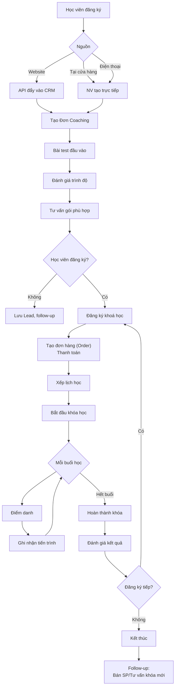
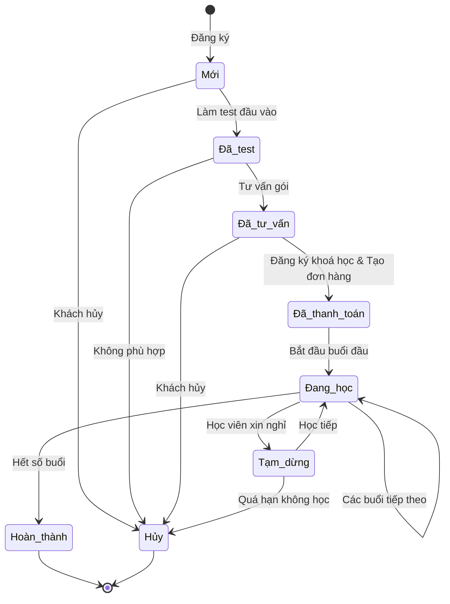
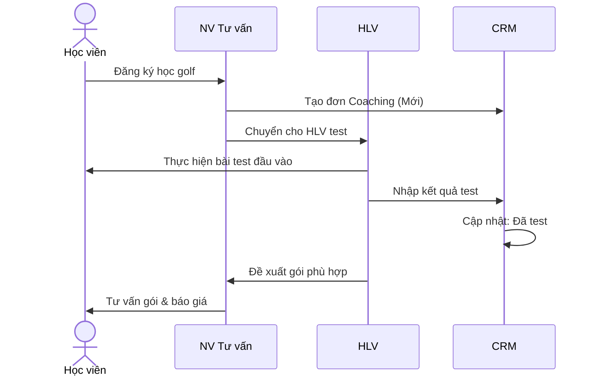
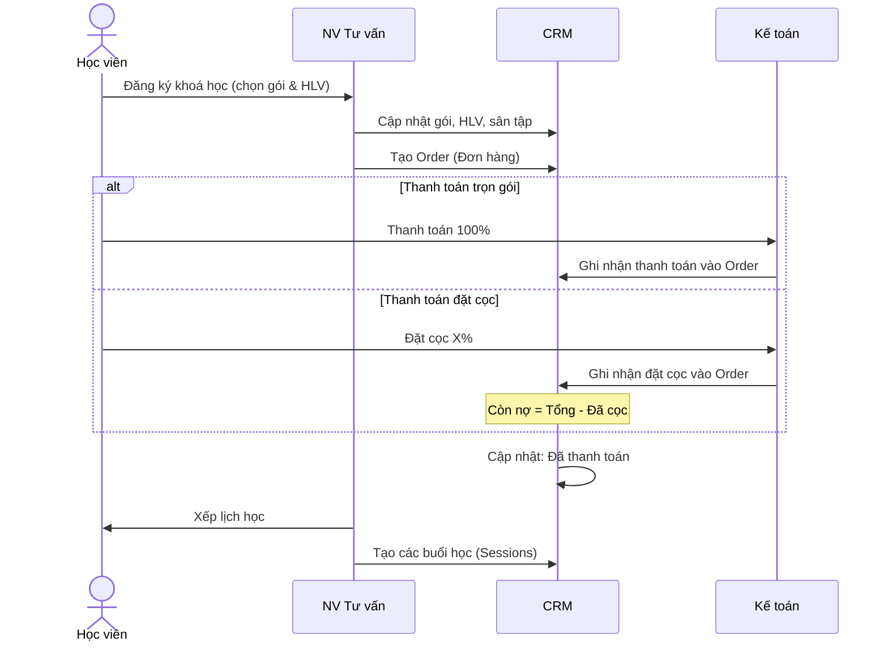
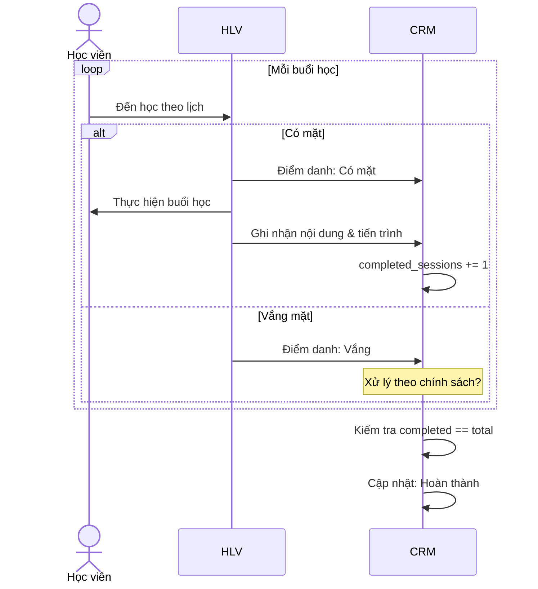
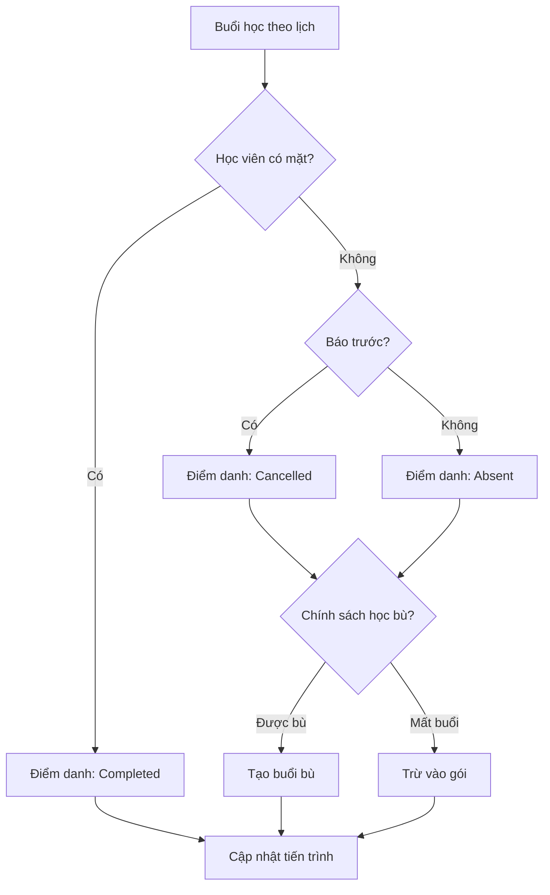
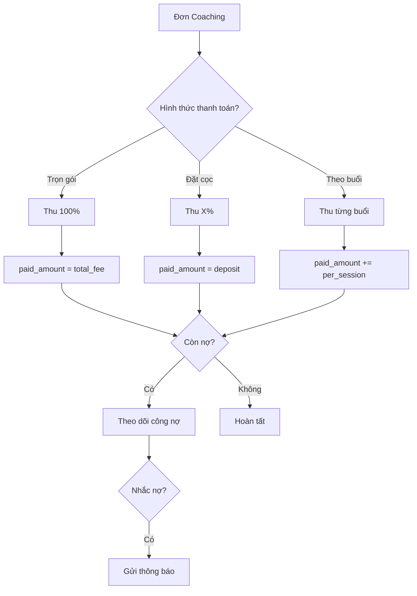
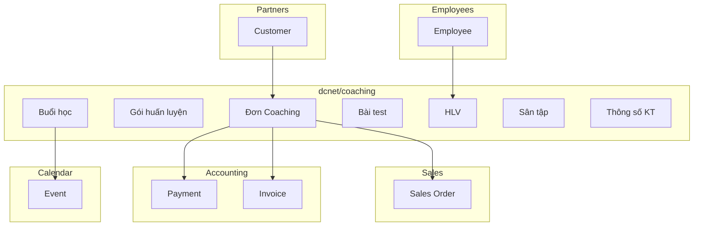
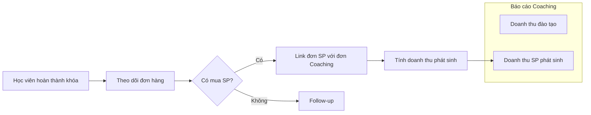

# Module Coaching - Workflow & Phân tích

> **Plugin:** `dcnet/coaching`
> **Ưu tiên:** Cao
> **Phụ thuộc:** `sales`, `partners`, `employees`, `products`

---

## 1. Tổng quan

### Định nghĩa
Đơn Coaching là dịch vụ huấn luyện golf cho học viên, bao gồm quản lý gói học, HLV, lịch học, và theo dõi tiến trình.

### Mục tiêu
- Quản lý hồ sơ học viên & bài test đầu vào
- Quản lý gói huấn luyện & HLV
- Lịch học & điểm danh
- Tracking doanh thu (học phí + SP phát sinh)
- Báo cáo theo HLV, khóa học

---

## 2. Workflow chính

### 2.1. Luồng tổng quan



### 2.2. Trạng thái đơn Coaching (State Machine)



#### ❓ CẦN XÁC NHẬN: Trạng thái đơn Coaching

| Trạng thái đề xuất | Mô tả | Xác nhận |
|-------------------|-------|----------|
| Mới | Vừa đăng ký, chưa test | ☐ |
| Đã test | Đã làm bài test đầu vào | ☐ |
| Đã tư vấn | Đã tư vấn gói, chờ đăng ký khoá học | ☐ |
| Đã thanh toán | Đã tạo đơn hàng & thanh toán, chờ xếp lịch | ☐ |
| Đang học | Đang trong khóa học | ☐ |
| Tạm dừng | Học viên tạm nghỉ | ☐ |
| Hoàn thành | Kết thúc khóa học | ☐ |
| Hủy | Đơn bị hủy | ☐ |

---

## 3. Entity Relationship

### 3.1. ERD

```mermaid
erDiagram
    COACHING_ORDER ||--|| CUSTOMER : belongs_to
    COACHING_ORDER ||--|| COACHING_PACKAGE : uses
    COACHING_ORDER ||--|| COACH : assigned_to
    COACHING_ORDER ||--|| GOLF_COURSE : at
    COACHING_ORDER ||--o| COACHING_TEST : has
    COACHING_ORDER ||--o| COACHING_SPECS : has
    COACHING_ORDER ||--o{ COACHING_SESSION : has
    COACHING_ORDER ||--o{ SALES_ORDER : generates
    COACHING_SESSION ||--o| COACH : taught_by

    COACH ||--|| EMPLOYEE : extends

    COACHING_ORDER {
        int id PK
        string code "Auto generate"
        int customer_id FK
        int package_id FK
        int coach_id FK
        int golf_course_id FK
        string status
        date start_date
        date end_date
        decimal total_fee "Tổng học phí"
        decimal discount "Ưu đãi"
        decimal paid_amount "Đã thanh toán"
        int total_sessions "Tổng số buổi"
        int completed_sessions "Đã học"
        text learning_goals "Mục tiêu học"
        timestamps
    }

    COACHING_PACKAGE {
        int id PK
        string name "VD: 8 buổi cơ bản"
        string type "❓ Cá nhân/Nhóm/Thi đấu?"
        int sessions_count "Số buổi"
        int duration_minutes "Thời lượng/buổi"
        decimal price
        text description
        bool is_active
        timestamps
    }

    COACH {
        int id PK
        int employee_id FK
        string certification "❓ Chứng chỉ"
        int experience_years "Kinh nghiệm"
        string specialty "Chuyên môn"
        decimal rating "Đánh giá"
        text bio
        timestamps
    }

    GOLF_COURSE {
        int id PK
        string name "Tên sân tập"
        string address
        int lanes_count "Số lane"
        string contact_phone
        bool is_partner "Đối tác hay của NM?"
        timestamps
    }

    COACHING_TEST {
        int id PK
        int coaching_order_id FK
        int coach_id FK "Người test"
        datetime test_date
        string skill_level "❓ Kết quả đánh giá"
        json test_results "❓ Chi tiết bài test"
        text notes
        text recommendations "Đề xuất gói"
        timestamps
    }

    COACHING_SESSION {
        int id PK
        int coaching_order_id FK
        int coach_id FK
        int session_number "Buổi thứ mấy"
        datetime scheduled_at
        datetime actual_start
        datetime actual_end
        string status "scheduled/completed/absent/cancelled"
        text lesson_content "Nội dung buổi học"
        text progress_notes "Ghi chú tiến trình"
        text homework "Bài tập về nhà"
        timestamps
    }

    COACHING_SPECS {
        int id PK
        int coaching_order_id FK
        decimal height_cm "Chiều cao"
        decimal weight_kg "Cân nặng"
        string glove_size "Size tay"
        string player_level "Cấp độ"
        decimal club_head_speed "Tốc độ đầu gậy"
        decimal ball_speed "Tốc độ bóng"
        string swing_shape "Hình swing"
        string ball_flight "Đường bóng"
        string ball_height "Đường cao bóng"
        decimal iron_distance "KC gậy sắt"
        decimal driver_distance "KC driver"
        text current_clubs "Gậy hiện tại"
        text customer_needs "Nhu cầu"
        text notes "Ghi chú từ PHỤ LỤC: tương tự Fitting"
        timestamps
    }
```

### 3.2. Chi tiết các Entity

#### COACHING_ORDER (Đơn Coaching)

> **Lưu ý:** Đơn Coaching tạo ra **Order (Sales Order)** để đồng bộ luồng thanh toán. Mỗi COACHING_ORDER có thể liên kết với một hoặc nhiều SALES_ORDER.

| Field | Type | Required | Ghi chú |
|-------|------|----------|---------|
| code | string | ✅ | Auto: COACH-YYYYMMDD-XXX |
| customer_id | FK | ✅ | Học viên |
| package_id | FK | ✅ | Gói huấn luyện |
| coach_id | FK | ✅ | HLV phụ trách |
| golf_course_id | FK | ✅ | Sân tập |
| status | enum | ✅ | Trạng thái |
| start_date | date | | Ngày bắt đầu |
| end_date | date | | Ngày kết thúc |
| total_fee | decimal | ✅ | Tổng học phí |
| discount | decimal | | Ưu đãi |
| paid_amount | decimal | | Đã thanh toán |
| total_sessions | int | ✅ | Tổng số buổi (từ gói) |
| completed_sessions | int | | Số buổi đã học |
| learning_goals | text | | Mục tiêu học |

#### COACHING_PACKAGE (Gói huấn luyện)

| Field | Type | Required | ❓ Cần xác nhận |
|-------|------|----------|----------------|
| name | string | ✅ | Danh sách gói có sẵn? |
| type | enum | ✅ | Cá nhân/Nhóm/Thi đấu? |
| sessions_count | int | ✅ | |
| duration_minutes | int | ✅ | 60/90/120 phút? |
| price | decimal | ✅ | Bảng giá? |
| description | text | | |

#### COACH (Huấn luyện viên)

| Field | Type | Required | ❓ Cần xác nhận |
|-------|------|----------|----------------|
| employee_id | FK | ✅ | Extend từ Employee |
| certification | string | | Có chứng chỉ gì? |
| experience_years | int | | |
| specialty | string | | Chuyên môn riêng? |
| rating | decimal | | Có rating không? |
| bio | text | | |

#### COACHING_TEST (Bài test đầu vào)

| Field | Type | Required | ❓ Cần xác nhận |
|-------|------|----------|----------------|
| coach_id | FK | ✅ | Ai thực hiện test? |
| test_date | datetime | ✅ | |
| skill_level | enum | ✅ | Kết quả đánh giá - các level? |
| test_results | json | ❓ | Nội dung bài test là gì? |
| notes | text | | |
| recommendations | text | | Đề xuất gói |

#### COACHING_SESSION (Buổi học)

| Field | Type | Required | Ghi chú |
|-------|------|----------|---------|
| session_number | int | ✅ | Buổi thứ mấy |
| scheduled_at | datetime | ✅ | Lịch học |
| actual_start | datetime | | Giờ bắt đầu thực tế |
| actual_end | datetime | | Giờ kết thúc thực tế |
| status | enum | ✅ | scheduled/completed/absent/cancelled |
| lesson_content | text | | Nội dung đã dạy |
| progress_notes | text | | Tiến trình học viên |
| homework | text | | Bài tập về nhà |

#### GOLF_COURSE (Sân tập)

| Field | Type | Required | ❓ Cần xác nhận |
|-------|------|----------|----------------|
| name | string | ✅ | Danh sách sân? |
| address | string | ✅ | |
| lanes_count | int | | Có cần quản lý lane? |
| is_partner | bool | ✅ | Đối tác hay của NM? |

#### COACHING_SPECS (Thông số kỹ thuật học viên)

> **Lưu ý từ PHỤ LỤC:** "Thông tin kỹ thuật: tương tự Fitting"

| Field | Type | Required | Ghi chú |
|-------|------|----------|---------|
| height_cm | decimal | ✅ | Chiều cao |
| weight_kg | decimal | ✅ | Cân nặng |
| glove_size | string/enum | ✅ | Kích thước size tay |
| player_level | enum | ✅ | Cấp độ (người mới, đã chơi) |
| club_head_speed | decimal | | Tốc độ đầu gậy |
| ball_speed | decimal | | Tốc độ bóng |
| swing_shape | ??? | | Hình swing |
| ball_flight | enum | | Đường bóng |
| ball_height | enum | | Đường cao bóng |
| iron_distance | decimal | | Khoảng cách gậy sắt |
| driver_distance | decimal | | Khoảng cách driver |
| current_clubs | text | | Tình trạng bộ gậy |
| customer_needs | text | | Nhu cầu riêng |

> **Lưu ý thiết kế:** Có thể tái sử dụng/share với FITTING_SPECS nếu khách đã fitting trước đó. Cần xác nhận với khách hàng.

---

## 4. Quy trình chi tiết

### 4.1. Đăng ký & Test đầu vào



### 4.2. Đăng ký khóa học



### 4.3. Quá trình học



### 4.4. Điểm danh & Xử lý vắng



#### ❓ CẦN XÁC NHẬN: Chính sách điểm danh

| Tình huống | Xử lý | Xác nhận |
|------------|-------|----------|
| Vắng có báo trước | ☐ Được học bù ☐ Mất buổi | ☐ |
| Vắng không báo trước | ☐ Được học bù ☐ Mất buổi | ☐ |
| HLV bận | ☐ Đổi HLV ☐ Đổi lịch | ☐ |
| Báo trước bao lâu? | ___ giờ/ngày | ☐ |

---

## 5. Thanh toán & Tạo đơn hàng

> **Lưu ý quan trọng:** Khi học viên đăng ký khoá học và thanh toán, hệ thống sẽ **tạo Order (Đơn hàng)** để đồng bộ luồng thanh toán.

### 5.1. Flow thanh toán



#### ❓ CẦN XÁC NHẬN: Chính sách thanh toán

| Câu hỏi | Lựa chọn | Xác nhận |
|---------|----------|----------|
| Có hình thức đặt cọc? | ☐ Có (___%) ☐ Không | ☐ |
| Có thanh toán theo buổi? | ☐ Có ☐ Không | ☐ |
| Hoàn tiền khi nghỉ giữa chừng? | ☐ Có (___%) ☐ Không | ☐ |

---

## 6. Tích hợp

### 6.1. Với các module khác



### 6.2. Tracking doanh thu phát sinh



#### ❓ CẦN XÁC NHẬN: Doanh thu phát sinh

| Câu hỏi | Trả lời |
|---------|---------|
| Thời gian tracking sau coaching? | ☐ 30 ngày ☐ 60 ngày ☐ 90 ngày ☐ Khác: ___ |
| Cách link đơn SP với Coaching? | ☐ Tự động (cùng KH) ☐ Manual tag |

---

## 7. UI/UX đề xuất

### 7.1. Danh sách đơn Coaching

| Cột | Hiển thị | Filter |
|-----|----------|--------|
| Mã đơn | ✅ | Search |
| Học viên | ✅ | Search |
| SĐT | ✅ | |
| Gói | ✅ | Multi-select |
| HLV | ✅ | Multi-select |
| Sân tập | ✅ | Multi-select |
| Tiến trình | ✅ | 5/8 buổi |
| Trạng thái | ✅ | Multi-select |
| Còn nợ | ✅ | Range |
| Ngày bắt đầu | ✅ | Date range |

### 7.2. Form tạo/sửa đơn Coaching

**Tab 1: Thông tin học viên**
- Học viên (lookup/create)
- Trình độ hiện tại
- Mục tiêu học

**Tab 2: Bài test đầu vào**
- Ngày test
- HLV test
- Kết quả đánh giá
- Đề xuất gói

**Tab 3: Thông số kỹ thuật** *(Mới - từ PHỤ LỤC)*
- Chiều cao, cân nặng
- Size tay, cấp độ
- Tốc độ đầu gậy, tốc độ bóng
- Hình swing, đường bóng, đường cao bóng
- Khoảng cách gậy sắt/driver
- Tình trạng bộ gậy, nhu cầu
- *Nếu đã có Fitting → Auto fill từ FITTING_SPECS*

**Tab 4: Đăng ký khoá học**
- Chọn khoá có sẵn từ trung tâm
- Gói huấn luyện
- HLV phụ trách
- Sân tập
- Học phí & ưu đãi
- **Tạo Order (Đơn hàng)** khi thanh toán

**Tab 5: Lịch học**
- Calendar view
- Danh sách buổi học
- Điểm danh

**Tab 6: Tiến trình**
- Timeline tiến trình
- Ghi chú từng buổi
- Đánh giá cuối khóa

**Tab 7: Thanh toán**
- Tổng học phí
- Đã thanh toán
- Còn nợ
- Lịch sử thanh toán

### 7.3. Lịch HLV

```
┌─────────────────────────────────────────────────────────────┐
│  HLV: Nguyễn Văn A                    << Tháng 12/2025 >>  │
├─────────────────────────────────────────────────────────────┤
│  T2    │  T3    │  T4    │  T5    │  T6    │  T7    │  CN  │
├────────┼────────┼────────┼────────┼────────┼────────┼──────┤
│ 08:00  │        │ 08:00  │        │ 08:00  │ 08:00  │      │
│ Trần A │        │ Trần A │        │ Trần A │ Lê B   │      │
│ 2/8    │        │ 3/8    │        │ 4/8    │ 1/12   │      │
├────────┼────────┼────────┼────────┼────────┼────────┼──────┤
│ 10:00  │ 10:00  │ 10:00  │ 10:00  │ 10:00  │ 10:00  │      │
│ Lê B   │ Nguyễn │ Lê B   │ Phạm D │ Lê B   │ Trần A │      │
│ 2/12   │ C 5/8  │ 3/12   │ 1/8    │ 4/12   │ 5/8    │      │
└────────┴────────┴────────┴────────┴────────┴────────┴──────┘

[■] Đã hoàn thành  [□] Chưa học  [X] Vắng
```

### 7.4. Dashboard HLV

```
┌──────────────────┬──────────────────┬──────────────────┐
│  Học viên        │  Buổi dạy        │  Doanh thu       │
│  đang dạy        │  tháng này       │  tháng           │
│                  │                  │                  │
│     12           │     45           │   67,500,000     │
└──────────────────┴──────────────────┴──────────────────┘

┌─────────────────────────────────────────────────────────┐
│  Lịch dạy hôm nay                                       │
├─────────────────────────────────────────────────────────┤
│  08:00 - 09:30  │  Trần Văn A  │  Sân ABC  │  Buổi 3/8 │
│  10:00 - 11:30  │  Lê Thị B    │  Sân XYZ  │  Buổi 5/12│
│  14:00 - 15:30  │  Nguyễn C    │  Sân ABC  │  Buổi 1/8 │
└─────────────────────────────────────────────────────────┘
```

---

## 8. Báo cáo

### Yêu cầu từ PHỤ LỤC

| # | Báo cáo | Metrics | Ghi chú |
|---|---------|---------|---------|
| 1 | Doanh thu từ coaching | Học phí thu được | Theo thời gian |
| 2 | Doanh thu SP phát sinh | Đơn hàng từ học viên | Sau khi hoàn thành khóa |
| 3 | Số lượng học viên | Đang học, hoàn thành | |
| 4 | Doanh số theo HLV | Từng HLV | |

### Dashboard Widgets

```
┌──────────────────┬──────────────────┬──────────────────┐
│  Học viên        │  Doanh thu       │  Doanh thu SP    │
│  đang học        │  đào tạo         │  phát sinh       │
│                  │                  │                  │
│     28           │   210,000,000    │   85,000,000     │
│  ▲ +5            │   ▲ +15%         │   ▲ +22%         │
└──────────────────┴──────────────────┴──────────────────┘

┌─────────────────────────────────────────────────────────┐
│  Top HLV tháng này                                      │
├─────────────────────────────────────────────────────────┤
│  1. Nguyễn Văn A    8 HV    85,000,000    ⭐ 4.8        │
│  2. Trần Văn B      6 HV    62,000,000    ⭐ 4.7        │
│  3. Lê Thị C        5 HV    48,000,000    ⭐ 4.9        │
└─────────────────────────────────────────────────────────┘
```

---

## 9. So sánh Fitting vs Coaching

| Tiêu chí | Fitting | Coaching |
|----------|---------|----------|
| **Thời gian** | 1 buổi | Nhiều buổi (khóa học) |
| **Người thực hiện** | NV Fitting | HLV |
| **Output** | Thông số kỹ thuật | Kỹ năng chơi golf |
| **Revenue** | Phí fitting + SP | Học phí + SP phát sinh |
| **Entities** | 3 | 7 *(+COACHING_SPECS)* |
| **Calendar** | Simple (1 event) | Complex (recurring) |
| **Tracking** | 1 lần | Nhiều buổi + tiến trình |
| **Thông số KT** | ✅ FITTING_SPECS | ✅ COACHING_SPECS *(tương tự)* |

---

## 10. Checklist triển khai

### Phase 1: Core Entities (Tuần 1-2)
- [ ] Migration: coaching_packages, coaches, golf_courses
- [ ] CRUD cho Package, Coach, Golf Course
- [ ] Migration: coaching_orders
- [ ] CRUD cho Coaching Order

### Phase 2: Test & Sessions (Tuần 2-3)
- [ ] Migration: coaching_tests, coaching_sessions
- [ ] Form bài test đầu vào
- [ ] Calendar integration cho Sessions
- [ ] Điểm danh

### Phase 3: Thanh toán (Tuần 3)
- [ ] Tích hợp Payments
- [ ] Công nợ tracking
- [ ] Invoice generation

### Phase 4: Báo cáo (Tuần 4)
- [ ] Dashboard widgets
- [ ] Báo cáo HLV
- [ ] Báo cáo doanh thu
- [ ] Tracking SP phát sinh

---

## 11. Câu hỏi chưa giải quyết

> Xem chi tiết: [FITTING_COACHING_QUESTIONS.md](../../kickoff/questions/FITTING_COACHING_QUESTIONS.md#b-module-coaching-đơn-coaching)

| # | Câu hỏi | Ảnh hưởng đến | Trạng thái |
|---|---------|---------------|------------|
| 1 | Bài test đầu vào gồm những gì? | COACHING_TEST | ⏳ Chờ HLV confirm |
| 2 | Danh sách gói huấn luyện? | COACHING_PACKAGE | ⏳ Chờ |
| 3 | HLV có thông tin đặc biệt? | COACH entity | ⏳ Chờ |
| 4 | Danh sách sân tập? | GOLF_COURSE | ⏳ Chờ |
| 5 | Chính sách điểm danh? | Workflow | ⏳ Chờ |
| 6 | Chính sách thanh toán/hoàn tiền? | Payment flow | ⏳ Chờ |
| 7 | Cách tính doanh thu phát sinh? | Report | ⏳ Chờ |
| 8 | **Thông số KT share với Fitting?** | COACHING_SPECS vs FITTING_SPECS | ⏳ Chờ |

---

*Cập nhật: 2025-12-09*
