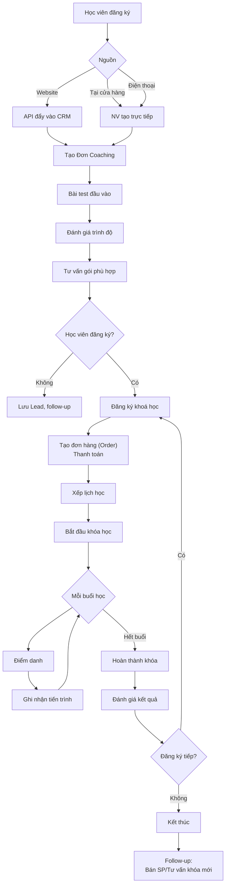
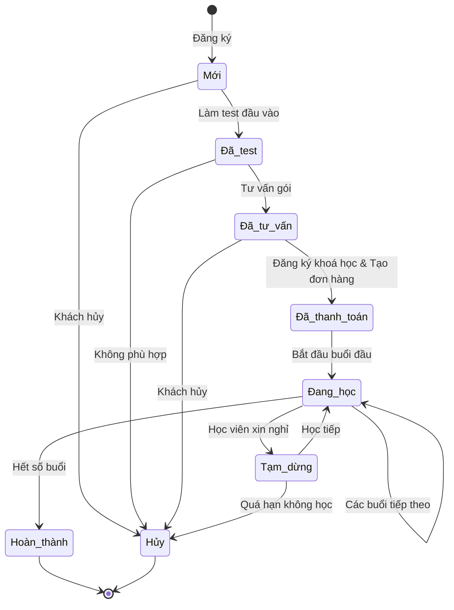
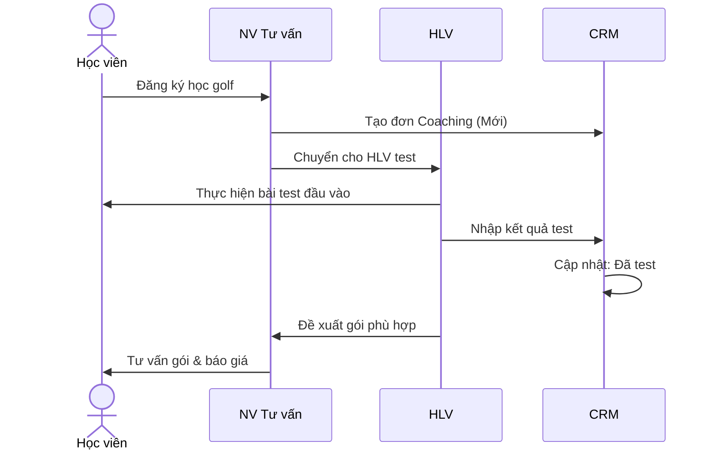
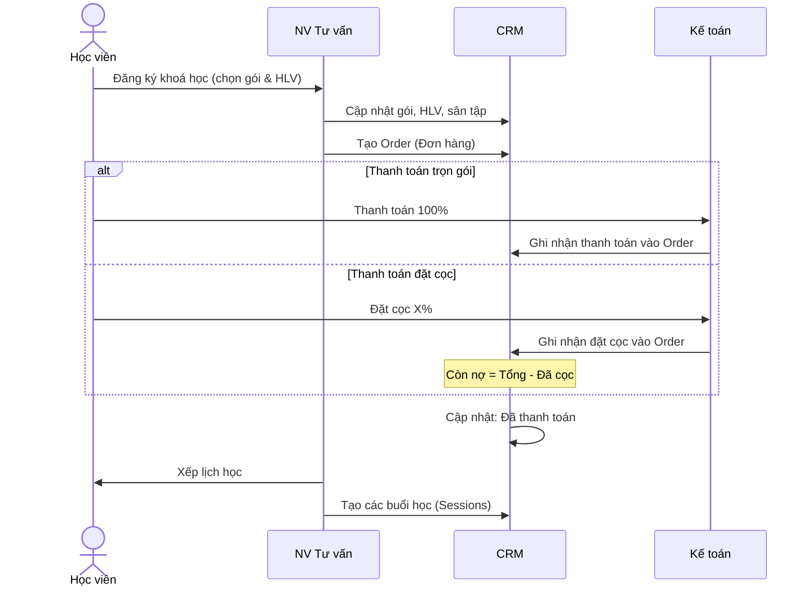
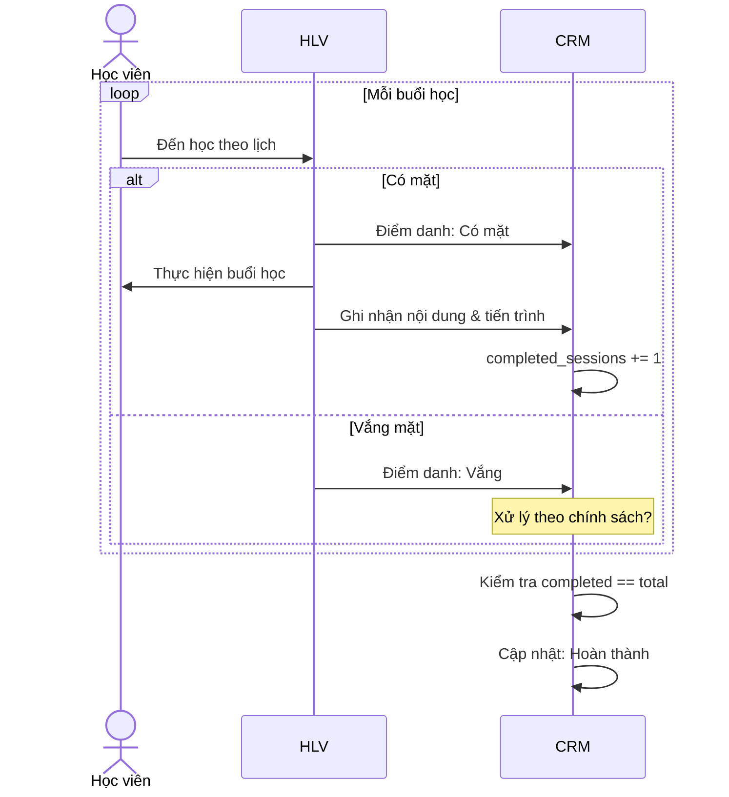
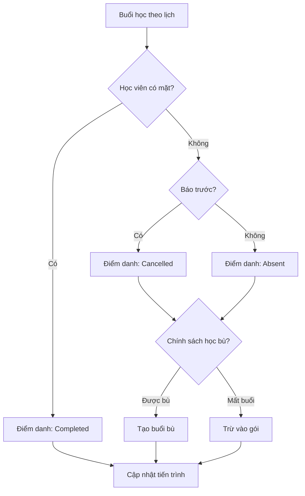
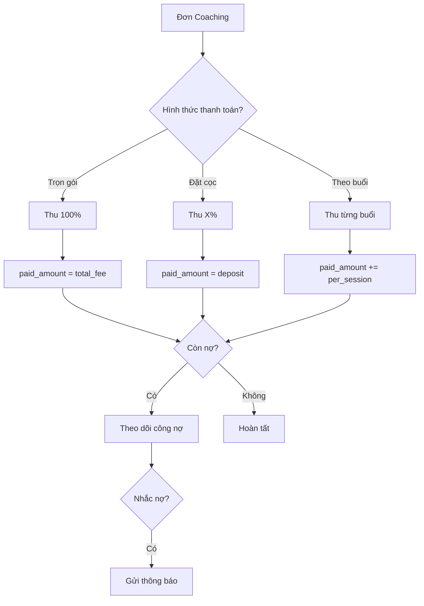
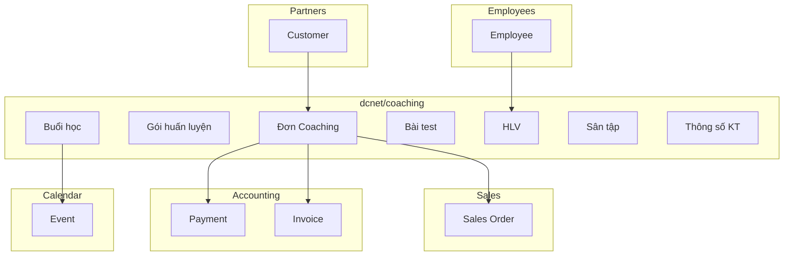
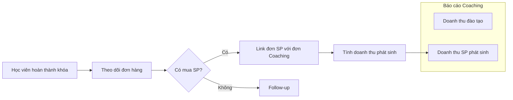

# Coaching Module - Tổng hợp Diagrams

> **Mục đích:** Tổng hợp tất cả Mermaid diagrams để dễ review
>
> **Preview online:** Paste vào https://mermaid.live hoặc VS Code extension "Mermaid Preview"

---

## 1. Workflow tổng quan



---

## 2. State Machine - Trạng thái đơn Coaching



---

## 3. ERD - Entity Relationship Diagram

```mermaid
erDiagram
    COACHING_ORDER ||--|| CUSTOMER : belongs_to
    COACHING_ORDER ||--|| COACHING_PACKAGE : uses
    COACHING_ORDER ||--|| COACH : assigned_to
    COACHING_ORDER ||--|| GOLF_COURSE : at
    COACHING_ORDER ||--o| COACHING_TEST : has
    COACHING_ORDER ||--o| COACHING_SPECS : has
    COACHING_ORDER ||--o{ COACHING_SESSION : has
    COACHING_ORDER ||--o{ SALES_ORDER : generates
    COACHING_SESSION ||--o| COACH : taught_by

    COACH ||--|| EMPLOYEE : extends

    COACHING_ORDER {
        int id PK
        string code "Auto: COACH-YYYYMMDD-XXX"
        int customer_id FK
        int package_id FK
        int coach_id FK
        int golf_course_id FK
        string status
        date start_date
        date end_date
        decimal total_fee "Tổng học phí"
        decimal discount "Ưu đãi"
        decimal paid_amount "Đã thanh toán"
        int total_sessions "Tổng số buổi"
        int completed_sessions "Đã học"
        text learning_goals "Mục tiêu học"
        timestamps
    }

    COACHING_PACKAGE {
        int id PK
        string name "VD: 8 buổi cơ bản"
        string type "Cá nhân/Nhóm/Thi đấu"
        int sessions_count "Số buổi"
        int duration_minutes "Thời lượng/buổi"
        decimal price
        text description
        bool is_active
        timestamps
    }

    COACH {
        int id PK
        int employee_id FK
        string certification "Chứng chỉ"
        int experience_years "Kinh nghiệm"
        string specialty "Chuyên môn"
        decimal rating "Đánh giá"
        text bio
        timestamps
    }

    GOLF_COURSE {
        int id PK
        string name "Tên sân tập"
        string address
        int lanes_count "Số lane"
        string contact_phone
        bool is_partner "Đối tác hay của NM"
        timestamps
    }

    COACHING_TEST {
        int id PK
        int coaching_order_id FK
        int coach_id FK "Người test"
        datetime test_date
        string skill_level "Kết quả đánh giá"
        json test_results "Chi tiết bài test"
        text notes
        text recommendations "Đề xuất gói"
        timestamps
    }

    COACHING_SESSION {
        int id PK
        int coaching_order_id FK
        int coach_id FK
        int session_number "Buổi thứ mấy"
        datetime scheduled_at
        datetime actual_start
        datetime actual_end
        string status "scheduled/completed/absent/cancelled"
        text lesson_content "Nội dung buổi học"
        text progress_notes "Ghi chú tiến trình"
        text homework "Bài tập về nhà"
        timestamps
    }

    COACHING_SPECS {
        int id PK
        int coaching_order_id FK
        decimal height_cm "Chiều cao"
        decimal weight_kg "Cân nặng"
        string glove_size "Size tay"
        string player_level "Cấp độ"
        decimal club_head_speed "Tốc độ đầu gậy"
        decimal ball_speed "Tốc độ bóng"
        string swing_shape "Hình swing"
        string ball_flight "Đường bóng"
        string ball_height "Đường cao bóng"
        decimal iron_distance "KC gậy sắt"
        decimal driver_distance "KC driver"
        text current_clubs "Gậy hiện tại"
        text customer_needs "Nhu cầu"
        text notes
        timestamps
    }
```

---

## 4. Sequence Diagram - Đăng ký & Test đầu vào



---

## 5. Sequence Diagram - Đăng ký khóa học



---

## 6. Sequence Diagram - Quá trình học



---

## 7. Flowchart - Điểm danh & Xử lý vắng



---

## 8. Flowchart - Thanh toán



---

## 9. Integration Diagram



---

## 10. Tracking doanh thu phát sinh



---

## Quick Preview Commands

```bash
# VS Code với extension "Markdown Preview Mermaid Support"
# Hoặc paste từng block vào https://mermaid.live

# Export SVG/PNG từ CLI (cần cài mermaid-cli)
npx @mermaid-js/mermaid-cli mmdc -i COACHING_DIAGRAMS.md -o coaching-diagrams.svg
```

---

*Cập nhật: 2025-12-09*
