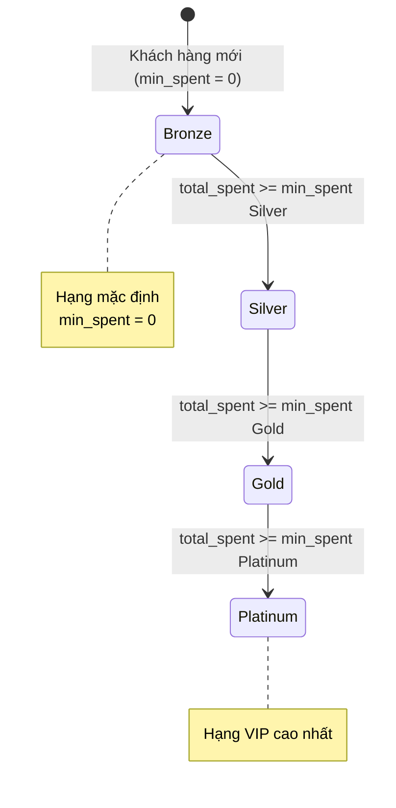
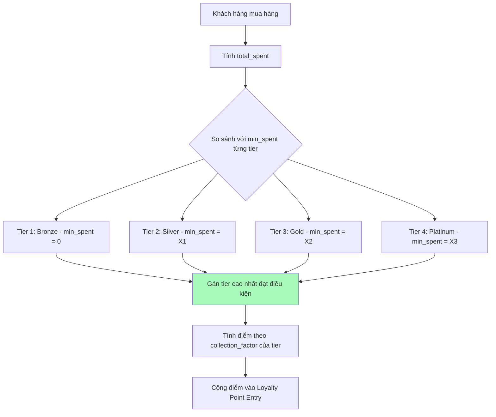

# Module Loyalty - Trạng thái (Status)

> **Phiên bản:** v1.0.0 - Dựa trên DCNET Core Loyalty Program
> **Ngày cập nhật:** 2026-01-13
> **Nền tảng:** DCNET Core (có sẵn)

---

## 1. Hạng thành viên (Membership Tiers)

### 1.1. Danh sách hạng (đề xuất)

| # | Hạng | Màu | Mô tả |
|---|------|-----|-------|
| 1 | **Bronze** | #CD7F32 | Hạng mặc định (min_spent = 0) |
| 2 | **Silver** | #C0C0C0 | Hạng tiêu chuẩn |
| 3 | **Gold** | #FFD700 | Hạng cao cấp |
| 4 | **Platinum** | #E5E4E2 | Hạng VIP cao nhất |

### 1.2. Cách hoạt động trong DCNET Core

- Hạng được xác định tự động dựa trên **Doanh số tối thiểu** (min_spent)
- Khi KH mua hàng, hệ thống tính tổng chi tiêu và gán hạng phù hợp
- Mỗi hạng có **Hệ số quy đổi điểm** riêng (bao nhiêu VNĐ = 1 điểm)

---

## 2. Workflow - Luồng xác định hạng

### 2.1. Sơ đồ tổng quan

### 2.2. Logic xác định hạng

---

## 3. Loại giao dịch điểm (Loyalty Point Entry)

### 3.1. Các loại giao dịch có sẵn

| # | Loại | Mô tả | Hướng điểm |
|---|------|-------|------------|
| 1 | **Tích điểm** | Từ Sales Invoice | + |
| 2 | **Tiêu điểm** | Dùng điểm giảm giá | - |

### 3.2. Fields trong Loyalty Point Entry

| Field | Mô tả |
|-------|-------|
| `loyalty_program` | Chương trình loyalty |
| `loyalty_program_tier` | Hạng tại thời điểm giao dịch |
| `customer` | Khách hàng |
| `invoice` | Link tới Sales Invoice |
| `loyalty_points` | Số điểm (+/-) |
| `purchase_amount` | Giá trị mua hàng |
| `expiry_date` | Ngày hết hạn điểm |
| `posting_date` | Ngày giao dịch |

---

## 4. Điều kiện xác định hạng

### 4.1. Cấu hình trong Loyalty Program Collection

| Tier | min_spent | collection_factor | Cần confirm |
|------|-----------|-------------------|-------------|
| Bronze | 0 | (X VNĐ = 1 điểm) | ☐ |
| Silver | (cần xác nhận) | (X VNĐ = 1 điểm) | ☐ |
| Gold | (cần xác nhận) | (X VNĐ = 1 điểm) | ☐ |
| Platinum | (cần xác nhận) | (X VNĐ = 1 điểm) | ☐ |

### 4.2. Ví dụ cấu hình

| Tier | min_spent | collection_factor | Ý nghĩa |
|------|-----------|-------------------|---------|
| Bronze | 0 | 10,000 | Mới đăng ký, 10K = 1 điểm |
| Silver | 20,000,000 | 8,000 | Chi 20M+, 8K = 1 điểm |
| Gold | 50,000,000 | 6,000 | Chi 50M+, 6K = 1 điểm |
| Platinum | 100,000,000 | 5,000 | Chi 100M+, 5K = 1 điểm |

---

## 5. Chức năng có sẵn trong DCNET Core

### 5.1. Loyalty Program

| Field | Mô tả | Có sẵn |
|-------|-------|--------|
| `loyalty_program_name` | Tên chương trình | ✅ |
| `loyalty_program_type` | Single/Multiple Tier | ✅ |
| `from_date` | Ngày bắt đầu | ✅ |
| `to_date` | Ngày kết thúc | ✅ |
| `auto_opt_in` | Tự động áp dụng cho tất cả KH | ✅ |
| `customer_group` | Lọc theo nhóm KH | ✅ |
| `customer_territory` | Lọc theo khu vực | ✅ |
| `conversion_factor` | 1 điểm = X VNĐ (redemption) | ✅ |
| `expiry_duration` | Số ngày điểm có hiệu lực | ✅ |
| `expense_account` | Tài khoản chi phí | ✅ |

### 5.2. Loyalty Program Collection (Tier)

| Field | Mô tả | Có sẵn |
|-------|-------|--------|
| `tier_name` | Tên hạng | ✅ |
| `min_spent` | Doanh số tối thiểu | ✅ |
| `collection_factor` | X VNĐ = 1 điểm | ✅ |

### 5.3. Loyalty Point Entry

| Field | Mô tả | Có sẵn |
|-------|-------|--------|
| `loyalty_program` | Link chương trình | ✅ |
| `loyalty_program_tier` | Hạng khi giao dịch | ✅ |
| `customer` | Khách hàng | ✅ |
| `invoice` | Link Invoice | ✅ |
| `loyalty_points` | Số điểm | ✅ |
| `purchase_amount` | Giá trị mua | ✅ |
| `expiry_date` | Ngày hết hạn | ✅ |
| `posting_date` | Ngày giao dịch | ✅ |

---

## 6. Tích hợp có sẵn

### 6.1. Customer

- Field `loyalty_program` để gán chương trình loyalty
- Hiển thị thông tin điểm hiện tại

### 6.2. Sales Invoice

- Tự động tích điểm khi submit
- Cho phép dùng điểm giảm giá
- Ghi nhận vào sổ kế toán

---

## 7. Câu hỏi cần xác nhận

| # | Câu hỏi | Ảnh hưởng |
|---|---------|-----------|
| 1 | min_spent cho từng hạng? | Điều kiện lên hạng |
| 2 | collection_factor cho từng hạng? | Tỷ lệ tích điểm |
| 3 | Có dùng điểm đổi giảm giá? | conversion_factor |
| 4 | Điểm có hết hạn? | expiry_duration |
| 5 | Tự động áp dụng cho tất cả KH? | auto_opt_in |

---

## 8. References

- [LOYALTY_SPEC.md](./LOYALTY_SPEC.md) - Đặc tả chức năng
- [LOYALTY_WORKFLOW.md](./LOYALTY_WORKFLOW.md) - Workflow tổng thể
- [FEATURE_SPECIFICATION.md](../../feature/FEATURE_SPECIFICATION.md) - Section 4.6

---

**Nguồn:** FEATURE_SPECIFICATION.md Section 4.6
**Nền tảng:** DCNET Core Loyalty Program
**Cập nhật:** 2026-01-13
