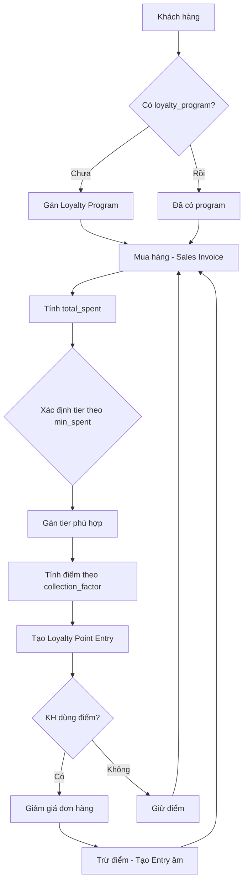
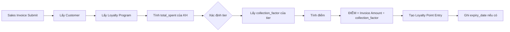
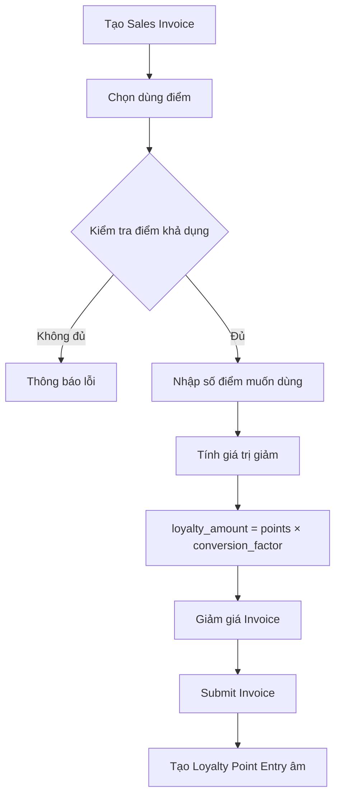
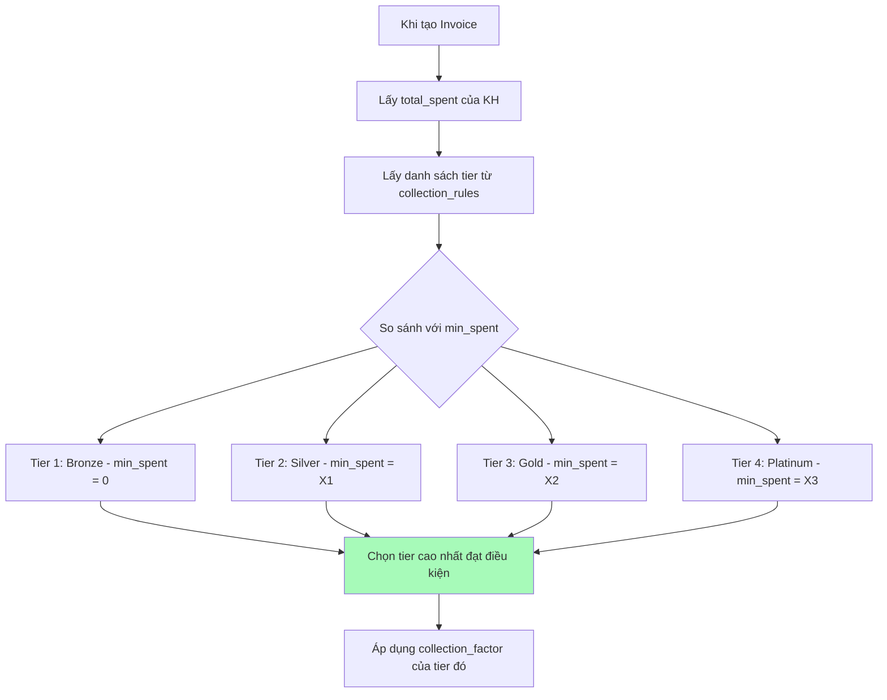
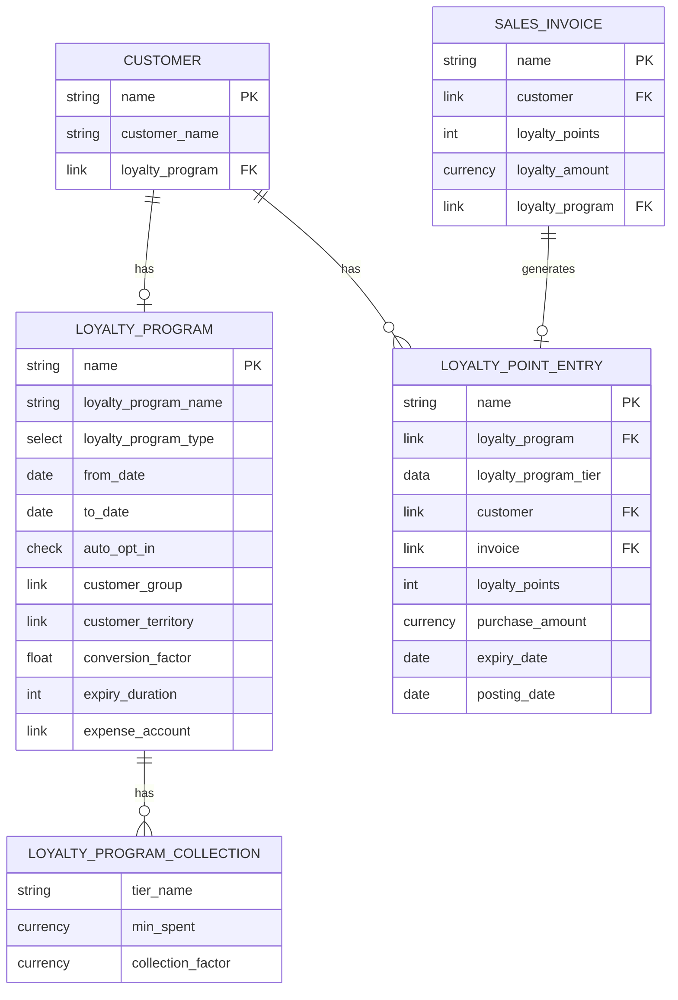
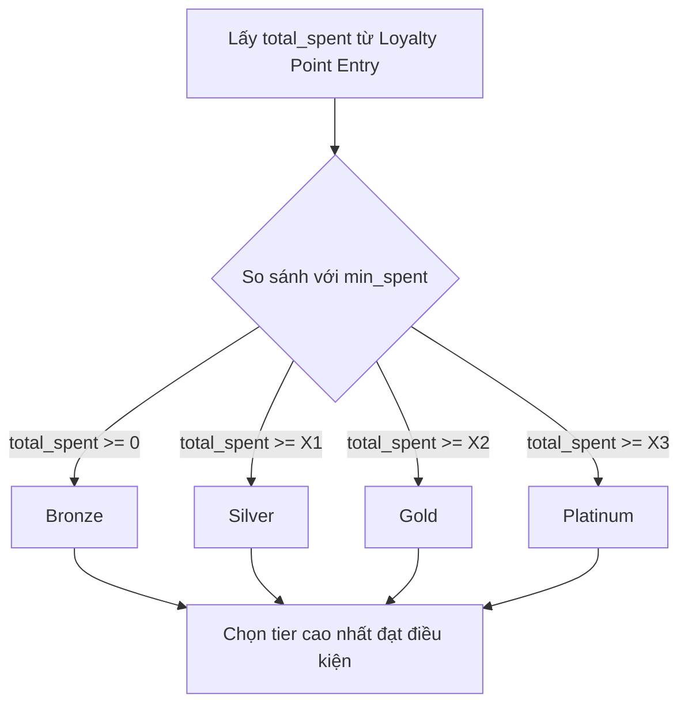
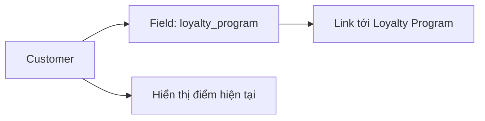
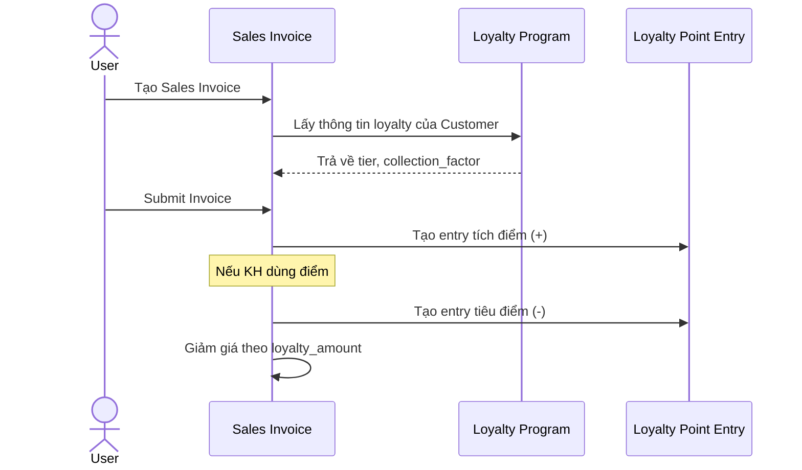

# Module Khách hàng Thân thiết (Loyalty) - Workflow

> **Nguồn:** `/docs/feature/FEATURE_SPECIFICATION.md` Section 4.6
> **Phiên bản:** v1.0.0 | **Nền tảng:** DCNET Core Loyalty Program (có sẵn)

---

## 1. Tổng quan

### Định nghĩa

Module Loyalty là chương trình tích điểm và quản lý khách hàng thân thiết, nhằm giữ chân và gia tăng giá trị lifetime của khách hàng.

### Yêu cầu từ Spec (Section 4.6)

| # | Chức năng | Status |
|---|-----------|--------|
| 1 | Quy tắc tính điểm | ✅ Có sẵn |
| 2 | Quy tắc lên hạng | ✅ Có sẵn |

### Chức năng có sẵn trong DCNET Core

| # | Chức năng | DocType |
|---|-----------|---------|
| 1 | Cấu hình chương trình Loyalty | Loyalty Program |
| 2 | Quy tắc tích điểm theo hạng | Loyalty Program Collection |
| 3 | Lịch sử giao dịch điểm | Loyalty Point Entry |
| 4 | Sử dụng điểm giảm giá | Sales Invoice |
| 5 | Điểm hết hạn | expiry_duration |
| 6 | Auto opt-in cho tất cả KH | auto_opt_in |

---

## 2. Workflow chính

### 2.1. Luồng tổng quan



### 2.2. Quy trình tích điểm



### 2.3. Quy trình sử dụng điểm



### 2.4. Quy trình xác định hạng



---

## 3. Entity Relationship

### 3.1. ERD - DCNET Core



### 3.2. Chi tiết các Entity

#### LOYALTY_PROGRAM

| Field | Type | Mô tả |
|-------|------|-------|
| loyalty_program_name | Data | Tên chương trình |
| loyalty_program_type | Select | Single Tier / Multiple Tier |
| from_date | Date | Ngày bắt đầu |
| to_date | Date | Ngày kết thúc |
| auto_opt_in | Check | Tự động cho tất cả KH |
| customer_group | Link | Lọc theo nhóm KH |
| customer_territory | Link | Lọc theo khu vực |
| conversion_factor | Float | 1 điểm = X VNĐ |
| expiry_duration | Int | Số ngày hết hạn |
| expense_account | Link | Tài khoản chi phí |
| collection_rules | Table | Danh sách tier |

#### LOYALTY_PROGRAM_COLLECTION (Tier)

| Field | Type | Mô tả |
|-------|------|-------|
| tier_name | Data | Tên hạng (Bronze/Silver/Gold/Platinum) |
| min_spent | Currency | Doanh số tối thiểu để vào hạng |
| collection_factor | Currency | X VNĐ = 1 điểm |

#### LOYALTY_POINT_ENTRY

| Field | Type | Mô tả |
|-------|------|-------|
| loyalty_program | Link | Chương trình loyalty |
| loyalty_program_tier | Data | Hạng tại thời điểm giao dịch |
| customer | Link | Khách hàng |
| invoice_type | Link | Loại chứng từ |
| invoice | Dynamic Link | Link tới Invoice |
| loyalty_points | Int | Số điểm (+/-) |
| purchase_amount | Currency | Giá trị mua hàng |
| expiry_date | Date | Ngày hết hạn điểm |
| posting_date | Date | Ngày giao dịch |

---

## 4. Công thức tính điểm

### 4.1. Công thức

```
ĐIỂM = GIÁ TRỊ INVOICE ÷ COLLECTION_FACTOR
```

### 4.2. Ví dụ

| Tier | collection_factor | Invoice 10,000,000 VNĐ | Điểm |
|------|-------------------|------------------------|------|
| Bronze | 10,000 | 10,000,000 ÷ 10,000 | 1,000 |
| Silver | 8,000 | 10,000,000 ÷ 8,000 | 1,250 |
| Gold | 6,000 | 10,000,000 ÷ 6,000 | 1,667 |
| Platinum | 5,000 | 10,000,000 ÷ 5,000 | 2,000 |

### 4.3. Cần xác nhận với khách hàng

| Tham số | Câu hỏi | Xác nhận |
|---------|---------|----------|
| collection_factor Bronze | Bao nhiêu VNĐ = 1 điểm? | ☐ |
| collection_factor Silver | Bao nhiêu VNĐ = 1 điểm? | ☐ |
| collection_factor Gold | Bao nhiêu VNĐ = 1 điểm? | ☐ |
| collection_factor Platinum | Bao nhiêu VNĐ = 1 điểm? | ☐ |

---

## 5. Quy đổi điểm sang tiền

### 5.1. Công thức

```
SỐ TIỀN GIẢM = SỐ ĐIỂM × CONVERSION_FACTOR
```

### 5.2. Ví dụ

- conversion_factor = 1,000 (1 điểm = 1,000 VNĐ)
- KH có 500 điểm
- Giảm giá = 500 × 1,000 = **500,000 VNĐ**

### 5.3. Cần xác nhận với khách hàng

| Câu hỏi | Xác nhận |
|---------|----------|
| Có cho dùng điểm đổi giảm giá? | ☐ |
| 1 điểm = bao nhiêu VNĐ? | ☐ |

---

## 6. Điều kiện lên hạng

### 6.1. Cách hoạt động

Hệ thống xác định hạng dựa trên `total_spent` của khách hàng:



### 6.2. Ví dụ cấu hình

| Tier | min_spent |
|------|-----------|
| Bronze | 0 |
| Silver | 20,000,000 |
| Gold | 50,000,000 |
| Platinum | 100,000,000 |

**Ví dụ:**
- KH có total_spent = 55,000,000
- Đạt: Bronze (0), Silver (20M), Gold (50M)
- → Gán tier **Gold**

### 6.3. Cần xác nhận với khách hàng

| Tham số | Câu hỏi | Xác nhận |
|---------|---------|----------|
| min_spent Silver | Doanh số tối thiểu? | ☐ |
| min_spent Gold | Doanh số tối thiểu? | ☐ |
| min_spent Platinum | Doanh số tối thiểu? | ☐ |

---

## 7. Điểm hết hạn

### 7.1. Cách hoạt động

- Cấu hình `expiry_duration` trong Loyalty Program (số ngày)
- Khi tạo Loyalty Point Entry, hệ thống tính `expiry_date = posting_date + expiry_duration`
- Điểm hết hạn không còn khả dụng

### 7.2. Cần xác nhận với khách hàng

| Câu hỏi | Xác nhận |
|---------|----------|
| Điểm có hết hạn không? | ☐ |
| Nếu có, sau bao nhiêu ngày? | ☐ |

---

## 8. Tích hợp

### 8.1. Với Customer



### 8.2. Với Sales Invoice



---

## 9. Quyền & Bảo mật

### 9.1. Phân quyền có sẵn

| Role | Loyalty Program | Loyalty Point Entry |
|------|-----------------|---------------------|
| System Manager | Full access | Full access |
| Accounts Manager | Read | Read |
| Accounts User | Read | Read |
| Auditor | Read | Read |

---

## 10. Hướng dẫn cấu hình

### Bước 1: Tạo Loyalty Program

1. Vào **Selling > Settings > Loyalty Program**
2. Điền thông tin:
   - Loyalty Program Name: "Nhật Minh Golf Club"
   - Loyalty Program Type: "Multiple Tier Program"
   - From Date: Ngày bắt đầu
   - Auto Opt In: ✅ (nếu áp dụng cho tất cả)

### Bước 2: Cấu hình Collection Rules

Thêm các tier vào bảng:

| Tier Name | Minimum Total Spent | Collection Factor |
|-----------|---------------------|-------------------|
| Bronze | 0 | (cần confirm) |
| Silver | (cần confirm) | (cần confirm) |
| Gold | (cần confirm) | (cần confirm) |
| Platinum | (cần confirm) | (cần confirm) |

### Bước 3: Cấu hình Redemption (nếu có)

- Conversion Factor: 1 điểm = X VNĐ
- Expiry Duration: X ngày
- Expense Account: Chọn tài khoản chi phí

### Bước 4: Gán cho Customer

- Nếu `auto_opt_in` = ✅ → Tự động áp dụng
- Nếu không → Vào Customer > chọn Loyalty Program

---

## 11. Câu hỏi cần clarify với khách hàng

| # | Câu hỏi | Ảnh hưởng đến |
|---|---------|---------------|
| 1 | collection_factor cho từng hạng? | Tính điểm |
| 2 | min_spent cho từng hạng? | Lên hạng |
| 3 | Có cho dùng điểm đổi giảm giá? | Redemption |
| 4 | 1 điểm = bao nhiêu VNĐ? | conversion_factor |
| 5 | Điểm có hết hạn không? Sau bao lâu? | expiry_duration |
| 6 | Áp dụng tự động cho tất cả KH? | auto_opt_in |

---

**Nguồn:** `/docs/feature/FEATURE_SPECIFICATION.md` Section 4.6 - Quản lý Tích điểm
**Nền tảng:** DCNET Core Loyalty Program
**Cập nhật:** 2026-01-13
