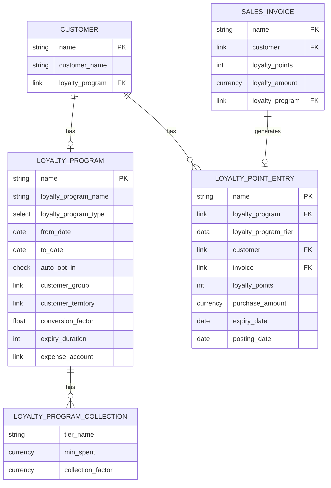
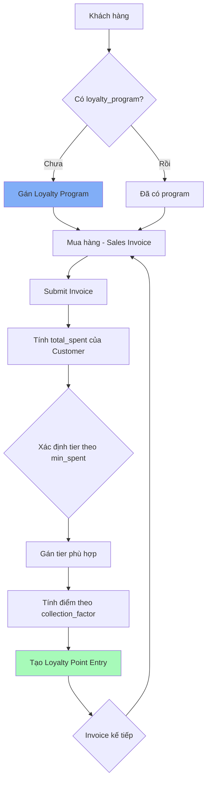
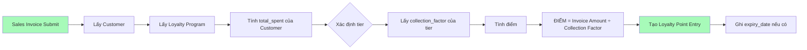
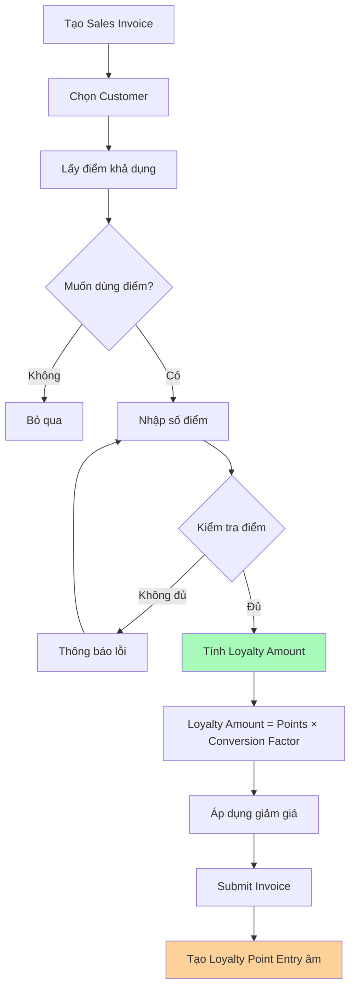
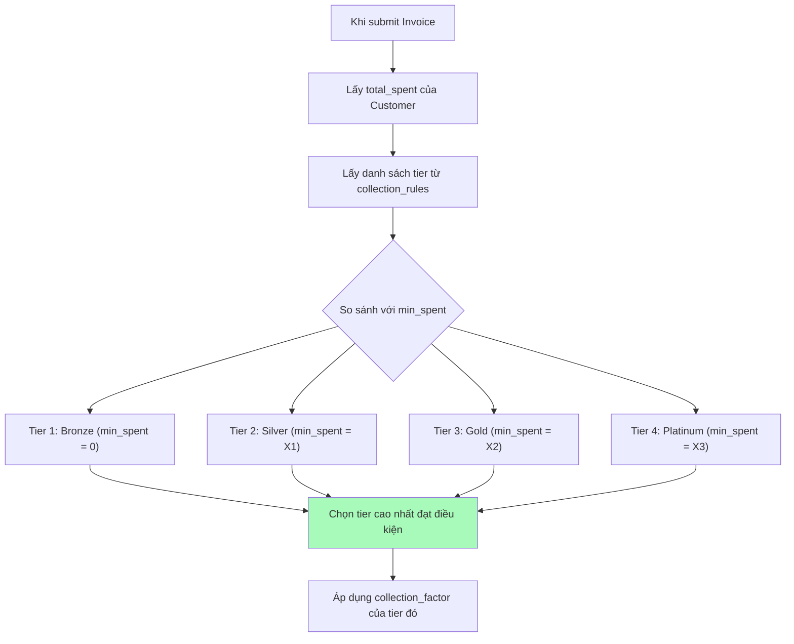
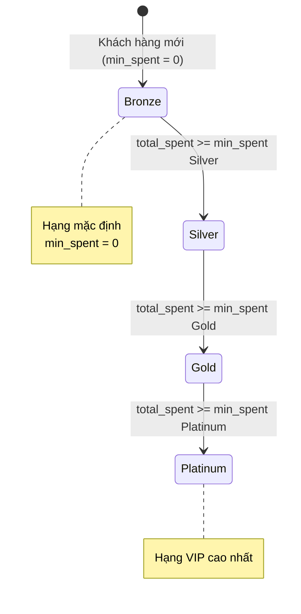
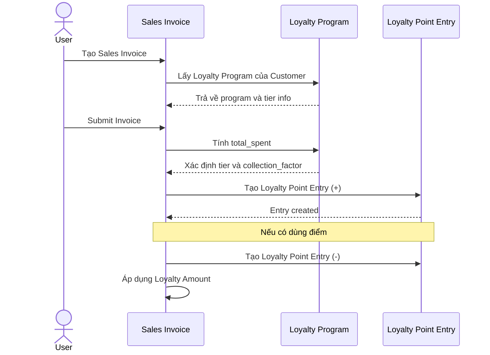
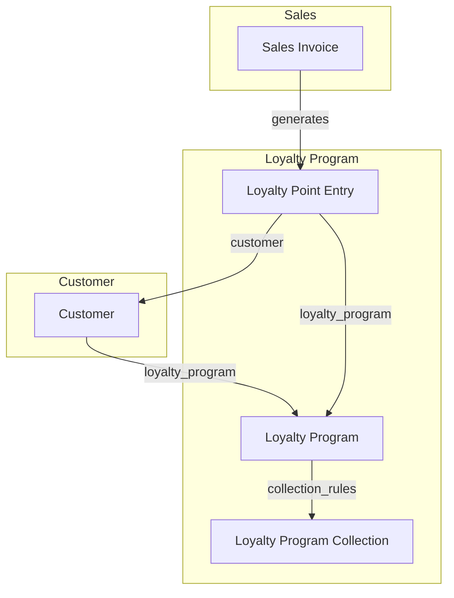
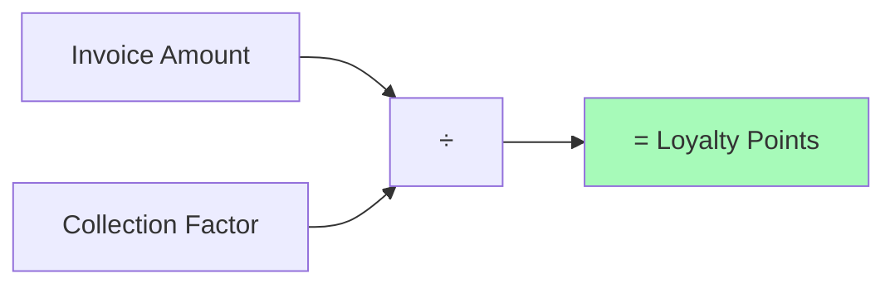
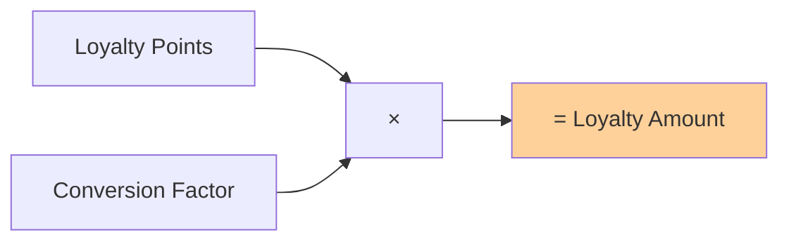

# Module Loyalty - Diagrams

> **Nguồn:** `/docs/feature/FEATURE_SPECIFICATION.md` Section 4.6 - Quản lý Tích điểm
> **Phiên bản:** 1.0.0
> **Nền tảng:** DCNET Core Loyalty Program (có sẵn)

---

## 1. ERD - Entity Relationship Diagram (DCNET Core)

---

## 2. Workflow tổng quan

---

## 3. Quy trình tích điểm

---

## 4. Quy trình sử dụng điểm

---

## 5. Quy trình xác định hạng

---

## 6. State Diagram - Hạng thành viên

---

## 7. Sequence Diagram - Tích hợp với Sales Invoice

---

## 8. Tích hợp với modules khác

---

## 9. Công thức tính điểm

**Giải thích:**
- **Collection Factor (Hệ số quy đổi điểm):** Số tiền cần chi để được 1 điểm
- VD: Collection Factor = 10,000 → Chi 10,000 VNĐ = 1 điểm

---

## 10. Công thức sử dụng điểm

**Giải thích:**
- **Conversion Factor (Tỷ lệ quy đổi):** Giá trị 1 điểm khi sử dụng
- VD: Conversion Factor = 1,000 → 1 điểm = 1,000 VNĐ giảm giá

---

**Nguồn:** `/docs/feature/FEATURE_SPECIFICATION.md` Section 4.6 - Quản lý Tích điểm
**Nền tảng:** DCNET Core Loyalty Program
**Ngày cập nhật:** 2026-01-13
