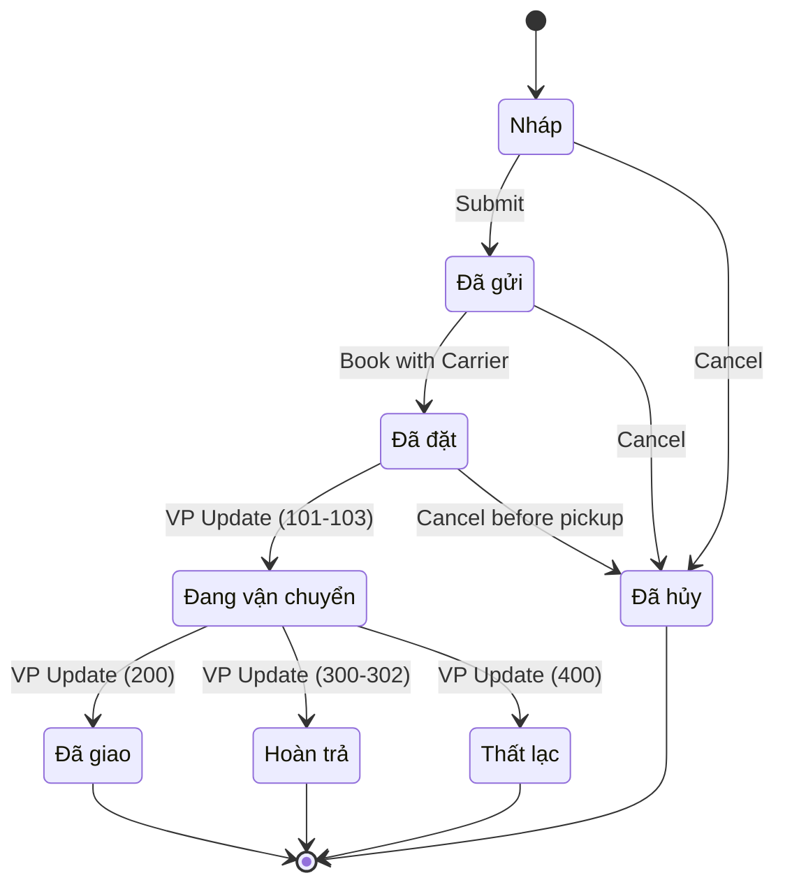
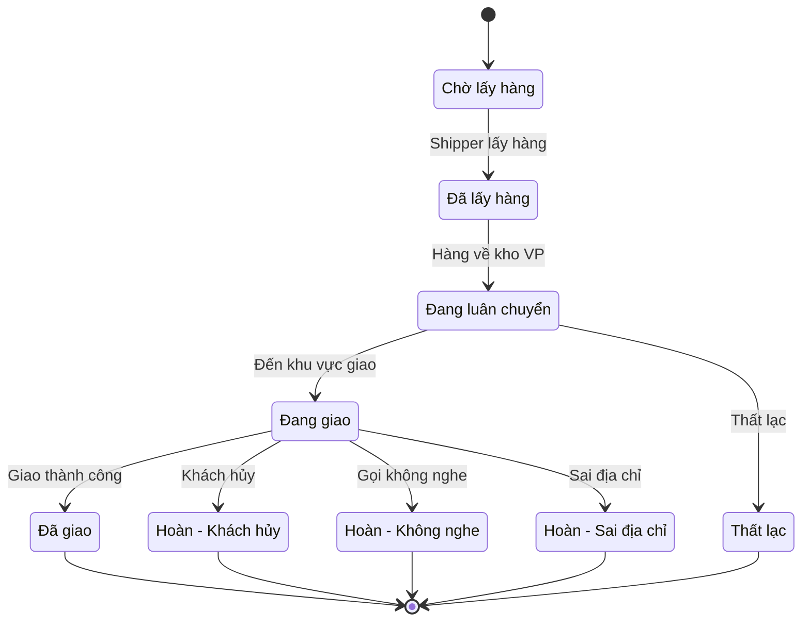

# Shipping Status Management

> **Module:** Shipping (Giao vận)
>
> **Nguồn:** FEATURE_SPECIFICATION.md Section 9 + ERPNext Shipment Analysis
>
> **Cập nhật:** 14/01/2026

---

## Mục lục

1. [Danh sách Trạng thái](#1-danh-sách-trạng-thái)
2. [Workflow Giao vận](#2-workflow-giao-vận)
3. [State Machine](#3-state-machine)
4. [Database Schema](#4-database-schema)
5. [Transition Matrix](#5-transition-matrix)
6. [Business Rules](#6-business-rules)
7. [Integration Points](#7-integration-points)

---

## 1. Danh sách Trạng thái

### 1.1. Trạng thái Shipment (ERPNext Core)

| Code | Label | Mô tả | Màu | Icon |
|------|-------|-------|-----|------|
| `draft` | Nháp | Vận đơn chưa submit | 🟤 Gray | 📝 |
| `submitted` | Đã gửi | Đã submit, chưa book với carrier | 🔵 Blue | 📨 |
| `booked` | Đã đặt | Đã tạo vận đơn với Viettel Post | 🟡 Orange | 📦 |
| `in_transit` | Đang vận chuyển | Hàng đang trên đường | 🟣 Purple | 🚚 |
| `delivered` | Đã giao | Giao hàng thành công | 🟢 Green | ✅ |
| `returned` | Hoàn trả | Khách từ chối nhận | 🟠 Orange | ↩️ |
| `lost` | Thất lạc | Hàng bị thất lạc | 🔴 Red | ❌ |
| `cancelled` | Đã hủy | Vận đơn bị hủy | ⚫ Black | 🚫 |

**Nguồn:** ERPNext Shipment DocType (dcnet_core/erpnext/stock/doctype/shipment/shipment.py Line 64)

### 1.2. Tracking Status (từ Viettel Post)

| Code | Label VN | Label EN | Mapping |
|------|----------|----------|---------|
| `100` | Chờ lấy hàng | Pending Pickup | `submitted` |
| `101` | Đã lấy hàng | Picked Up | `booked` |
| `102` | Đang luân chuyển | In Transit | `in_transit` |
| `103` | Đang giao hàng | Out for Delivery | `in_transit` |
| `200` | Giao thành công | Delivered | `delivered` |
| `300` | Hoàn - Khách hủy | Return - Customer Cancelled | `returned` |
| `301` | Hoàn - Gọi không nghe | Return - No Answer | `returned` |
| `302` | Hoàn - Sai địa chỉ | Return - Wrong Address | `returned` |
| `400` | Thất lạc | Lost | `lost` |

**Nguồn:** Viettel Post API Documentation (cần xác nhận)

---

## 2. Workflow Giao vận

### 2.1. Happy Path (Giao thành công)

```
Order → Delivery Note → Shipment → Viettel Post → Tracking → Delivered → Update Stock
```

**Mô tả chi tiết:**

1. **Tạo Shipment từ Delivery Note**
   - User chọn Delivery Note đã submit
   - Click "Create Shipment"
   - Fill pickup/delivery info
   - Submit Shipment → status = `submitted`

2. **Book với Viettel Post**
   - Click "Book with Carrier"
   - Call API Viettel Post tạo vận đơn
   - Nhận AWB number
   - Update status = `booked`

3. **Tracking Updates**
   - System poll Viettel Post API mỗi 30 phút
   - Update `tracking_status` và `tracking_status_info`
   - Gửi notification cho khách (nếu enabled)

4. **Hoàn thành**
   - Tracking status = `200` (Delivered)
   - Update Shipment status = `delivered`
   - Mark Delivery Note as delivered

**Nguồn:** ERPNext Shipment Flow + Custom Enhancement

### 2.2. Unhappy Path (Hoàn trả)

```
Delivered (Failed) → Returned → Stock Entry (Return) → Update Inventory
```

**Mô tả:**

1. **Viettel Post báo hoàn**
   - Tracking status = `300`/`301`/`302`
   - Update Shipment status = `returned`
   - Notification cho warehouse team

2. **Xử lý hàng hoàn** (Manual - Phase 1)
   - Warehouse nhận hàng về
   - Tạo Stock Entry (Material Receipt)
   - Link với Shipment
   - Update tồn kho

3. **Xử lý hàng hoàn** (Auto - Phase 2)
   - System tự động tạo Stock Entry
   - Auto update inventory
   - Notification cho Sales team

**Nguồn:** FEATURE_SPECIFICATION.md Section 9.2 (Line 817)

---

## 3. State Machine

### 3.1. Shipment State Diagram



**Nguồn:** ERPNext Shipment Analysis + Custom Logic

### 3.2. Tracking Status Flow



**Nguồn:** Viettel Post Tracking Flow

---

## 4. Database Schema

### 4.1. Core Tables (ERPNext)

**tabShipment**

| Field | Type | Description |
|-------|------|-------------|
| `name` | VARCHAR(140) | SHIPMENT-.##### |
| `status` | VARCHAR(50) | draft/submitted/booked/cancelled |
| `tracking_status` | VARCHAR(50) | In Progress/Delivered/Returned/Lost |
| `service_provider` | VARCHAR(255) | "Viettel Post" |
| `carrier` | VARCHAR(255) | Carrier name |
| `carrier_service` | VARCHAR(255) | Standard/Express |
| `awb_number` | VARCHAR(255) | Mã vận đơn |
| `tracking_url` | TEXT | Link tracking |
| `tracking_status_info` | VARCHAR(255) | Chi tiết status |
| `shipment_amount` | DECIMAL(18,6) | Phí vận chuyển |
| `value_of_goods` | DECIMAL(18,6) | Giá trị hàng hóa |
| `total_weight` | FLOAT | Tổng trọng lượng (kg) |
| `pickup_date` | DATE | Ngày lấy hàng |
| `pickup_from` | TIME | Giờ bắt đầu lấy hàng |
| `pickup_to` | TIME | Giờ kết thúc lấy hàng |
| `docstatus` | INT | 0=Draft, 1=Submitted, 2=Cancelled |

**Nguồn:** ERPNext Shipment DocType Schema

**tabShipment Delivery Note** (Child Table)

| Field | Type | Description |
|-------|------|-------------|
| `parent` | VARCHAR(140) | Shipment name |
| `delivery_note` | VARCHAR(140) | Link to Delivery Note |

**tabShipment Parcel** (Child Table)

| Field | Type | Description |
|-------|------|-------------|
| `parent` | VARCHAR(140) | Shipment name |
| `length` | FLOAT | Chiều dài (cm) |
| `width` | FLOAT | Chiều rộng (cm) |
| `height` | FLOAT | Chiều cao (cm) |
| `weight` | FLOAT | Trọng lượng (kg) |
| `count` | INT | Số kiện |

**Nguồn:** ERPNext Shipment Parcel DocType

### 4.2. Custom Fields (dcnet_shipping)

**Bổ sung vào tabShipment:**

| Field | Type | Description | Required |
|-------|------|-------------|----------|
| `viettel_order_id` | VARCHAR(100) | Order ID từ VP API | No |
| `viettel_tracking_code` | VARCHAR(50) | Tracking code VP | No |
| `cod_amount` | DECIMAL(18,6) | Tiền thu hộ | No |
| `cod_collected` | CHECK | Đã thu COD? | No |
| `cod_remitted` | CHECK | Đã chuyển COD? | No |
| `return_reason` | TEXT | Lý do hoàn | No |
| `last_sync_time` | DATETIME | Lần sync cuối | No |

**Nguồn:** Custom Enhancement Design

---

## 5. Transition Matrix

### 5.1. Allowed Transitions

| From | To | Trigger | Permission | Note |
|------|-----|---------|------------|------|
| `draft` | `submitted` | Submit button | Stock User | Manual |
| `draft` | `cancelled` | Cancel button | Stock User | Manual |
| `submitted` | `booked` | Book API | System/Stock User | Auto/Manual |
| `submitted` | `cancelled` | Cancel button | Stock Manager | Manual |
| `booked` | `in_transit` | VP Webhook | System | Auto |
| `booked` | `cancelled` | Cancel API | Stock Manager | Before pickup only |
| `in_transit` | `delivered` | VP Webhook | System | Auto |
| `in_transit` | `returned` | VP Webhook | System | Auto |
| `in_transit` | `lost` | VP Webhook | System | Auto |

**Nguồn:** Business Logic Design

### 5.2. Forbidden Transitions

| From | To | Reason |
|------|----|--------|
| `delivered` | Any | Final state |
| `returned` | Any | Final state |
| `lost` | Any | Final state |
| `cancelled` | Any | Final state |
| `in_transit` | `draft` | Cannot revert |
| `in_transit` | `submitted` | Cannot revert |

**Nguồn:** State Machine Rules

---

## 6. Business Rules

### 6.1. Status Update Rules

**Rule 1: Sync from Viettel Post**
```python
IF tracking_status_code IN [100, 101]:
    shipment.status = "booked"
ELIF tracking_status_code IN [102, 103]:
    shipment.status = "in_transit"
    shipment.tracking_status = "In Progress"
ELIF tracking_status_code == 200:
    shipment.status = "delivered"
    shipment.tracking_status = "Delivered"
ELIF tracking_status_code IN [300, 301, 302]:
    shipment.status = "returned"
    shipment.tracking_status = "Returned"
ELIF tracking_status_code == 400:
    shipment.status = "lost"
    shipment.tracking_status = "Lost"
```

**Nguồn:** Viettel Post API Mapping

**Rule 2: Stock Update on Return**
```python
IF shipment.status == "returned" AND shipment.auto_return_enabled:
    create_stock_entry(
        entry_type="Material Receipt",
        from_warehouse=shipment.source_warehouse,
        items=shipment.get_items_from_delivery_notes()
    )
```

**Nguồn:** FEATURE_SPECIFICATION.md Section 9.2 (Line 817)

### 6.2. Validation Rules

**Before Submit:**
- ✅ Shipment phải có ít nhất 1 Delivery Note
- ✅ Shipment phải có ít nhất 1 Parcel
- ✅ Total weight > 0
- ✅ Value of goods > 0
- ✅ Pickup address phải valid
- ✅ Delivery address phải valid

**Before Book:**
- ✅ Status = `submitted`
- ✅ Service provider = "Viettel Post"
- ✅ Pickup date >= today
- ✅ API credentials configured

**Nguồn:** ERPNext Shipment Validation + Custom Rules

### 6.3. Permission Rules

| Action | Role Required | Condition |
|--------|---------------|-----------|
| Create | Stock User | - |
| Submit | Stock User | docstatus=0 |
| Cancel | Stock Manager | docstatus=1 AND status IN (draft, submitted) |
| Book with Carrier | Stock User | status=submitted |
| Update Tracking | System | Any |
| View | Stock User, Sales User | - |

**Nguồn:** ERPNext Permission Framework

---

## 7. Integration Points

### 7.1. Upstream (Nhận data từ)

**Sales Order → Delivery Note:**
- Trigger: User tạo Delivery Note từ SO
- Data: Items, Customer, Address

**Delivery Note → Shipment:**
- Trigger: User click "Create Shipment"
- Data:
  - `shipment_delivery_note` (child table)
  - Customer address → Delivery address
  - Items → Parcels (weight calculation)

**Nguồn:** ERPNext Standard Flow

### 7.2. Downstream (Gửi data đến)

**Shipment → Viettel Post API:**
- Trigger: User click "Book with Carrier"
- Endpoint: `POST /api/v1/order/create`
- Payload:
  ```json
  {
    "ORDER_NUMBER": "SO-00123",
    "SENDER_FULLNAME": "...",
    "SENDER_ADDRESS": "...",
    "RECEIVER_FULLNAME": "...",
    "RECEIVER_ADDRESS": "...",
    "PRODUCT_WEIGHT": 1500,
    "PRODUCT_PRICE": 500000,
    "MONEY_COLLECTION": 500000
  }
  ```
- Response: `ORDER_ID`, `AWB_NUMBER`

**Viettel Post → Shipment (Webhook):**
- Trigger: VP tracking update
- Endpoint: `POST /api/method/dcnet_shipping.webhook.viettel_post`
- Payload:
  ```json
  {
    "ORDER_ID": "VP123456",
    "STATUS_CODE": "200",
    "STATUS_NAME": "Giao hàng thành công",
    "UPDATE_TIME": "2026-01-14 15:30:00"
  }
  ```

**Nguồn:** API Integration Design

### 7.3. Lateral (Tương tác song song)

**Shipment ↔ Stock Entry:**
- Khi status = `returned`
- Tạo Stock Entry type = "Material Receipt"
- Link qua `custom_shipment` field

**Shipment ↔ Accounting:**
- Shipping amount → Sales Invoice (nếu KH trả)
- Shipping amount → Purchase Invoice (nếu Shop trả)

**Nguồn:** Business Logic Design

---

## 8. Timeline & Checkpoints

### 8.1. Phase 1 - MVP (15 ngày)

**Week 1: Core Integration (5 ngày)**
- [ ] Day 1-2: Viettel Post API research & setup
- [ ] Day 3-4: Create Shipment from Delivery Note
- [ ] Day 5: Book API integration

**Week 2: Tracking & Sync (5 ngày)**
- [ ] Day 6-7: Tracking status polling (cron job)
- [ ] Day 8-9: Status mapping & update logic
- [ ] Day 10: Webhook receiver (optional)

**Week 3: Business Logic (5 ngày)**
- [ ] Day 11-12: Shipping Rule configuration
- [ ] Day 13: COD fields (if needed)
- [ ] Day 14: Testing
- [ ] Day 15: Bug fix & deployment

**Nguồn:** Development Planning

### 8.2. Phase 2 - Enhancements (10 ngày)

- Day 16-18: Auto return handling
- Day 19-21: Customer notification (Zalo/SMS)
- Day 22-23: COD reconciliation
- Day 24-25: Reporting & analytics

**Nguồn:** Future Enhancement

---

## 9. Monitoring & Metrics

### 9.1. KPIs

| Metric | Target | Measurement |
|--------|--------|-------------|
| Tracking Update Frequency | Every 30 min | Cron job log |
| API Success Rate | > 99% | Error log |
| Delivery Success Rate | > 90% | Delivered / Total |
| Return Rate | < 10% | Returned / Total |
| Average Delivery Time | < 3 days | Delivered timestamp - Booked timestamp |

**Nguồn:** Standard Logistics KPIs

### 9.2. Alerts

**Critical:**
- Viettel Post API down > 1 hour
- Tracking update failed > 3 times
- Shipment stuck in `in_transit` > 7 days

**Warning:**
- Return rate > 15% in 1 day
- Delivery time > 5 days
- COD collection pending > 10 days

**Nguồn:** Monitoring Strategy

---

## 10. Troubleshooting

### 10.1. Common Issues

**Issue 1: AWB Number không sync về**
- Nguyên nhân: API timeout, invalid data
- Solution: Retry mechanism, validate input
- Log: Check `Error Log` doctype

**Issue 2: Tracking status không update**
- Nguyên nhân: Webhook blocked, cron job fail
- Solution: Check firewall, verify cron schedule
- Log: Check `Scheduled Job Log`

**Issue 3: Đơn hoàn nhưng tồn kho không cập nhật**
- Nguyên nhân: Auto return disabled, permission issue
- Solution: Enable auto return, check role permission
- Log: Check `Stock Ledger Entry`

**Nguồn:** Common Issues from Testing

---

**Cập nhật:** 14/01/2026

**Tài liệu liên quan:**
- [SHIPPING_SPEC.md](./SHIPPING_SPEC.md)
- [SHIPPING_WORKFLOW.md](./SHIPPING_WORKFLOW.md)
- [Viettel Post API Docs](https://viettelpost.com.vn/api-documentation)
