# Shipping Workflow & ERD

> **Module:** Quản lý Giao vận (Shipping Management)
>
> **Nguồn:** FEATURE_SPECIFICATION.md Section 9 + ERPNext Analysis
>
> **Cập nhật:** 14/01/2026

---

## Mục lục

1. [Entity Relationship Diagram](#1-entity-relationship-diagram)
2. [Workflow Diagrams](#2-workflow-diagrams)
3. [State Diagrams](#3-state-diagrams)
4. [Data Flow](#4-data-flow)

---

## 1. Entity Relationship Diagram

### 1.1. ERD - Shipping Module

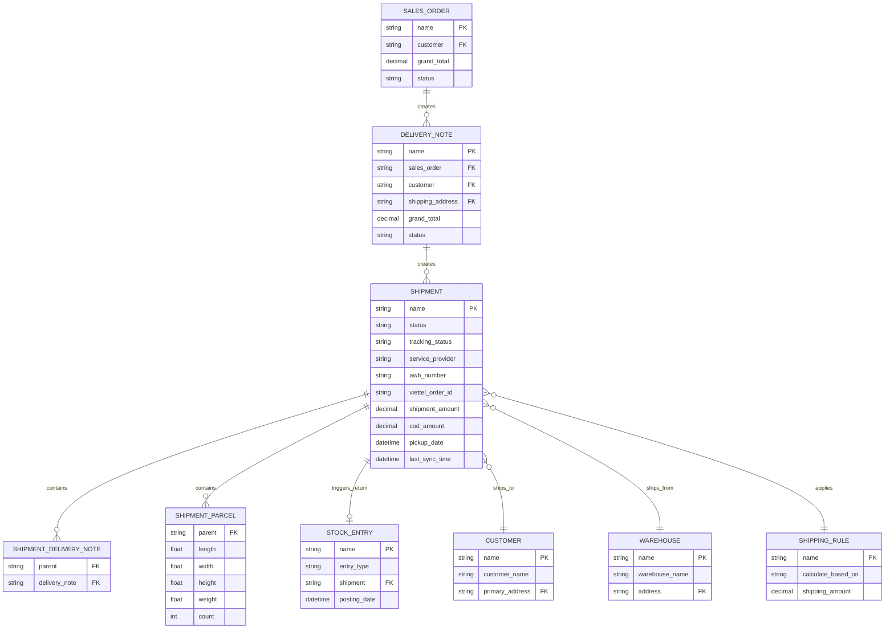

**Nguồn:** ERPNext Shipment Schema

---

## 2. Workflow Diagrams

### 2.1. Workflow Tổng quan

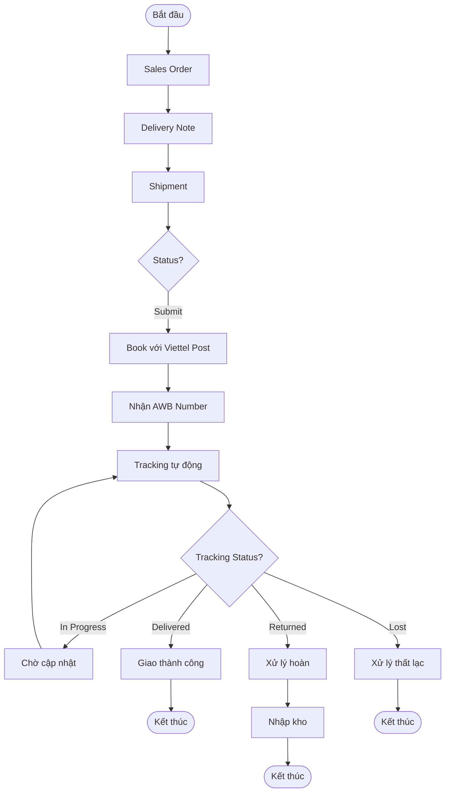

### 2.2. Workflow Chi tiết - Tạo & Book Shipment

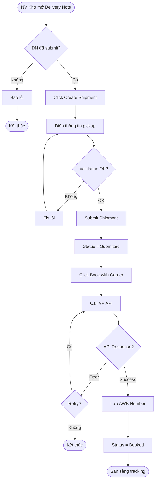

### 2.3. Workflow Tracking Tự động

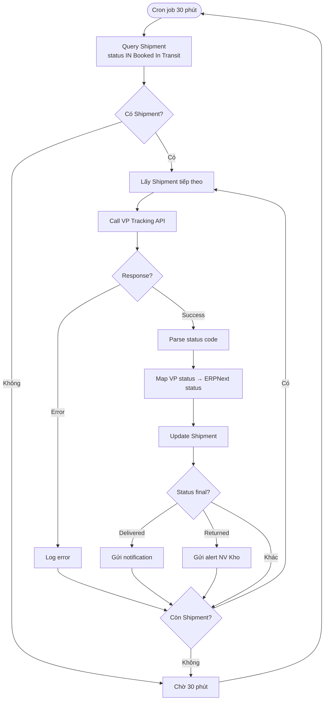

### 2.4. Workflow Xử lý Hoàn hàng

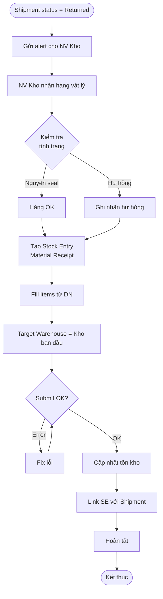

---

## 3. State Diagrams

### 3.1. Shipment Lifecycle

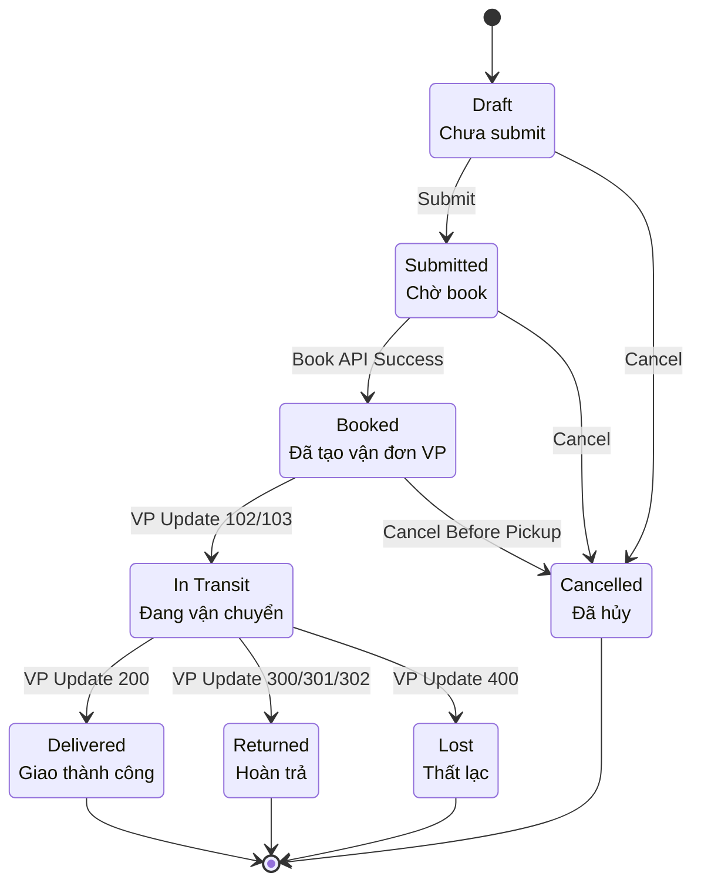

### 3.2. COD Payment Lifecycle

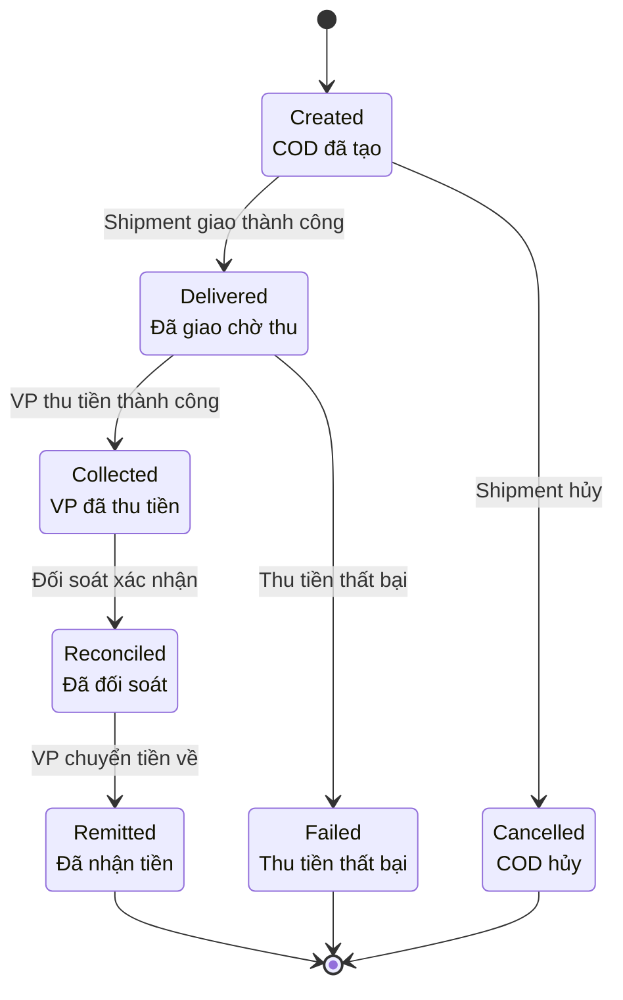

---

## 4. Data Flow

### 4.1. Data Flow - Book Shipment

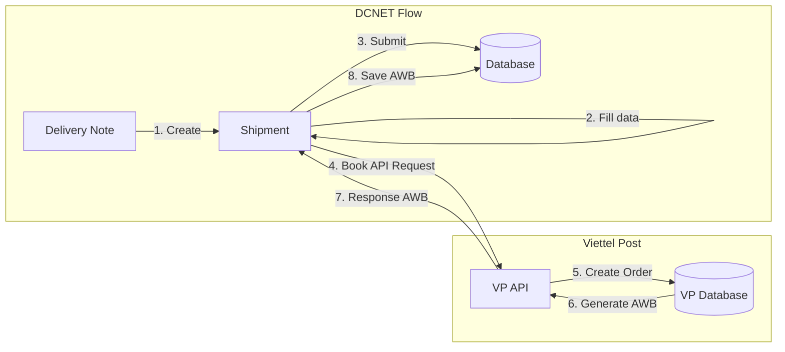

### 4.2. Data Flow - Tracking Sync

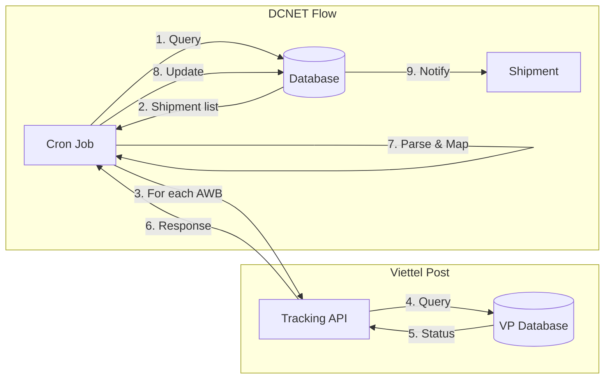

### 4.3. Data Flow - COD Reconciliation

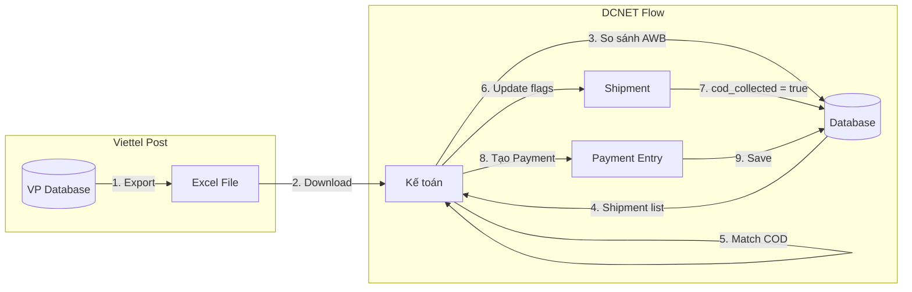

---

## 5. Integration Points

### 5.1. Upstream Integration

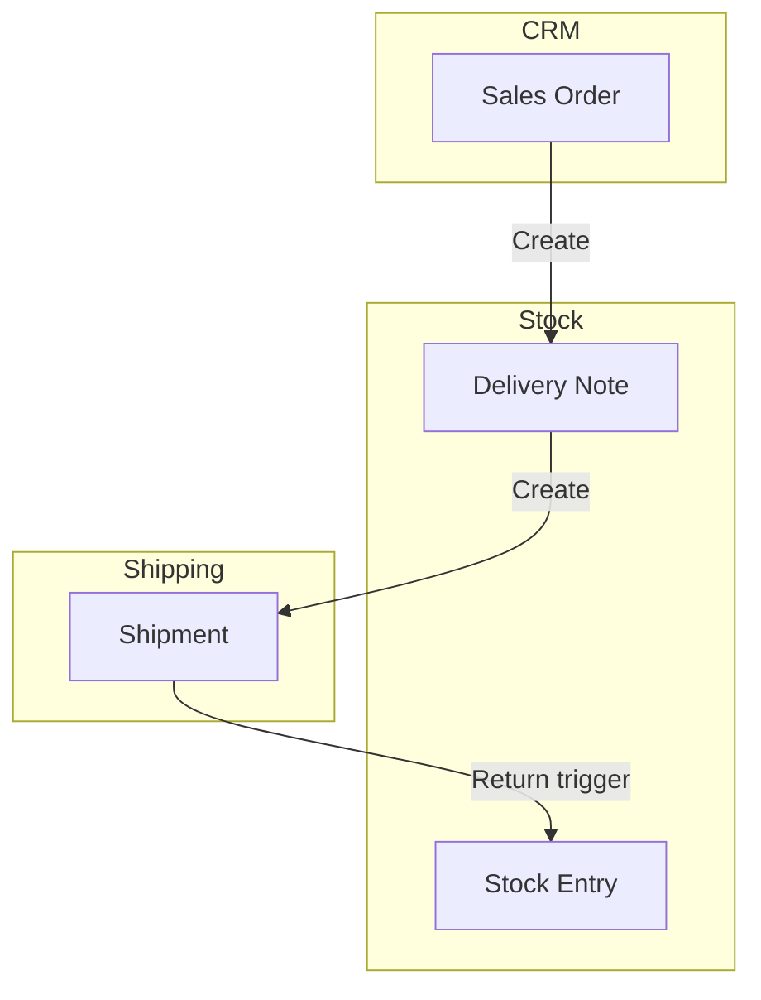

### 5.2. External Integration

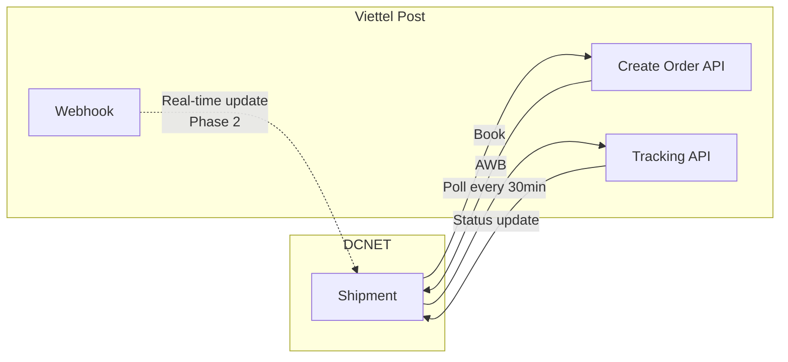

---

## 6. UI Mockups

### 6.1. Shipment List View

```
┌─────────────────────────────────────────────────────────────────────────┐
│ Shipment List                                         [+ New] [Filter]  │
├─────────────────────────────────────────────────────────────────────────┤
│ ☑ Name         Customer      Status      AWB Number     Tracking       │
├─────────────────────────────────────────────────────────────────────────┤
│ ☐ SHIPMENT-001 Nguyen Van A  🟡 Booked   VTP123456789  -              │
│ ☐ SHIPMENT-002 Tran Thi B    🟣 In Transit VTP987654321 In Progress    │
│ ☐ SHIPMENT-003 Le Van C      🟢 Delivered VTP456789123  Delivered      │
│ ☐ SHIPMENT-004 Pham Thi D    🟠 Returned  VTP789123456  Returned       │
└─────────────────────────────────────────────────────────────────────────┘

Filters:
┌──────────────────────────────────┐
│ Status:     [All ▾]              │
│ Date Range: [Last 7 days ▾]     │
│ Customer:   [                 ]  │
│ AWB:        [                 ]  │
│             [Apply Filter]       │
└──────────────────────────────────┘
```

### 6.2. Shipment Form View

```
┌─────────────────────────────────────────────────────────────────────────┐
│ Shipment SHIPMENT-001                          [Book] [Submit] [Cancel] │
├─────────────────────────────────────────────────────────────────────────┤
│ Status: 🟡 Submitted                    AWB: VTP123456789               │
│                                                                          │
│ ┌─ Pickup From ────────────────┐  ┌─ Delivery To ─────────────────┐   │
│ │ Type: Company                 │  │ Type: Customer                 │   │
│ │ Company: Nhat Minh Sport      │  │ Customer: Nguyen Van A         │   │
│ │ Address: 123 ABC, HN          │  │ Address: 456 XYZ, HCMC         │   │
│ │ Date: 2026-01-15              │  │ Contact: 0901234567            │   │
│ │ Time: 08:00 - 17:00           │  │                                │   │
│ └───────────────────────────────┘  └────────────────────────────────┘   │
│                                                                          │
│ ┌─ Parcels ──────────────────────────────────────────────────────────┐  │
│ │ Parcel | L(cm) | W(cm) | H(cm) | Weight(kg) | Count | [+ Add]     │  │
│ │ ─────────────────────────────────────────────────────────────────  │  │
│ │   1    |  30   |  20   |  10   |    1.5     |   2   | [Remove]   │  │
│ │                                                                     │  │
│ │ Total Weight: 3.0 kg                                               │  │
│ └─────────────────────────────────────────────────────────────────────┘  │
│                                                                          │
│ ┌─ Shipment Details ──────────────────────────────────────────────────┐ │
│ │ Service Provider:  Viettel Post                                     │ │
│ │ Carrier Service:   Standard                                         │ │
│ │ Value of Goods:    500,000 VNĐ                                      │ │
│ │ Shipment Amount:   30,000 VNĐ                                       │ │
│ │ COD Amount:        0 VNĐ                                            │ │
│ └─────────────────────────────────────────────────────────────────────┘ │
│                                                                          │
│ ┌─ Tracking ──────────────────────────────────────────────────────────┐ │
│ │ Status: In Progress                                                  │ │
│ │ Info:   Đang giao hàng                                               │ │
│ │ URL:    https://viettelpost.vn/track/VTP123456789                    │ │
│ │ Last Sync: 2026-01-14 15:30:00                                       │ │
│ └─────────────────────────────────────────────────────────────────────┘ │
└─────────────────────────────────────────────────────────────────────────┘
```

---

**Cập nhật:** 14/01/2026

**Tài liệu liên quan:**
- [SHIPPING_SPEC.md](./SHIPPING_SPEC.md)
- [SHIPPING_STATUS.md](./SHIPPING_STATUS.md)
- [SHIPPING_DIAGRAMS.md](./SHIPPING_DIAGRAMS.md)
