# Shipping Module - Diagrams

> **Module:** Quản lý Giao vận (Shipping Management)
>
> **Nguồn:** FEATURE_SPECIFICATION.md Section 9 + Technical Design
>
> **Cập nhật:** 14/01/2026

---

## Mục lục

1. [Sequence Diagrams](#1-sequence-diagrams)
2. [Activity Diagrams](#2-activity-diagrams)
3. [Component Diagrams](#3-component-diagrams)
4. [Deployment Diagram](#4-deployment-diagram)

---

## 1. Sequence Diagrams

### 1.1. Tạo & Book Shipment

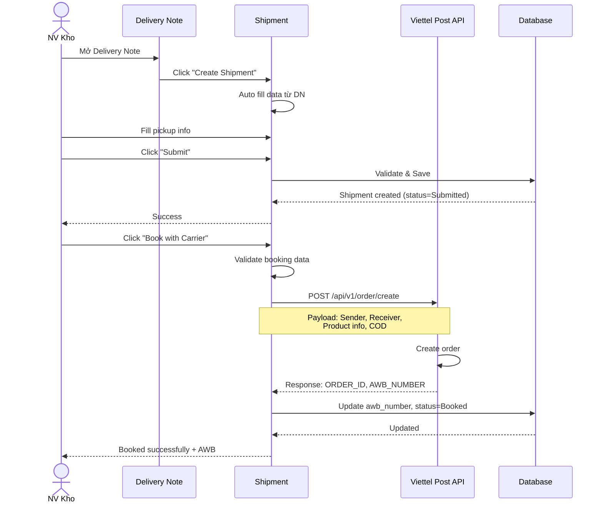

### 1.2. Tracking Sync (Cron Job)

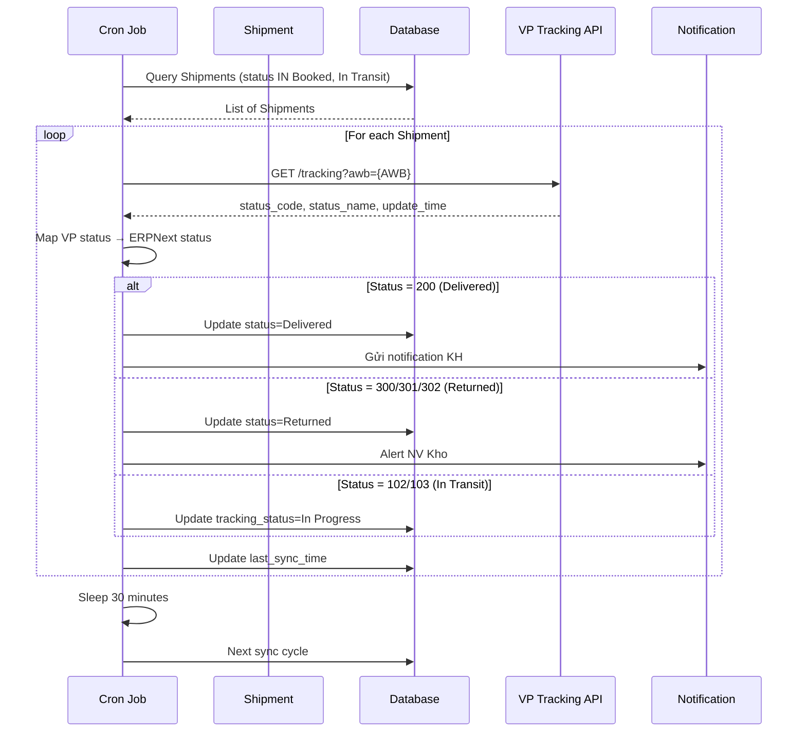

### 1.3. Xử lý Hoàn hàng

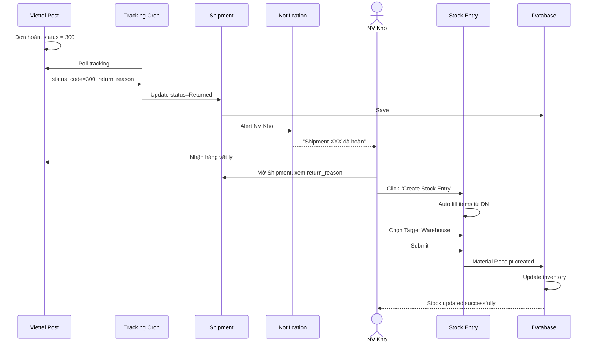

---

## 2. Activity Diagrams

### 2.1. Quy trình Giao hàng Hoàn chỉnh

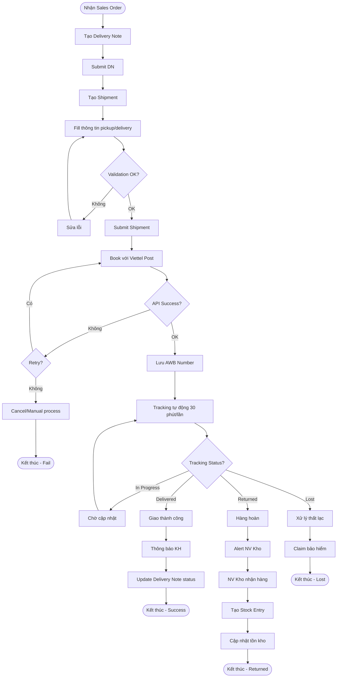

### 2.2. Quy trình Đối soát COD

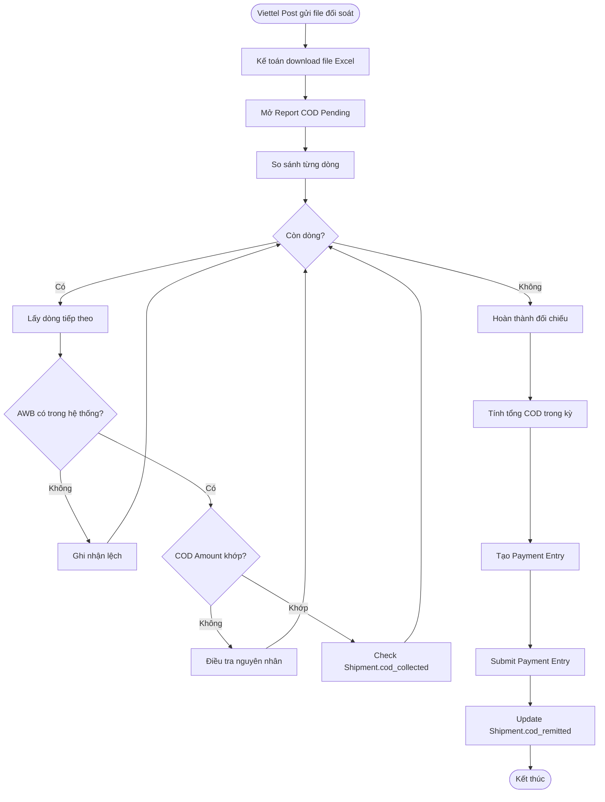

---

## 3. Component Diagrams

### 3.1. System Components

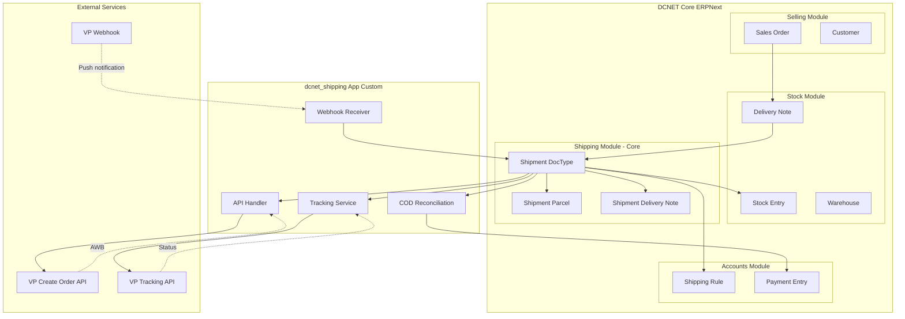

### 3.2. API Integration Architecture

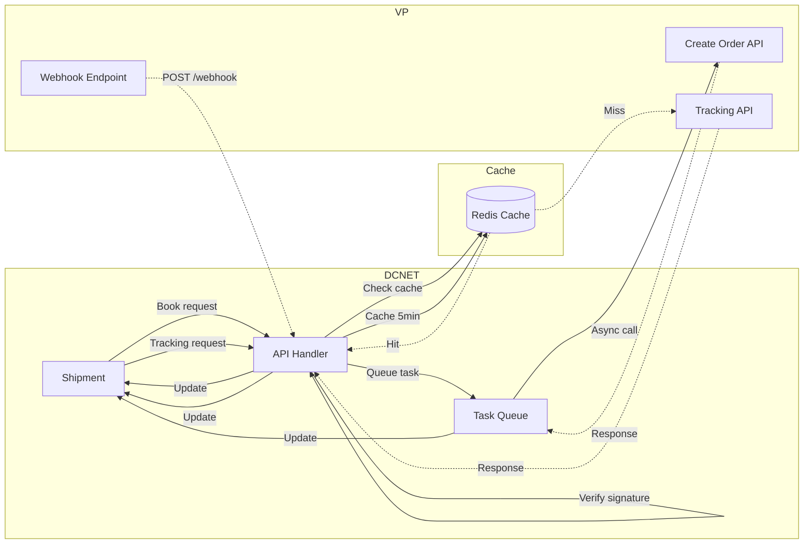

---

## 4. Deployment Diagram

### 4.1. Production Deployment

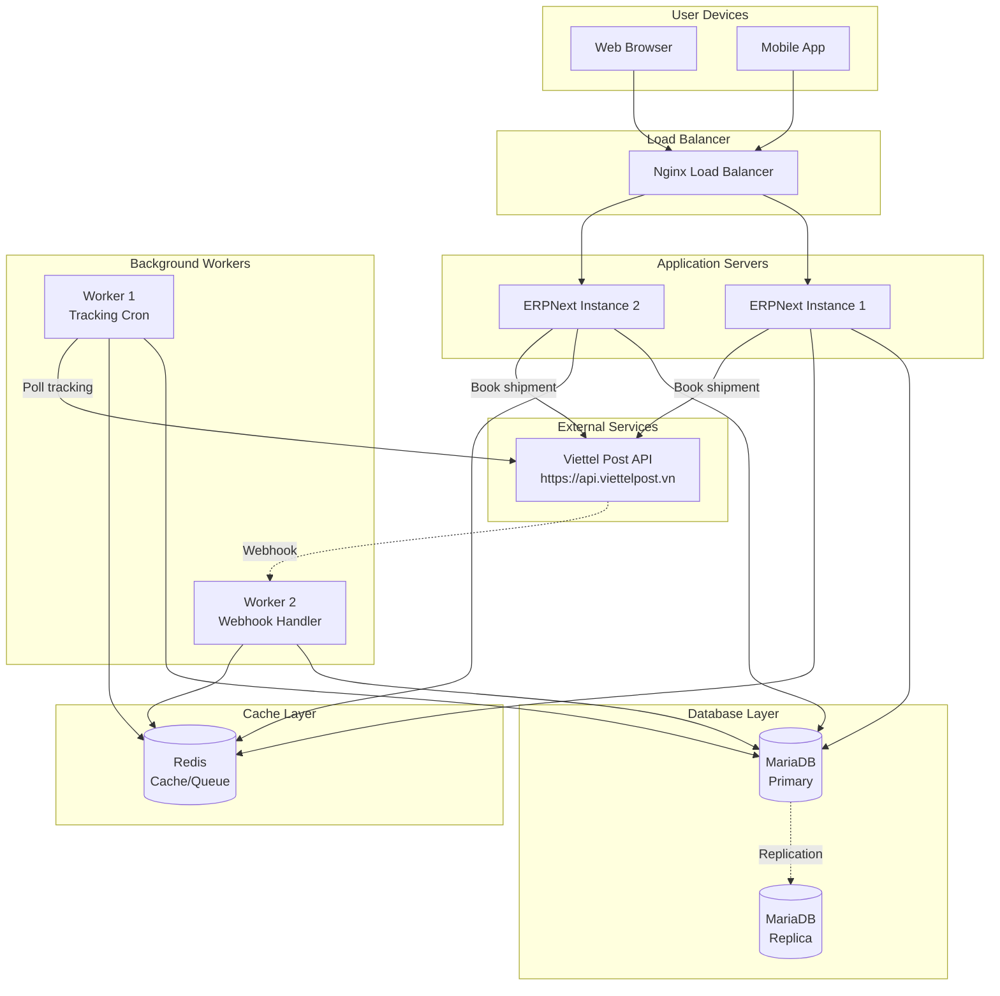

### 4.2. Development Environment

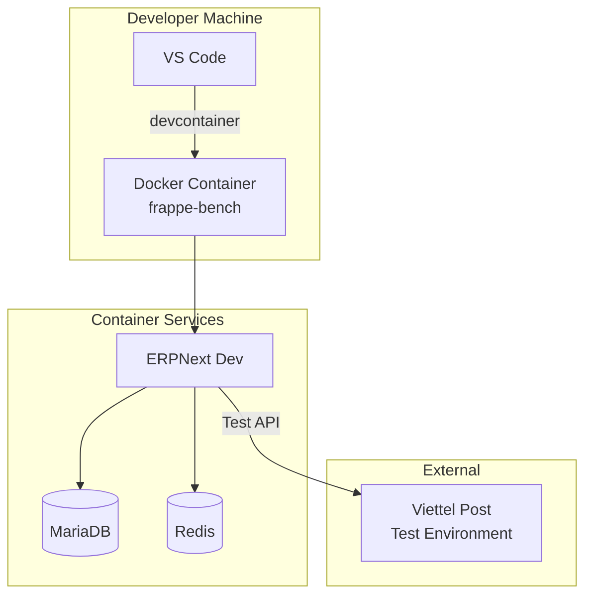

---

## 5. Class Diagrams

### 5.1. Shipment Class Structure

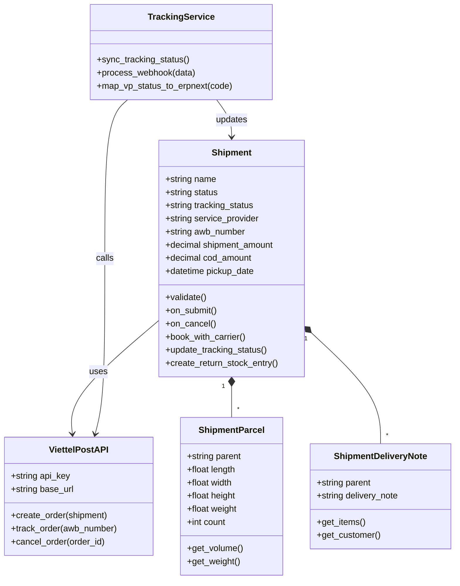

---

## 6. Timing Diagrams

### 6.1. Tracking Sync Timeline

```mermaid
gantt
    title Tracking Sync Timeline (1 hour)
    dateFormat HH:mm
    axisFormat %H:%M

    section Cron Job
    Sync Cycle 1      :active, 09:00, 5m
    Sleep             :        09:05, 25m
    Sync Cycle 2      :active, 09:30, 5m
    Sleep             :        09:35, 25m
    Sync Cycle 3      :active, 10:00, 5m

    section API Calls
    Query Shipments   :crit,   09:00, 1m
    Call VP API       :        09:01, 3m
    Update DB         :        09:04, 1m

    section Database
    Read Shipments    :        09:00, 1m
    Write Updates     :        09:04, 1m
```

### 6.2. Order Lifecycle Timeline

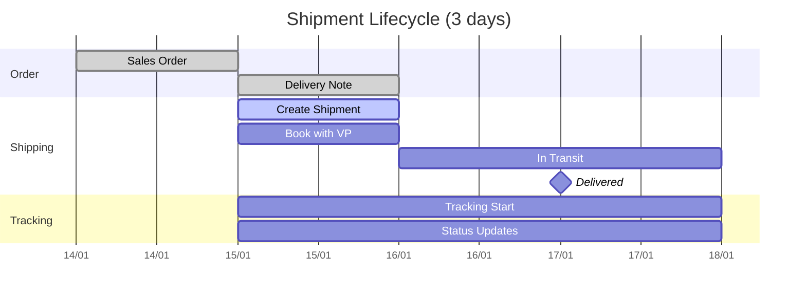

---

**Cập nhật:** 14/01/2026

**Tài liệu liên quan:**
- [SHIPPING_SPEC.md](./SHIPPING_SPEC.md)
- [SHIPPING_STATUS.md](./SHIPPING_STATUS.md)
- [SHIPPING_WORKFLOW.md](./SHIPPING_WORKFLOW.md)
- [SHIPPING_USE_CASE_SPEC.md](./SHIPPING_USE_CASE_SPEC.md)
