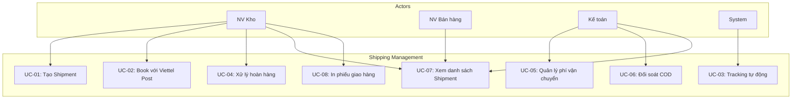

# Shipping Module - Use Case Specification

> **Module:** Quản lý Giao vận (Shipping Management)
>
> **Nguồn:** FEATURE_SPECIFICATION.md Section 9 + ERPNext Shipment Analysis
>
> **Cập nhật:** 14/01/2026

---

## Mục lục

1. [Use Case Diagram](#1-use-case-diagram)
2. [Actors](#2-actors)
3. [Use Cases Chi tiết](#3-use-cases-chi-tiết)
4. [Permission Matrix](#4-permission-matrix)

---

## 1. Use Case Diagram



---

## 2. Actors

### 2.1. Internal Actors

| Actor | Mô tả | Vai trò |
|-------|-------|---------|
| **NV Kho** (Stock User) | Nhân viên kho | Tạo Shipment, book với VP, xử lý hoàn |
| **NV Bán hàng** (Sales User) | Nhân viên bán hàng | Xem tracking, hỗ trợ khách |
| **Kế toán** (Accounts User) | Nhân viên kế toán | Quản lý phí VC, đối soát COD |
| **System** | Hệ thống tự động | Tracking sync, webhook, notification |

### 2.2. External Actors

| Actor | Mô tả | Vai trò |
|-------|-------|---------|
| **Viettel Post API** | API đơn vị vận chuyển | Tạo vận đơn, tracking, webhook |
| **Khách hàng** | Người nhận hàng | Nhận notification, tracking (passive) |

---

## 3. Use Cases Chi tiết

### UC-01: Tạo Shipment

**ID:** UC-01

**Tên:** Tạo Shipment từ Delivery Note

**Actor:** NV Kho (Stock User)

**Điều kiện tiên quyết:**
- Delivery Note đã được submit
- Delivery Note chưa có Shipment

**Luồng chính:**

1. NV Kho mở Delivery Note
2. Click button "Create" → "Shipment"
3. Hệ thống tạo Shipment form với data từ DN:
   - Delivery address ← DN Customer Address
   - Items → Parcels (auto calculate weight)
   - Value of goods ← DN Grand Total
4. NV Kho điền thông tin pickup:
   - Pickup date, time
   - Pickup address (warehouse address)
   - Service Provider = "Viettel Post"
   - Carrier Service (Standard/Express)
5. NV Kho click "Save"
6. NV Kho click "Submit"
7. Shipment status = "Submitted"

**Luồng thay thế:**

- **3a.** Nếu DN không có địa chỉ:
  - Hệ thống báo lỗi "Customer Address is required"
  - Return to step 1

- **6a.** Validation fail (weight = 0, value = 0):
  - Hệ thống báo lỗi
  - User fix → Return to step 6

**Kết quả:**
- Shipment được tạo với status = "Submitted"
- Link với Delivery Note

**Nguồn:** ERPNext Shipment DocType + Custom Enhancement

---

### UC-02: Book với Viettel Post

**ID:** UC-02

**Tên:** Tạo vận đơn Viettel Post

**Actor:** NV Kho (Stock User)

**Điều kiện tiên quyết:**
- Shipment status = "Submitted"
- Service Provider = "Viettel Post"
- API credentials đã config

**Luồng chính:**

1. NV Kho mở Shipment (status = Submitted)
2. Click button "Book with Carrier"
3. Hệ thống validate:
   - Pickup date >= today
   - Pickup/Delivery address valid
   - Parcel info complete
4. Hệ thống call VP API:
   ```
   POST /api/v1/order/create
   {
     "ORDER_NUMBER": "DN-00123",
     "SENDER_FULLNAME": "...",
     "SENDER_ADDRESS": "...",
     "RECEIVER_FULLNAME": "...",
     "RECEIVER_ADDRESS": "...",
     "PRODUCT_WEIGHT": 1500,
     "PRODUCT_PRICE": 500000,
     "MONEY_COLLECTION": 0
   }
   ```
5. VP API response:
   ```
   {
     "ORDER_ID": "VP123456",
     "AWB_NUMBER": "VTP123456789",
     "STATUS": "SUCCESS"
   }
   ```
6. Hệ thống update Shipment:
   - `awb_number` = "VTP123456789"
   - `viettel_order_id` = "VP123456"
   - `status` = "Booked"
7. Hiển thị success message + AWB number

**Luồng thay thế:**

- **4a.** VP API timeout/error:
  - Hệ thống hiển thị error message
  - Shipment vẫn status = "Submitted"
  - User có thể retry

- **4b.** Địa chỉ không hợp lệ (VP reject):
  - VP trả error code
  - Hệ thống hiển thị chi tiết lỗi
  - User fix address → Retry

**Kết quả:**
- Shipment status = "Booked"
- AWB number được lưu
- Sẵn sàng tracking

**Nguồn:** Viettel Post API Integration Design

---

### UC-03: Tracking tự động

**ID:** UC-03

**Tên:** Cập nhật trạng thái giao hàng tự động

**Actor:** System (Cron job)

**Điều kiện tiên quyết:**
- Shipment status IN ("Booked", "In Transit")
- AWB number đã có

**Luồng chính:**

1. Cron job chạy mỗi 30 phút
2. Query danh sách Shipment cần tracking:
   ```sql
   SELECT * FROM tabShipment
   WHERE status IN ('Booked', 'In Transit')
   AND awb_number IS NOT NULL
   ```
3. Foreach Shipment:
   - Call VP API tracking:
     ```
     GET /api/v1/order/tracking?awb={AWB}
     ```
   - Nhận response:
     ```json
     {
       "ORDER_ID": "VP123456",
       "STATUS_CODE": "103",
       "STATUS_NAME": "Đang giao hàng",
       "UPDATE_TIME": "2026-01-14 15:30:00"
     }
     ```
   - Mapping status code:
     ```python
     if status_code in [100, 101]:
         shipment.status = "Booked"
     elif status_code in [102, 103]:
         shipment.status = "In Transit"
         shipment.tracking_status = "In Progress"
     elif status_code == 200:
         shipment.status = "Delivered"
         shipment.tracking_status = "Delivered"
     elif status_code in [300, 301, 302]:
         shipment.status = "Returned"
         shipment.tracking_status = "Returned"
         shipment.return_reason = status_name
     elif status_code == 400:
         shipment.status = "Lost"
         shipment.tracking_status = "Lost"
     ```
   - Update Shipment:
     - `status`
     - `tracking_status`
     - `tracking_status_info`
     - `last_sync_time`
4. Log tracking result

**Luồng thay thế:**

- **3a.** VP API không available:
  - Log error
  - Skip shipment này
  - Continue với shipment khác

- **3b.** Shipment status = "Delivered":
  - Trigger notification (nếu enabled)
  - Update Delivery Note status

**Kết quả:**
- Shipment status được cập nhật real-time
- Tracking info sync từ VP

**Nguồn:** Auto Tracking Enhancement Design

---

### UC-04: Xử lý hoàn hàng

**ID:** UC-04

**Tên:** Nhận hàng hoàn về kho

**Actor:** NV Kho (Stock User)

**Điều kiện tiên quyết:**
- Shipment status = "Returned"
- Hàng đã về kho vật lý

**Luồng chính (Manual - Phase 1):**

1. NV Kho nhận notification "Shipment XXX đã hoàn"
2. Nhận hàng vật lý từ Viettel Post
3. Kiểm tra tình trạng hàng:
   - Nguyên seal → OK
   - Hư hỏng → Note lại
4. Mở Shipment, xem lý do hoàn (return_reason)
5. Click "Create Stock Entry"
6. Hệ thống tạo Stock Entry form:
   - Entry Type = "Material Receipt"
   - Items ← Từ Delivery Note của Shipment
   - Target Warehouse ← Warehouse ban đầu
   - Link với Shipment (custom field)
7. NV Kho điều chỉnh nếu cần (item hư hỏng)
8. Submit Stock Entry
9. Tồn kho được cập nhật

**Luồng thay thế:**

- **3a.** Hàng bị hư hỏng:
  - NV Kho tạo Quality Inspection
  - Nếu không dùng được → Đưa vào kho "Hàng lỗi"

- **8a.** Stock Entry validation fail:
  - Fix lỗi
  - Retry submit

**Kết quả:**
- Tồn kho được cập nhật chính xác
- Audit trail đầy đủ

**Nguồn:** FEATURE_SPECIFICATION.md Section 9.2 (Line 817)

---

### UC-05: Quản lý phí vận chuyển

**ID:** UC-05

**Tên:** Cấu hình Shipping Rule

**Actor:** Kế toán (Accounts User)

**Điều kiện tiên quyết:**
- Có chính sách phí vận chuyển từ khách hàng

**Luồng chính:**

1. Kế toán mở "Shipping Rule" List
2. Click "New"
3. Điền thông tin:
   - Label: "Free Ship 500K"
   - Shipping Rule Type: "Selling"
   - Calculate based on: "Net Total"
   - Company: Default company
   - Account: "Shipping Charges - NM"
4. Thêm conditions:

   | From Value | To Value | Shipping Amount |
   |------------|----------|-----------------|
   | 0 | 500,000 | 30,000 |
   | 500,000 | 0 | 0 |

5. Save & Enable
6. Test với đơn hàng mẫu:
   - Đơn 300k → Phí ship = 30k ✓
   - Đơn 600k → Phí ship = 0 ✓

**Kết quả:**
- Shipping Rule hoạt động
- Tự động áp dụng cho đơn hàng

**Nguồn:** ERPNext Shipping Rule DocType

---

### UC-06: Đối soát COD

**ID:** UC-06

**Tên:** Đối soát tiền thu hộ (COD)

**Actor:** Kế toán (Accounts User)

**Điều kiện tiên quyết:**
- Có đơn COD đã giao (status = Delivered)
- Nhận file đối soát từ Viettel Post

**Luồng chính (Manual - Phase 1):**

1. Kế toán download file đối soát từ VP (Excel/CSV)
2. Mở Report "COD Pending Reconciliation"
3. So sánh từng dòng:
   - AWB trong file VP ↔ AWB trong hệ thống
   - COD amount match?
4. Nếu match:
   - Check Shipment.cod_collected = ✅
5. Sau khi đối chiếu hết:
   - Tổng COD trong kỳ = X VNĐ
6. Tạo Payment Entry:
   - From: Viettel Post
   - To: Company Bank Account
   - Amount: X VNĐ
7. Submit Payment Entry
8. Update Shipment.cod_remitted = ✅

**Luồng thay thế:**

- **3a.** AWB không match:
  - Note lại
  - Liên hệ VP confirm

- **3b.** COD amount khác:
  - Check lại với VP
  - Điều chỉnh nếu cần

**Kết quả:**
- COD được đối soát chính xác
- Tiền về đúng tài khoản

**Nguồn:** COD Management Design

---

### UC-07: Xem danh sách Shipment

**ID:** UC-07

**Tên:** Xem và filter Shipment

**Actor:** NV Kho, NV Bán hàng, Kế toán

**Luồng chính:**

1. User mở "Shipment" List
2. Hệ thống hiển thị danh sách với columns:
   - Name
   - Delivery Note
   - Customer
   - Status
   - Tracking Status
   - AWB Number
   - Shipment Amount
3. User có thể:
   - **Filter by Status:** Draft, Submitted, Booked, In Transit, Delivered, Returned, Lost, Cancelled
   - **Filter by Date range**
   - **Search by:** AWB number, Customer name
   - **Sort by:** Date, Status
4. Click vào 1 Shipment → Xem chi tiết

**Kết quả:**
- User dễ dàng tìm và theo dõi Shipment

**Nguồn:** ERPNext List View Standard

---

### UC-08: In phiếu giao hàng

**ID:** UC-08

**Tên:** In phiếu giao hàng / vận đơn

**Actor:** NV Kho (Stock User)

**Điều kiện tiên quyết:**
- Shipment đã submit

**Luồng chính:**

1. NV Kho mở Shipment
2. Click "Print" button
3. Chọn Print Format:
   - "Delivery Note Standard" (mặc định ERPNext)
   - "Viettel Post Label" (custom - nếu có)
4. Preview PDF
5. Click "Download PDF" hoặc "Print"
6. In phiếu
7. Dán lên kiện hàng

**Kết quả:**
- Phiếu giao hàng được in
- Sẵn sàng giao cho shipper

**Nguồn:** ERPNext Print Format

---

## 4. Permission Matrix

### 4.1. DocType Permission

**Shipment:**

| Role | Read | Write | Create | Submit | Cancel | Delete |
|------|------|-------|--------|--------|--------|--------|
| Stock User | ✅ | ✅ | ✅ | ✅ | ❌ | ❌ |
| Stock Manager | ✅ | ✅ | ✅ | ✅ | ✅ | ✅ |
| Sales User | ✅ | ❌ | ❌ | ❌ | ❌ | ❌ |
| Accounts User | ✅ | ❌ | ❌ | ❌ | ❌ | ❌ |

**Shipping Rule:**

| Role | Read | Write | Create | Submit | Cancel | Delete |
|------|------|-------|--------|--------|--------|--------|
| Accounts User | ✅ | ✅ | ✅ | ❌ | ❌ | ❌ |
| Accounts Manager | ✅ | ✅ | ✅ | ❌ | ❌ | ✅ |

### 4.2. Field Level Permission

**Shipment - Sensitive Fields:**

| Field | Stock User | Stock Manager | Accounts User |
|-------|------------|---------------|---------------|
| `shipment_amount` | ✅ View | ✅ View | ✅ View/Edit |
| `cod_amount` | ✅ View | ✅ View | ✅ View/Edit |
| `cod_collected` | ❌ | ✅ Edit | ✅ Edit |
| `cod_remitted` | ❌ | ❌ | ✅ Edit |

### 4.3. Action Permission

| Action | Stock User | Stock Manager | Sales User | Accounts User |
|--------|------------|---------------|------------|---------------|
| Book with Carrier | ✅ | ✅ | ❌ | ❌ |
| Cancel before pickup | ❌ | ✅ | ❌ | ❌ |
| Handle Return | ✅ | ✅ | ❌ | ❌ |
| COD Reconciliation | ❌ | ❌ | ❌ | ✅ |

---

## 5. Use Case Coverage

### 5.1. Theo Priority

| Priority | Use Cases | % Coverage |
|----------|-----------|------------|
| **Cao** | UC-01, UC-02, UC-03 | 100% (Phase 1) |
| **TB** | UC-04, UC-05 | 100% (Phase 1) |
| **Thấp** | UC-06 (manual), UC-07, UC-08 | 70% (Manual) |

### 5.2. Phase Planning

**Phase 1 (MVP):**
- ✅ UC-01: Tạo Shipment
- ✅ UC-02: Book với VP
- ✅ UC-03: Tracking auto (polling)
- ✅ UC-04: Xử lý hoàn (manual)
- ✅ UC-05: Shipping Rule
- ✅ UC-06: COD đối soát (manual)
- ✅ UC-07: Xem danh sách
- ✅ UC-08: In phiếu

**Phase 2 (Enhancements):**
- ⏳ UC-03: Tracking real-time (webhook)
- ⏳ UC-04: Xử lý hoàn (auto)
- ⏳ UC-06: COD đối soát (auto)
- ⏳ UC-09: Customer notification (new)

---

**Cập nhật:** 14/01/2026

**Tài liệu liên quan:**
- [SHIPPING_SPEC.md](./SHIPPING_SPEC.md)
- [SHIPPING_STATUS.md](./SHIPPING_STATUS.md)
- [SHIPPING_WORKFLOW.md](./SHIPPING_WORKFLOW.md)
