# Module Credit Management - Diagrams

> **Phiên bản**: v1.0
> **Ngày cập nhật**: 2026-01-14
> **Mục đích**: Tổng hợp tất cả sơ đồ trực quan cho Credit Management

---

## 📊 Table of Contents

1. [Process Flow Diagrams](#1-process-flow-diagrams)
2. [Sequence Diagrams](#2-sequence-diagrams)
3. [State Machine Diagrams](#3-state-machine-diagrams)
4. [Data Flow Diagrams](#4-data-flow-diagrams)
5. [Architecture Diagrams](#5-architecture-diagrams)
6. [UI Mockup Diagrams](#6-ui-mockup-diagrams)

---

## 1. Process Flow Diagrams

### 1.1. High-Level Credit Control Process

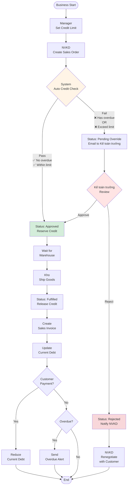

---

### 1.2. Credit Check Decision Tree

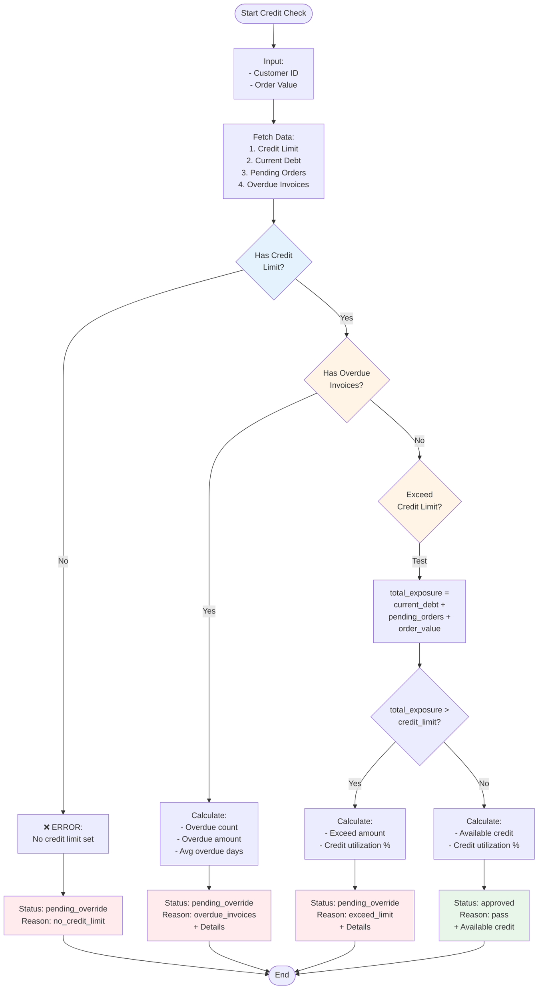

---

## 2. Sequence Diagrams

### 2.1. Normal Flow - Pass Credit Check

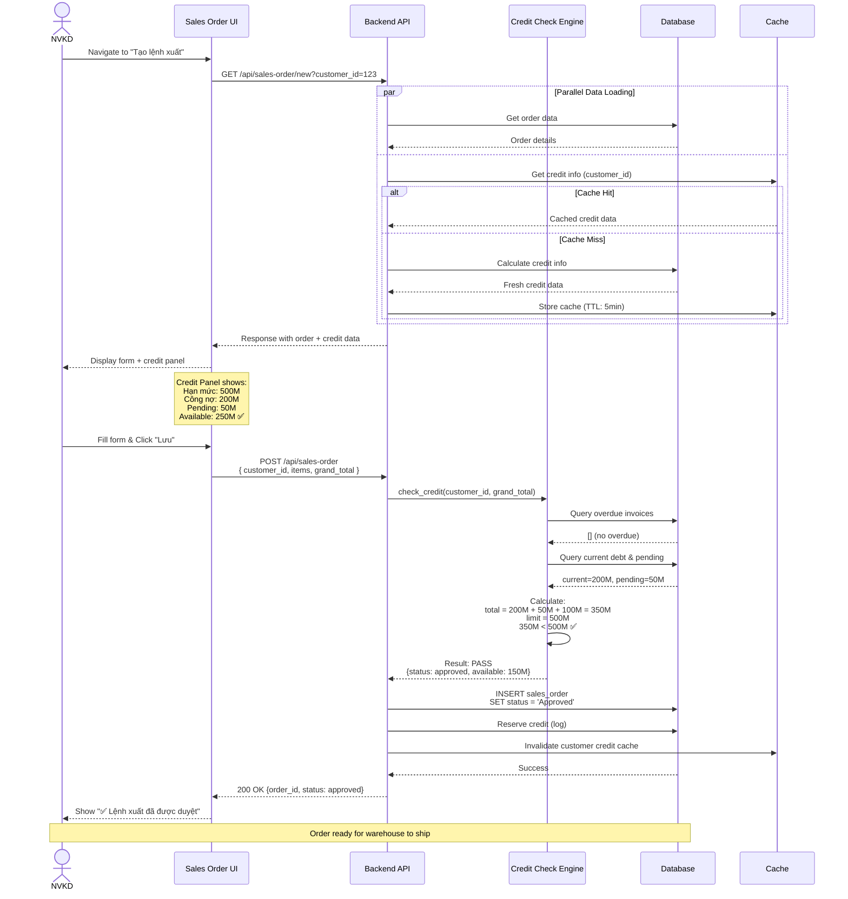

---

### 2.2. Exception Flow - Fail Credit Check (Overdue)

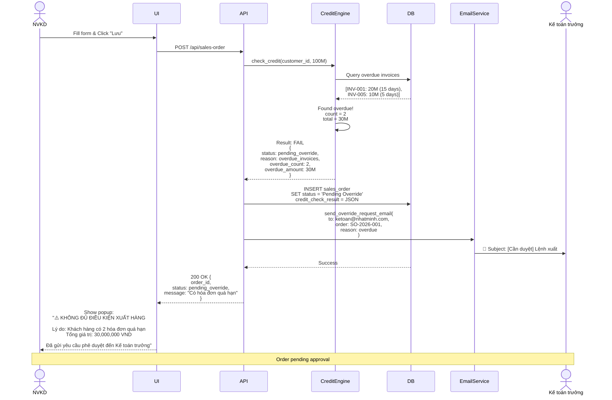

---

### 2.3. Override Approval Flow

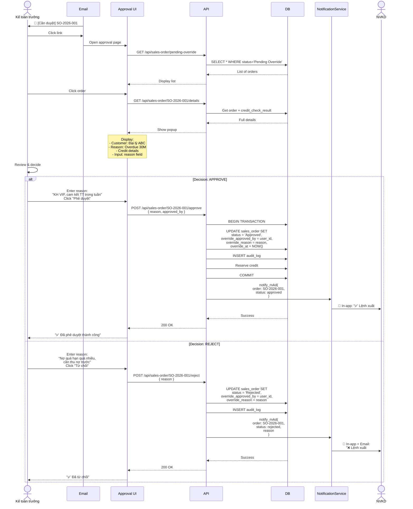

---

## 3. State Machine Diagrams

### 3.1. Sales Order Status State Machine

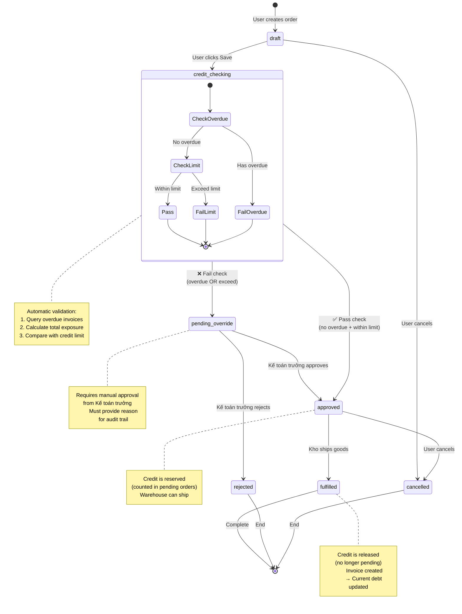

---

### 3.2. Credit Limit Lifecycle

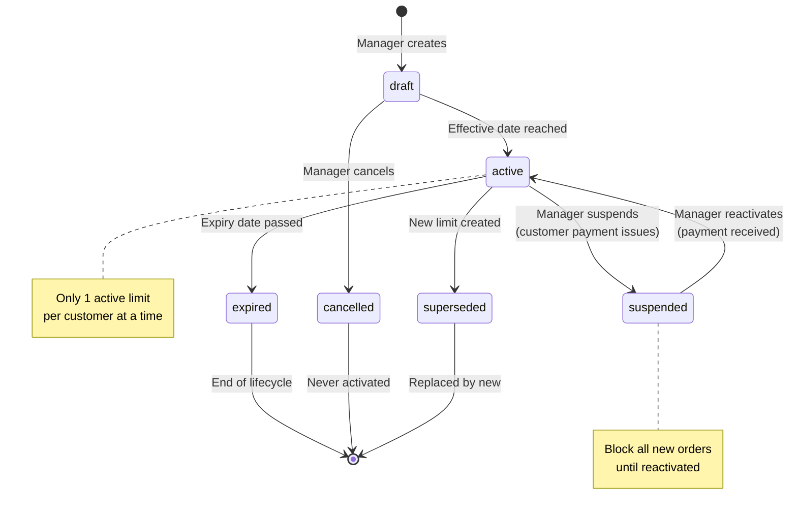

---

## 4. Data Flow Diagrams

### 4.1. Context Diagram (Level 0)

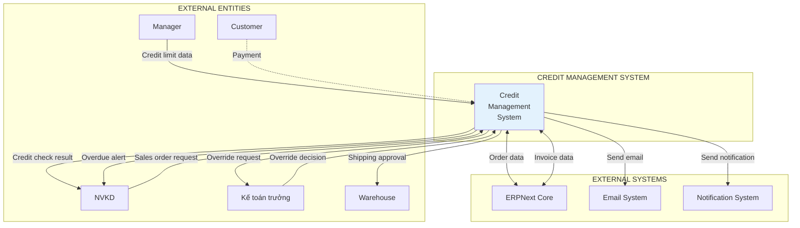

---

### 4.2. Level 1 DFD - Credit Check Process

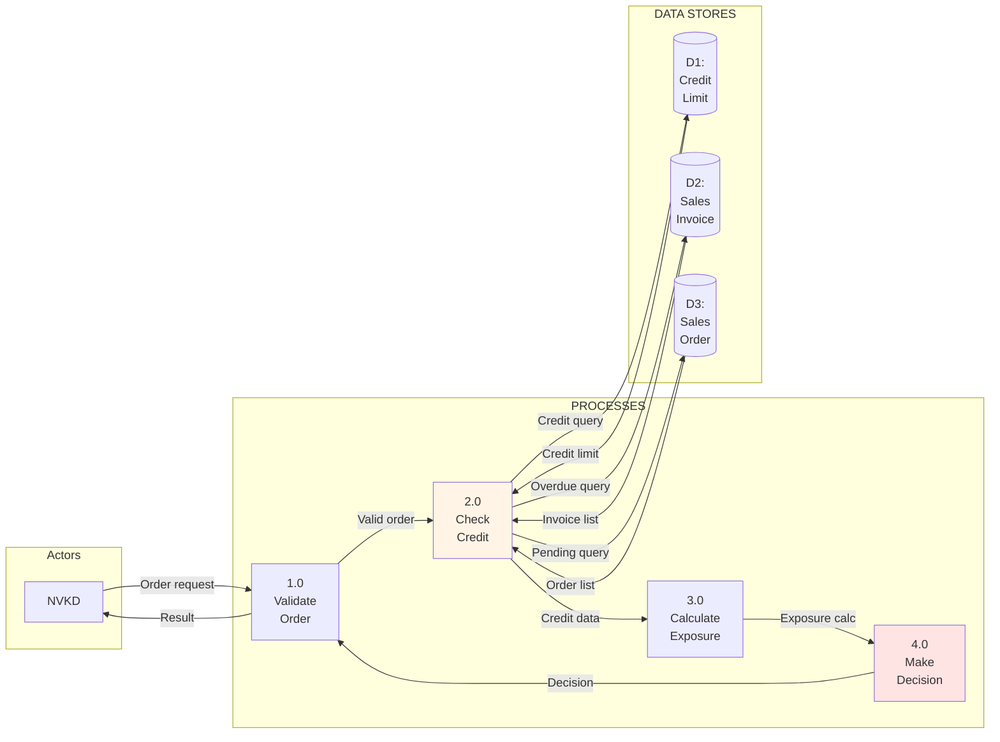

---

## 5. Architecture Diagrams

### 5.1. System Architecture

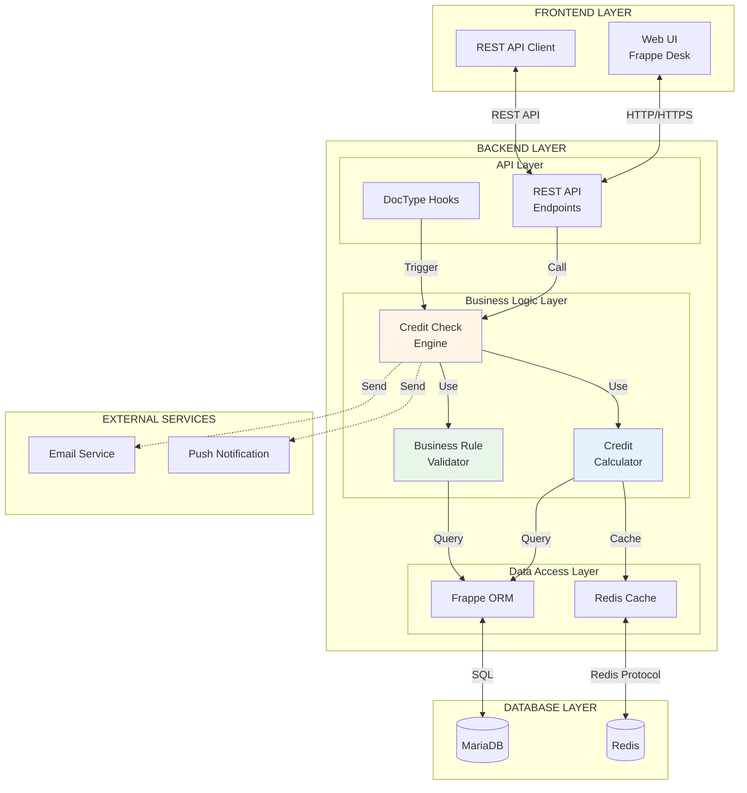

---

### 5.2. Component Diagram

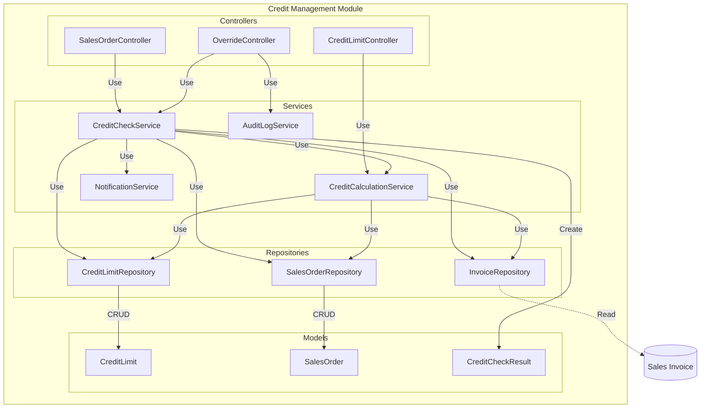

---

## 6. UI Mockup Diagrams

### 6.1. Credit Info Panel (Lệnh xuất hàng)

```
┌─────────────────────────────────────────┐
│ 💳 THÔNG TIN TÍN DỤNG                  │
├─────────────────────────────────────────┤
│                                         │
│ 📊 Hạn mức tín dụng                    │
│ ┌────────────────────────────────────┐ │
│ │   500,000,000 VND                  │ │
│ └────────────────────────────────────┘ │
│                                         │
│ 💰 Công nợ hiện tại                    │
│ ┌────────────────────────────────────┐ │
│ │   350,000,000 VND                  │ │
│ └────────────────────────────────────┘ │
│                                         │
│ 📦 Lệnh xuất chưa xuất                 │
│ ┌────────────────────────────────────┐ │
│ │   100,000,000 VND                  │ │
│ └────────────────────────────────────┘ │
│                                         │
│ 📝 Đơn hiện tại                        │
│ ┌────────────────────────────────────┐ │
│ │    80,000,000 VND                  │ │
│ └────────────────────────────────────┘ │
│                                         │
├─────────────────────────────────────────┤
│ 🔢 Tổng rủi ro tín dụng                │
│ ┌────────────────────────────────────┐ │
│ │   530,000,000 VND  ❌              │ │
│ │   Vượt hạn mức: 30,000,000         │ │
│ └────────────────────────────────────┘ │
│                                         │
│ ⚡ Tín dụng khả dụng                    │
│ ┌────────────────────────────────────┐ │
│ │   -30,000,000 VND  ⚠️              │ │
│ └────────────────────────────────────┘ │
│                                         │
│ 📈 Tỷ lệ sử dụng                       │
│ ┌────────────────────────────────────┐ │
│ │   [████████████░░░] 106%  🔴       │ │
│ └────────────────────────────────────┘ │
│                                         │
├─────────────────────────────────────────┤
│ ⚠️ CẢNH BÁO                            │
│                                         │
│ ❌ Vượt hạn mức 30,000,000 VND         │
│ ⚠️ Cần Kế toán trưởng phê duyệt        │
│                                         │
│ [ 📧 Gửi yêu cầu phê duyệt ]           │
└─────────────────────────────────────────┘
```

---

### 6.2. Override Approval Popup

```
┌──────────────────────────────────────────────┐
│ PHÊ DUYỆT NGOẠI LỆ - LỆNH XUẤT #SO-2026-001│
├──────────────────────────────────────────────┤
│                                              │
│ 👤 Khách hàng: Đại lý ABC (KH-12345)       │
│ 📅 Ngày tạo: 14/01/2026 10:30              │
│ 👨‍💼 NVKD: Nguyễn Văn A                      │
│ 💵 Giá trị đơn: 80,000,000 VND             │
│                                              │
├──────────────────────────────────────────────┤
│ ⚠️ LÝ DO CHẶN                               │
│                                              │
│ ❌ Vượt hạn mức công nợ                     │
│    Vượt: 30,000,000 VND                     │
│                                              │
│ CHI TIẾT TÍN DỤNG:                          │
│ ┌──────────────────────────────────────────┐│
│ │ Hạn mức:            500,000,000 VND     ││
│ │ Công nợ hiện tại:   350,000,000 VND     ││
│ │ Lệnh xuất chưa xuất: 100,000,000 VND    ││
│ │ Đơn hiện tại:        80,000,000 VND     ││
│ │ ─────────────────────────────────────── ││
│ │ Tổng rủi ro:        530,000,000 VND  ❌ ││
│ └──────────────────────────────────────────┘│
│                                              │
│ 📋 Lý do phê duyệt (bắt buộc): *            │
│ ┌──────────────────────────────────────────┐│
│ │                                          ││
│ │  [Nhập lý do phê duyệt...]              ││
│ │                                          ││
│ └──────────────────────────────────────────┘│
│                                              │
│ [ ✅ PHÊ DUYỆT ]  [ ❌ TỪ CHỐI ]           │
│                                              │
└──────────────────────────────────────────────┘
```

---

### 6.3. Aging Report Visualization

```
┌─────────────────────────────────────────────────────────────────┐
│ BÁO CÁO CÔNG NỢ THEO ĐỘ TUỔI (AGING REPORT)                   │
│ Ngày báo cáo: 14/01/2026                                        │
├─────────────────────────────────────────────────────────────────┤
│                                                                 │
│ ┌─────────┬──────────┬─────┬─────┬─────┬─────┬────────────┐  │
│ │ MÃ KH   │ TÊN KH   │0-30 │31-60│61-90│ 90+ │ TỔNG CÔNG  │  │
│ │         │          │     │     │     │     │ NỢ         │  │
│ ├─────────┼──────────┼─────┼─────┼─────┼─────┼────────────┤  │
│ │ KH-001  │ Đại lý A │ 100 │  50 │  20 │  10 │ 180        │  │
│ │         │          │ ███ │ ██  │ █   │ █   │            │  │
│ ├─────────┼──────────┼─────┼─────┼─────┼─────┼────────────┤  │
│ │ KH-002  │ Đại lý B │ 200 │   0 │   0 │   0 │ 200        │  │
│ │         │          │█████│     │     │     │            │  │
│ ├─────────┼──────────┼─────┼─────┼─────┼─────┼────────────┤  │
│ │ KH-003  │ Đại lý C │  50 │ 100 │  80 │  50 │ 280        │  │
│ │         │          │ ██  │ ███ │ ███ │ ██  │ ⚠️         │  │
│ ├─────────┼──────────┼─────┼─────┼─────┼─────┼────────────┤  │
│ │ ...     │ ...      │ ... │ ... │ ... │ ... │ ...        │  │
│ ├─────────┼──────────┼─────┼─────┼─────┼─────┼────────────┤  │
│ │ TỔNG    │          │ 500 │ 150 │  50 │  30 │ 730        │  │
│ └─────────┴──────────┴─────┴─────┴─────┴─────┴────────────┘  │
│                                                                 │
│ BIỂU ĐỒ PHÂN BỐ:                                              │
│                                                                 │
│ 0-30 ngày   (68.5%) ███████████████████████████░░░░░░         │
│ 31-60 ngày  (20.5%) ████████░░░░░░░░░░░░░░░░░░░░░░░░          │
│ 61-90 ngày  ( 6.8%) ███░░░░░░░░░░░░░░░░░░░░░░░░░░░░░          │
│ 90+ ngày    ( 4.1%) ██░░░░░░░░░░░░░░░░░░░░░░░░░░░░░░          │
│                                                                 │
│ [ 📥 Export Excel ]  [ 📧 Email Report ]                      │
└─────────────────────────────────────────────────────────────────┘
```

---

## 📊 Summary

### Diagram Count by Category

| Category | Count | Purpose |
|----------|-------|---------|
| **Process Flow** | 2 | Show business process flow |
| **Sequence** | 3 | Show interactions between actors & system |
| **State Machine** | 2 | Show status transitions |
| **Data Flow** | 2 | Show data movement |
| **Architecture** | 2 | Show system components |
| **UI Mockup** | 3 | Show user interface design |
| **TOTAL** | **14 diagrams** | Full visualization coverage |

---

### Key Insights from Diagrams

1. **Credit Check is Central:** All flows converge on credit check logic
2. **2-Stage Validation:** Overdue check → Limit check
3. **Override is Exception:** Normal flow should pass credit check
4. **Audit Trail:** Every decision is logged (state machines show this)
5. **Real-time Updates:** Cache invalidation ensures fresh data

---

**© 2025 DCNET Corporation - Powered by DCNET Cloud**
