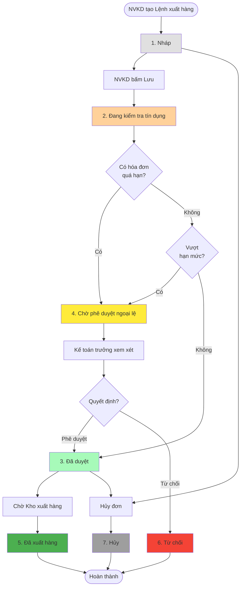
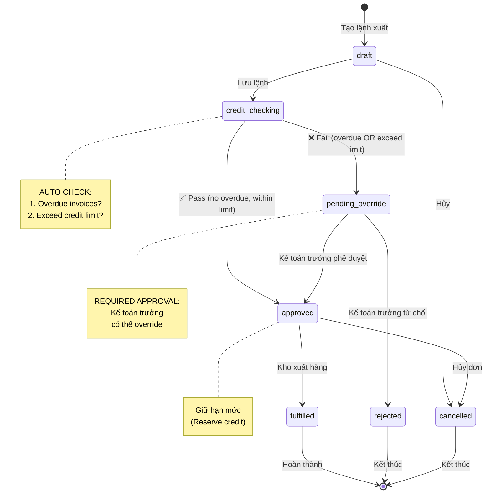

# Module Credit Management - Trạng thái (Status)

> **Phiên bản**: v1.0 - Credit Control Workflow
> **Ngày cập nhật**: 2026-01-14
> **Trạng thái**: Đề xuất - Chờ khách hàng Nhật Minh phê duyệt
> **Nguồn**: ERP_SPECIFICATION.md Section 2.6-2.8

---

## 📋 Tổng quan Module

### Mục đích

Quản lý và kiểm soát rủi ro tín dụng trong bán hàng chịu (credit sales) cho khách hàng đại lý.

### Phạm vi

- **Hạn mức tín dụng** (Credit Limit Management)
- **Kiểm tra công nợ tự động** (Automatic Credit Check)
- **Cảnh báo vượt hạn mức** (Overdue Alert)
- **Quy trình phê duyệt ngoại lệ** (Exception Approval Workflow)

### Vai trò liên quan

| Vai trò | Trách nhiệm |
|---------|-------------|
| **Kinh doanh (Sales)** | Tạo lệnh xuất hàng, kiểm tra công nợ KH |
| **Kế toán trưởng (Chief Accountant)** | Phê duyệt ngoại lệ (override credit limit) |
| **Manager** | Cập nhật hạn mức công nợ cho KH |
| **Hệ thống (System)** | Tự động check credit trước khi cho phép xuất hàng |

---

## 📊 Danh sách trạng thái

### A. Trạng thái Lệnh xuất hàng (Sales Order - with Credit Check)

| # | Trạng thái | Code | Màu | Mô tả | Loại |
|---|------------|------|-----|-------|------|
| 1 | **Nháp** | `draft` | #e0e0e0 | Lệnh xuất mới tạo, chưa kiểm tra credit | Active |
| 2 | **Đang kiểm tra tín dụng** | `credit_checking` | #ffd19a | System đang check hạn mức & công nợ quá hạn | Active |
| 3 | **Đã duyệt** | `approved` | #a7fab9 | Pass credit check, sẵn sàng xuất hàng | Active |
| 4 | **Chờ phê duyệt ngoại lệ** | `pending_override` | #ffeb3b | Fail credit check, cần Kế toán trưởng duyệt | Active |
| 5 | **Đã xuất hàng** | `fulfilled` | #4caf50 | Kho đã xuất hàng thực tế | Terminal |
| 6 | **Từ chối** | `rejected` | #f44336 | Kế toán trưởng từ chối xuất hàng | Terminal |
| 7 | **Hủy** | `cancelled` | #9e9e9e | Khách hàng/NVKD hủy đơn | Terminal |

### Phân loại

- **Active**: Trạng thái đang hoạt động, có thể chuyển sang trạng thái khác
- **Terminal**: Trạng thái kết thúc, không thể chuyển sang trạng thái khác

---

### B. Trạng thái Credit Limit (Hạn mức công nợ)

| # | Trạng thái | Code | Màu | Mô tả |
|---|------------|------|-----|-------|
| 1 | **Còn hạn mức** | `available` | #a7fab9 | Available credit > 0 |
| 2 | **Gần đạt hạn mức** | `near_limit` | #ffd19a | Available credit < 20% |
| 3 | **Hết hạn mức** | `limit_exceeded` | #f44336 | Available credit ≤ 0 |
| 4 | **Có nợ quá hạn** | `overdue` | #ff5722 | Có hóa đơn quá hạn thanh toán |

---

## 🔄 Workflow - Luồng chuyển đổi

### 1. Workflow Lệnh xuất hàng (với Credit Check)



---

### 2. State Machine Diagram



---

## 📐 Business Rules

### Rule 1: Credit Check Logic

**Trigger:** Khi NVKD lưu "Lệnh xuất hàng"

**Điều kiện Pass (Approved):**

```python
def check_credit(customer_id, order_value):
    """
    2 điều kiện bắt buộc (theo ERP_SPECIFICATION.md line 158-161):

    1. Khách hàng không có hóa đơn quá hạn
    2. (Công nợ hiện tại + Công nợ dự kiến + Giá trị lệnh xuất) ≤ Hạn mức
    """

    # Điều kiện 1: Kiểm tra hóa đơn quá hạn
    overdue_invoices = get_overdue_invoices(customer_id)
    if len(overdue_invoices) > 0:
        return {
            "status": "pending_override",
            "reason": "Khách hàng có hóa đơn quá hạn",
            "overdue_count": len(overdue_invoices),
            "overdue_amount": sum(inv.amount for inv in overdue_invoices)
        }

    # Điều kiện 2: Kiểm tra hạn mức
    current_debt = get_current_debt(customer_id)
    pending_orders = get_pending_shipment_value(customer_id)  # Lệnh xuất đã duyệt chưa xuất
    credit_limit = get_credit_limit(customer_id)

    total_exposure = current_debt + pending_orders + order_value
    available_credit = credit_limit - total_exposure

    if total_exposure > credit_limit:
        return {
            "status": "pending_override",
            "reason": "Vượt hạn mức công nợ",
            "credit_limit": credit_limit,
            "current_debt": current_debt,
            "pending_orders": pending_orders,
            "current_order": order_value,
            "total_exposure": total_exposure,
            "exceed_amount": total_exposure - credit_limit
        }

    # Pass cả 2 điều kiện
    return {
        "status": "approved",
        "reason": "Đủ điều kiện xuất hàng",
        "available_credit": available_credit
    }
```

---

### Rule 2: Override Approval

**Điều kiện:** Lệnh xuất hàng có status = `pending_override`

**Người duyệt:** Kế toán trưởng

**Hành động:**
- **Approve:** Chuyển status → `approved`
- **Reject:** Chuyển status → `rejected`

**Ghi chú:** Hệ thống phải log lại lý do override (audit trail)

---

### Rule 3: Credit Reservation (Giữ hạn mức)

**Trigger:** Lệnh xuất chuyển sang status = `approved`

**Logic:**
```python
def reserve_credit(customer_id, order_value):
    """
    Khi lệnh xuất được duyệt (approved):
    - Tính vào "Công nợ dự kiến"
    - Giảm "Available Credit"
    - Không tính vào "Current Debt" (chưa xuất hóa đơn)
    """

    # Lấy thông tin hiện tại
    credit_data = get_customer_credit(customer_id)

    # Cập nhật công nợ dự kiến
    new_pending = credit_data.pending_orders + order_value
    new_available = credit_data.credit_limit - credit_data.current_debt - new_pending

    # Update database
    update_customer_credit(
        customer_id=customer_id,
        pending_orders=new_pending,
        available_credit=new_available
    )
```

**Release reservation:** Khi lệnh xuất chuyển sang `fulfilled` hoặc `cancelled`

---

### Rule 4: Aging Report (Báo cáo công nợ theo độ tuổi)

**Phân loại công nợ:**

| Khoảng thời gian | Loại | Mức độ |
|------------------|------|--------|
| 0-30 ngày | Trong hạn | ✅ Normal |
| 31-60 ngày | Quá hạn 1 tháng | ⚠️ Warning |
| 61-90 ngày | Quá hạn 2 tháng | 🔴 Alert |
| 90+ ngày | Nợ xấu | ❌ Critical |

**Hành động:**
- **31-60 ngày:** Gửi thông báo nhắc nhở KH
- **61-90 ngày:** Tạm dừng xuất hàng mới
- **90+ ngày:** Block tất cả giao dịch

---

## 🎯 Key Performance Indicators (KPI)

### 1. Credit Utilization Rate

**Formula:**
```
Credit Utilization = (Current Debt + Pending Orders) / Credit Limit × 100%
```

**Thresholds:**
- **< 70%:** ✅ Good (Safe zone)
- **70-90%:** ⚠️ Medium (Monitor closely)
- **> 90%:** 🔴 High (Risk zone)

---

### 2. Overdue Rate

**Formula:**
```
Overdue Rate = Overdue Amount / Total Receivables × 100%
```

**Target:** < 5%

---

### 3. Days Sales Outstanding (DSO)

**Formula:**
```
DSO = (Accounts Receivable / Total Credit Sales) × Number of Days
```

**Industry benchmark:** 30-60 days

---

## 📊 Database Schema

### Table: `credit_limit`

| Column | Type | Description |
|--------|------|-------------|
| `id` | INT | Primary key |
| `customer_id` | INT | Foreign key → Customer |
| `credit_limit` | DECIMAL(15,2) | Hạn mức tín dụng (VND) |
| `effective_date` | DATE | Ngày áp dụng |
| `expiry_date` | DATE | Ngày hết hạn |
| `account_code` | VARCHAR(20) | Tài khoản công nợ |
| `approved_by` | INT | Manager phê duyệt |
| `attachment` | VARCHAR(255) | File đính kèm |
| `status` | ENUM | active, expired, suspended |
| `created_at` | TIMESTAMP | Ngày tạo |
| `updated_at` | TIMESTAMP | Ngày cập nhật |

---

### Table: `sales_order` (Credit-related fields)

| Column | Type | Description |
|--------|------|-------------|
| `id` | INT | Primary key |
| `customer_id` | INT | Foreign key → Customer |
| `order_value` | DECIMAL(15,2) | Giá trị đơn hàng |
| `status` | ENUM | draft, credit_checking, approved, pending_override, fulfilled, rejected, cancelled |
| `credit_check_result` | JSON | Kết quả check credit |
| `override_approved_by` | INT | Kế toán trưởng duyệt override |
| `override_reason` | TEXT | Lý do override |
| `override_at` | TIMESTAMP | Thời gian override |

**JSON structure for `credit_check_result`:**
```json
{
  "status": "pending_override",
  "reason": "Vượt hạn mức công nợ",
  "credit_limit": 500000000,
  "current_debt": 350000000,
  "pending_orders": 100000000,
  "current_order": 80000000,
  "total_exposure": 530000000,
  "exceed_amount": 30000000,
  "checked_at": "2026-01-14T10:30:00Z"
}
```

---

### Table: `invoice` (for Overdue tracking)

| Column | Type | Description |
|--------|------|-------------|
| `id` | INT | Primary key |
| `customer_id` | INT | Foreign key → Customer |
| `invoice_date` | DATE | Ngày xuất hóa đơn |
| `due_date` | DATE | Hạn thanh toán |
| `amount` | DECIMAL(15,2) | Giá trị hóa đơn |
| `paid_amount` | DECIMAL(15,2) | Đã thanh toán |
| `outstanding_amount` | DECIMAL(15,2) | Còn nợ |
| `overdue_days` | INT | Số ngày quá hạn (computed) |
| `aging_bucket` | ENUM | 0-30, 31-60, 61-90, 90+ |

**Computed field:**
```sql
overdue_days = DATEDIFF(CURRENT_DATE, due_date)
```

---

## 🎨 UI/UX Requirements

### 1. Màn hình "Lệnh xuất hàng" - Credit Info Panel

**Vị trí:** Sidebar bên phải form

**Hiển thị thông tin:**

```
┌─────────────────────────────────────┐
│ 💳 THÔNG TIN TÍN DỤNG KHÁCH HÀNG   │
├─────────────────────────────────────┤
│ Hạn mức:           500,000,000 VND  │
│ Công nợ hiện tại:  350,000,000 VND  │
│ Lệnh xuất chưa xuất: 100,000,000    │
│ Đơn hiện tại:       80,000,000      │
├─────────────────────────────────────┤
│ Tổng rủi ro:       530,000,000 ❌   │
│ Vượt hạn mức:       30,000,000      │
├─────────────────────────────────────┤
│ ⚠️ CẢN

H BÁO                      │
│ - Vượt hạn mức 30 triệu             │
│ - Cần Kế toán trưởng phê duyệt      │
└─────────────────────────────────────┘
```

**Color coding:**
- ✅ Green: Available credit > 20%
- ⚠️ Yellow: Available credit 0-20%
- ❌ Red: Exceed credit limit

---

### 2. Màn hình "Hạn mức công nợ" - List View

**Columns:**
- Mã KH
- Tên KH
- Hạn mức
- Công nợ hiện tại
- Tỷ lệ sử dụng (%)
- Trạng thái (Available / Near Limit / Exceeded)
- Số hóa đơn quá hạn
- Hành động (Edit, View Details)

**Filters:**
- Trạng thái hạn mức
- Có nợ quá hạn
- Nhóm khách hàng

---

### 3. Popup "Override Approval" (Kế toán trưởng)

```
┌───────────────────────────────────────────┐
│ PHÊ DUYỆT NGOẠI LỆ - LỆNH XUẤT #SO-2026 │
├───────────────────────────────────────────┤
│ Khách hàng: Đại lý ABC                    │
│ Lý do chặn:                               │
│ ❌ Vượt hạn mức 30,000,000 VND            │
│                                           │
│ Chi tiết:                                 │
│ - Hạn mức: 500,000,000                    │
│ - Công nợ hiện tại: 350,000,000           │
│ - Lệnh xuất chưa xuất: 100,000,000        │
│ - Đơn hiện tại: 80,000,000                │
│ ─────────────────────────────────────────│
│ Lý do phê duyệt (required): [ textarea ] │
│                                           │
│ [ ✅ PHÊ DUYỆT ]  [ ❌ TỪ CHỐI ]         │
└───────────────────────────────────────────┘
```

---

## 🔔 Notifications & Alerts

### 1. Email Alert - Vượt hạn mức

**Recipient:** Kế toán trưởng, Manager

**Trigger:** Lệnh xuất chuyển sang `pending_override`

**Subject:** `[Cần phê duyệt] Lệnh xuất #SO-2026 vượt hạn mức - KH Đại lý ABC`

**Body:**
```
Kính gửi Kế toán trưởng,

Lệnh xuất hàng #SO-2026 cần phê duyệt ngoại lệ:

- Khách hàng: Đại lý ABC (KH-12345)
- Nhân viên kinh doanh: Nguyễn Văn A
- Giá trị đơn hàng: 80,000,000 VND
- Lý do chặn: Vượt hạn mức 30,000,000 VND

Chi tiết tín dụng:
- Hạn mức: 500,000,000 VND
- Công nợ hiện tại: 350,000,000 VND
- Lệnh xuất chưa xuất: 100,000,000 VND
- Tổng rủi ro nếu duyệt: 530,000,000 VND

Vui lòng xem xét và phê duyệt tại:
[Link to approval page]

Trân trọng,
Hệ thống DCNET Flow
```

---

### 2. In-app Notification - Hóa đơn sắp quá hạn

**Recipient:** NVKD phụ trách khách hàng

**Trigger:** 3 ngày trước `due_date`

**Content:**
```
🔔 Hóa đơn #INV-2026-001 của KH Đại lý ABC sắp đến hạn thanh toán (còn 3 ngày)
Giá trị: 50,000,000 VND
Hạn thanh toán: 17/01/2026
```

---

### 3. SMS Alert - Nợ quá hạn

**Recipient:** Khách hàng

**Trigger:** 1 ngày sau `due_date`

**Content:**
```
[Nhat Minh Sport] Quy khach vui long thanh toan hoa don #INV-2026-001 gia tri 50 trieu VND. Han thanh toan: 14/01/2026. Lien he: 0901234567
```

---

## 📈 Reports

### 1. Báo cáo Aging (Công nợ theo độ tuổi)

**Columns:**
- Mã KH
- Tên KH
- 0-30 ngày
- 31-60 ngày
- 61-90 ngày
- 90+ ngày
- Tổng công nợ

**Footer:** Tổng cộng theo từng cột

---

### 2. Báo cáo Credit Utilization

**Group by:** Khách hàng

**Columns:**
- Mã KH
- Tên KH
- Hạn mức
- Công nợ hiện tại
- Lệnh xuất chưa xuất
- Tổng rủi ro
- Tỷ lệ sử dụng (%)
- Available credit
- Trạng thái

---

### 3. Báo cáo Override Log

**Columns:**
- Ngày
- Lệnh xuất #
- Khách hàng
- Lý do chặn
- Người duyệt override
- Lý do override
- Kết quả (Approved/Rejected)

**Purpose:** Audit trail cho compliance

---

## 🔐 Security & Permissions

### Role-based Access Control

| Role | Quyền |
|------|-------|
| **Sale (NVKD)** | View credit info, Create sales order |
| **Manager** | Update credit limit, View reports |
| **Kế toán trưởng** | Override approval, View all reports |
| **Kho** | Không xem giá, không sửa thông tin KH |

### Data Masking

- **Kho:** Mask đơn giá, thành tiền trên lệnh xuất
- **Sale:** Không xem credit limit của KH khác (chỉ KH của mình)

---

## 🧪 Test Scenarios

### Scenario 1: Pass Credit Check

**Given:**
- KH có hạn mức: 500 triệu
- Công nợ hiện tại: 200 triệu
- Không có hóa đơn quá hạn

**When:** Tạo lệnh xuất 100 triệu

**Then:**
- Status = `approved`
- Available credit = 200 triệu

---

### Scenario 2: Fail - Exceed Limit

**Given:**
- KH có hạn mức: 500 triệu
- Công nợ hiện tại: 400 triệu

**When:** Tạo lệnh xuất 150 triệu

**Then:**
- Status = `pending_override`
- Reason = "Vượt hạn mức 50 triệu"
- Email gửi Kế toán trưởng

---

### Scenario 3: Fail - Overdue Invoice

**Given:**
- KH có 1 hóa đơn quá hạn 10 ngày

**When:** Tạo lệnh xuất bất kỳ

**Then:**
- Status = `pending_override`
- Reason = "Có hóa đơn quá hạn"

---

### Scenario 4: Override Approved

**Given:**
- Lệnh xuất ở status = `pending_override`

**When:** Kế toán trưởng click "Phê duyệt"

**Then:**
- Status → `approved`
- Log ghi lại: approver, reason, timestamp

---

## 📚 Business Glossary

| Thuật ngữ | Định nghĩa |
|-----------|------------|
| **Credit Limit** | Hạn mức tín dụng - Số tiền tối đa KH được nợ |
| **Current Debt** | Công nợ hiện tại - Tổng hóa đơn chưa thanh toán |
| **Pending Orders** | Công nợ dự kiến - Lệnh xuất đã duyệt chưa xuất kho |
| **Total Exposure** | Tổng rủi ro tín dụng - Current Debt + Pending + Current Order |
| **Available Credit** | Tín dụng khả dụng - Credit Limit - Total Exposure |
| **Overdue Invoice** | Hóa đơn quá hạn - Invoice có `due_date` < today |
| **Aging** | Độ tuổi công nợ - Số ngày kể từ `due_date` |
| **Override** | Phê duyệt ngoại lệ - Bypass credit check rule |

---

## 🎯 Success Metrics

### Implementation Success

- ✅ 100% lệnh xuất hàng phải qua credit check
- ✅ 0% lệnh xuất vượt hạn mức mà không có override approval
- ✅ Audit log đầy đủ cho mọi override action

### Business Impact

- 📉 Giảm 30% nợ xấu (90+ ngày) trong 6 tháng
- 📉 Giảm 50% số lệnh xuất cần override (do quản lý credit tốt hơn)
- 📈 Tăng 20% tỷ lệ thu hồi công nợ đúng hạn

---

## 📝 Notes & Considerations

### Integration Points

1. **Với Lệnh xuất hàng:** Embed credit check vào save action
2. **Với Hóa đơn bán hàng:** Cập nhật current debt khi tạo invoice
3. **Với Phiếu thu tiền:** Giảm current debt khi thanh toán
4. **Với Kế hoạch bán hàng:** So sánh credit limit vs target sales

### Technical Considerations

- **Performance:** Cache credit info to avoid repeated DB queries
- **Concurrency:** Lock customer record khi check credit (prevent race condition)
- **Scalability:** Index on `customer_id`, `due_date` for fast lookup

### Future Enhancements

- 🔮 **AI-powered credit scoring:** Dự đoán khả năng thanh toán của KH
- 🔮 **Auto-adjustment:** Tự động tăng/giảm hạn mức dựa trên payment history
- 🔮 **Integration with banks:** Real-time payment verification

---

**© 2025 DCNET Corporation - Powered by DCNET Cloud**
