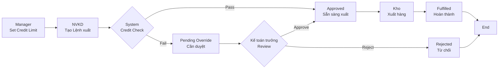
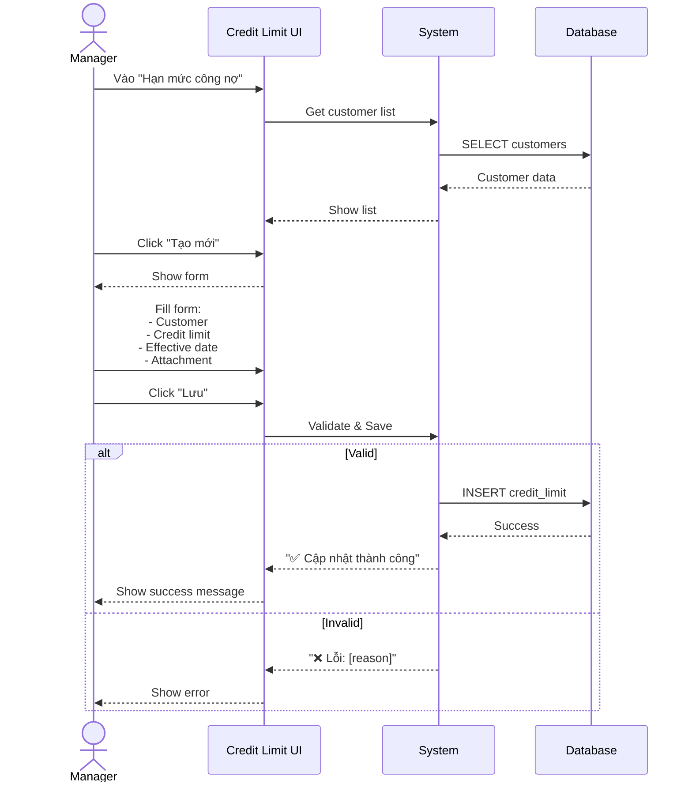
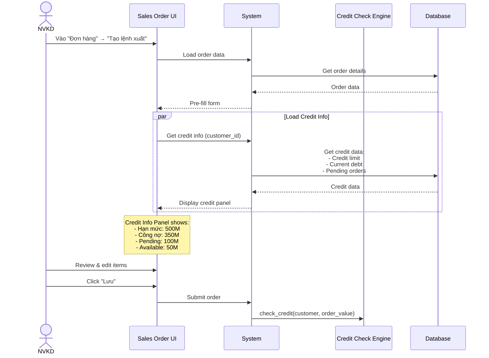
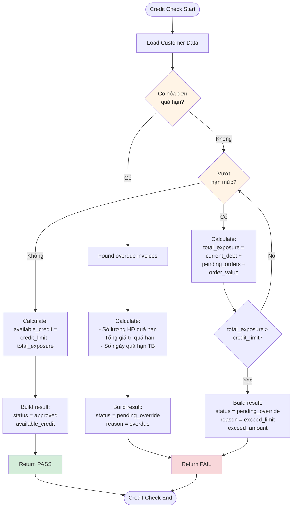
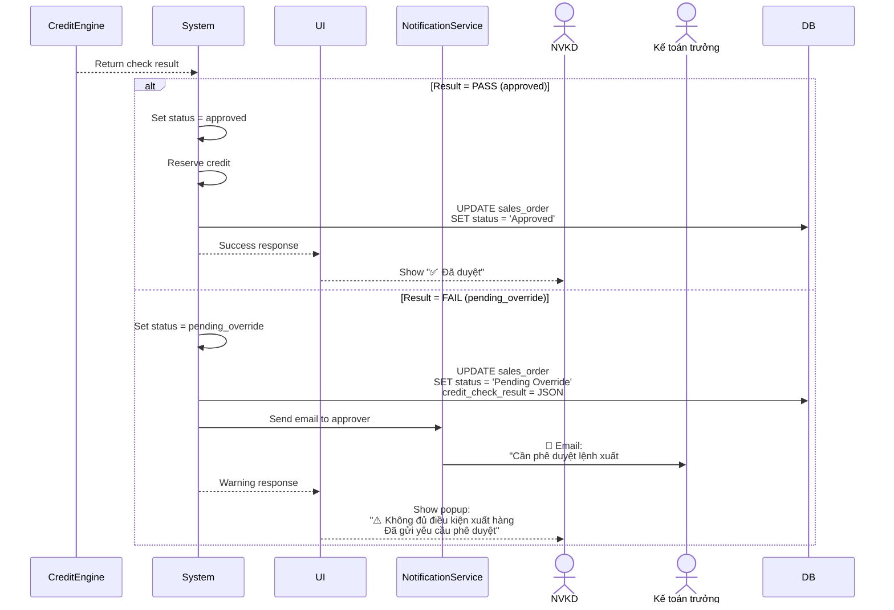
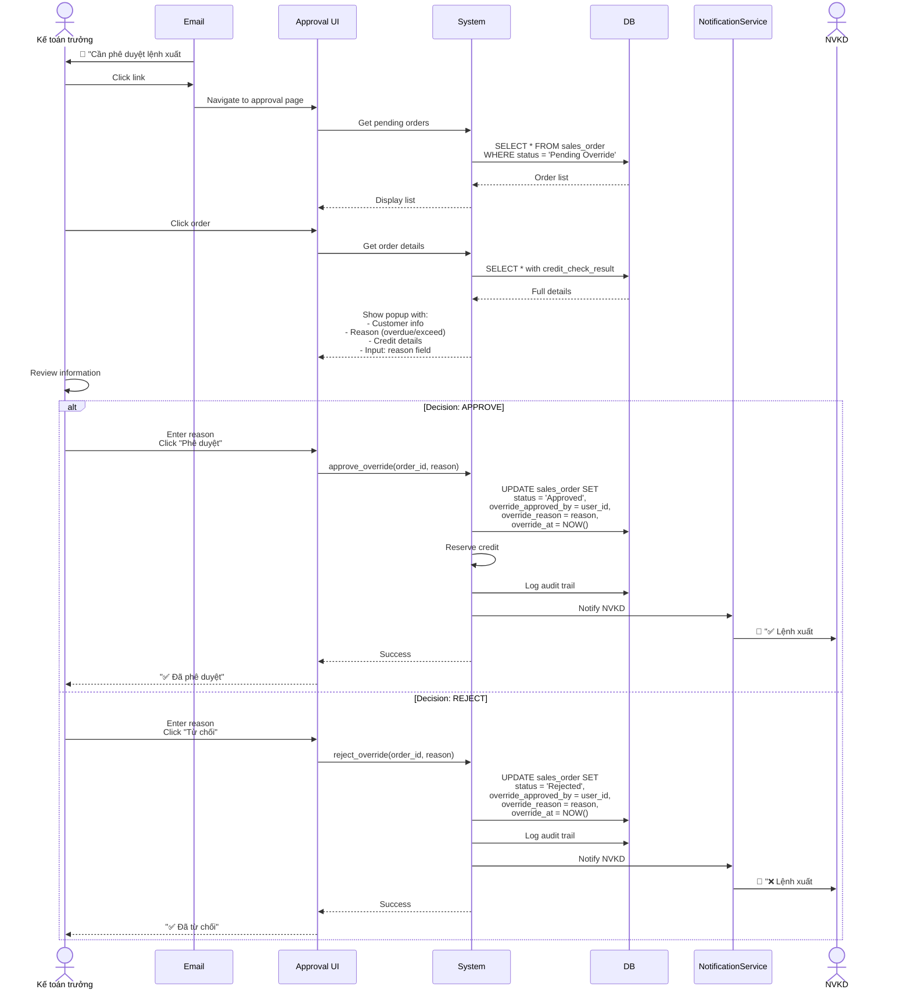
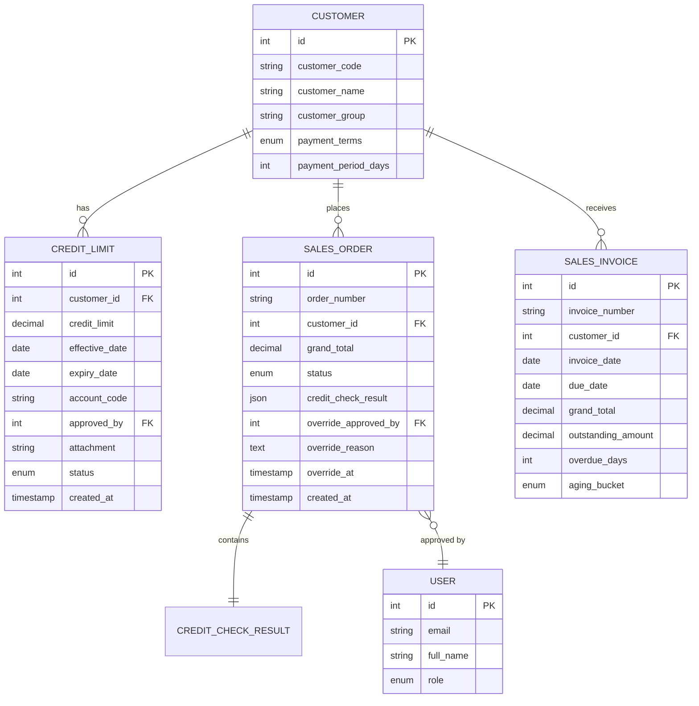
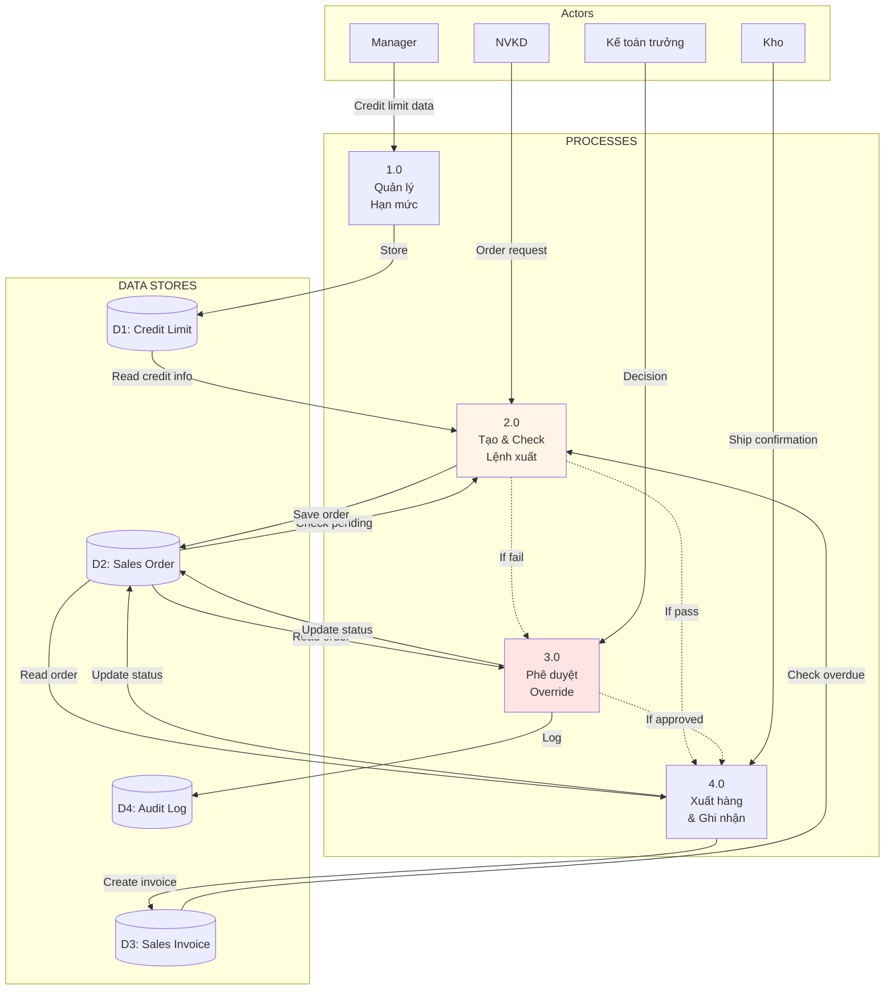

# Module Credit Management - Workflow & Data Flow

> **Phiên bản**: v1.0
> **Ngày cập nhật**: 2026-01-14
> **Nguồn**: ERP_SPECIFICATION.md Section 2.6-2.8

---

## 📊 Tổng quan Workflow

### Business Process Overview



### Key Components

| Component | Mô tả | Owner |
|-----------|-------|-------|
| **Credit Limit** | Hạn mức tín dụng cho KH | Manager |
| **Credit Check** | Kiểm tra tự động khi tạo lệnh xuất | System |
| **Override Approval** | Phê duyệt ngoại lệ | Kế toán trưởng |
| **Credit Reservation** | Giữ hạn mức khi approved | System |

---

## 🔄 Workflow Chi tiết

### Workflow 1: Cập nhật Hạn mức công nợ

**Nguồn:** ERP_SPECIFICATION.md line 137-150



**Input:**
- Mã khách hàng
- Giá trị hạn mức (VND)
- Ngày áp dụng
- Tài khoản công nợ
- File đính kèm (optional)

**Output:**
- Credit limit record created
- Áp dụng cho tất cả lệnh xuất từ ngày hiệu lực

**Business Rules:**
- Hạn mức phải > 0
- Một KH chỉ có 1 hạn mức active tại 1 thời điểm
- Hạn mức mới override hạn mức cũ (theo effective_date)

---

### Workflow 2: Tạo Lệnh xuất hàng với Credit Check

**Nguồn:** ERP_SPECIFICATION.md line 110-134, 152-162

#### Step 1: Tạo lệnh xuất



#### Step 2: Credit Check Logic



**Code Logic:**
```python
def check_credit(customer_id, order_value):
    """
    2 điều kiện bắt buộc (ERP_SPECIFICATION.md line 158-161):
    1. Không có hóa đơn quá hạn
    2. (Current Debt + Pending + Order) ≤ Credit Limit
    """

    # Step 1: Check overdue invoices
    overdue = frappe.db.sql("""
        SELECT name, due_date, outstanding_amount,
               DATEDIFF(CURDATE(), due_date) as overdue_days
        FROM `tabSales Invoice`
        WHERE customer = %s
          AND due_date < CURDATE()
          AND outstanding_amount > 0
          AND docstatus = 1
    """, customer_id, as_dict=True)

    if overdue:
        return {
            "status": "pending_override",
            "reason": "overdue_invoices",
            "overdue_count": len(overdue),
            "overdue_amount": sum(inv.outstanding_amount for inv in overdue),
            "overdue_list": overdue
        }

    # Step 2: Check credit limit
    credit_data = frappe.db.get_value(
        "Credit Limit",
        {"customer": customer_id, "status": "Active"},
        ["credit_limit", "effective_date"],
        as_dict=True
    )

    if not credit_data:
        return {
            "status": "pending_override",
            "reason": "no_credit_limit",
            "message": "Khách hàng chưa có hạn mức tín dụng"
        }

    # Get current debt
    current_debt = frappe.db.sql("""
        SELECT SUM(outstanding_amount) as total
        FROM `tabSales Invoice`
        WHERE customer = %s
          AND docstatus = 1
          AND outstanding_amount > 0
    """, customer_id)[0][0] or 0

    # Get pending orders (approved but not shipped)
    pending_orders = frappe.db.sql("""
        SELECT SUM(grand_total) as total
        FROM `tabSales Order`
        WHERE customer = %s
          AND status = 'Approved'
          AND docstatus = 1
    """, customer_id)[0][0] or 0

    # Calculate total exposure
    total_exposure = current_debt + pending_orders + order_value
    credit_limit = credit_data.credit_limit

    if total_exposure > credit_limit:
        return {
            "status": "pending_override",
            "reason": "exceed_limit",
            "credit_limit": credit_limit,
            "current_debt": current_debt,
            "pending_orders": pending_orders,
            "current_order": order_value,
            "total_exposure": total_exposure,
            "exceed_amount": total_exposure - credit_limit
        }

    # Pass all checks
    available_credit = credit_limit - total_exposure
    return {
        "status": "approved",
        "reason": "pass",
        "available_credit": available_credit,
        "credit_utilization": (total_exposure / credit_limit * 100) if credit_limit > 0 else 0
    }
```

#### Step 3: Handle Check Result



---

### Workflow 3: Override Approval (Phê duyệt ngoại lệ)

**Nguồn:** ERP_SPECIFICATION.md line 158-162



**Business Rules:**
- Chỉ Kế toán trưởng có quyền override
- Bắt buộc nhập lý do (audit trail)
- Mỗi lệnh xuất chỉ được xem xét 1 lần
- Log đầy đủ: who, when, why

---

## 📊 Entity Relationship Diagram (ERD)



---

## 🔄 State Transition Matrix

| From State | Event | To State | Condition | Actor |
|------------|-------|----------|-----------|-------|
| - | Create | `draft` | Always | NVKD |
| `draft` | Save | `credit_checking` | Always | System |
| `credit_checking` | Pass check | `approved` | No overdue + Within limit | System |
| `credit_checking` | Fail check | `pending_override` | Overdue OR Exceed limit | System |
| `pending_override` | Approve | `approved` | Kế toán trưởng approve | Kế toán trưởng |
| `pending_override` | Reject | `rejected` | Kế toán trưởng reject | Kế toán trưởng |
| `approved` | Ship | `fulfilled` | Kho xuất hàng | Kho |
| `approved` | Cancel | `cancelled` | User cancel | NVKD/Manager |
| `draft` | Cancel | `cancelled` | User cancel | NVKD |

---

## 📈 Data Flow Diagram (Level 1)



---

## 🎯 Integration Points

### 1. Integration với Đơn hàng bán (Sales Order)

**Trigger:** Khi tạo "Lệnh xuất hàng" từ Sales Order

**Data Flow:**
```
Sales Order → Lệnh xuất hàng
├── Copy: customer_id, items, quantities, prices
├── Trigger: Credit Check
└── Update: Sales Order status based on credit check result
```

**Hook Point:** `before_save` event của Sales Order DocType

---

### 2. Integration với Hóa đơn bán hàng (Sales Invoice)

**Trigger:** Khi tạo Sales Invoice

**Data Flow:**
```
Sales Invoice Created/Paid
├── Update: Current Debt
├── Update: Overdue Status
└── Release: Reserved Credit (if invoice is paid)
```

**Hook Points:**
- `on_submit`: Tăng current debt
- `on_payment`: Giảm current debt, check if overdue cleared

---

### 3. Integration với Phiếu thu tiền (Payment Entry)

**Trigger:** Khi nhận thanh toán từ KH

**Data Flow:**
```
Payment Entry
├── Decrease: Current Debt
├── Clear: Overdue status (if applicable)
└── Recalculate: Available Credit
```

**Hook Point:** `on_submit` event của Payment Entry

---

## 📊 Performance Considerations

### Caching Strategy

```python
# Cache credit info to avoid repeated queries
def get_customer_credit_cached(customer_id):
    cache_key = f"credit_info:{customer_id}"
    cached = frappe.cache().get(cache_key)

    if cached:
        return cached

    # Calculate fresh data
    credit_info = calculate_credit_info(customer_id)

    # Cache for 5 minutes
    frappe.cache().setex(cache_key, 300, credit_info)

    return credit_info

# Invalidate cache when relevant data changes
def invalidate_credit_cache(customer_id):
    cache_key = f"credit_info:{customer_id}"
    frappe.cache().delete(cache_key)
```

**Cache invalidation triggers:**
- Sales Invoice created/updated
- Payment Entry created
- Credit Limit updated
- Sales Order status changed

---

### Database Indexing

```sql
-- Optimize overdue invoice queries
CREATE INDEX idx_invoice_overdue
ON `tabSales Invoice` (customer, due_date, outstanding_amount, docstatus);

-- Optimize pending order queries
CREATE INDEX idx_order_pending
ON `tabSales Order` (customer, status, docstatus);

-- Optimize credit limit lookup
CREATE INDEX idx_credit_limit_active
ON `tabCredit Limit` (customer, status, effective_date);
```

---

## 🔐 Security & Audit

### Audit Trail

**Log these events:**
- Credit limit created/updated
- Credit check performed (pass/fail)
- Override approved/rejected
- Credit reserved/released

**Log format:**
```json
{
  "timestamp": "2026-01-14T10:30:00Z",
  "event_type": "override_approved",
  "user_id": 123,
  "user_email": "ketoan@nhatminh.com",
  "sales_order": "SO-2026-001",
  "customer": "KH-12345",
  "reason": "Khách hàng VIP, có cam kết thanh toán trong tuần",
  "credit_data": {
    "credit_limit": 500000000,
    "total_exposure": 530000000,
    "exceed_amount": 30000000
  }
}
```

### Role-based Access Control

| Action | NVKD | Manager | Kế toán | Kế toán trưởng |
|--------|------|---------|---------|----------------|
| View credit info (own customers) | ✅ | ✅ | ✅ | ✅ |
| View credit info (all customers) | ❌ | ✅ | ✅ | ✅ |
| Create sales order | ✅ | ✅ | ❌ | ✅ |
| Update credit limit | ❌ | ✅ | ❌ | ✅ |
| Override credit check | ❌ | ❌ | ❌ | ✅ |
| View audit log | ❌ | ✅ | ✅ | ✅ |

---

## 📝 Key Takeaways

### 1. Tại sao cần Credit Management?

**Vấn đề:**
- Bán chịu cho đại lý → Rủi ro nợ xấu cao
- Không kiểm soát → Mất vốn, dòng tiền khó khăn

**Giải pháp:**
- Set credit limit
- Auto-check trước khi xuất hàng
- Override workflow cho exceptions

---

### 2. 2 điều kiện xuất hàng

```python
✅ Điều kiện 1: Không có hóa đơn quá hạn
✅ Điều kiện 2: (Current Debt + Pending + Order) ≤ Credit Limit
```

---

### 3. Best Practices

**DO:**
- ✅ Set credit limit cho tất cả khách hàng đại lý
- ✅ Review credit limit định kỳ (quarterly)
- ✅ Monitor aging report hàng tuần
- ✅ Log đầy đủ override decisions

**DON'T:**
- ❌ Skip credit check (ngay cả KH VIP)
- ❌ Override mà không ghi lý do
- ❌ Set credit limit quá cao ban đầu
- ❌ Bỏ qua cảnh báo hóa đơn quá hạn

---

**© 2025 DCNET Corporation - Powered by DCNET Cloud**
