# Module NhatMinh Connect - Diagrams

> **Nguồn:** Phân tích bravo-connect codebase
> **Lưu ý:** Diagrams dựa trên hệ thống HIỆN TẠI đang chạy production

---

## 1. Activity Diagram - Order Push Complete Flow

**Nguồn:** Phân tích bravo-connect codebase

```mermaid
flowchart TD
    A[Khách hàng đặt hàng] --> B[WooCommerce tạo Order]
    B --> C[Order status = pending]

    C --> D{Phương thức<br/>thanh toán?}

    D -->|COD| E[Auto chuyển status<br/>→ processing]
    D -->|Online payment| F[Status → on-hold]

    F --> G[Admin xác nhận<br/>đã nhận tiền]
    G --> H[Status → completed]

    E --> I[Hook triggered:<br/>woocommerce_order_status_changed]
    H --> I

    I --> J{new_status in<br/>[processing, completed]?}

    J -->|No| K[Plugin ignore<br/>không push]
    J -->|Yes| L[Plugin execute<br/>push order]

    L --> M[Call bravoAuth]
    M --> N[POST /token<br/>username, password]

    N --> O{Auth<br/>success?}

    O -->|No| P[Log error:<br/>Auth failed]
    O -->|Yes| Q[Receive access_token]

    Q --> R[Build order payload]

    R --> S[Loop through<br/>order items]

    S --> T{Product<br/>has SKU?}

    T -->|Yes| U[Add to DetailInfo:<br/>ItemCode, Quantity,<br/>OriginalAmount9,<br/>OriginalAmount]
    T -->|No| V[Add to Description:<br/>SP không SKU:<br/>Product name x Qty]

    U --> W{More<br/>items?}
    V --> W

    W -->|Yes| S
    W -->|No| X[Detect USER_PREFIX<br/>from subdomain]

    X --> Y{Subdomain?}

    Y -->|shop| Z[USER_PREFIX = SHOP]
    Y -->|origin/other| AA[USER_PREFIX = ORIGIN]

    Z --> AB[Build DocNo:<br/>SHOP + Order#]
    AA --> AC[Build DocNo:<br/>ORIGIN + Order#]

    AB --> AD[Set OrderSource:<br/>SHOP]
    AC --> AE[Set OrderSource:<br/>ORIGIN]

    AD --> AF{Order status?}
    AE --> AF

    AF -->|processing| AG[PaymentStatus = COD]
    AF -->|completed| AH[PaymentStatus =<br/>Đã chuyển khoản]

    AG --> AI[Complete payload JSON]
    AH --> AI

    AI --> AJ[POST /api/BravoWebApi/execute]
    AJ --> AK[Header:<br/>Authorization: Bearer token]

    AK --> AL{Bravo API<br/>response?}

    AL -->|200 OK| AM[Log success:<br/>Push Order To Bravo OK]
    AL -->|Error| AN[Log error:<br/>API call failed]

    AM --> AO[End]
    AN --> AO
    P --> AO
    K --> AO
```

---

## 2. Activity Diagram - Stock Update Flow

**Nguồn:** Phân tích bravo-connect codebase

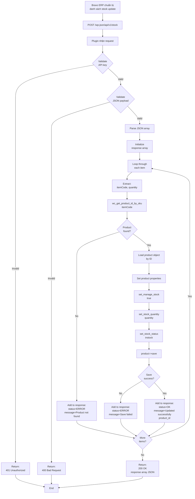

---

## 3. Activity Diagram - Bulk Update Tool Flow

**Nguồn:** Phân tích bravo-connect codebase

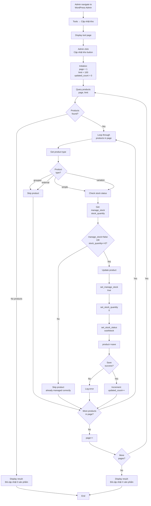

---

## 4. Flowchart - Multi-site USER_PREFIX Detection

**Nguồn:** Phân tích bravo-connect codebase

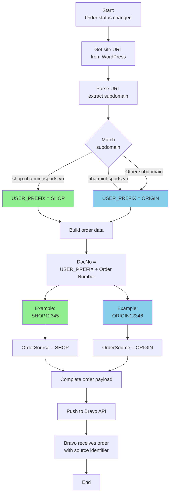

---

## 5. Flowchart - Product SKU Handling Logic

**Nguồn:** Phân tích bravo-connect codebase

```mermaid
flowchart TD
    A[Start:<br/>Processing order items] --> B[Initialize:<br/>DetailInfo = []<br/>Description = Customer note]

    B --> C[Get all order items]

    C --> D[Loop item by item]

    D --> E[Get product from item]

    E --> F{Product<br/>exists?}

    F -->|No| G[Skip item]

    F -->|Yes| H[Get product SKU]

    H --> I{SKU<br/>empty?}

    I -->|No - Has SKU| J[Extract item data]

    J --> K[ItemCode = SKU<br/>Quantity = item qty<br/>OriginalAmount9 = subtotal<br/>OriginalAmount = total]

    K --> L[Create item object]

    L --> M[Add to DetailInfo array]

    I -->|Yes - No SKU| N[Get product name<br/>and quantity]

    N --> O[Format string:<br/>SP không SKU:<br/>Product name x Qty]

    O --> P[Append to<br/>Description string]

    M --> Q{More<br/>items?}
    P --> Q
    G --> Q

    Q -->|Yes| D
    Q -->|No| R[Build final payload]

    R --> S[Payload contains:<br/>DetailInfo array<br/>with SKU items only]

    S --> T[Payload contains:<br/>Description string<br/>with no-SKU items]

    T --> U[Push to Bravo]

    U --> V[Bravo processes:<br/>DetailInfo automatically]

    V --> W[Bravo processes:<br/>Description manually]

    W --> X[End]

    style M fill:#90EE90
    style P fill:#FFB6C1
    style S fill:#90EE90
    style T fill:#FFB6C1
```

---

## 6. Component Diagram - Plugin Architecture

**Nguồn:** Phân tích bravo-connect codebase

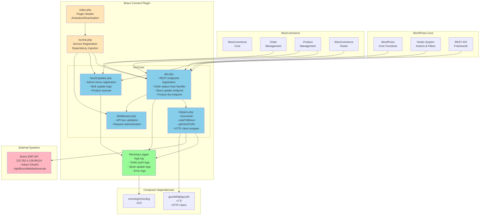

---

## 7. Sequence Diagram - Authentication Flow

**Nguồn:** Phân tích bravo-connect codebase

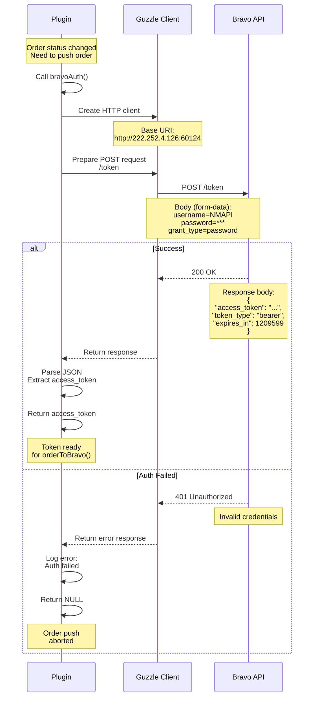

---

## 8. Sequence Diagram - Error Recovery (or Lack Thereof)

**Nguồn:** Phân tích bravo-connect codebase

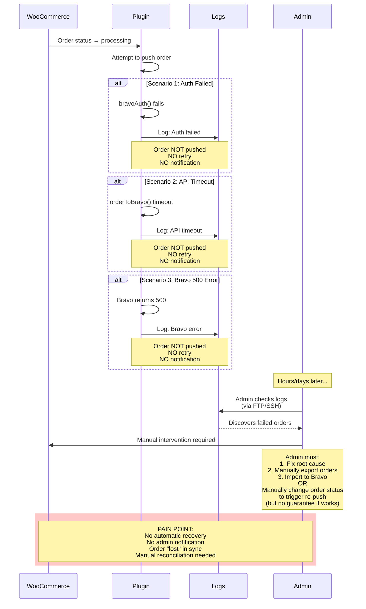

---

## 9. State Machine Diagram - Order Sync States

**Nguồn:** Phân tích bravo-connect codebase

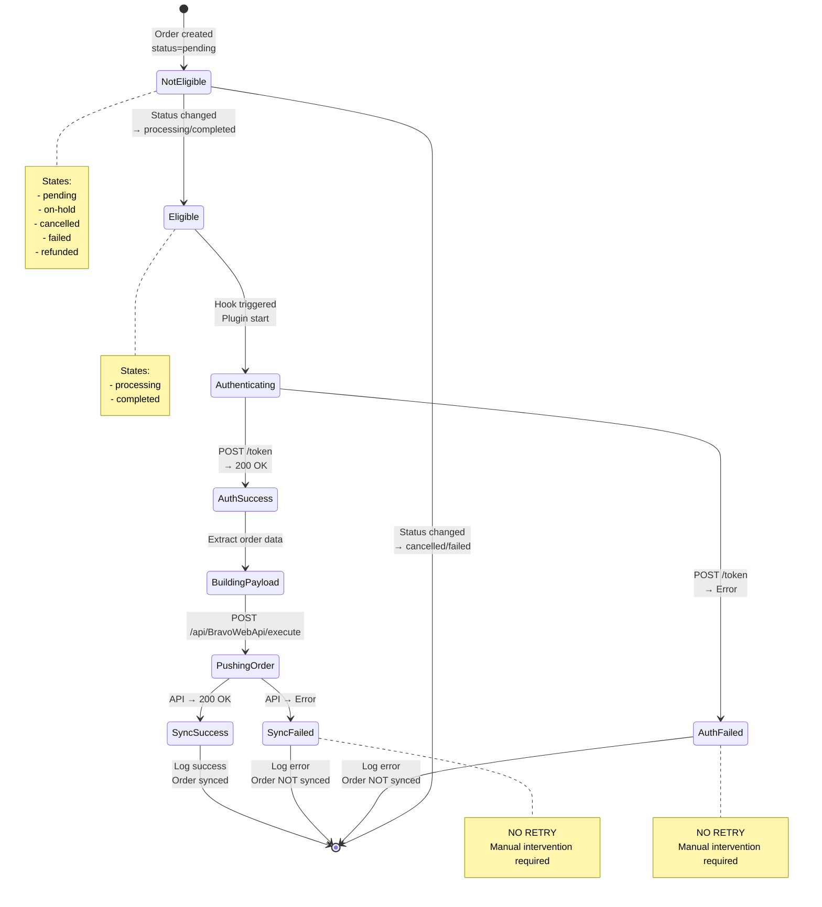

---

## 10. Data Flow Diagram - Complete Integration

**Nguồn:** Phân tích bravo-connect codebase

```mermaid
flowchart TB
    subgraph Customer["Customer Journey"]
        C1[Customer visits website]
        C2[Add products to cart]
        C3[Checkout]
        C4[Select payment method]
        C5[Place order]
    end

    subgraph WooCommerce["WooCommerce System"]
        WC1[Order created<br/>status: pending]
        WC2{Payment<br/>method?}
        WC3[Status: processing<br/>COD]
        WC4[Status: on-hold<br/>Online payment]
        WC5[Admin confirms<br/>→ completed]
    end

    subgraph Plugin["Bravo Connect"]
        P1[Hook listener<br/>order_status_changed]
        P2{Status in<br/>processing/completed?}
        P3[Extract order data]
        P4[Detect USER_PREFIX]
        P5[Process items<br/>SKU vs No-SKU]
        P6[Build payload]
        P7[Authenticate]
        P8[Push to Bravo]
        P9[Log result]
    end

    subgraph Bravo["Bravo ERP"]
        B1[/token endpoint<br/>OAuth2 Auth]
        B2[/api/BravoWebApi/execute<br/>Receive order]
        B3[Create SalesOrder<br/>in Bravo DB]
        B4[Calculate inventory]
        B5[Prepare stock data]
        B6[Call WooCommerce<br/>stock update API]
    end

    subgraph StockSync["Stock Sync"]
        S1[POST /api/v1/stock]
        S2[Validate API key]
        S3[Loop items]
        S4[Find product by SKU]
        S5[Update stock quantity]
        S6[Save product]
        S7[Return response]
    end

    C1 --> C2 --> C3 --> C4 --> C5
    C5 --> WC1
    WC1 --> WC2
    WC2 -->|COD| WC3
    WC2 -->|Online| WC4
    WC4 --> WC5

    WC3 --> P1
    WC5 --> P1

    P1 --> P2
    P2 -->|Yes| P3
    P2 -->|No| P9

    P3 --> P4 --> P5 --> P6 --> P7

    P7 --> B1
    B1 --> P8
    P8 --> B2

    B2 --> B3
    B3 --> P9

    B3 --> B4
    B4 --> B5
    B5 --> B6

    B6 --> S1
    S1 --> S2 --> S3 --> S4 --> S5 --> S6 --> S7

    S7 --> B5

    style C5 fill:#FFE4B5
    style WC3 fill:#90EE90
    style WC5 fill:#87CEEB
    style P8 fill:#FFB6C1
    style B3 fill:#FFB6C1
    style S6 fill:#98FB98
```

---

## 11. Deployment Diagram - System Topology

**Nguồn:** Phân tích bravo-connect codebase

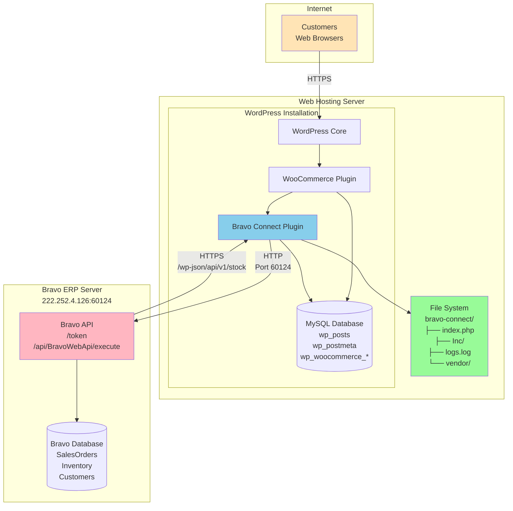

---

## 12. Mindmap - Plugin Feature Overview

**Nguồn:** Phân tích bravo-connect codebase

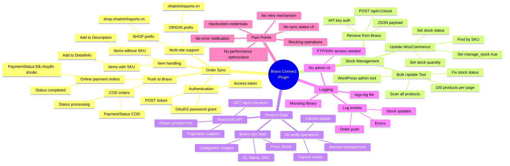

---

## 13. Comparison Diagram - Current vs Proposed FlowNext

**Nguồn:** Phân tích bravo-connect codebase + Đề xuất

```mermaid
graph TB
    subgraph Current["Current: Bravo Connect"]
        C1[WooCommerce]
        C2[Bravo Connect Plugin]
        C3[Bravo ERP<br/>222.252.4.126]

        C1 -->|Hook: Sync| C2
        C2 -->|HTTP: Push Order| C3
        C3 -->|HTTP: Update Stock| C2
        C2 -->|Direct: Update DB| C1

        C_Issues[Issues:<br/>❌ No retry<br/>❌ No notification<br/>❌ Hardcoded keys<br/>❌ Blocking calls<br/>❌ No admin UI]
    end

    subgraph Proposed["Proposed: FlowNext Connect"]
        P1[WooCommerce]
        P2[FlowNext Connect Plugin]
        P3[Queue System<br/>WP Cron/Redis]
        P4[FlowNext API<br/>api.flownext.dcnet.vn]
        P5[FlowNext Database]
        P6[Admin Dashboard]

        P1 -->|Hook: Enqueue| P2
        P2 -->|Async: Add to Queue| P3
        P3 -->|Background: Process| P4
        P4 -->|RESTful API| P5
        P4 -->|Webhook: Stock Update| P2
        P2 -->|Update| P1
        P2 -->|UI: Status| P6
        P6 -->|View/Retry| P2

        P_Benefits[Benefits:<br/>✅ Auto retry (3 attempts)<br/>✅ Email notifications<br/>✅ Environment config<br/>✅ Non-blocking<br/>✅ Full admin UI<br/>✅ Sync status tracking<br/>✅ Manual retry button<br/>✅ Error dashboard]
    end

    Current -.->|Migration Path| Proposed

    style C_Issues fill:#FFB6C1
    style P_Benefits fill:#90EE90
```

---

## 14. Timeline Diagram - Order Sync Lifecycle

**Nguồn:** Phân tích bravo-connect codebase

```mermaid
gantt
    title Order Sync Lifecycle (Current Implementation)
    dateFormat  HH:mm:ss
    axisFormat %H:%M:%S

    section Customer
    Place order           :a1, 08:00:00, 5s
    Order pending         :a2, after a1, 10s

    section WooCommerce
    Status → processing   :b1, after a2, 1s
    Hook triggered        :b2, after b1, 1s

    section Plugin
    Receive hook          :c1, after b2, 1s
    Auth request          :c2, after c1, 2s
    Build payload         :c3, after c2, 3s
    Push to Bravo         :crit, c4, after c3, 5s

    section Bravo
    Process order         :d1, after c4, 8s
    Save to DB            :d2, after d1, 2s
    Return response       :d3, after d2, 1s

    section Plugin
    Receive response      :e1, after d3, 1s
    Write log             :e2, after e1, 1s
    Complete              :milestone, e3, after e2, 0s

    section Total
    Total time: ~45s      :active, after a1, 45s
```

**Note:** Blocking nature means WooCommerce admin/checkout page waits for entire process to complete.

---

## 15. Risk Matrix Diagram

**Nguồn:** Phân tích bravo-connect codebase

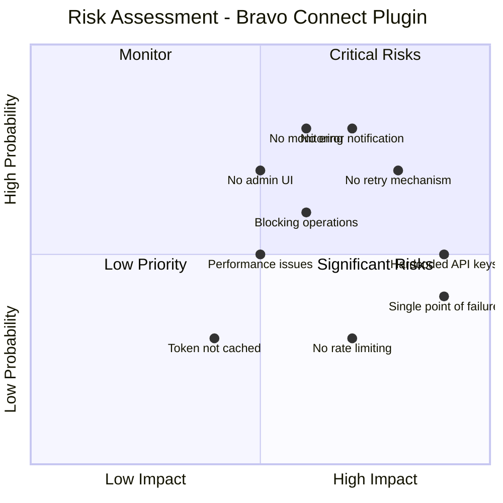

**Legend:**
- **Quadrant 1 (Critical):** High probability, high impact - immediate action needed
- **Quadrant 2 (Monitor):** Low impact, high probability - keep watching
- **Quadrant 3 (Low Priority):** Low probability, low impact - accept risk
- **Quadrant 4 (Significant):** High impact, low probability - contingency plan

---

**Nguồn:** Phân tích bravo-connect codebase tại `/Users/vovanduc/Code/dcnet/bravo-connect`
**Ngày cập nhật:** 10/01/2026
**Trạng thái:** Production system documentation - All diagrams based on actual codebase analysis
