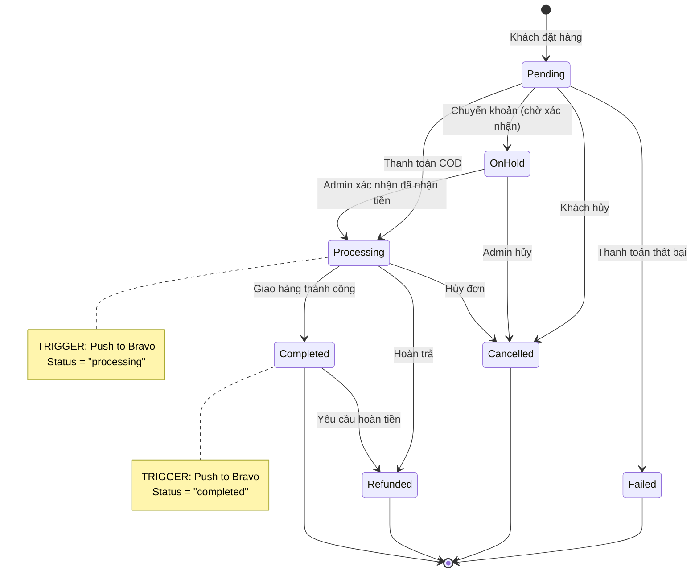
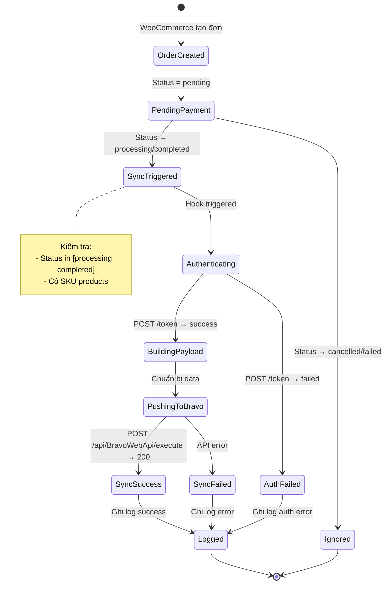
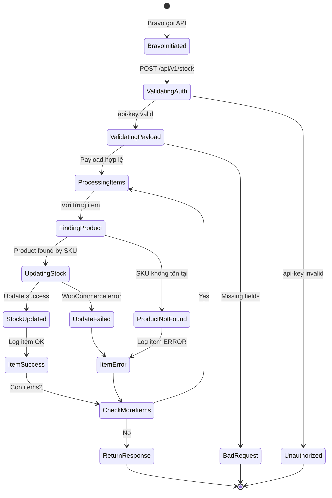
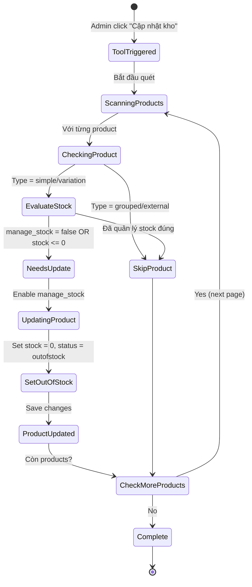

# NHATMINH CONNECT - STATUS & WORKFLOW SPECIFICATION

**Nguồn:** Phân tích từ codebase Bravo Connect Plugin

**Module:** NhatMinh-Connect Integration

**Phiên bản:** 1.0

**Ngày:** 10/01/2026

---

## 1. TỔNG QUAN STATUS WORKFLOW

Module NhatMinh-Connect không có status quản lý nội bộ như các module CRM/ERP khác. Thay vào đó, nó phản ứng với status changes của WooCommerce và đồng bộ với Bravo ERP.

### 1.1 Loại Status

| Loại | Source | Mô tả |
|------|--------|-------|
| **Order Status** | WooCommerce | Trạng thái đơn hàng (pending, processing, completed, etc.) |
| **Sync Status** | Plugin Internal | Trạng thái đồng bộ (success, failed, pending) |
| **Stock Status** | WooCommerce | Trạng thái tồn kho (instock, outofstock) |

---

## 2. ORDER STATUS WORKFLOW

### 2.1 WooCommerce Order Status Lifecycle



### 2.2 Status Mapping Table

| WooCommerce Status | Trigger Push? | Bravo PaymentStatus | Ghi chú |
|-------------------|---------------|---------------------|---------|
| `pending` | ❌ | - | Chờ thanh toán |
| `on-hold` | ❌ | - | Chờ xác nhận CK |
| `processing` | ✅ | "COD" | Push sang Bravo |
| `completed` | ✅ | "Đã chuyển khoản" | Push sang Bravo |
| `cancelled` | ❌ | - | Không push |
| `refunded` | ❌ | - | Không push |
| `failed` | ❌ | - | Không push |

---

## 3. SYNC STATUS WORKFLOW

### 3.1 Order Push Flow



### 3.2 Sync Status Details

#### 3.2.1 Success Criteria

✅ **SyncSuccess** khi:
- Bravo API trả về HTTP 200
- Response body hợp lệ
- Log ghi "Push Order To Bravo ==== OK"

#### 3.2.2 Failure Scenarios

❌ **AuthFailed:**
- Username/password sai
- Bravo API không phản hồi
- Token expired

❌ **SyncFailed:**
- Invalid payload format
- Missing required fields
- Bravo business validation error
- Network timeout

❌ **Ignored:**
- Order status không phải processing/completed
- Tất cả sản phẩm không có SKU

---

## 4. STOCK STATUS WORKFLOW

### 4.1 Stock Update Flow



### 4.2 Stock Status States

| Status | Điều kiện | Hành động |
|--------|-----------|-----------|
| `instock` | `quantity > 0` | Set khi update stock từ Bravo |
| `outofstock` | `quantity = 0` | Set tự động hoặc bởi Bulk Update Tool |
| `onbackorder` | `quantity <= 0` + allow backorder | Không áp dụng trong plugin |

### 4.3 Bulk Update Tool States



---

## 5. STATE MACHINE SPECIFICATION

### 5.1 Order Push State Machine

| Current State | Event | Next State | Action |
|---------------|-------|------------|--------|
| `OrderCreated` | Order pending | `PendingPayment` | None |
| `PendingPayment` | Status → processing | `SyncTriggered` | Trigger hook |
| `PendingPayment` | Status → completed | `SyncTriggered` | Trigger hook |
| `PendingPayment` | Status → cancelled/failed | `Ignored` | None |
| `SyncTriggered` | Hook executed | `Authenticating` | Call bravoAuth() |
| `Authenticating` | Token received | `BuildingPayload` | Build order data |
| `Authenticating` | Auth failed | `AuthFailed` | Log error |
| `BuildingPayload` | Data ready | `PushingToBravo` | Call orderToBravo() |
| `PushingToBravo` | API success (200) | `SyncSuccess` | Log success |
| `PushingToBravo` | API error | `SyncFailed` | Log error |
| `SyncSuccess` | Logged | `[END]` | Complete |
| `SyncFailed` | Logged | `[END]` | Complete |
| `AuthFailed` | Logged | `[END]` | Complete |
| `Ignored` | - | `[END]` | Complete |

### 5.2 Stock Update State Machine

| Current State | Event | Next State | Action |
|---------------|-------|------------|--------|
| `[START]` | POST /api/v1/stock | `ValidatingAuth` | Check api-key |
| `ValidatingAuth` | Key valid | `ValidatingPayload` | Check JSON |
| `ValidatingAuth` | Key invalid | `Unauthorized` | Return 401 |
| `ValidatingPayload` | Valid JSON | `ProcessingItems` | Start loop |
| `ValidatingPayload` | Invalid JSON | `BadRequest` | Return 400 |
| `ProcessingItems` | Process item | `FindingProduct` | Query by SKU |
| `FindingProduct` | Product exists | `UpdatingStock` | Update quantity |
| `FindingProduct` | Not found | `ProductNotFound` | Log error |
| `UpdatingStock` | Success | `StockUpdated` | Log OK |
| `UpdatingStock` | Failed | `UpdateFailed` | Log error |
| `StockUpdated` | Item done | `CheckMoreItems` | Check array |
| `ProductNotFound` | Item done | `CheckMoreItems` | Check array |
| `UpdateFailed` | Item done | `CheckMoreItems` | Check array |
| `CheckMoreItems` | More items | `ProcessingItems` | Continue loop |
| `CheckMoreItems` | No more items | `ReturnResponse` | Return 200 |
| `ReturnResponse` | - | `[END]` | Complete |

---

## 6. DATABASE STATUS TRACKING

### 6.1 WooCommerce Tables

Plugin **KHÔNG** tạo custom tables. Sử dụng WooCommerce tables:

| Table | Purpose | Status Fields |
|-------|---------|---------------|
| `wp_posts` | Orders | `post_status` (wc-processing, wc-completed) |
| `wp_postmeta` | Product meta | `_stock_status`, `_stock`, `_manage_stock` |

### 6.2 Log File Tracking

**File:** `logs.log`

**Format:**
```
[2026-01-10 08:30:15] order.INFO: Info Order ==== {"order_id":12345,"old_status":"pending","new_status":"processing"}
[2026-01-10 08:30:16] order.INFO: Push Order To Bravo Info ==== {...}
[2026-01-10 08:30:18] order.INFO: Push Order To Bravo ==== {"code":200,"message":"Success"}
```

### 6.3 Status Fields

**Order Meta (không lưu sync status):**
- Plugin KHÔNG lưu trạng thái đồng bộ vào order meta
- Chỉ dựa vào logs để tracking

**Đề xuất cải tiến:**
- Thêm meta field: `_bravo_sync_status` (success/failed/pending)
- Thêm meta field: `_bravo_sync_time` (timestamp)
- Thêm meta field: `_bravo_doc_no` (ORIGIN12345)

---

## 7. STATUS TRANSITION MATRIX

### 7.1 Order Status Transitions

| From → To | Auto? | Trigger | Bravo Push? |
|-----------|-------|---------|-------------|
| `pending → processing` | ✅ | COD payment | ✅ Yes |
| `pending → on-hold` | ✅ | Bank transfer | ❌ No |
| `on-hold → processing` | 👤 | Admin confirm | ✅ Yes |
| `on-hold → completed` | 👤 | Admin confirm | ✅ Yes |
| `processing → completed` | 👤 | Admin/Auto | ✅ Yes |
| `pending → cancelled` | 👤 | Customer/Admin | ❌ No |
| `processing → cancelled` | 👤 | Admin | ❌ No |
| `completed → refunded` | 👤 | Admin | ❌ No |

**Chú thích:**
- ✅ Auto = Tự động
- 👤 = Thủ công (admin action)

### 7.2 Stock Status Transitions

| From | To | Trigger | Condition |
|------|-------|---------|-----------|
| `instock` | `outofstock` | Bravo API | `quantity = 0` |
| `outofstock` | `instock` | Bravo API | `quantity > 0` |
| `null` | `outofstock` | Bulk Tool | `manage_stock = false` |
| `null` | `outofstock` | Bulk Tool | `stock <= 0` |

---

## 8. BUSINESS RULES

### 8.1 Order Push Rules

| Rule | Description | Implementation |
|------|-------------|----------------|
| **R1** | Chỉ push status = processing/completed | `if (!in_array($new_status, ['processing', 'completed']))` |
| **R2** | Sản phẩm không SKU → ghi vào Description | Check `$product->get_sku()` |
| **R3** | Mỗi order chỉ push 1 lần | Không có retry mechanism |
| **R4** | Multi-site support | `USER_PREFIX` tự động theo subdomain |

### 8.2 Stock Update Rules

| Rule | Description | Implementation |
|------|-------------|----------------|
| **S1** | Chỉ update theo SKU | `wc_get_product_id_by_sku($sku)` |
| **S2** | Tự động enable manage_stock | `$product->set_manage_stock(true)` |
| **S3** | Quantity > 0 → instock | `$product->set_stock_status('instock')` |
| **S4** | Product không tồn tại → log ERROR | Return error in response |

### 8.3 Bulk Update Rules

| Rule | Description | Implementation |
|------|-------------|----------------|
| **B1** | Bỏ qua grouped/external products | `$product->is_type('grouped')` |
| **B2** | Chỉ update stock <= 0 hoặc not managed | Check conditions |
| **B3** | Process 100 products/page | Pagination |

---

## 9. ERROR HANDLING & RECOVERY

### 9.1 Error States

| Error Type | Status | Recovery | Impact |
|------------|--------|----------|--------|
| **Auth Failed** | AuthFailed | Retry với credentials mới | Đơn hàng không đồng bộ |
| **Network Timeout** | SyncFailed | Không auto-retry | Đơn hàng không đồng bộ |
| **Invalid SKU** | ItemError | Skip item | Item đó không update stock |
| **API 500** | SyncFailed | Không auto-retry | Đơn hàng không đồng bộ |

### 9.2 Recovery Mechanisms

**Hiện tại:** ❌ KHÔNG CÓ auto-retry

**Đề xuất:**
- Thêm queue system (WP Cron)
- Retry failed orders sau 5 phút, 15 phút, 1 giờ
- Admin panel để xem failed orders và manual retry

---

## 10. INTEGRATION STATUS SUMMARY

### 10.1 Current Status

| Chức năng | Status | Reliability | Notes |
|-----------|--------|-------------|-------|
| **Order Push** | ✅ Active | 🟢 High | Real-time sync |
| **Stock Update** | ✅ Active | 🟢 High | API-based |
| **Product Sync** | ⚠️ Read-only | 🟡 Medium | Không auto-sync |
| **Error Recovery** | ❌ None | 🔴 Low | Cần cải thiện |

### 10.2 Pain Points

1. **No retry mechanism** - Failed orders không tự động sync lại
2. **No status tracking** - Không lưu sync status vào database
3. **No admin UI** - Không có giao diện quản lý sync status
4. **Manual product management** - Sản phẩm phải nhập thủ công

---

## 11. FUTURE ENHANCEMENT

### 11.1 FlowNext Integration Status Design

Khi tích hợp với FlowNext, đề xuất thêm:

**Sync Status Table:**
```sql
CREATE TABLE wp_flownext_sync_log (
    id BIGINT PRIMARY KEY AUTO_INCREMENT,
    order_id BIGINT,
    sync_type VARCHAR(20), -- 'order', 'stock', 'product'
    status VARCHAR(20),     -- 'pending', 'success', 'failed'
    attempt INT DEFAULT 1,
    error_message TEXT,
    request_payload TEXT,
    response_payload TEXT,
    created_at DATETIME,
    updated_at DATETIME
);
```

**New Status Fields:**
- `pending` - Chờ đồng bộ
- `syncing` - Đang đồng bộ
- `success` - Thành công
- `failed` - Thất bại
- `retry` - Đang retry

---

**Người lập:** Claude Code (FlowNext Team)

**Ngày:** 10/01/2026
