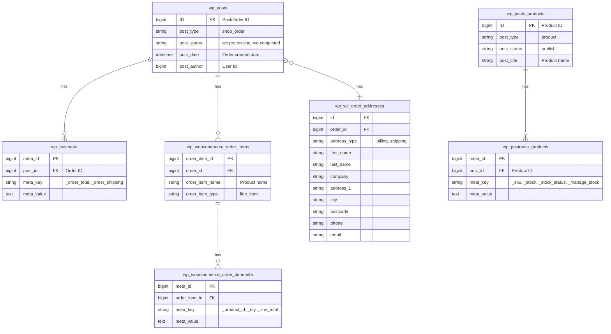
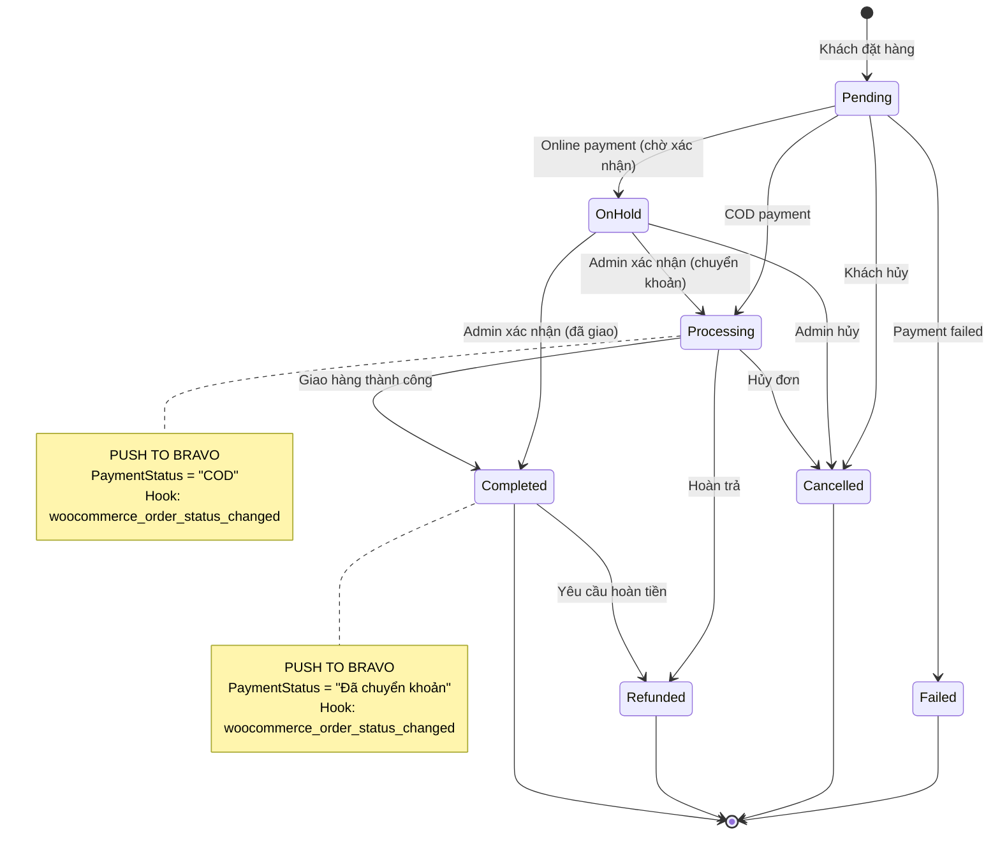
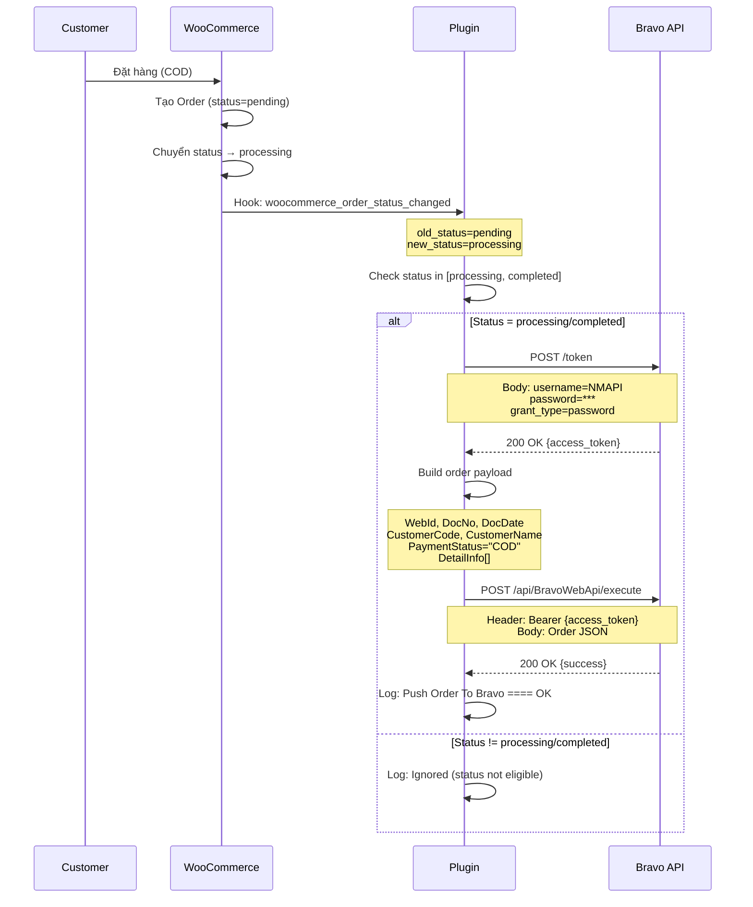
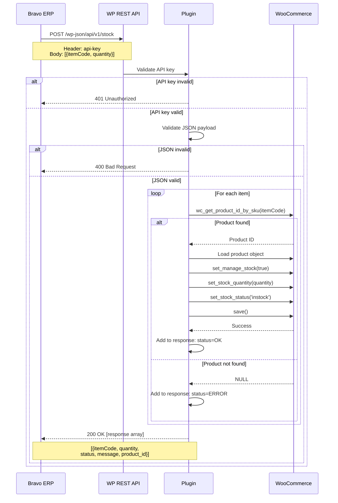
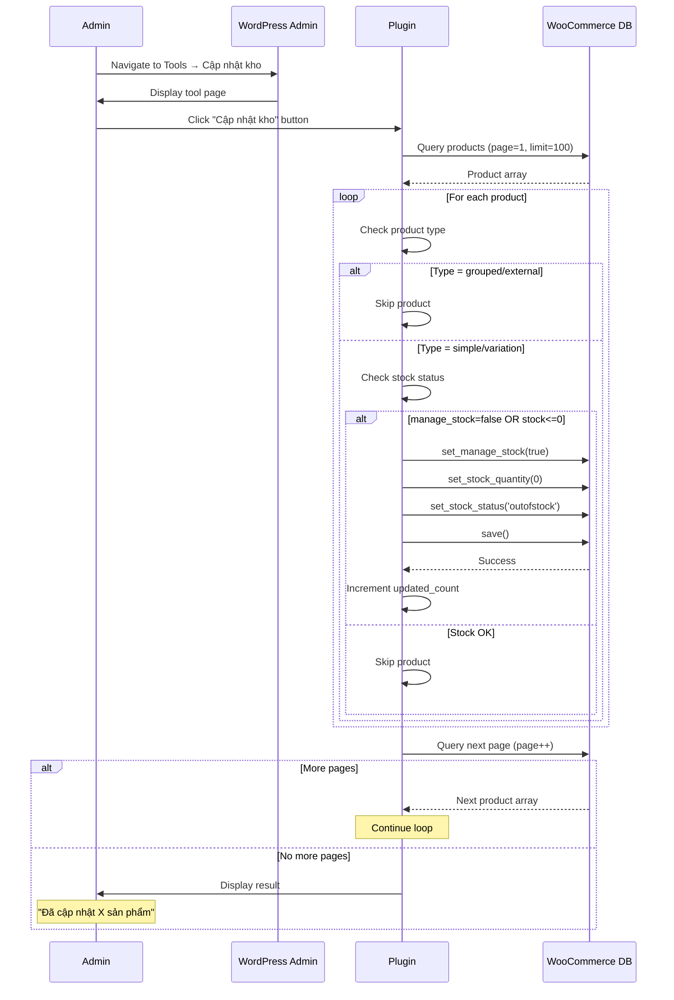
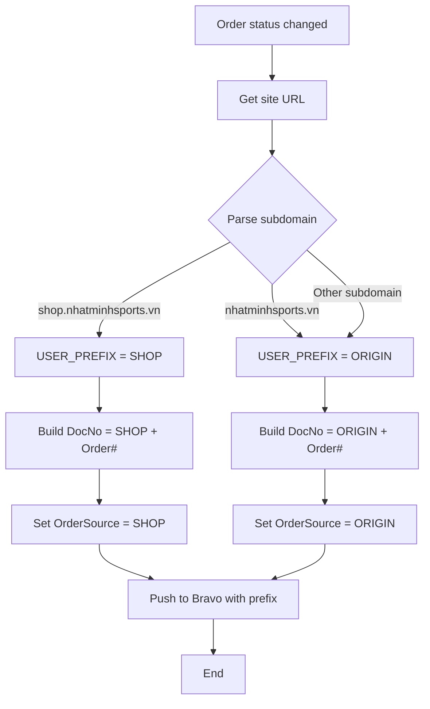
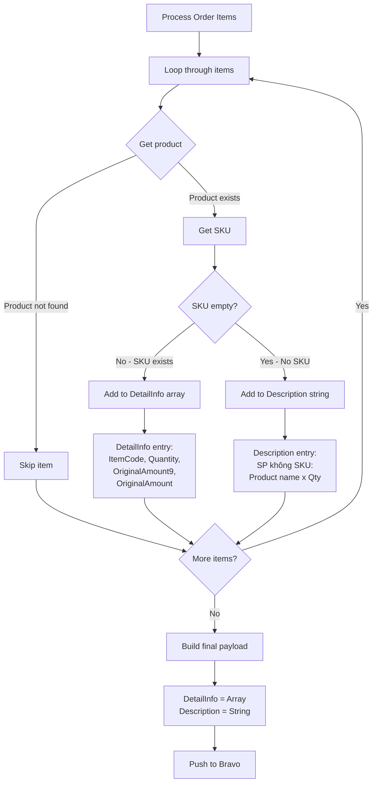
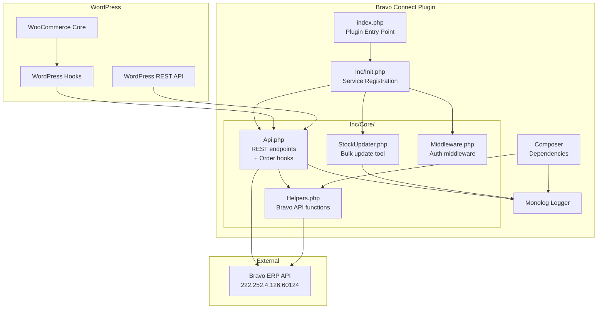

# Module NhatMinh Connect - Đặc tả Workflow & ERD

> **Nguồn:** Phân tích bravo-connect codebase
> **Lưu ý:** Đây là đặc tả hệ thống HIỆN TẠI đang chạy production

---

## 1. Định nghĩa

> **Bravo Connect** là WordPress/WooCommerce plugin tích hợp website Nhật Minh Sports với hệ thống ERP Bravo (cũ).

**Phạm vi:**
- Đồng bộ đơn hàng: WooCommerce → Bravo (real-time)
- Đồng bộ tồn kho: Bravo → WooCommerce (API-based)
- Đọc sản phẩm: Bravo → WooCommerce (read-only)

**Nguồn:** Phân tích bravo-connect codebase

---

## 2. ERD - Entity Relationship Diagram

### 2.1. WooCommerce Database Schema

**Nguồn:** Phân tích bravo-connect codebase



### 2.2. Bravo ERP Data Structure (JSON)

**Nguồn:** Phân tích bravo-connect codebase

```json
{
  "WebId": "12345",
  "DocNo": "SHOP12345",
  "DocDate": "1/10/2026",
  "CustomerCode": "0987654321",
  "CustomerName": "Nguyễn Văn A",
  "Tel": "0987654321",
  "Address": "123 Đường ABC",
  "OrderSource": "SHOP",
  "Description": "Ghi chú KH + SP không SKU",
  "PaymentStatus": "COD",
  "DeliveryAmount": 50000,
  "Consignee": "Nguyễn",
  "DeliveryAddress": "456 Đường XYZ, Q1, 70000",
  "ConsigneeTel": "Văn A",
  "CompReceiveInv": "Công ty ABC",
  "AddrReceiveInv": "789 Đường DEF",
  "CompTaxCode": "0123456789",
  "EmailReceiveInv": "invoice@example.com",
  "DetailInfo": [
    {
      "ItemCode": "SKU001",
      "Quantity": 2,
      "OriginalAmount9": 500000,
      "OriginalAmount": 450000
    }
  ]
}
```

---

## 3. State Diagram - Order Status Transitions

**Nguồn:** Phân tích bravo-connect codebase



---

## 4. Sequence Diagram - Push Order Flow

**Nguồn:** Phân tích bravo-connect codebase



---

## 5. Sequence Diagram - Stock Update Flow

**Nguồn:** Phân tích bravo-connect codebase



---

## 6. Sequence Diagram - Bulk Stock Update Tool

**Nguồn:** Phân tích bravo-connect codebase



---

## 7. Activity Diagram - Multi-site USER_PREFIX Detection

**Nguồn:** Phân tích bravo-connect codebase



---

## 8. Activity Diagram - Product SKU Handling

**Nguồn:** Phân tích bravo-connect codebase



---

## 9. UI Mockup - Bulk Stock Update Admin Page

**Nguồn:** Phân tích bravo-connect codebase

```
┌─────────────────────────────────────────────────────────────┐
│ WordPress Admin                                              │
├─────────────────────────────────────────────────────────────┤
│                                                              │
│  Tools > Cập nhật kho                                        │
│  ────────────────────────────────────────────────────────   │
│                                                              │
│  ┌──────────────────────────────────────────────────────┐   │
│  │  Công cụ cập nhật trạng thái tồn kho                  │   │
│  │                                                        │   │
│  │  Công cụ này sẽ quét tất cả sản phẩm và:              │   │
│  │  • Enable manage_stock = true                          │   │
│  │  • Set stock_quantity = 0                              │   │
│  │  • Set stock_status = 'outofstock'                     │   │
│  │                                                        │   │
│  │  Áp dụng cho sản phẩm:                                 │   │
│  │  ✓ Simple products                                     │   │
│  │  ✓ Product variations                                  │   │
│  │  ✗ Grouped products (skip)                             │   │
│  │  ✗ External products (skip)                            │   │
│  │                                                        │   │
│  │  Điều kiện: manage_stock=false HOẶC stock_qty <= 0    │   │
│  │                                                        │   │
│  │  ┌──────────────────────┐                              │   │
│  │  │  Cập nhật kho        │                              │   │
│  │  └──────────────────────┘                              │   │
│  │                                                        │   │
│  └──────────────────────────────────────────────────────┘   │
│                                                              │
│  ┌──────────────────────────────────────────────────────┐   │
│  │  Kết quả:                                             │   │
│  │                                                        │   │
│  │  ✓ Đã cập nhật 127 sản phẩm thành công                │   │
│  │                                                        │   │
│  └──────────────────────────────────────────────────────┘   │
│                                                              │
└─────────────────────────────────────────────────────────────┘
```

---

## 10. Component Diagram - Plugin Architecture

**Nguồn:** Phân tích bravo-connect codebase



---

## 11. Data Flow - Order Push Complete Flow

**Nguồn:** Phân tích bravo-connect codebase

```mermaid
flowchart LR
    subgraph WooCommerce
        Order[Order Created<br/>Status: pending]
        Status[Status Changed<br/>→ processing]
    end

    subgraph Plugin
        Hook[Hook Triggered]
        Check[Check Status]
        Auth[Get Auth Token]
        Build[Build Payload]
        Push[Push to Bravo]
        Log[Write Log]
    end

    subgraph Bravo
        Token[/token endpoint]
        Execute[/api/BravoWebApi/execute]
        DB[(Bravo Database)]
    end

    Order --> Status
    Status --> Hook
    Hook --> Check

    Check -->|Valid| Auth
    Check -->|Invalid| Log

    Auth --> Token
    Token -->|access_token| Build
    Token -->|Error| Log

    Build -->|Payload ready| Push
    Push --> Execute
    Execute -->|Success| Log
    Execute -->|Error| Log
    Execute --> DB
```

---

## 12. Data Mapping - WooCommerce → Bravo

**Nguồn:** Phân tích bravo-connect codebase

### 12.1. Order Header Mapping

| Bravo Field | WooCommerce Source | PHP Code | Notes |
|-------------|-------------------|----------|-------|
| `WebId` | Order ID | `$order->get_id()` | Order number |
| `DocNo` | Prefix + Order ID | `USER_PREFIX . $order->get_id()` | SHOP12345/ORIGIN12345 |
| `DocDate` | Order created date | `$order->get_date_created()->format('m/d/Y')` | US date format |
| `CustomerCode` | Billing phone | `$order->get_billing_phone()` | Phone as customer ID |
| `CustomerName` | Billing name | `$order->get_billing_first_name() . ' ' . $order->get_billing_last_name()` | Full name |
| `Tel` | Billing phone | `$order->get_billing_phone()` | Contact number |
| `Address` | Billing address 1 | `$order->get_billing_address_1()` | Main address |
| `OrderSource` | Site prefix | `USER_PREFIX` | SHOP/ORIGIN |
| `Description` | Customer note + no-SKU items | `$order->get_customer_note()` | Free text |
| `PaymentStatus` | Order status | `$status == 'processing' ? 'COD' : 'Đã chuyển khoản'` | COD or paid |
| `DeliveryAmount` | Shipping total | `$order->get_shipping_total()` | Shipping fee |

### 12.2. Shipping Info Mapping

| Bravo Field | WooCommerce Source | PHP Code |
|-------------|-------------------|----------|
| `Consignee` | Shipping first name | `$order->get_shipping_first_name()` |
| `DeliveryAddress` | Shipping full address | `$address_1 . ', ' . $city . ', ' . $postcode` |
| `ConsigneeTel` | Shipping last name | `$order->get_shipping_last_name()` |

### 12.3. VAT Info Mapping

| Bravo Field | WooCommerce Meta | Meta Key |
|-------------|------------------|----------|
| `CompReceiveInv` | VAT company name | `billing_vat_name` |
| `AddrReceiveInv` | VAT address | `_billing_vat_address` |
| `CompTaxCode` | VAT tax code | `billing_vat_taxcode` |
| `EmailReceiveInv` | VAT email | `billing_vat_email` |

### 12.4. Order Items Mapping

| Bravo Field | WooCommerce Source | Condition |
|-------------|-------------------|-----------|
| `ItemCode` | Product SKU | `$product->get_sku()` - if not empty |
| `Quantity` | Item quantity | `$item->get_quantity()` |
| `OriginalAmount9` | Line subtotal | `$item->get_subtotal()` |
| `OriginalAmount` | Line total | `$item->get_total()` |

**Note:** Items without SKU are added to Description field instead of DetailInfo array.

---

## 13. Business Rules Summary

**Nguồn:** Phân tích bravo-connect codebase

### 13.1. Order Push Rules

| Rule ID | Description | Implementation |
|---------|-------------|----------------|
| **R1** | Chỉ push status = processing/completed | `if (!in_array($new_status, ['processing', 'completed']))` |
| **R2** | COD → PaymentStatus = "COD" | `$status == 'processing' ? 'COD' : 'Đã chuyển khoản'` |
| **R3** | Online payment → PaymentStatus = "Đã chuyển khoản" | Same as R2 |
| **R4** | Sản phẩm không SKU → ghi vào Description | `if (empty($sku)) { $description .= ... }` |
| **R5** | Multi-site prefix tự động | Detect từ subdomain |
| **R6** | Mỗi order chỉ push 1 lần | Không có retry mechanism |

### 13.2. Stock Update Rules

| Rule ID | Description | Implementation |
|---------|-------------|----------------|
| **S1** | Chỉ update theo SKU | `wc_get_product_id_by_sku($itemCode)` |
| **S2** | Tự động enable manage_stock | `$product->set_manage_stock(true)` |
| **S3** | Set stock_status = 'instock' | `$product->set_stock_status('instock')` |
| **S4** | SKU không tồn tại → trả error | `status: "ERROR", message: "Product not found"` |
| **S5** | Partial success/failure | Process từng item độc lập |

### 13.3. Bulk Update Rules

| Rule ID | Description | Implementation |
|---------|-------------|----------------|
| **B1** | Bỏ qua grouped/external | `if ($product->is_type('grouped'))` |
| **B2** | Chỉ update stock <= 0 hoặc not managed | `if (!$manage_stock OR $stock <= 0)` |
| **B3** | Process 100 products/page | Pagination limit = 100 |
| **B4** | Set stock = 0, status = outofstock | Fixed values |

---

## 14. API Endpoints Summary

**Nguồn:** Phân tích bravo-connect codebase

### 14.1. Bravo ERP API (External)

| Endpoint | Method | Auth | Purpose | Response |
|----------|--------|------|---------|----------|
| `/token` | POST | - | Get access token | `{access_token, expires_in}` |
| `/api/BravoWebApi/execute` | POST | Bearer | Push order | `{code: 200, message: "Success"}` |

**Base URL:** `http://222.252.4.126:60124`

### 14.2. WooCommerce REST API (Exposed by Plugin)

| Endpoint | Method | Auth | Purpose | Response |
|----------|--------|------|---------|----------|
| `/wp-json/api/v1/stock` | POST | api-key | Update stock | `[{itemCode, status, message}]` |
| `/wp-json/api/v1/product` | GET | api-key | Read products | `{limit, page, total, data[]}` |
| `/wp-json/api/v1/customer` | GET | api-key | Read customers | `{data[]}` |

**API Key:** `AspWOlS9KcrQmY8Il78Xrl0pUT6FeRIJ` (hardcoded)

---

## 15. Error Handling Matrix

**Nguồn:** Phân tích bravo-connect codebase

| Error Type | Status Code | Handling | Recovery | Impact |
|------------|-------------|----------|----------|--------|
| **Auth Failed** | 401 | Log error, stop | Manual | Order not synced |
| **API Timeout** | - | Log error, stop | Manual | Order not synced |
| **Invalid Payload** | 400 | Log error, stop | Manual | Order not synced |
| **Bravo 500 Error** | 500 | Log error, stop | Manual | Order not synced |
| **Product Not Found** | 200 | Log warning, continue | None | Item not updated |
| **Invalid API Key** | 401 | Return error | Fix key | Request rejected |
| **Invalid JSON** | 400 | Return error | Fix format | Request rejected |

**Pain Point:** Không có auto-retry mechanism, tất cả errors cần xử lý thủ công.

---

## 16. Performance Considerations

**Nguồn:** Phân tích bravo-connect codebase

### 16.1. Order Push Performance

- **Trigger:** Real-time (khi order status changed)
- **Blocking:** Yes (đồng bộ, block request cho đến khi Bravo response)
- **Timeout:** Không có timeout config rõ ràng
- **Impact:** Nếu Bravo API chậm → WooCommerce admin/checkout bị chậm

### 16.2. Stock Update Performance

- **Trigger:** On-demand (Bravo gọi khi cần)
- **Batch Size:** Không giới hạn (có thể gửi nhiều items cùng lúc)
- **Processing:** Loop sequential qua từng item
- **Impact:** Nếu update nhiều items → response time tăng

### 16.3. Bulk Update Performance

- **Page Size:** 100 products
- **Processing:** Sequential loop
- **Duration:** Phụ thuộc số lượng sản phẩm
- **Impact:** Có thể timeout nếu site có nhiều sản phẩm

---

## 17. Security Analysis

**Nguồn:** Phân tích bravo-connect codebase

### 17.1. Authentication

| Aspect | Current Implementation | Risk Level | Recommendation |
|--------|----------------------|------------|----------------|
| **Bravo API credentials** | Hardcoded in code | 🔴 High | Move to environment variables |
| **WooCommerce API key** | Hardcoded in code | 🔴 High | Move to settings page |
| **OAuth2 token** | In-memory only | 🟢 Low | OK |
| **Token caching** | No caching | 🟡 Medium | Cache token để giảm API calls |

### 17.2. API Security

| Endpoint | Auth Method | Exposure | Risk |
|----------|-------------|----------|------|
| `/api/v1/stock` | API key header | Public | 🟡 Medium - API key có thể leak |
| `/api/v1/product` | API key header | Public | 🟡 Medium - Same |
| `/api/v1/customer` | API key header | Public | 🔴 High - Sensitive data |

**Recommendation:** Implement rate limiting, IP whitelist, hoặc OAuth2 thay vì API key.

---

## 18. Migration Path to FlowNext

**Nguồn:** Phân tích bravo-connect codebase

### 18.1. Proposed Architecture

```
WooCommerce → FlowNext Connect Plugin → FlowNext API → FlowNext Database
```

### 18.2. Key Changes

| Aspect | Current (Bravo) | Proposed (FlowNext) |
|--------|----------------|-------------------|
| **Auth** | OAuth2 password grant | OAuth2 client credentials |
| **API Base URL** | `http://222.252.4.126:60124` | `https://api.flownext.dcnet.vn` |
| **Order endpoint** | `/api/BravoWebApi/execute` | `/api/v1/orders` (RESTful) |
| **Stock endpoint** | WooCommerce exposes | FlowNext exposes webhook |
| **Retry mechanism** | None | Queue-based with retry |
| **Admin UI** | None | Full sync status dashboard |
| **Error handling** | Log only | Log + notification + retry |

---

**Nguồn:** Phân tích bravo-connect codebase tại `/Users/vovanduc/Code/dcnet/bravo-connect`
**Ngày cập nhật:** 10/01/2026
**Trạng thái:** Production system documentation
