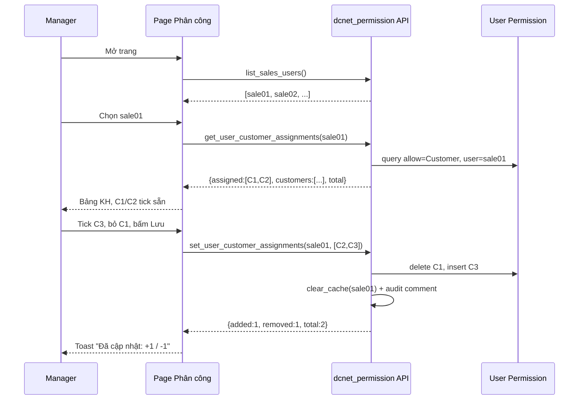

# 📋 PHÂN CÔNG KHÁCH HÀNG (Customer Assignment) — Tài liệu họp bàn

> **Mục đích tài liệu:** Chuẩn bị cho buổi họp chốt phương án trước khi code.
> **Ngày:** 2026-06-25 · **Người soạn:** Dev team · **Trạng thái:** 🟡 DRAFT — chờ chốt
> **Nguồn yêu cầu:** `dcnet-crm/HANDOFF.md` §12 "Phân công khách hàng (design note 2026-06-20)" — Option 2
> **Ước lượng:** ~2–3h code (nếu chốt phương án A + apply_to_all_doctypes)
> **Phạm vi liên quan:** app `dcnet-permission`, app `dcnet-crm`, DocType chuẩn `User Permission`

---

## MỤC LỤC

1. [Bối cảnh & vấn đề](#1-bối-cảnh--vấn-đề)
2. [Mục tiêu & tiêu chí thành công](#2-mục-tiêu--tiêu-chí-thành-công)
3. [Cơ chế kỹ thuật nền tảng](#3-cơ-chế-kỹ-thuật-nền-tảng)
4. [So sánh phương án đặt tính năng](#4-so-sánh-phương-án-đặt-tính-năng-placement)
5. [Thiết kế Backend chi tiết](#5-thiết-kế-backend-chi-tiết)
6. [Thiết kế Frontend / UI](#6-thiết-kế-frontend--ui)
7. [Luồng nghiệp vụ (flow)](#7-luồng-nghiệp-vụ)
8. [Edge cases & rủi ro](#8-edge-cases--rủi-ro)
9. [Bảo mật & phân quyền](#9-bảo-mật--phân-quyền)
10. [Kế hoạch test & verify](#10-kế-hoạch-test--verify)
11. [Rollout & migration](#11-rollout--migration)
12. [Câu hỏi cần chốt trong họp](#12-câu-hỏi-cần-chốt-trong-họp-decision-log)
13. [Phân rã công việc & ước lượng](#13-phân-rã-công-việc--ước-lượng)
14. [Phụ lục — tham chiếu code hiện có](#14-phụ-lục--tham-chiếu-code-hiện-có)

---

## 1. Bối cảnh & vấn đề

### 1.1 Hiện trạng
- Trong ERPNext, để giới hạn 1 nhân viên sales chỉ thấy **một số khách hàng nhất định**, phải tạo bản ghi **User Permission** (`allow = Customer`).
- Việc này hiện **chỉ System Manager / IT** làm được, qua **Setup → User Permissions** — màn hình kỹ thuật, khó dùng, dễ sai.
- Mỗi lần phân công lại / nhân viên mới / chuyển khách → phải nhờ IT → **nghẽn cổ chai, phụ thuộc IT**.

### 1.2 Nhu cầu (từ Manager)
> "Tôi (Trưởng phòng KD) muốn **tự gán khách hàng cho từng nhân viên** sales mà không cần gọi IT. Nhân viên chỉ được thấy KH của mình."

### 1.3 Vì sao cần giải quyết
| Đau | Hệ quả |
|-----|--------|
| Phụ thuộc IT để phân công | Chậm, không chủ động khi đội sale thay đổi |
| Màn hình User Permission kỹ thuật | Manager không tự làm được, dễ tạo sai bản ghi |
| Không có cái nhìn tổng quan "ai đang giữ KH nào" | Khó kiểm soát, khó reassign |

---

## 2. Mục tiêu & tiêu chí thành công

### 2.1 Mục tiêu
1. Manager tự gán / bỏ gán Customer cho sales user qua **giao diện checklist trực quan**.
2. Sau khi gán, sales user **chỉ thấy KH được giao** trong mọi danh sách Customer (và tuỳ chọn: cả giao dịch của KH đó).
3. **Không cần IT**, không thao tác trực tiếp trên `User Permission`.

### 2.2 Tiêu chí thành công (Definition of Done)
- [ ] Manager (role Sales Manager) mở được màn hình phân công.
- [ ] Chọn 1 sales user → thấy danh sách toàn bộ KH, KH đã giao tích sẵn ✓.
- [ ] Tick/bỏ tick + Lưu → `User Permission` được tạo/xóa đúng.
- [ ] Sales user đăng nhập → list Customer bị giới hạn đúng theo phân công.
- [ ] Sales User thường **không** mở được màn hình phân công.
- [ ] Không tạo DocType mới; không sửa `dcnet_apps`/ERPNext core.

### 2.3 Ngoài phạm vi (Non-goals — phase 1)
- ❌ Gán hàng loạt theo Customer Group / Territory (cân nhắc phase 2).
- ❌ Đồng bộ tự động với ERPNext "Sales Team" (Sales Person + hoa hồng).
- ❌ Phân công theo quy tắc tự động (round-robin, theo khu vực).
- ❌ Lịch sử phân công dạng report (chỉ ghi audit comment cơ bản).

---

## 3. Cơ chế kỹ thuật nền tảng

### 3.1 User Permission = giới hạn theo dòng (row-level)
ERPNext khi user **không có** quyền "bỏ qua User Permission" thì list/report tự động lọc:

```
User Permission record:
  user        = sale01@dcnet.vn
  allow       = "Customer"
  for_value   = "CUST-0001"
  apply_to_all_doctypes = 1   ← (xem mục 3.2)
```

→ `sale01` chỉ thấy `CUST-0001` trong list Customer. Nếu `apply_to_all_doctypes=1`, mọi DocType có trường link tới Customer (Sales Order, Sales Invoice, Quotation, Opportunity...) cũng bị lọc theo các KH được phép.

### 3.2 `apply_to_all_doctypes` — 2 chế độ

| Chế độ | `apply_to_all_doctypes` | Tác dụng | Phù hợp khi |
|--------|:----------------------:|----------|-------------|
| **Toàn bộ** | `1` | Sales chỉ thấy KH + **mọi giao dịch** của KH đó | Muốn cô lập triệt để theo KH (KHUYẾN NGHỊ) |
| **Chỉ Customer** | `0` + `allow_doctype="Customer"` | Chỉ lọc màn hình Customer; SO/SI vẫn thấy hết | Chỉ cần giới hạn danh bạ KH |

> ⚠️ **Đây là câu hỏi #2 cần chốt.** Mặc định khuyến nghị `apply_to_all_doctypes=1`.

### 3.3 Vì sao đặt trong `dcnet-permission`?
App `dcnet-permission` **đã** quản lý `User Permission` (hiện cho `allow="Department"`) và có sẵn:
- Helper `normalize_email`, `add_audit_comment`, guard pattern `assert_*_access`.
- Design system teal + Frappe Page framework + JS class manager.
→ Thêm nhánh `allow="Customer"` là mở rộng tự nhiên, ít trùng lặp nhất.

---

## 4. So sánh phương án đặt tính năng (Placement)

### Phương án A — Page mới trong `dcnet-permission` ⭐ KHUYẾN NGHỊ

```
dcnet-permission/
  └── page/dcnet_customer_assignment/   ← page Frappe mới
  └── customer_assignment.py            ← logic
  └── api.py (+3 endpoint)
```

| Ưu | Nhược |
|----|-------|
| ✅ Tái dùng 100% logic User Permission, guard, audit, CSS teal | ⚠️ Sales Manager phải vào app "Phân quyền" (về mặt định vị hơi lệch) |
| ✅ Không rebuild bundle Vue | ⚠️ Cần thêm role Sales Manager vào page riêng |
| ✅ Access control tách bạch với tab IT | |
| ✅ Nhanh nhất (~2-3h) | |

### Phương án B — CRM Vue view `?view=customer-assignment`

| Ưu | Nhược |
|----|-------|
| ✅ Đúng nơi sales làm việc (trong CRM) | ❌ Phải viết lại logic ghi User Permission trong CRM api.py |
| ✅ Sidebar CRM sẵn có | ❌ Rebuild bundle Vue mỗi lần |
| | ❌ Trùng lặp 2 nơi cùng đụng User Permission → khó maintain |

### Phương án C — Lai (Hybrid)
- Logic + Page đặt ở **dcnet-permission** (phương án A).
- Thêm 1 link ở **sidebar CRM** trỏ sang Page đó (mở cùng tab, như các link sidebar CRM khác).
- → Sales mở từ CRM nhưng code chỉ ở 1 nơi.

> 💡 **Đề xuất họp:** Chốt **A** (hoặc **C** nếu muốn lối vào từ CRM). Tránh **B**.

---

## 5. Thiết kế Backend chi tiết

> File mới: `dcnet-permission/dcnet_permission/customer_assignment.py`
> Endpoint whitelisted thêm vào: `dcnet-permission/dcnet_permission/api.py`

### 5.1 Access guard
```python
# customer_assignment.py
import frappe
from frappe import _

CUSTOMER_ASSIGNMENT_ROLES = {"System Manager", "Sales Master Manager", "Sales Manager"}

def assert_customer_assignment_access(user=None):
    user = user or frappe.session.user
    if user == "Administrator":
        return
    if not (set(frappe.get_roles(user)) & CUSTOMER_ASSIGNMENT_ROLES):
        frappe.throw(_("Bạn không có quyền phân công khách hàng."),
                     frappe.PermissionError)
```

### 5.2 Endpoint 1 — danh sách sales user
```python
@frappe.whitelist()
def list_sales_users():
    assert_customer_assignment_access()
    # User enabled có role Sales User / Sales Manager
    rows = frappe.get_all(
        "Has Role",
        filters={"role": ["in", ["Sales User", "Sales Manager"]],
                 "parenttype": "User"},
        fields=["parent as user"],
        distinct=True,
    )
    emails = sorted({r.user for r in rows})
    users = frappe.get_all(
        "User",
        filters={"name": ["in", emails], "enabled": 1},
        fields=["name", "full_name"],
    ) if emails else []
    return users
```

### 5.3 Endpoint 2 — lấy phân công hiện tại + full danh sách KH
```python
@frappe.whitelist()
def get_user_customer_assignments(user, search=None, page=1, page_length=200):
    assert_customer_assignment_access()
    user = normalize_email(user)

    assigned = frappe.get_all(
        "User Permission",
        filters={"user": user, "allow": "Customer"},
        pluck="for_value",
    )

    filters = {"disabled": 0}
    if search:
        # tên hoặc mã
        or_filters = {"customer_name": ["like", f"%{search}%"],
                      "name": ["like", f"%{search}%"]}
    customers = frappe.get_all(
        "Customer",
        filters=filters,
        or_filters=or_filters if search else None,
        fields=["name", "customer_name", "customer_group", "territory"],
        order_by="customer_name asc",
        start=(int(page) - 1) * int(page_length),
        page_length=int(page_length),
    )
    total = frappe.db.count("Customer", filters=filters)
    return {
        "assigned": assigned,         # toàn bộ KH đã gán (không phân trang)
        "customers": customers,       # trang hiện tại
        "total": total,
        "assigned_count": len(assigned),
    }
```
> Lưu ý: `assigned` trả về **đầy đủ** (không phân trang) để UI tick đúng kể cả KH không nằm trong trang đang xem.

### 5.4 Endpoint 3 — lưu phân công (diff add/remove)
```python
@frappe.whitelist(methods=["POST"])
def set_user_customer_assignments(user, customers, apply_to_all_doctypes=1):
    assert_customer_assignment_access()
    user = normalize_email(user)
    if not user:
        frappe.throw(_("Thiếu nhân viên."))
    if user == frappe.session.user:
        frappe.throw(_("Không thể tự phân công cho chính mình."))

    new_set = set(parse_list(customers))           # customers: JSON list
    # validate KH tồn tại
    valid = set(frappe.get_all("Customer",
                filters={"name": ["in", list(new_set)]}, pluck="name")) if new_set else set()
    invalid = new_set - valid
    if invalid:
        frappe.throw(_("Khách hàng không tồn tại: {0}").format(", ".join(sorted(invalid))))

    existing_rows = frappe.get_all("User Permission",
        filters={"user": user, "allow": "Customer"},
        fields=["name", "for_value"])
    existing = {r.for_value: r.name for r in existing_rows}

    to_add = valid - set(existing.keys())
    to_remove = set(existing.keys()) - valid

    for cust in to_remove:
        frappe.delete_doc("User Permission", existing[cust],
                          force=True, ignore_permissions=True)

    for cust in to_add:
        frappe.get_doc({
            "doctype": "User Permission",
            "user": user,
            "allow": "Customer",
            "for_value": cust,
            "apply_to_all_doctypes": cint(apply_to_all_doctypes),
        }).insert(ignore_permissions=True)

    frappe.clear_cache(user=user)
    add_audit_comment(user, "", [], 
        f"customer assignment updated: +{len(to_add)} / -{len(to_remove)} / total {len(valid)}")
    return {"added": len(to_add), "removed": len(to_remove), "total": len(valid)}
```

### 5.5 Wrapper trong `api.py`
```python
from dcnet_permission.customer_assignment import (
    list_sales_users, get_user_customer_assignments, set_user_customer_assignments,
)
# 3 hàm trên đã @frappe.whitelist() — chỉ cần import để Frappe nạp, hoặc
# khai báo lại wrapper mỏng giống pattern dashboard()/save_user() hiện có.
```

### 5.6 Bảng tóm tắt API
| Method | HTTP | Input | Output |
|--------|------|-------|--------|
| `list_sales_users` | GET | — | `[{name, full_name}]` |
| `get_user_customer_assignments` | GET | `user, search?, page?, page_length?` | `{assigned[], customers[], total, assigned_count}` |
| `set_user_customer_assignments` | POST | `user, customers[], apply_to_all_doctypes?` | `{added, removed, total}` |

---

## 6. Thiết kế Frontend / UI

### 6.1 Wireframe (ASCII)

```
┌──────────────────────────────────────────────────────────────┐
│  Phân công khách hàng                          [ Lưu thay đổi ]│
├──────────────────────────────────────────────────────────────┤
│  Nhân viên sales:  [ Nguyễn Văn A (sale01@dcnet.vn)   ▼ ]      │
│                                                                │
│  Đã giao: 12 KH        [ 🔍 Tìm tên/mã KH...          ]        │
│  [✓ Chọn tất cả]  [✗ Bỏ chọn tất cả]   (theo kết quả lọc)     │
├──────────────────────────────────────────────────────────────┤
│  ☑  CUST-0001  Công ty TNHH ABC        [Nhóm: Doanh nghiệp]   │
│  ☑  CUST-0002  Cửa hàng XYZ            [Nhóm: Bán lẻ]         │
│  ☐  CUST-0003  Tập đoàn KLM            [Nhóm: Doanh nghiệp]   │
│  ☑  CUST-0004  Hộ KD Trần Văn B       [Khu vực: Hà Nội]      │
│  ...                                                           │
│  ◀ 1 2 3 ... ▶   (200 KH/trang)                               │
└──────────────────────────────────────────────────────────────┘
```

### 6.2 Thành phần UI
1. **Dropdown chọn sales user** — nguồn `list_sales_users`. Chọn → load assignment.
2. **Badge "Đã giao: N"** — đếm `assigned_count`, cập nhật realtime khi tick.
3. **Search box** — lọc theo tên/mã (gọi lại endpoint 2 với `search`).
4. **Nút "Chọn tất cả" / "Bỏ chọn tất cả"** — áp theo kết quả lọc hiện tại.
5. **Bảng checklist** — mỗi dòng: checkbox + mã + tên KH + nhóm/khu vực.
6. **Nút "Lưu thay đổi"** — gọi endpoint 3 với set hiện tại; toast kết quả `+X / -Y`.

### 6.3 State management (client)
- `selectedUser` — sales user đang chọn.
- `assignedSet` — `Set<Customer.name>` (nguồn sự thật để tick + để gửi khi lưu).
- `customers` — trang hiện tại (hiển thị).
- `dirty` — có thay đổi chưa lưu → cảnh báo khi đổi user/rời trang.

> ⚠️ `assignedSet` giữ **toàn bộ** KH đã chọn (kể cả KH ngoài trang/ngoài kết quả lọc) để không mất khi phân trang. Khi Lưu, gửi nguyên `assignedSet`.

### 6.4 Tái dùng CSS
- Dùng lại biến màu teal + class card của `dcnet_permission_manager.css`.
- Class mới prefix `dca-*` (dca-table, dca-row, dca-checkbox...) để không đụng class cũ.

---

## 7. Luồng nghiệp vụ



---

## 8. Edge cases & rủi ro

| # | Tình huống | Xử lý |
|---|-----------|-------|
| 1 | KH bị xóa sau khi đã gán → `for_value` mồ côi | Khi load bỏ qua KH không tồn tại; có thể thêm nút "dọn rác" phase sau |
| 2 | Manager tự gán cho chính mình | Chặn ở backend (`user == session.user`) |
| 3 | Sales user vốn có quyền "bỏ qua User Permission" (vd kèm role Sales Manager) | User Permission **không** lọc được → cảnh báo trên UI rằng user này thấy tất cả |
| 4 | Số lượng KH rất lớn (vài nghìn) | Phân trang + search; `assigned` trả riêng (chỉ name, nhẹ) |
| 5 | Gán 0 KH (bỏ hết) | Hợp lệ → user không thấy KH nào (hoặc thấy tất cả nếu role bỏ-qua) — confirm hành vi mong muốn |
| 6 | Đổi user khi đang dirty | Cảnh báo "Bỏ thay đổi chưa lưu?" |
| 7 | 2 manager sửa cùng 1 sales đồng thời | Diff-based nên hội tụ; lần lưu sau ghi đè theo set của nó — chấp nhận (low risk) |
| 8 | `apply_to_all_doctypes=1` làm sales mất quyền xem báo cáo tổng | Cần test kỹ; nếu chặn quá tay → cân nhắc chế độ chỉ-Customer |

---

## 9. Bảo mật & phân quyền

- **Mọi endpoint** gọi `assert_customer_assignment_access()` đầu hàm.
- Chỉ `System Manager`, `Sales Master Manager`, `Sales Manager` (+ Administrator) truy cập.
- Validate `customers` tồn tại trong DB trước khi insert (chống chèn `for_value` rác).
- Page Frappe khai báo `roles` tương ứng → Frappe chặn ở cả lớp routing.
- Ghi `add_audit_comment` mỗi lần Lưu → có vết kiểm toán trên hồ sơ User.
- Không dùng SQL chuỗi; dùng `frappe.get_all`/`get_doc` chuẩn (tuân thủ rule v16).

---

## 10. Kế hoạch test & verify

> Chạy trong `devcontainer-frappe-1`, site `flow.local`.

### 10.1 Test thủ công
1. Tạo `saletest@dcnet.vn` (role Sales User), 3 KH test.
2. Gán 2/3 KH → đăng nhập saletest → list Customer chỉ thấy 2 KH. ✅
3. Nếu `apply_to_all_doctypes=1`: tạo SO cho KH thứ 3 (admin) → saletest **không** thấy SO đó. ✅
4. Bỏ gán 1 KH → list còn 1. ✅
5. Đăng nhập user role Sales User thường (không Manager) → **không** mở được page. ✅
6. `bench --site flow.local clear-cache` giữa các bước nếu cache.

### 10.2 Test tự động (nếu site cho phép)
> ⚠️ `flow.local` có `allow_tests = false` (theo HANDOFF). Test trong transaction rollback hoặc cleanup thủ công.
- `set_user_customer_assignments` → assert số bản ghi User Permission đúng → rollback.

### 10.3 Lệnh build/migrate
```bash
docker exec devcontainer-frappe-1 bash -lc \
  'cd /workspace/development/frappe-bench && bench --site flow.local migrate'
docker exec devcontainer-frappe-1 bash -lc \
  'cd /workspace/development/frappe-bench && bench --site flow.local clear-cache'
```

---

## 11. Rollout & migration

- **Không** cần migration dữ liệu (dùng User Permission có sẵn).
- Nếu trước đó IT đã tạo User Permission `allow=Customer` thủ công → UI tự nhận và hiển thị (không xung đột).
- Triển khai: merge vào `develop` → test trên site dev → bàn giao theo timeline.
- Cần cập nhật: `docs/customization/` (log UI mới) + `dcnet-crm/HANDOFF.md` nếu chọn phương án C (link sidebar CRM).

---

## 12. Câu hỏi cần chốt trong họp (Decision Log)

| # | Câu hỏi | Phương án | Khuyến nghị | Quyết định |
|---|---------|-----------|-------------|:----------:|
| 1 | **Đặt tính năng ở đâu?** | A) dcnet-permission · B) CRM Vue · C) Hybrid | **A** (hoặc C nếu cần lối vào CRM) | ⬜ |
| 2 | **Mức giới hạn?** | `apply_to_all_doctypes=1` (cả giao dịch) · chỉ Customer | **=1** | ⬜ |
| 3 | Ai được phân công? | Chỉ Sales Manager · + Sales Master Manager · + role khác | SM + SMM + SysMgr | ⬜ |
| 4 | Gán hàng loạt theo Group/Territory? | Phase 1 · Phase 2 | **Phase 2** | ⬜ |
| 5 | "Chuyển toàn bộ KH user A → B" (nghỉ việc)? | Có · Không (phase sau) | **Phase 2** | ⬜ |
| 6 | Đồng bộ ERPNext Sales Team (hoa hồng)? | Có · Độc lập | **Độc lập** | ⬜ |
| 7 | Gán 0 KH nghĩa là gì? | Không thấy KH nào · Thấy tất cả | Làm rõ kỳ vọng | ⬜ |
| 8 | 1 KH có thể giao cho **nhiều** sales? | Có (mặc định User Permission cho phép) · Chỉ 1 | Cho phép nhiều | ⬜ |

> Mức ưu tiên: 🔴 #1, #2 (chặn kiến trúc) · 🟠 #3, #8 · 🟡 còn lại.

---

## 13. Phân rã công việc & ước lượng

| Hạng mục | Mô tả | Ước lượng |
|----------|-------|:---------:|
| BE-1 | `customer_assignment.py`: guard + 3 hàm logic | 45m |
| BE-2 | Wire vào `api.py` | 10m |
| FE-1 | Page json + `__init__.py` + đăng ký | 15m |
| FE-2 | JS: dropdown user + load + checklist + search + save | 60m |
| FE-3 | CSS `dca-*` tái dùng teal | 20m |
| QA | Test thủ công 6 case + build/migrate | 30m |
| DOC | Log `docs/customization/` + cập nhật HANDOFF | 15m |
| **Tổng** | | **~3h** |

> Phụ thuộc: cần chốt #1 + #2 trước khi bắt đầu (nếu chọn B thì ước lượng +1.5h do rebuild Vue + viết lại logic).

---

## 14. Phụ lục — tham chiếu code hiện có

Các thành phần **đã có** trong `dcnet-permission/dcnet_permission/permission_manager.py` có thể tái dùng:

| Helper | Dòng | Công dụng |
|--------|------|-----------|
| `normalize_email(value)` | ~2059 | Chuẩn hóa email user |
| `add_audit_comment(user, dept, roles, action)` | ~1860 | Ghi Comment kiểm toán lên hồ sơ User |
| `can_access_permission_manager / assert_*` | ~1883 | Pattern guard để mô phỏng cho guard mới |
| `parse_payload(data)` | ~? | Parse JSON payload từ client |
| Pattern wrapper trong `api.py` | toàn bộ | Mẫu khai báo `@frappe.whitelist` mỏng |

Mẫu xử lý User Permission `allow="Department"` hiện có (tham chiếu để làm `allow="Customer"`):
- `save_user_permissions` (~585), `revoke_personal_permissions` (~642): cách insert/delete `User Permission`, gọi `frappe.clear_cache(user=...)`.

DocType chuẩn dùng: **`User Permission`** (`user`, `allow`, `for_value`, `apply_to_all_doctypes`, `allow_doctype`).

---

> **Sau họp:** điền cột "Quyết định" ở §12, cập nhật trạng thái tài liệu sang ✅ APPROVED, rồi bắt đầu theo §13.
