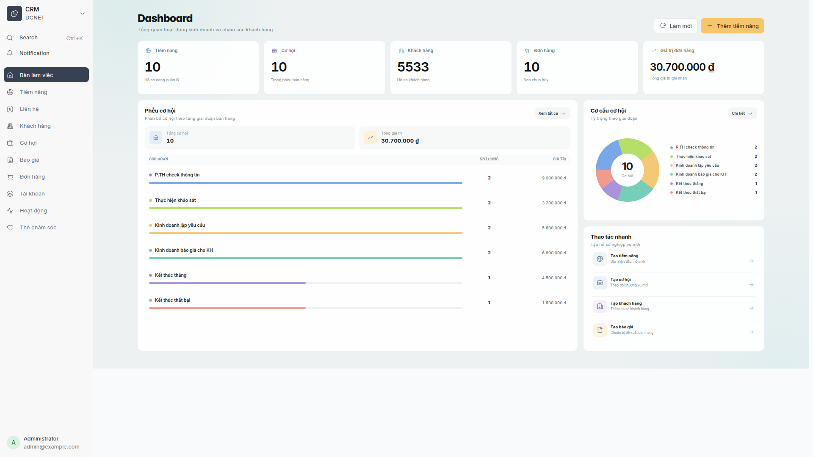
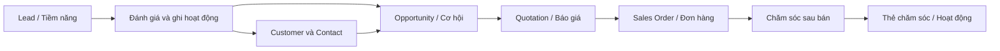
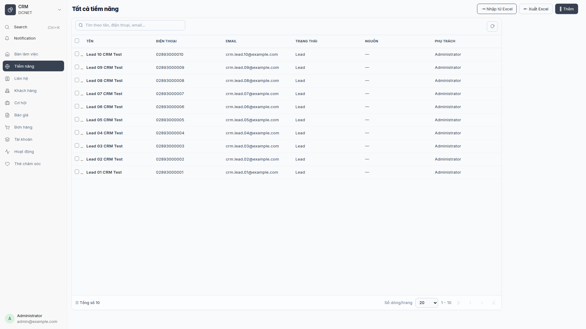
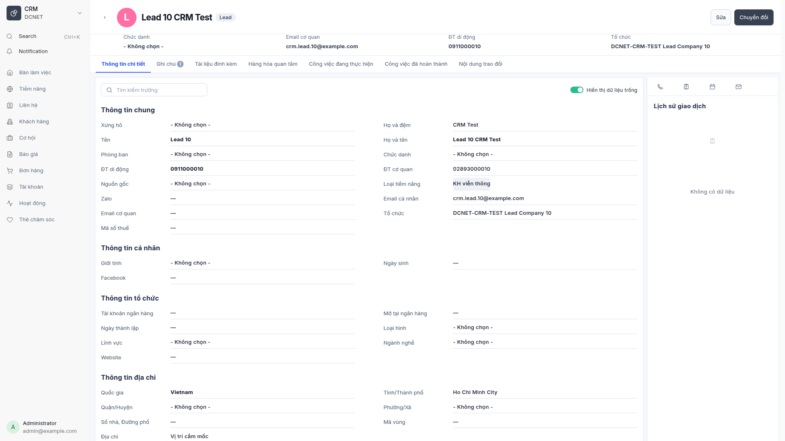
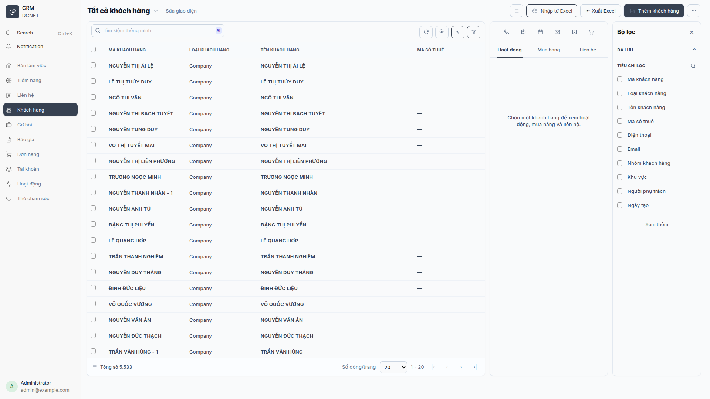
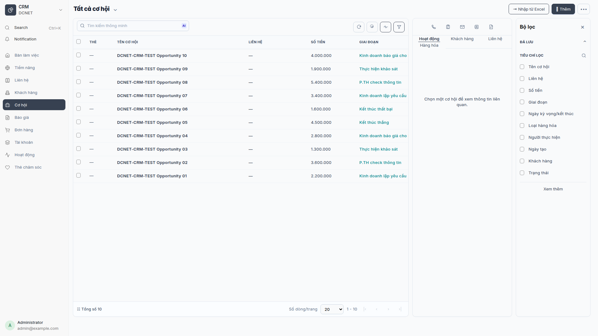
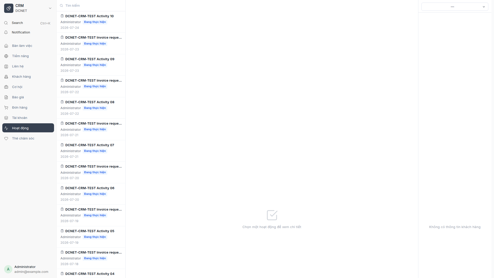

# Hướng dẫn sử dụng DCNET CRM

> **Hệ thống:** DCNET Flow  
> **Phiên bản tài liệu:** 1.3 — 13/07/2026  
> **Đối tượng:** Nhân viên kinh doanh, quản lý kinh doanh, CSKH và quản trị hệ thống  
> **Nguồn:** `docs/feature/FEATURE_SPECIFICATION.md` mục 2, 3, 4, 5, 13, 14; `docs/modules/dcnet-crm/SPEC_MAPPING.md`; code app `dcnet-crm`.

## 1. CRM này dùng để làm gì?

DCNET CRM là giao diện hợp nhất trên dữ liệu ERPNext chuẩn. Người dùng làm việc với Lead, Opportunity, Customer, Contact, Quotation và Sales Order mà không phải chuyển qua nhiều màn hình Desk.

Toàn bộ bản ghi xuất hiện trong ảnh của tài liệu này là dữ liệu demo phục vụ
training. Tên, email, số điện thoại và thông tin chứng từ mẫu được giữ nguyên để
người học dễ đối chiếu với màn hình UAT.

Các phần DCNET mở rộng quan sát được trong code gồm giao diện danh sách/chi tiết, dashboard, hoạt động, thẻ chăm sóc, tài khoản dịch vụ, tạo báo giá và đơn hàng trực tiếp. Dữ liệu lõi vẫn dùng DocType ERPNext; riêng `CRM Care Card` và `DCNET Service Account` là DocType custom.

Dashboard hiện tại dùng layout bento với KPI, phễu, cơ cấu cơ hội và nhóm thao tác
nhanh trên cùng một màn hình.

*Hình 1 — Dashboard CRM sau redesign, chụp bằng persona System Manager. Menu “Bàn làm việc” là điểm truy cập dashboard và mục “Tất cả” đã được loại bỏ.*

## 2. Quyền truy cập

Trang CRM cho phép các vai trò `Sales User`, `Sales Manager` và `System Manager`. Dữ liệu cụ thể còn phụ thuộc quyền ERPNext và phân quyền dòng dữ liệu đang áp dụng cho tài khoản.

| Vai trò | Công việc training chính |
|---|---|
| Sales User | Quản lý Lead/Customer được phép xem, cập nhật hoạt động, tạo cơ hội, báo giá và đơn hàng |
| Sales Manager | Theo dõi tổng quan, kiểm soát pipeline và dữ liệu của nhóm trong phạm vi quyền |
| System Manager | Cấu hình, hỗ trợ và kiểm tra lỗi; không dùng tài khoản này cho thao tác bán hàng hằng ngày |

Truy cập bằng menu **CRM → Bàn làm việc** hoặc URL Desk
`/desk/dcnet-crm?view=dashboard`. Nếu không thấy menu, không tự xin quyền rộng
hơn; liên hệ người quản trị để kiểm tra vai trò và phạm vi dữ liệu.

## 3. Bản đồ màn hình

| Menu | Dữ liệu nền | Công việc chính |
|---|---|---|
| Bàn làm việc | API tổng hợp CRM | Xem KPI, phễu và cơ cấu cơ hội |
| Tiềm năng | Lead | Tạo, tìm, cập nhật và theo dõi Lead |
| Cơ hội | Opportunity | Quản lý giai đoạn, xác suất, giá trị và ngày dự kiến chốt |
| Khách hàng | Customer | Quản lý hồ sơ, liên hệ, lịch sử và giao dịch |
| Liên hệ | Contact | Quản lý người liên hệ của khách hàng/tổ chức |
| Báo giá | Quotation | Lập và theo dõi báo giá |
| Đơn hàng | Sales Order | Lập, xem chi tiết và theo dõi đơn hàng |
| Hoạt động | Communication, Comment, ToDo | Theo dõi cuộc gọi, email, công việc và lịch sử xử lý |
| Thẻ chăm sóc | CRM Care Card | Theo dõi nội dung chăm sóc custom |
| Tài khoản | DCNET Service Account | Quản lý tài khoản dịch vụ liên quan đơn hàng |

## 4. Quy trình bán hàng dùng trong training

Sơ đồ là lộ trình training, không thay thế điều kiện workflow của từng chứng từ ERPNext.

## 5. Làm việc với danh sách

*Hình 2 — Danh sách Lead demo với đầy đủ tên, điện thoại và email mẫu.*

1. Chọn menu cần làm việc.
2. Nhập từ khóa vào ô tìm kiếm. Với Khách hàng có thể tìm theo mã, tên, mã số thuế, điện thoại hoặc email nếu trường đó được cấp quyền.
3. Dùng bộ lọc để thu hẹp theo trạng thái, người phụ trách, giai đoạn hoặc ngày.
4. Chọn cột cần hiển thị nếu màn hình hỗ trợ tùy chỉnh cột.
5. Click một dòng để mở chi tiết.
6. Chỉ dùng thao tác xóa hàng loạt sau khi đã đối chiếu dữ liệu liên kết; hệ thống có thể từ chối xóa khi bản ghi đã được chứng từ khác sử dụng.

## 6. Tiềm năng và Cơ hội

### 6.1. Tạo Lead

*Hình 3 — Trang chi tiết Lead demo gồm đầy đủ thông tin liên hệ, tab nghiệp vụ và lịch sử giao dịch.*

1. Mở **Tiềm năng** và chọn nút tạo mới.
2. Nhập tối thiểu các trường bắt buộc đang hiển thị trên form.
3. Kiểm tra điện thoại/email để hạn chế trùng dữ liệu.
4. Chọn nguồn và người phụ trách nếu quy trình của đơn vị yêu cầu.
5. Lưu rồi mở chi tiết để thêm ghi chú hoặc hoạt động.

Yêu cầu tích hợp Lead từ nguồn ngoài tại spec 3.7 vẫn cần thông tin nhà cung cấp/credential; không trình diễn tích hợp giả trong training.

### 6.2. Theo dõi Opportunity

Các cột quan trọng gồm tên cơ hội, liên hệ, số tiền, giai đoạn bán hàng, ngày kỳ vọng, người thực hiện, trạng thái và xác suất. Khi cập nhật, phải phân biệt:

- **Giai đoạn bán hàng:** vị trí trong pipeline.
- **Trạng thái:** tình trạng xử lý của chứng từ.
- **Xác suất:** đánh giá khả năng thành công, không phải doanh thu đã ghi nhận.

Từ chi tiết cơ hội, dùng chức năng tạo đơn hàng chỉ khi thông tin khách hàng, mặt hàng, số lượng, giá và ngày giao đã được kiểm tra.

## 7. Khách hàng và Liên hệ

*Hình 4 — Danh sách Khách hàng demo, panel hoạt động và bộ lọc với dữ liệu mẫu được giữ nguyên.*

### 7.1. Tạo Khách hàng

1. Mở **Khách hàng** → tạo mới.
2. Chọn đúng loại Khách hàng cá nhân/tổ chức theo form.
3. Nhập tên, nhóm khách hàng, khu vực và mã số thuế nếu có.
4. Với địa chỉ Việt Nam, chọn Tỉnh/Thành và Phường/Xã theo danh mục hiển thị; không nhập tự do khi hệ thống cung cấp dropdown.
5. Kiểm tra cảnh báo trùng mã số thuế trước khi lưu.
6. Tạo hoặc liên kết Contact để lưu đúng người giao dịch.

### 7.2. Đọc trang chi tiết

Trang chi tiết có thể hiển thị thông tin chung, liên hệ, hoạt động và dữ liệu bán hàng liên kết. Không chỉnh trực tiếp số liệu lịch sử giao dịch từ hồ sơ Customer; mở chứng từ nguồn để xử lý theo quyền.

## 8. Báo giá và Đơn hàng

*Hình 5 — Danh sách Cơ hội mẫu theo giai đoạn bán hàng và panel bộ lọc.*

1. Chọn đúng khách hàng và ngày chứng từ.
2. Thêm từng mặt hàng, số lượng và đơn vị tính.
3. Kiểm tra bảng giá, đơn giá, thuế, ngày hiệu lực/ngày giao.
4. Với đơn hàng, dùng tra cứu tồn kho trước khi cam kết số lượng với khách nếu nút này được hiển thị.
5. Lưu nháp để kiểm tra; chỉ Submit theo quy trình nghiệp vụ đã được phê duyệt.

`DCNET Service Account` có thể được liên kết ở dòng đơn hàng đối với nghiệp vụ tài khoản dịch vụ. Đây là phần custom; chỉ sử dụng khi sản phẩm/quy trình thực tế yêu cầu.

## 9. Hoạt động và Thẻ chăm sóc

*Hình 6 — Không gian Hoạt động CRM dùng theo dõi công việc và tương tác.*

Trang **Hoạt động** hợp nhất các bản ghi tương tác/công việc và áp dụng phạm vi theo vai trò. Khi ghi hoạt động:

- Chọn đúng loại: cuộc gọi, email, công việc hoặc loại được cấu hình.
- Liên kết đúng Lead, Customer, Opportunity hoặc Sales Order.
- Ghi kết quả và bước tiếp theo có thể hành động được.
- Đặt hạn xử lý và người phụ trách khi là công việc.

**Thẻ chăm sóc** là phần custom dùng cho danh sách, tạo mới, xem chi tiết và cập nhật nội dung chăm sóc. Trong môi trường training, sử dụng dữ liệu demo và có thể giữ nguyên nội dung mẫu để người học đối chiếu thao tác.

## 10. Import, export và báo cáo

- Import Lead/Customer theo spec dùng công cụ Data Import hoặc quy trình migration được quản trị phê duyệt.
- Export chỉ thực hiện khi vai trò được cấp quyền và có mục đích nghiệp vụ rõ ràng.
- Dashboard/KPI là số tổng hợp theo dữ liệu mà tài khoản được phép xem; hai người dùng khác phạm vi có thể thấy số khác nhau.
- Công thức KPI và danh sách báo cáo phase đầu còn các điểm cần khách hàng xác nhận; người đào tạo không tự diễn giải thành cam kết chức năng.

## 11. Bài thực hành training

1. Tạo một Lead mẫu, thêm hoạt động gọi điện và ghi bước tiếp theo.
2. Tạo một Customer cùng Contact, kiểm tra cảnh báo dữ liệu trùng.
3. Tạo Opportunity, cập nhật giai đoạn và xác suất.
4. Tạo Quotation từ dữ liệu mẫu, kiểm tra tổng tiền.
5. Tạo Sales Order nháp, tra cứu tồn và không Submit.
6. Tạo một Thẻ chăm sóc và tìm lại từ danh sách.

## 12. Câu hỏi thường gặp

1. **Không thấy menu CRM?** Kiểm tra tài khoản có `Sales User`, `Sales Manager` hoặc vai trò được quản trị cho phép.
2. **Tại sao không thấy đủ khách hàng?** Tài khoản có thể đang bị giới hạn theo phân công/phạm vi dữ liệu.
3. **Dashboard của tôi khác quản lý?** KPI được tính trên dữ liệu người dùng được phép xem.
4. **Có thể xóa Customer đã phát sinh đơn không?** Thường không; dữ liệu liên kết sẽ chặn để bảo toàn lịch sử.
5. **Lead và Customer khác nhau thế nào?** Lead là đầu mối chưa được xác lập thành khách hàng; Customer là đối tượng giao dịch chính thức.
6. **Opportunity có phải đơn hàng không?** Không. Opportunity là cơ hội bán; Sales Order mới là đơn hàng.
7. **Xác suất 100% có ghi nhận doanh thu không?** Không; ghi nhận phụ thuộc chứng từ bán hàng/kế toán.
8. **Tại sao nút tạo đơn bị lỗi?** Kiểm tra Customer, mặt hàng, kho, ngày giao và các trường bắt buộc ERPNext.
9. **Có gửi Zalo/Facebook trực tiếp không?** Chưa khẳng định; nhà cung cấp và credential đang là nội dung cần clarify.
10. **Có thể export toàn bộ CRM không?** Chỉ khi quyền và chính sách dữ liệu cho phép.
11. **Thẻ chăm sóc có thay thế Hoạt động không?** Không; dùng đúng mục đích nghiệp vụ đã cấu hình.
12. **Khi gặp dữ liệu trùng phải làm gì?** Dừng tạo mới, tìm bản ghi hiện có và báo quản trị/key user để xử lý.

## 13. Thuật ngữ

| Thuật ngữ | Nghĩa |
|---|---|
| Lead | Tiềm năng/đầu mối bán hàng |
| Opportunity | Cơ hội bán hàng |
| Customer | Khách hàng giao dịch |
| Contact | Người liên hệ |
| Quotation | Báo giá |
| Sales Order | Đơn hàng bán |
| Pipeline | Chuỗi các giai đoạn bán hàng |
| Submit | Xác nhận chứng từ theo cơ chế ERPNext; thường hạn chế sửa sau đó |

## 14. Điểm cần xác nhận trước training chính thức

- Nhà cung cấp và credential Zalo OA, Facebook/Messenger, SMS Brandname.
- Nguồn ngoài tại spec 3.7.
- Quy tắc doanh số và công thức KPI.
- Phạm vi GPS/di tuyến.
- Danh sách báo cáo chính thức cho phase training.
