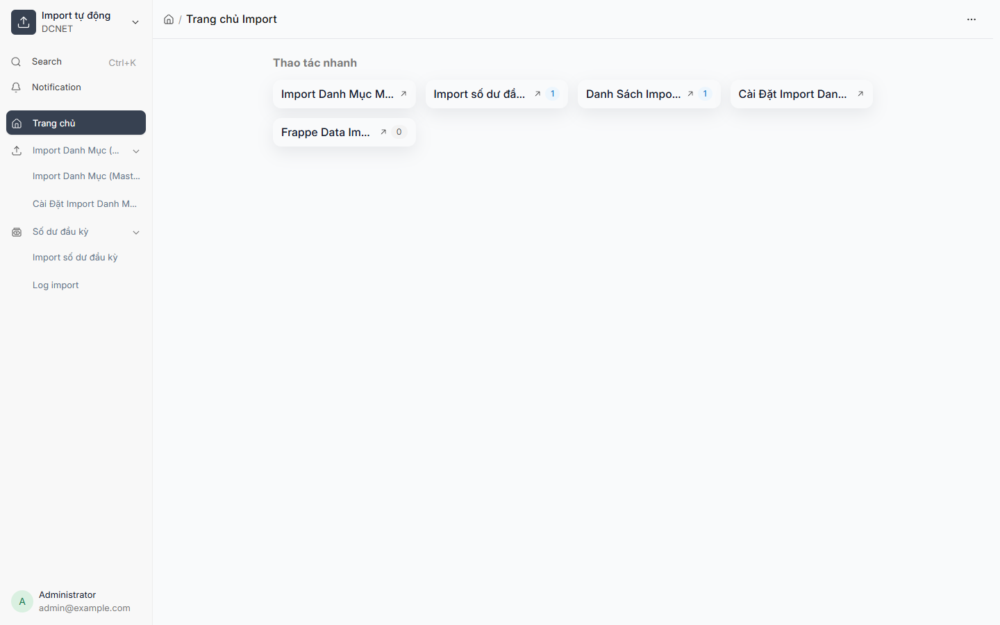
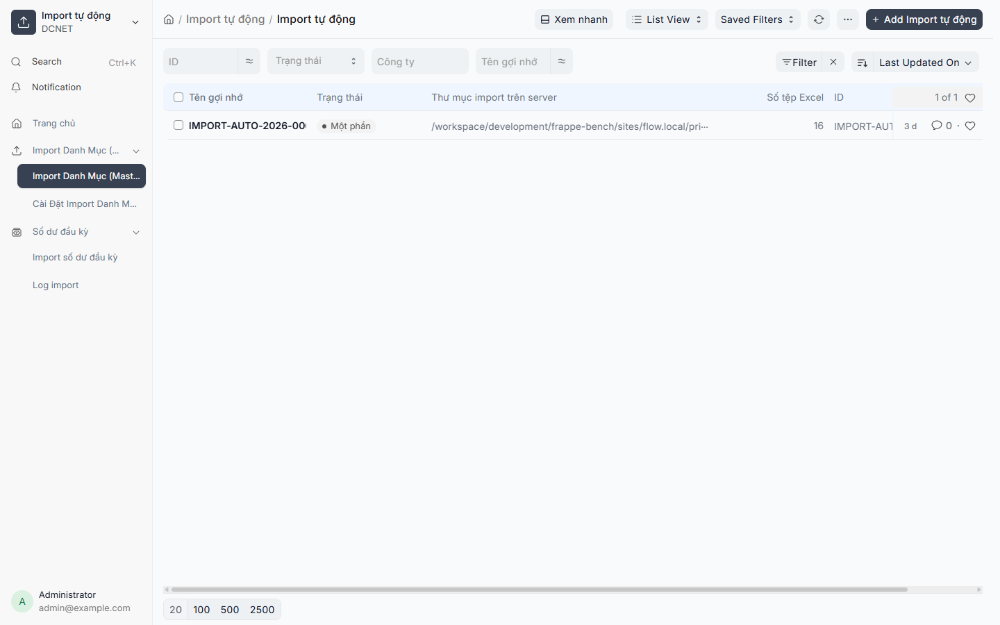
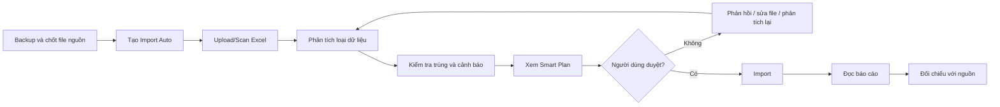
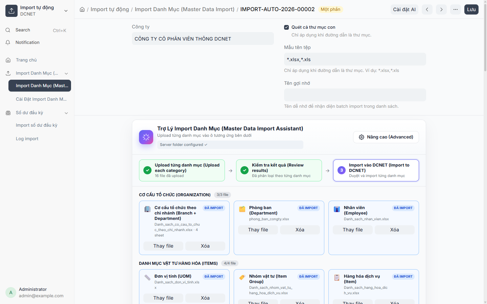
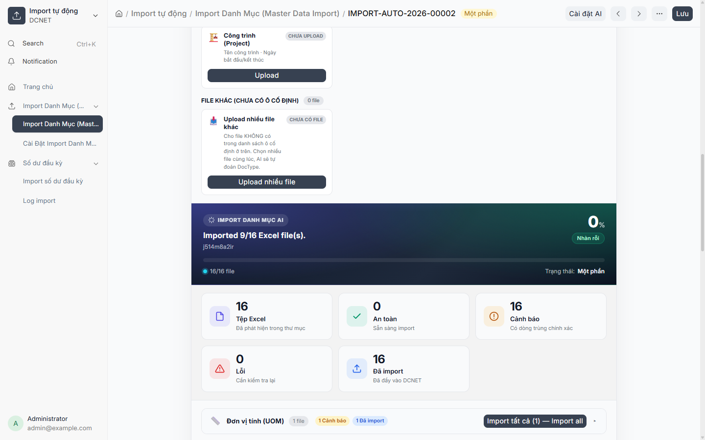

# Hướng dẫn sử dụng DCNET Migrate — Import tự động

> **Hệ thống:** DCNET Flow  
> **Phiên bản tài liệu:** 1.1 — 13/07/2026  
> **Đối tượng:** Đội migration, key user dữ liệu, kế toán trưởng và quản trị hệ thống  
> **Nguồn:** Code app `dcnet-migrate`; `docs/modules/import-auto/AI_SMART_FIX_HANDOFF.md`; kế hoạch migration BRAVO của dự án.

## 1. Phạm vi và cảnh báo

DCNET Migrate hỗ trợ đọc file Excel, nhận diện loại dữ liệu, kiểm tra trùng, sinh kế hoạch import, yêu cầu người dùng duyệt và ghi dữ liệu vào ERPNext. Công cụ không thay thế trách nhiệm đối chiếu của chủ dữ liệu.

*Hình 1 — Trang chủ Import tự động trên site UAT, chụp ở chế độ chỉ đọc.*

> **Cảnh báo:** Import là thao tác có ảnh hưởng lớn và có thể khó hoàn tác. Luôn chạy trên UAT/backup trước, duyệt kế hoạch và đối chiếu tổng số bản ghi sau import.

## 2. Các màn hình chính

*Hình 2 — Danh sách batch import và trạng thái xử lý. Batch được mở để quan sát, không chạy lại import.*

| Màn hình | Mục đích |
|---|---|
| Import Auto | Upload/scan nhiều file, phân tích, kiểm tra và import theo danh mục |
| Import Auto Settings | Cấu hình kết nối AI và kiểm tra kết nối |
| Opening Balance Import | Nhập số dư đầu kỳ theo công ty và ngày hạch toán |
| Báo cáo import | Xem bản ghi thành công, bỏ qua, lỗi và lý do |

## 3. Dữ liệu được nhận diện trong giao diện

Danh mục hiện có trong code gồm UOM, Item Group, Bank, Account, Branch, Department, Warehouse, Bank Account, Customer Group, Supplier Group, Customer, Supplier, Item, Employee và Project. File ngoài danh mục có thể được xếp vào nhóm **Không hỗ trợ/Khác**; không ép import nếu chưa xác định đúng DocType.

## 4. Quy trình chuẩn

## 5. Chuẩn bị trước khi import

1. Chốt công ty đích, dữ liệu đích và người phê duyệt.
2. Tạo backup có thể khôi phục.
3. Giữ một bản file nguồn bất biến; làm sạch trên bản sao.
4. Kiểm tra tiêu đề cột, sheet, mã định danh và quan hệ cha-con.
5. Xác định thứ tự dữ liệu nền trước dữ liệu phụ thuộc, ví dụ Nhóm khách hàng trước Khách hàng.
6. Với dữ liệu kế toán, kế toán trưởng phải duyệt hệ thống tài khoản, ngày hạch toán và số dư.

## 6. Upload và scan file

*Hình 3 — Hồ sơ Import Auto đã có sẵn với các ô danh mục và trạng thái file.*

1. Mở **Import tự động** và tạo hồ sơ mới.
2. Chọn **Company** đúng site/công ty.
3. Tải file vào đúng ô danh mục. Có thể dùng phần nâng cao để upload nhiều file, upload thư mục hoặc scan thư mục server nếu quản trị cho phép.
4. Sau khi scan, kiểm tra tên file, sheet, số dòng và `Target DocType` mà hệ thống nhận diện.
5. File bị nhận diện sai phải **Phân tích lại** và ghi phản hồi rõ ràng; không tiếp tục chỉ vì nút Import đang bật.

## 7. Đọc trạng thái và mức an toàn

*Hình 4 — Khu vực thống kê file, cảnh báo và số file đã import của batch mẫu.*

| Trạng thái | Ý nghĩa | Hành động |
|---|---|---|
| Scanned | Đã đọc file | Chạy phân tích |
| Ready | Có kế hoạch sẵn sàng | Kiểm tra plan và duplicate |
| Reanalyzing | Đang phân tích lại | Chờ hoàn tất, không reload liên tục |
| Error / Failed | Phân tích hoặc import lỗi | Mở chi tiết lỗi, sửa nguyên nhân |
| Imported | Đã import | Mở báo cáo và đối chiếu |
| Partial | Một phần thành công | Xác định dòng lỗi trước khi chạy lại |

Mức `Safe` không có nghĩa dữ liệu nghiệp vụ chắc chắn đúng; nó chỉ cho biết công cụ không phát hiện rủi ro kỹ thuật đã biết. `Warning` phải được người có trách nhiệm duyệt. `Error` không được bỏ qua.

## 8. Kiểm tra trùng và Smart Plan

Trước khi import, mở báo cáo trùng để xem bản ghi hiện có. Không tự chọn “tạo mới” khi khóa định danh chưa được thống nhất.

Smart Plan mô tả các bước tạo dữ liệu, thứ tự phụ thuộc và trường sẽ ghi. Người duyệt cần kiểm tra:

- Đúng DocType và công ty.
- Đúng khóa/mã bản ghi.
- Đúng quan hệ Link, parent và nhóm.
- Không tạo master phụ thuộc ngoài phạm vi mong muốn.
- Số dòng trong plan phù hợp file nguồn.

Smart Fix có thể đề xuất tạo dữ liệu phụ thuộc và sửa liên kết sau khi người dùng chấp nhận. Đề xuất AI không phải phê duyệt nghiệp vụ tự động.

## 9. Thực hiện và đối chiếu

1. Xác nhận plan đã được chủ dữ liệu duyệt.
2. Chọn **Import** và không đóng trang khi đang chạy nếu giao diện chưa báo hoàn tất.
3. Mở báo cáo ngay sau khi hoàn thành.
4. Ghi lại số imported, skipped và failed.
5. Đối chiếu tổng số và chọn mẫu bản ghi trong ERPNext.
6. Với `Partial`, chỉ chạy lại dòng lỗi sau khi hiểu cơ chế chống trùng; tránh tạo bản ghi lặp.
7. Lưu biên bản đối chiếu và người phê duyệt.

## 10. Nhập số dư đầu kỳ

Màn hình `Opening Balance Import` có Company, Default Posting Date và dashboard theo dõi. Đây là dữ liệu kế toán có rủi ro cao:

- Ngày hạch toán phải được kế toán trưởng xác nhận.
- Tổng Nợ/Có và số dư theo đối tượng phải được đối chiếu.
- Không trộn dữ liệu master và số dư trong cùng một quyết định phê duyệt.
- Chỉ import sau khi COA và các master liên quan đã ổn định.

## 11. Bài thực hành training

1. Upload một file UOM nhỏ trên UAT.
2. Xem preview, Target DocType và số dòng.
3. Chạy duplicate check.
4. Mở Smart Plan và từ chối một plan giả định sai.
5. Gửi phản hồi để phân tích lại.
6. Import file đã duyệt, mở báo cáo và đối chiếu 3 bản ghi mẫu.

## 12. Xử lý sự cố

| Hiện tượng | Kiểm tra trước |
|---|---|
| Không scan thấy file | Định dạng Excel, quyền file, thư mục server và pattern |
| Nhận diện sai DocType | Tên file, header, sheet; dùng phản hồi phân tích lại |
| AI không kết nối | `Import Auto Settings`, URL, model, API key, timeout |
| Báo trùng | Mở bản ghi mẫu, xác nhận khóa định danh với chủ dữ liệu |
| Link không tồn tại | Kiểm tra thứ tự import và master phụ thuộc |
| Partial | Đọc từng reason type, không chạy lại toàn bộ ngay |
| Import xong nhưng sai nghiệp vụ | Dừng batch tiếp theo, khóa biên bản và khôi phục theo kế hoạch đã duyệt |

## 13. Câu hỏi thường gặp

1. **AI có tự import không cần duyệt?** Không; người dùng phải kiểm tra và xác nhận plan.
2. **Safe có nghĩa 100% đúng không?** Không; vẫn phải đối chiếu nghiệp vụ.
3. **Có thể import thẳng production?** Không nên; phải chạy UAT/backup và có phê duyệt.
4. **Có thể chạy lại file Imported?** Chỉ sau khi hiểu chống trùng và mục tiêu chạy lại.
5. **File CSV có dùng được không?** Quy trình này tập trung vào Excel; dùng công cụ phù hợp hoặc xác nhận hỗ trợ trước.
6. **Tại sao số dòng import ít hơn file?** Kiểm tra dòng trống, duplicate, skipped và báo cáo lỗi.
7. **AI đề xuất tạo Department mới thì có chấp nhận ngay không?** Không; chủ dữ liệu tổ chức phải duyệt.
8. **Có thể xóa file khỏi hồ sơ?** Có nút xóa trong giao diện, nhưng phải giữ bản nguồn và biên bản migration bên ngoài hồ sơ.
9. **Partial có cần rollback toàn bộ không?** Tùy loại dữ liệu và kế hoạch khôi phục; phải đánh giá trước khi hành động.
10. **Ai duyệt COA/số dư?** Kế toán có thẩm quyền của khách hàng.
11. **API key có đưa vào tài liệu training không?** Không; chỉ quản trị viên lưu trong cấu hình bảo mật.
12. **Làm sao chứng minh import đúng?** Lưu file nguồn, log/báo cáo, tổng đối chiếu và mẫu bản ghi được ký xác nhận.

## 14. Thuật ngữ

| Thuật ngữ | Nghĩa |
|---|---|
| Target DocType | Loại bản ghi ERPNext đích |
| Smart Plan | Kế hoạch các bước ghi dữ liệu |
| Smart Fix | Đề xuất sửa plan/lỗi có kiểm soát |
| Duplicate | Bản ghi có khả năng trùng dữ liệu hiện có |
| Partial | Chỉ một phần batch thành công |
| Opening Balance | Số dư đầu kỳ |

## 15. Điểm cần xác nhận

- Quyền thao tác chính thức của đội migration trên UAT và production.
- Ma trận người duyệt theo từng loại master và dữ liệu kế toán.
- Kịch bản rollback được phê duyệt cho từng batch.
- Mapping BRAVO cuối cùng và tiêu chí chấp nhận đối chiếu.
