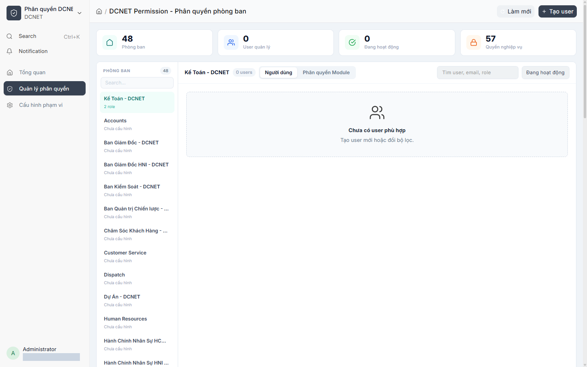
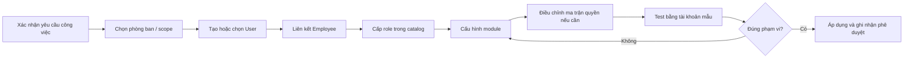
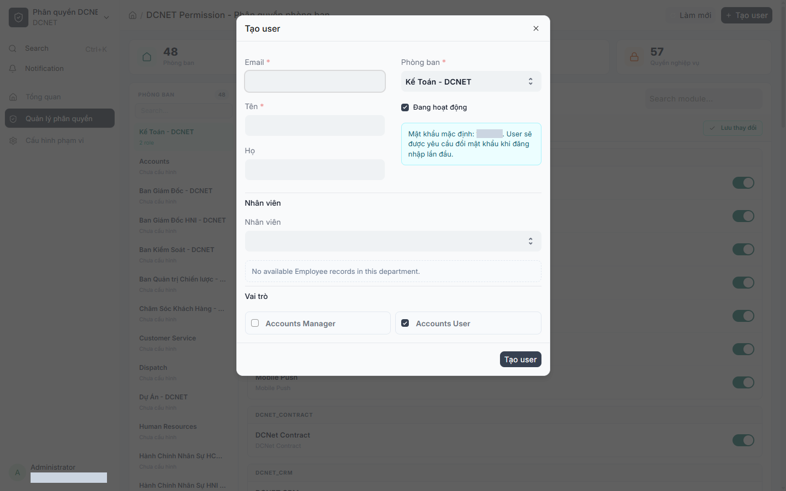
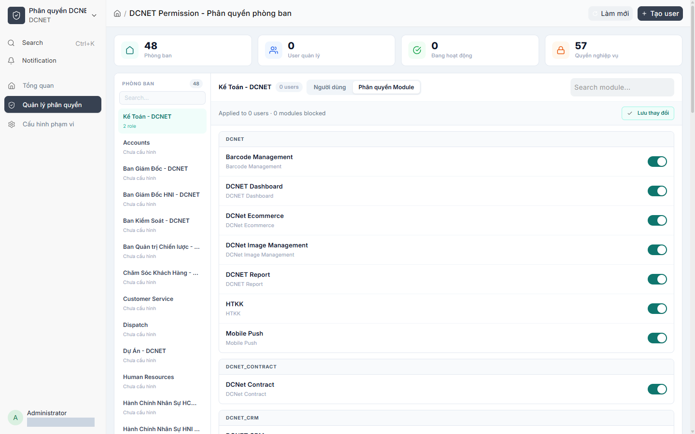
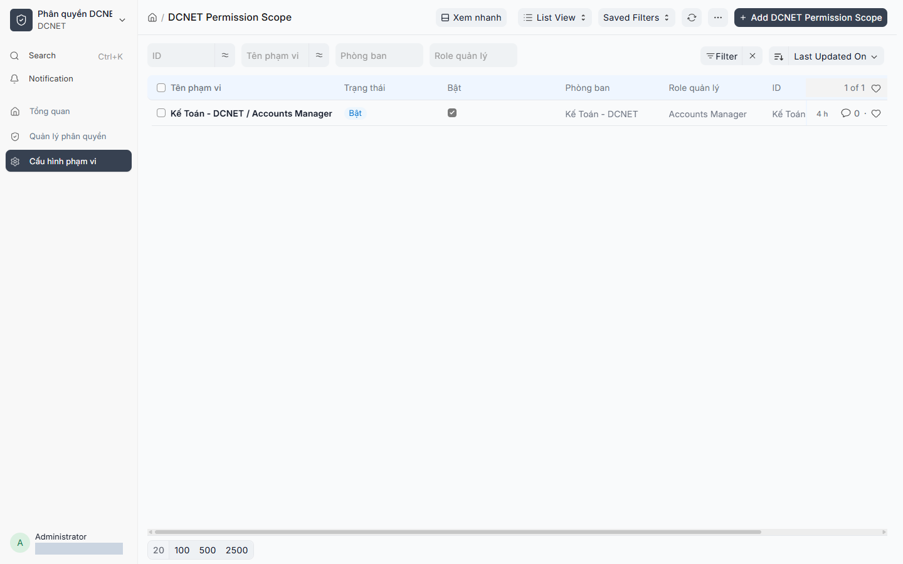

# Hướng dẫn sử dụng DCNET Permission

> **Hệ thống:** DCNET Flow  
> **Phiên bản tài liệu:** 1.1 — 13/07/2026  
> **Đối tượng:** System Manager, DCNET Permission Admin, DCNET Permission Manager  
> **Nguồn:** `docs/feature/FEATURE_SPECIFICATION.md` mục 12; `docs/feature/ERP_SPECIFICATION.md` phần yêu cầu phân quyền; code app `dcnet-permission`.

## 1. Mục đích

DCNET Permission mở rộng cơ chế Role Permission của Frappe để quản trị người dùng theo phạm vi phòng ban. App hỗ trợ quản lý user, vai trò được ủy quyền, quyền module và ma trận quyền chi tiết; đồng thời áp dụng guard khi người dùng truy cập dữ liệu.

*Hình 1 — Permission Manager trên site UAT. Email quản trị đã được che.*

## 2. Khái niệm cần phân biệt

| Khái niệm | Tác dụng |
|---|---|
| Role | Nhóm quyền nghiệp vụ cơ sở của Frappe/ERPNext |
| Permission Scope | Phạm vi phòng ban và các role/profile người quản lý được phép cấp |
| User Permission | Giới hạn dữ liệu theo giá trị cụ thể, ví dụ Department |
| Module Permission | Cho phép/chặn module trên giao diện cho người dùng thuộc phòng ban |
| Custom user permission matrix | Quyền chi tiết riêng cho một user, thay cho nguồn quyền theo role ở phần được cấu hình |

Ẩn module không đồng nghĩa xóa mọi quyền backend. Quyền thực tế là kết quả tổng hợp của role, DocType permission, user permission, module restriction và các guard của app.

## 3. Ai được vào trang quản trị?

Trang `/app/dcnet-permission-manager` dành cho:

- `System Manager`
- `DCNET Permission Admin`
- `DCNET Permission Manager`

Admin thấy phạm vi rộng theo cấu hình. Manager chỉ thấy các scope được giao. Không cấp `System Manager` chỉ để người dùng nhìn thấy trang này.

## 4. Quy trình cấp quyền an toàn

Nguyên tắc tối thiểu: cấp đủ để làm việc, không cấp theo chức danh suy đoán, không dùng tài khoản admin để kiểm thử thay cho user thật.

## 5. Chọn phòng ban và xem người dùng

1. Mở **DCNET Permission**.
2. Chọn phòng ban ở sidebar bên trái.
3. Kiểm tra trạng thái scope: phòng ban tồn tại nhưng chưa có `DCNET Permission Scope` sẽ không cấp role được.
4. Dùng ô tìm kiếm theo user, email hoặc role.
5. Lọc Active/Disabled khi cần rà soát tài khoản.

Tab **Người dùng** hiển thị tài khoản trong phạm vi. Tab **Phân quyền Module** cấu hình module cho toàn bộ user thuộc phòng ban được áp dụng.

## 6. Tạo và cập nhật người dùng

*Hình 2 — Dialog tạo user theo phòng ban và role. Thông tin mật khẩu mặc định đã được che; crawler không lưu user.*

1. Chọn đúng phòng ban trước khi bấm **Tạo người dùng**.
2. Nhập Email và First Name; Last Name theo dữ liệu nhân sự.
3. Liên kết Employee có sẵn nếu đây là nhân viên. Chỉ để trống cho tài khoản dịch vụ/phi nhân viên đã được phê duyệt.
4. Chọn role trong danh mục được scope cho phép.
5. Giữ trạng thái Active khi tài khoản cần sử dụng.
6. Lưu, sau đó test đăng nhập bằng tài khoản mẫu tương đương.

Code giao diện hiện hiển thị mật khẩu mặc định `123456` khi tạo user và yêu cầu đổi ở lần đăng nhập đầu. Đây là rủi ro cần xác nhận chính sách bảo mật trước production; không ghi mật khẩu thật vào tài liệu hoặc gửi qua kênh công khai.

## 7. Phân quyền module

*Hình 3 — Danh mục module và toggle Allowed/Blocked. Crawler chỉ chụp, không thay toggle hoặc lưu.*

1. Chọn phòng ban → tab **Phân quyền Module**.
2. Tìm module theo tên.
3. Toggle module sang Allowed hoặc Blocked.
4. Kiểm tra số user bị áp dụng và tổng module blocked.
5. Bấm **Lưu thay đổi**.
6. Nếu user không tự reload, yêu cầu đăng xuất/đăng nhập hoặc refresh trình duyệt.

Trạng thái **Mixed** cho biết người dùng trong phòng ban hiện chưa đồng nhất. Không gạt toggle mà chưa hiểu thay đổi sẽ ghi đè như thế nào cho cả nhóm.

## 8. Ma trận quyền riêng cho user

*Hình 4 — Scope Kế toán hiện có trên site UAT. Chưa có user mẫu trong scope nên không tạo dữ liệu chỉ để chụp ma trận quyền.*

Tại dòng user, chọn **Permissions/Quyền** để mở ma trận. Màn hình cho biết nguồn hiện tại là **By Role** hoặc **Custom**.

Các quyền DocType trong code gồm các hành động chuẩn như read, write, create, delete, submit, cancel, amend, report, export, import, print, email và share. Quyền Report chỉ dùng read.

1. Kiểm tra phòng ban và nguồn quyền hiện tại.
2. Chỉ bật quyền có ticket/yêu cầu được duyệt.
3. Lưu và chờ thông báo hoàn tất.
4. Test cả thao tác được phép và thao tác phải bị chặn.

Quyền custom theo user làm hệ thống khó kiểm toán hơn role dùng chung. Chỉ dùng cho ngoại lệ có ngày rà soát lại.

## 9. Khóa quyền và vô hiệu hóa

- **Khóa quyền phòng:** gỡ quyền của user trong phòng ban được chọn, không nhất thiết vô hiệu hóa toàn bộ tài khoản.
- **Disable user:** ngăn tài khoản đăng nhập/hoạt động theo cơ chế User.

Trước khi khóa, xác nhận người phê duyệt và ảnh hưởng tới công việc đang xử lý. Không xóa lịch sử user để “dọn tài khoản”.

## 10. Kiểm thử sau thay đổi

Dùng một tài khoản test không có vai trò quản trị và kiểm tra:

1. Có/không thấy đúng module.
2. Danh sách chỉ hiện dữ liệu đúng phạm vi Department.
3. Có thể đọc/tạo/sửa/submit đúng ma trận.
4. Không thể truy cập bằng URL trực tiếp khi bị chặn.
5. Không xem đơn giá/thành tiền hoặc sửa trường bị hạn chế đối với persona kho theo yêu cầu ERP spec.
6. Sau khi thu hồi, phiên đăng nhập được reload hoặc đăng nhập lại.

## 11. Bài thực hành training

1. Tạo một user test trong phòng Kinh doanh và liên kết Employee mẫu.
2. Cấp `Sales User` từ catalog scope.
3. Chặn một module không liên quan.
4. Kiểm tra quyền đọc Customer và không cấp delete.
5. Đăng nhập user test, ghi bằng chứng kết quả cho phép/chặn.
6. Khóa quyền phòng rồi xác nhận quyền đã bị thu hồi.

## 12. Câu hỏi thường gặp

1. **Không thấy phòng ban?** Scope của tài khoản quản lý chưa bao gồm phòng ban đó hoặc dữ liệu Department chưa cấu hình.
2. **Phòng ban có nhưng không cấp role được?** Chưa có `DCNET Permission Scope` tương ứng.
3. **Ẩn module rồi user vẫn mở URL được?** Kiểm tra DocType permission/guard; module visibility không phải lớp bảo mật duy nhất.
4. **Lưu xong user chưa thấy thay đổi?** Refresh hoặc đăng nhập lại; kiểm tra thông báo reload.
5. **Mixed nghĩa là gì?** Các user trong phòng ban đang có cấu hình module khác nhau.
6. **By Role và Custom khác nhau thế nào?** By Role kế thừa quyền chung; Custom là ngoại lệ riêng của user.
7. **Có cấp System Manager cho quản lý phòng không?** Không, trừ khi họ thực sự là quản trị hệ thống được phê duyệt.
8. **Khóa quyền phòng có xóa user không?** Không; nó thu hồi quyền scope phòng, tùy trường hợp tài khoản vẫn còn quyền khác.
9. **Disable có xóa lịch sử không?** Không; tài khoản bị vô hiệu hóa nhưng lịch sử cần được giữ.
10. **Có thể cấp quyền kế toán cho nhân viên kho?** Chỉ theo ma trận được phê duyệt; guard có hạn chế thao tác kế toán cho role không phù hợp.
11. **Tại sao không sửa được role bảo vệ?** `Administrator` và `System Manager` là protected roles trong code.
12. **Ai phê duyệt ngoại lệ Custom?** Cần ma trận phê duyệt của khách hàng; app không tự quyết định chính sách tổ chức.

## 13. Thuật ngữ

| Thuật ngữ | Nghĩa |
|---|---|
| Least privilege | Chỉ cấp mức quyền tối thiểu cần cho công việc |
| Scope | Phạm vi mà người quản lý được phép thao tác |
| Guard | Kiểm tra quyền bổ sung khi truy cập dữ liệu |
| Protected role | Vai trò hệ thống được bảo vệ khỏi sửa/gỡ tùy tiện |
| Persona test | Tài khoản mẫu đại diện cho một nhóm người dùng thực tế |

## 14. Điểm cần xác nhận trước production

- Ma trận role/phòng ban được khách hàng ký duyệt.
- Người có quyền phê duyệt user mới, ngoại lệ custom và thu hồi quyền.
- Chính sách mật khẩu khởi tạo; thay thế mật khẩu mặc định nếu cần.
- Chu kỳ rà soát quyền và quy trình offboarding.
- Quy tắc chính thức đối với đơn giá/thành tiền và các trường kho không được sửa.
